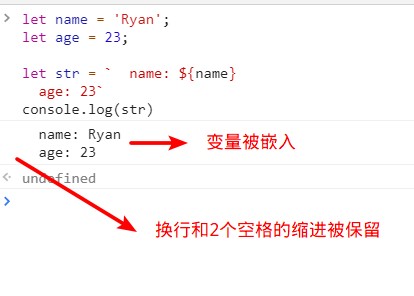
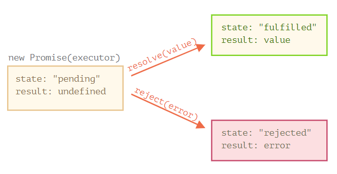
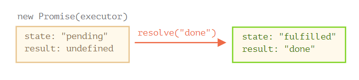
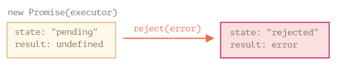

# ES6基础


## 1.变量定义

ES6新增了 `let` 和 `const`，分别用来声明变量和常量，应该尽可能使用 `let` 和 `const` 来定义变量，而不是 `var`

### 1.1 `let` 关键字

`let` 用于声明变量，声明的变量只在当前代码块能被访问到

```js
// 外部代码块不能访问到内部代码块定义的变量
if(true) {
  let a = 1;
}
console.log(a);   // 报错：Uncaught ReferenceError: a is not defined

/*-----------------分隔线-----------------*/

// 内部代码块能访问到外部代码块的变量
let arr = []
for(let i = 0; i < 10; i++) {
  arr.push(i);
}
console.log(arr.join());  // 打印：0,1,2,3,4,5,6,7,8,9

/*-----------------分隔线-----------------*/

// 注意：在for循环中，循环在一个代码块，循环体在一个代码块
for (let i = 0; i < 3; i++) {
  let i = 'abc';
  console.log(i);
}
// 打印如下：
// abc
// abc
// abc
```

### 1.2 `const` 关键字

`const` 声明一个只读的常量

一旦声明，常量的值就不能改变，这意味着，const一旦声明变量，就必须立即初始化，不能留到以后赋值

```js
const foo;
// SyntaxError: Missing initializer in const declaration

/*-----------------分隔线-----------------*/

const a = 1;
a = 2;  // 报错：Uncaught TypeError: Assignment to constant variable.

/*-----------------分隔线-----------------*/

// 对于对象
const obj = { str: '123'}
console.log(obj.str) // 打印：123

obj.str = '456'
console.log(obj.str) // 打印：456

obj = {} // 报错：Uncaught TypeError: Assignment to constant variable.

// 或者
let newObj = { str: '123' }
obj = newObj // 报错：Uncaught TypeError: Assignment to constant variable.
```


## 2. 模板字符串

模板字符串（template string）是增强版的字符串，用反引号（`）标识。它可以当作普通字符串使用，也可以用来定义多行字符串，即换行和缩进将会被保留，或者在字符串中嵌入变量。

```js
let name = 'Ryan';
let age = 23;

let str = `  name: ${name}
  age: 23`
console.log(str)
```



## 3. 数组常用方法

这里列举数组的常用方法，**并不都是**ES6新增的方法

### 3.1 `forEach`

遍历数组，没有返回值，不改变原数组，处理函数可以接收三个参数，分别是当前位置元素item，当前位置下标index，当前遍历的数组

```js
let arr = [1, 2, 3]
arr.forEach(function(item) {
    console.log(item)
}) 
// 打印：
//1
//2
//3
```

### 3.2 `map`

遍历数组，不在源数组上进行操作，返回一个新的数组，处理函数可以接收三个参数，分别是当前位置元素item，当前位置下标index，当前遍历的数组

```js
let arr = [1, 2, 3]
let arr1 = arr.map(function(item) {
    console.log(item)
    item *= 2
    return item
}) 
// 打印：
//1
//2
//3

console.log(arr.join()) // 打印：1,2,3
console.log(arr1.join()) //打印：2,4,6
//map一定要返回一个新数组，需要一个新的数组变量来接受
```

> forEach 和 map 的区别

**map方法：**

map它返回一个新数组，原数组的结构不会被改变。
如果需要对原数组进行操作并返回一个新的数组，map是更合适的选择。
map经常用于转换数组中的每个元素。

**forEach方法：**
forEach直接在原数组上进行操作，不返回任何值（或者说返回undefined）。
它**没有能力中断循环**，也就是说，即使出现错误，forEach中的函数也会继续执行。
如果需要在数组上直接进行修改，并不需要一个新数组，那么可以使用forEach。


### 3.3 `filter`

不在源数组上进行操作，返回一个新的数组，处理函数可以接收三个参数，分别是当前位置元素item，当前位置下标index，当前遍历的数组

```js
let arr = [1, 2, 3, 4]
let arr1 = arr.filter(function(item) {
    return item > 2
})

console.log(arr1.join()) // 打印：3,4
```

### 3.4 `includes`

返回一个布尔值，表示某个数组是否包含给定的值，该方法的第二个参数表示搜索的起始位置

```javascript
let arr = [1, 2, 3, 4]
console.log(arr.includes(2)) // 打印：true

// 从下标为2的位置开始向数组末尾搜索，没找到，返回false
console.log(arr.includes(2, 2)) // 打印：false

// 如果第二个参数为负数，则表示倒数的位置，从倒数第二个开始搜索，没找到，返回false
console.log(arr.includes(2, -2)) // 打印：false

// 如果这时它大于数组长度，则会重置为从0开始，倒数第五个，超过数组长度，则从数组开头向数组末尾搜索
console.log(arr.includes(2, -5)) // 打印：true
```

### 3.5 `find()`

find()方法在JavaScript中用于**在数组中**<u>查找满足特定条件的第一个元素</u>。它接受一个回调函数作为参数，该函数返回布尔值来确定元素是否匹配。如果找到匹配项，则返回该元素，否则返回undefined。此方法不会改变原始数组，适用于寻找单个匹配项。

```js
array.find((item,index)=>{
  console.log(item,index);
})
 
array.find(callback(element[, index[, array]])[, thisArg])
```

**参数解释：**

- **`callback`：必需。要在数组中每个元素上执行的函数。**
- **`element`：必需。当前正在处理的数组元素。**
- **`index`：可选。正在处理的元素的索引。**
- **`array`：可选。调用该方法的数组本身。**
- **`thisArg`：可选。当执行回调函数时使用的 `this` 值。**


find() 方法的第一个参数 callback 是一个函数，用于测试每个元素是否符合条件，接收三个

参数：

element：表示当前正在被处理的元素。
index：表示正在被处理的元素的索引。
array：表示当前正在被处理的数组对象。
回调函数应该返回一个布尔值，表示当前元素是否符合我们的条件。如果返回 true，则会停止遍历并返回该元素的值；否则，继续遍历直到遇到符合条件的元素或者整个数组都被遍历完毕。

**`find()` 方法实际应用：**

**实例 1：**查找数组中的第一个负数。

```js
const arr = [1, 2, -3, 4, -5]; 
const negativeNum = arr.find(num => num < 0); 
console.log(negativeNum); // 输出：-3
```

**实例 2：**从[对象数组](https://so.csdn.net/so/search?q=对象数组&spm=1001.2101.3001.7020)中查找符合条件的对象。

```js
const users = [ 
 {id: 1, name: 'Alice'},
 {id: 2, name: 'Bob'},
 {id: 3, name: 'Charlie'}
]; 
const user = users.find(u => u.id === 2);
console.log(user); // 输出：{id: 2, name: 'Bob'}
```

**实例 3：**使用 `thisArg` 参数指定回调函数中的 `this` 值。

```js
function isEven(num) { return num % 2 === 0; } 
const nums = [1, 3, 4, 7, 8]; 
const evenNum = nums.find(isEven, this); 
console.log(evenNum); // 输出：4
```

★注意事项

1. find() 方法会遍历整个数组，直到找到满足条件的元素或者遍历完整个数组。
2. 如果数组为空，那么返回 undefined。
3. 在回调函数中修改数组本身不是一个好习惯。如果要修改数组，请使用 map() 或者 filter() 方法。
4. 当多个元素符合条件时，find() 方法只会返回第一个符合条件的元素。
5. find() 方法是 ES6 中新增的方法，在较旧的浏览器中可能不被支持。

### 3.6 `findIndex()`

findIndex返回满足条件的第一个元素的索引，而find返回满足条件的元素本身。这两个方法都不会改变原数组，且在找到匹配项后停止遍历剩余元素。

findIndex方法常用来查找数组中满足条件的第一项元素的下标

```js
const arr = [1, 2, 3, 4, 5, 3, 3, 2, 4, 5 ]
 
// 可以这么写
const index = arr.findIndex(item => {
    return item > 2
})
console.log(index) // 2
//------------------------------------------

// 也可以这么写
const index = arr.findIndex(item => item > 2)
console.log(index) // 2
```

返回的index是满足条件的第一项元素的下标，这要注意的是findIndex会给数组中的每一项执行一个函数来判断是否满足表达式，如果满足条件后，剩下的元素则不再执行

### 3.7 `indexOf()`

indexOf方法可返回某个指定的字符串值在字符串中首次出现的位置。

如果没有找到匹配的字符串则返回 -1

**注意：** indexOf() 方法区分大小写。

```js
let str = 'orange';
 
str.indexOf('o');  //0
str.indexOf('n');  //3
str.indexOf('c');  //-1

//这里 0 和 3 分别是 o 和 n 在字符串中出现的位置。起始下标是 0。而 -1 代表未匹配
```

**注意：**indexOf 会做简单的类型转换

```js
let numStr = '2016';
 
numStr.indexOf('2');  //0
numStr.indexOf(2);  //0

//把会先把数字转换成字符串 '2' 然后再执行。
```

**注意：**number 类型有没有 indexOf 方法

```js
let num = 2016;
 
num.indexOf(2);  //Uncaught TypeError: num.indexOf is not a function
```

对 number 类型使用 indexOf 方法，需要先转换成字符串

```js
//二逼青年的写法
num = '2016';
num.indexOf(2);  //0
 
//普通青年的写法
num.toString().indexOf(2);  //0
 
//文艺青年的写法
('' + num).indexOf(2);  //0

//这里注意，第一种写死的写法在num为变量的时候会显得很蠢。第二种比较常用，第三种则比较精明
```

**注意：**Array 类型
indexOf() 方法在数组中搜索指定项目，并返回其位置。

搜索将从指定位置开始，如果未指定开始位置，则从头开始，并在数组末尾结束搜索。

如果未找到该项目，则 indexOf() 返回 -1。

如果该项目出现多次，则 indexOf() 方法返回第一次出现的位置。

注释：第一项的位置为 0，第二项的位置为 1，依此类推。

提示：如果您想从尾到头搜索，请使用 lastIndexOf() 方法。

```
array.indexOf(item, start)
```

**参数值**

| 参数    | 描述                                                         |
| :------ | :----------------------------------------------------------- |
| *item*  | 必需。要搜索的项目。                                         |
| *start* | 可选。从哪里开始搜索。负值给定的位置将从结尾计数，然后搜索到最后。 |

示例

```js
let arr = ['orange', '2016', '2016'];
 
arr.indexOf('orange');  //0
arr.indexOf('o');  //-1
 
arr.indexOf('2016');  //1
arr.indexOf(2016);  //-1
```


> **find 与 findIndex** 
>
> find返回元素，findIndex返回索引
>
> 找不到时find返回undefined，findlIndex返回-1

> **findIndex 与 indexOf** 
>
> findlndex比indexOf更强大一些，可以查找 对象数组，
>
> indexOf只能查找 数组 中指定时值，不过indexOf可以指定开始查找位置的索引


## 4. 对象常用方法

### 4.1 `Object.assign()`

用于对象的合并，将源对象（source）的所有可枚举属性，复制到目标对象（target），第一层属性是深拷贝，第二层属性是浅拷贝

```js
const target1 = { a: 1 };

const source1 = { b: 2 };
const source2 = { c: 3 };

Object.assign(target1, source1, source2);
console.log(target1) // 打印：{a:1, b:2, c:3}

/*-----------------分隔线-----------------*/

// 第二层属性浅拷贝
const target2 = { a: 1 };
const source3 = { b: { name: 'test' }, c: 3 };

Object.assign(target2, source3);
source3.b.name = 'nick'
console.log(target2) // 打印：{a:1, b:{ name: 'nick' }, c:3}
```

## 5. 解构赋值

**解构赋值** 是一种特殊的语法，它使我们可以将数组或对象“拆包”为到一系列变量中，因为有时候使用变量更加方便

解构操作对那些具有很多参数和默认值等的函数也很奏效

```html
“解构”并不意味着“破坏”

这种语法叫做解构赋值，因为它通过将结构中的各元素复制到变量中来达到“解构”的目的，但数组本身是没有被修改的
```

### 5.1 数组解构赋值

- 基础

  ```js
  // 我们有一个存放了名字和姓氏的数组
  let arr = ["Ilya", "Kantor"]
  
  // 解构赋值
  // sets firstName = arr[0]
  // and surname = arr[1]
  let [firstName, surname] = arr;
  
  console.log(firstName); // Ilya
  console.log(surname);  // Kantor
  
  /*-----------------分隔线-----------------*/
  
  // 不需要第二个元素
  let [firstName, , title] = ["Julius", "Caesar", "Consul", "of the Roman Republic"];
  
  console.log( title ); // Consul
  
  /*-----------------分隔线-----------------*/
  
  // 等号右侧可以是任何可迭代对象
  let [a, b, c] = "abc"; // ["a", "b", "c"]
  let [one, two, three] = new Set([1, 2, 3]);
  
  /*-----------------分隔线-----------------*/
  
  // 赋值给等号左侧的任何内容
  let user = {};
  [user.name, user.surname] = "Ilya Kantor".split(' ');
  
  
  console.log(user.name); // Ilya
  ```

  我们可以将 `Object.entries()` 方法与解构语法一同使用，来遍历一个对象的”键—值“对：

  ```js
  let user = {
    name: "John",
    age: 30
  };
  
  // 循环遍历键—值对
  for (let [key, value] of Object.entries(user)) {
    console.log(`${key}: ${value}`); // name:John, then age:30
  }
  ```

  ……对于 map 对象也类似：

  ```js
  let user = new Map();
  user.set("name", "John");
  user.set("age", "30");
  
  for (let [key, value] of user) {
    console.log(`${key}: ${value}`); // name:John, then age:30
  }
  ```

- 默认值

  ```js
  // 默认值
  let [name = "Guest", surname = "Anonymous"] = ["Julius"];
  
  console.log(name);    // Julius（来自数组的值）
  console.log(surname); // Anonymous（默认值被使用了）
  ```

- 剩余的 `...`

  ```js
  let [name1, name2, ...rest] = ["Julius", "Caesar", "Consul", "of the Roman Republic"];
  
  console.log(name1); // Julius
  console.log(name2); // Caesar
  
  // 请注意，`rest` 的类型是数组
  console.log(rest[0]); // Consul
  console.log(rest[1]); // of the Roman Republic
  console.log(rest.length); // 2
  ```

#### 	5.1.1**关于（...）运算符**

### 5.2 对象解构赋值

- 基础

  ```js
  let options = {
    title: "Menu",
    width: 100,
    height: 200
  };
  
  let {title, width, height} = options;
  
  console.log(title);  // Menu
  console.log(width);  // 100
  console.log(height); // 200
  
  /*-----------------分隔线-----------------*/
  
  // 仅提取 title 作为变量
  let { title } = options;
  console.log(title);  // Menu
  
  /*-----------------分隔线-----------------*/
  
  // 在options变量的基础上，改变 let {...} 中元素的顺序
  let {height, width, title} = { title: "Menu", height: 200, width: 100 }
  console.log(title);  // Menu
  console.log(width);  // 100
  console.log(height); // 200
  
  /*-----------------分隔线-----------------*/
  
  // 在options变量的基础上，改变映射关系，冒号表示“什么值：赋值给谁”
  let {width: w, height: h, title} = options;
  
  // width -> w
  // height -> h
  // title -> title
  
  console.log(title);  // Menu
  console.log(w);      // 100
  console.log(h);      // 200
  ```

- 默认值

  ```js
  let options = {
    title: "Menu"
  };
  
  let {width = 100, height = 200, title} = options;
  
  console.log(title);  // Menu
  console.log(width);  // 100
  console.log(height); // 200
  
  /*-----------------分隔线-----------------*/
  
  // 改变映射关系并设置默认值
  let {width: w = 100, height: h = 200, title} = options;
  
  console.log(title);  // Menu
  console.log(w);      // 100
  console.log(h);      // 200
  ```

- 剩余的 `...`

  ```js
  let options = {
    title: "Menu",
    height: 200,
    width: 100
  };
  
  // title = 名为 title 的属性
  // rest = 存有剩余属性的对象
  let {title, ...rest} = options;
  
  // 现在 title="Menu", rest={height: 200, width: 100}
  console.log(rest.height);  // 200
  console.log(rest.width);   // 100
  ```

### 5.3 嵌套解构

```js
let options = {
  size: {
    width: 100,
    height: 200
  },
  items: ["Cake", "Donut"],
  extra: true
};

// 为了清晰起见，解构赋值语句被写成多行的形式
let {
  size: { // 把 size 赋值到这里
    width,
    height
  },
  items: [item1, item2], // 把 items 赋值到这里
  title = "Menu" // 在对象中不存在（使用默认值）
} = options;

console.log(title);  // Menu
console.log(width);  // 100
console.log(height); // 200
console.log(item1);  // Cake
console.log(item2);  // Donut
```

### 5.4 函数参数

```
let options = {
  title: "My menu",
  items: ["Item1", "Item2"]
};

// 函数把对象展开成变量
function showMenu({ title = "Untitled", width = 200, height = 100, items = [] }) {
  // title, items – 提取于 options，
  // width, height – 使用默认值
  console.log( `${title} ${width} ${height}` ); // My Menu 200 100
  console.log( items ); // Item1, Item2
}

showMenu(options);
```

## 6. `...` 运算符

### 6.1 Rest 参数

> 注意
>
> **Rest 参数必须放到参数列表的末尾**

```js
function sumAll(...args) { // 数字名为 args
  let sum = 0;

  for (let arg of args) sum += arg;

  return sum;
}

console.log( sumAll(1) ); // 1
console.log( sumAll(1, 2) ); // 3
console.log( sumAll(1, 2, 3) ); // 6


function showName(firstName, lastName, ...titles) {
  console.log( `${firstName} ${lastName}` ); // Julius Caesar

  // 剩余的参数被放入 titles 数组中
  // i.e. titles = ["Consul", "Imperator"]
  console.log( titles[0] ); // Consul
  console.log( titles[1] ); // Imperator
  console.log( titles.length ); // 2
}

showName("Julius", "Caesar", "Consul", "Imperator");
```

### 6.2 Spread 语法

- 基础

  ```js
  let arr = [3, 5, 1];
  console.log( Math.max(...arr) ); // 5（spread 语法把数组转换为参数列表）
  
  /*-----------------分隔线-----------------*/
  
  let arr1 = [1, -2, 3, 4];
  let arr2 = [8, 3, -8, 1];
  console.log( Math.max(1, ...arr1, 2, ...arr2, 25) ); // 25
  
  /*-----------------分隔线-----------------*/
  
  let arr = [3, 5, 1];
  let arr2 = [8, 9, 15];
  let merged = [0, ...arr, 2, ...arr2];
  console.log(merged); // 0,3,5,1,2,8,9,15（0，然后是 arr，然后是 2，然后是arr2）
  ```

- 获取一个对象或数组的副本

  ```js
  let arr = [1, 2, 3];
  // 将数组 spread 到参数列表中，然后将结果放到一个新数组
  let arrCopy = [...arr]; 
  // 两个数组中的内容相同吗？
  console.log(JSON.stringify(arr) === JSON.stringify(arrCopy)); // true
  // 两个数组相等吗？
  console.log(arr === arrCopy); // false（它们的引用是不同的）
  // 修改我们初始的数组不会修改副本：
  arr.push(4);
  console.log(arr); // 1, 2, 3, 4
  console.log(arrCopy); // 1, 2, 3
  
  /*-----------------分隔线-----------------*/
  
  // 同样适用于对象
  let obj = { a: 1, b: 2, c: 3 };
  let objCopy = { ...obj }; // 将对象 spread 到参数列表中，然后将结果返回到一个新对象
  // 两个对象中的内容相同吗？
  console.log(JSON.stringify(obj) === JSON.stringify(objCopy)); // true
  // 两个对象相等吗？
  console.log(obj === objCopy); // false (not same reference)
  // 修改我们初始的对象不会修改副本：
  obj.d = 4;
  console.log(JSON.stringify(obj)); // {"a":1,"b":2,"c":3,"d":4}
  console.log(JSON.stringify(objCopy)); // {"a":1,"b":2,"c":3}
  ```

### 6.3  ...语法

**1.1 合并数组**

```js
//es5写法，使用concat
let arr1 = [1,2];
let arr2 = [5,6];
let newArr = [20];
newArr = newArr.concat(arr1).concat(arr2);
//es6写法
let arr1 = [1,2];
let arr2 = [5,6];
let newArr = [20];
newArr = [20,...arr1,...arr2];  
```

**1.2合并对象**

```js
const baseSquirtle = {
  name: 'Squirtle',
  type: 'Water'
};
 
const squirtleDetails = {
  species: 'Tiny Turtle Pokemon',
  evolution: 'Wartortle'
};
 
const squirtle = { ...baseSquirtle, ...squirtleDetails };
console.log(squirtle); 
//Result: { name: 'Squirtle', type: 'Water', species: 'Tiny Turtle Pokemon', evolution: 'Wartortle' }
```

**2.1** **为数组新增成员**

```js
const pokemon = ['小红', '小李'];
const charmander = '大大';

const pokedex = [...pokemon, charmander];

console.log(pokedex); 

//Result: [ '小红', '小李', '大大' ]
```

 **2.2** **为对象新增属性**

```js
const aa= { name: '小红', type: '123' };
const obj= {
  ...aa,
  unit: '米',
  id: '1'
};

console.log(obj); 

//Result: { name: '小红', type: '123', unit: '米', id: '1' }
```

**将一个数组添加到另一个数组的尾部：**

```js
let arr1 = [0, 1, 2];  
let arr2 = [3, 4, 5]; 
//es5写法
Array.prototype.push.apply(arr1, arr2); 
//es6写法
let arr1 = [0, 1, 2];  
let arr2 = [3, 4, 5];  
arr1.push(...arr2); 
```

**将字符串转换成数组：**

```js
//es5写法需要split和join的操作
//...
//es6写法
[...'hello']  
// [ "h", "e", "l", "l", "o" ] 
```

**解构赋值**

**例1：**

```js
let obj = {name:"小明",age:18,hobby:"小红"};
        let newobj  = {
            ...obj
        }
        console.log(newobj)//和obj一样
```

**例2：**

```js
let { x, y, ...z } = { x: 1, y: 2, a: 3, b: 4 };
console.log(x); // 1
console.log(y); // 2
console.log(z); // { a: 3, b: 4 }
```

**可以对数组进行浅克**

```js
let arr  = [1,2,[1,2],3];
let arr2 = [...arr];
arr2.push(1);
console.log(arr);//[1,2,[1,2],3]
console.log(arr2);//[1,2,[1,2],3,1]
```

 **进阶:**

1. 复制具有嵌套结构的数据/对象

**先看一个例子：** 

```js
const pokemon = {
  name: 'Squirtle',
  type: 'Water',
  abilities: ['Torrent', 'Rain Dish']
};
 
const squirtleClone = { ...pokemon };
 
pokemon.name = 'Charmander';
pokemon.abilities.push('Surf');
 
console.log(squirtleClone); 
 
//Result: { name: 'Squirtle', type: 'Water', abilities: [ 'Torrent', 'Rain Dish', 'Surf' ] }
```

当我们修改原对象的name 属性时，我们的克隆对象的 name 属性没有受影响， 这是符合我们预期的。但是当修改原对象的abilities 属性时，我们的克隆对象也被修改了。

原因: 因为复制过来的abilities 是一个引用类型， 原数据改了， 用到他的地方也会跟着改

解决办法：**const squirtleClone = { ...pokemon, abilities: [...pokemon.abilities] };**

```js
 const pokemon = {
  name: 'Squirtle',
  type: 'Water',
  abilities: ['Torrent', 'Rain Dish']
};
 
const squirtleClone = { ...pokemon, abilities: [...pokemon.abilities] };
 
pokemon.name = 'Charmander';
pokemon.abilities.push('Surf');
 
console.log(squirtleClone); 
 
//Result: { name: 'Squirtle', type: 'Water', abilities: [ 'Torrent', 'Rain Dish' ] }
```

**增加条件属性**

**方式一：**

```typescript
const pokemon = {
  name: 'Squirtle',
  type: 'Water'
};
 
const abilities = ['Torrent', 'Rain dish'];
const fullPokemon = abilities ? { ...pokemon, abilities } : pokemon;
 
console.log(fullPokemon);
```

**方式二：简化一下**

```cobol
const fullPokemon = abilities && { ...pokemon, abilities };
```

**短路**

```js
const pokemon = {
  name: 'Squirtle',
  type: 'Water'
};

const abilities = ['Torrent', 'Rain dish'];
const fullPokemon = {
  ...pokemon,
  ...(abilities && { abilities })
};

console.log(fullPokemon);
```

**如果 abilities 为 true， 就相当于是**

```csharp
const fullPokemon = {
  ...pokemon,
  ...{ abilities }
}
```


## 7. 箭头函数

创建函数还有另外一种非常简单的语法，并且这种方法通常比函数表达式更好，它看起来像这样：

### 7.1 基础

```js
// 这里创建了一个函数 func，它接受参数 arg1..argN，然后使用参数对右侧的 expression 求值并返回其结果
let func = (arg1, arg2, ...argN) => expression

/*-----------------分隔线-----------------*/

// 具体例子
let sum = (a, b) => a + b;

/* 这个箭头函数是下面这个函数的更短的版本：

let sum = function(a, b) {
  return a + b;
};
*/

console.log( sum(1, 2) ); // 3
```

### 7.2 多行箭头函数

```js
let sum = (a, b) => {  // 花括号表示开始一个多行函数
  let result = a + b;
  return result; // 如果我们使用了花括号，那么我们需要一个显式的 “return”
};

console.log( sum(1, 2) ); // 3
```

### 7.3 箭头函数没有 `this`

箭头函数没有 `this`。如果访问 `this`，则会从外部获取，例如：

```js
let group = {
  title: "Our Group",
  students: ["John", "Pete", "Alice"],

  showList1() {
    this.students.forEach(
      student => console.log(this.title + ': ' + student)
    );
  }
  
  showList2() {
    this.students.forEach(function(student) {
      // Error: Cannot read property 'title' of undefined
      console.log(this.title + ': ' + student)
    });
  }
};

group.showList1();
// 打印：
// Our Group: John
// Our Group: Pete
// Our Group: Alice

group.showList2();
// 报错：TypeError: Cannot read property 'title' of undefined
```

报错是因为 `forEach` 运行它里面的这个函数，但是这个函数的 `this` 为默认值 `this=undefined`，因此就出现了尝试访问 `undefined.title` 的情况。

但箭头函数就没事，因为它们没有 `this`。

> 注意
>
> **不能对箭头函数进行** `new` **操作**
>
> 不具有 `this` 自然也就意味着另一个限制：箭头函数不能用作构造器（constructor），即不能用 `new` 调用它们


## 8. `Promise`

Promise 是异步编程的一种解决方案，比传统的解决方案——回调函数和事件——更合理和更强大。它由社区最早提出和实现，ES6 将其写进了语言标准，统一了用法，原生提供了 `Promise` 对象。

所谓 `Promise`，简单说就是一个容器，里面保存着某个未来才会结束的事件（通常是一个异步操作）的结果。从语法上说，Promise 是一个对象，从它可以获取异步操作的消息。Promise 提供统一的 API，各种异步操作都可以用同样的方法进行处理。

`Promise` 对象有以下两个特点：

1. 对象的状态不受外界影响。`Promise` 对象代表一个异步操作，有三种状态：`pending`（进行中）、`fulfilled`（已成功）和 `rejected`（已失败）。只有异步操作的结果，可以决定当前是哪一种状态，任何其他操作都无法改变这个状态。这也是 `Promise` 这个名字的由来，它的英语意思就是“承诺”，表示其他手段无法改变。
2. 一旦状态改变，就不会再变，任何时候都可以得到这个结果。`Promise` 对象的状态改变，只有两种可能：从 `pending` 变为 `fulfilled` 和从 `pending` 变为 `rejected`。只要这两种情况发生，状态就凝固了，不会再变了，会一直保持这个结果，这时就称为 resolved（已定型）。如果改变已经发生了，你再对 `Promise` 对象添加回调函数，也会立即得到这个结果。这与事件（Event）完全不同，事件的特点是，如果你错过了它，再去监听，是得不到结果的。



### 8.1 用法

ES6 规定，`Promise` 对象是一个构造函数，用来生成 `Promise` 实例

- `resolve`

  

  ```js
  let promise = new Promise((resolve, reject) => {
    // 当 promise 被构造完成时，自动执行此函数
  
    // 1 秒后发出工作已经被完成的信号，并带有结果 "done"
    setTimeout(() => resolve("done"), 1000);
  });
  
  promise
      .then(res => console.log(res))   // 执行条件：promise内的任务处理完成，resolve被执行
      .catch(error => console.log(error))  // 执行条件：reject被执行或者抛出异常
      .finally(() => console.log('this promist done!')) // 执行条件：不管promise内的任务为什么状态都会执行
  // 打印：
  // done
  // this promist done!
  ```

- `reject`

  

  ```js
  let promise1 = new Promise(function(resolve, reject) {
    // 当 promise 被构造完成时，自动执行此函数
  
    // 1 秒后发出工作执行失败的信号，并带有结果 "failed"
    setTimeout(() => reject("failed"), 1000);
  });
  
  promise1
      .then(res => console.log(res))   // 执行条件：promise内的任务处理完成，resolve被执行
      .catch(error => console.log(error))  // 执行条件：reject被执行或者抛出异常
      .finally(() => console.log('this promist done!')) // 执行条件：不管promise内的任务为什么状态都会执行
  // 打印：
  // failed
  // this promist done!
  ```

