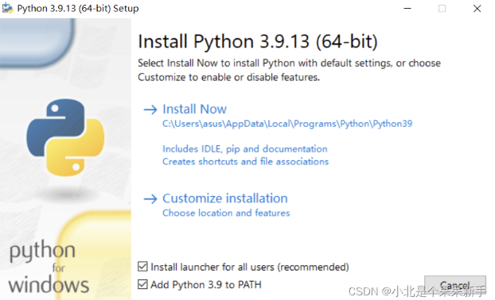
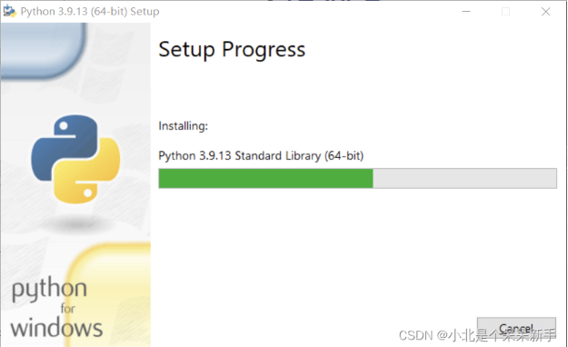
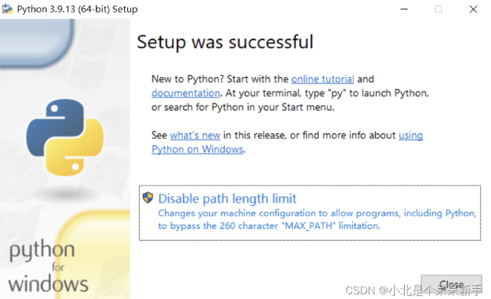
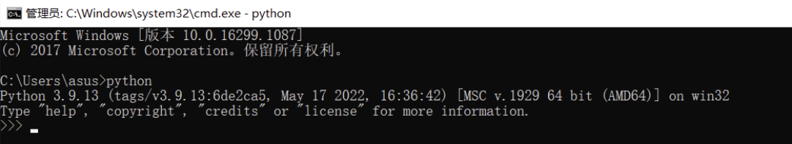

# Python下载与安装操作步骤

# Python下载与安装操作步骤

[python官网](https://so.csdn.net/so/search?q=python官网&spm=1001.2101.3001.7020)地址：https://www.python.org/

第1步：先勾选，再安装，上面是默认安装路径，下面是自定义安装路径

等待安装

安装完成，设置MAX_PATH，授管理员权限

打开终端窗口，输入python命令，验证是否安装成功

