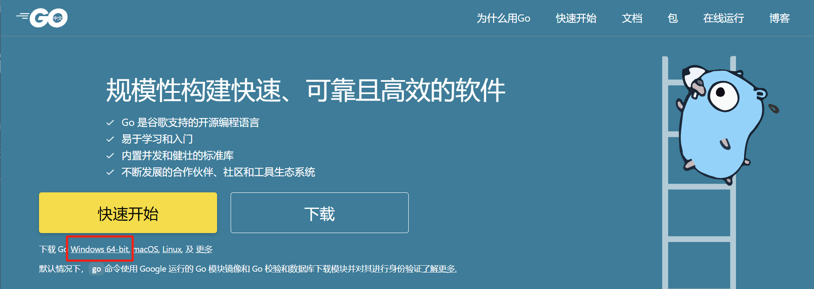
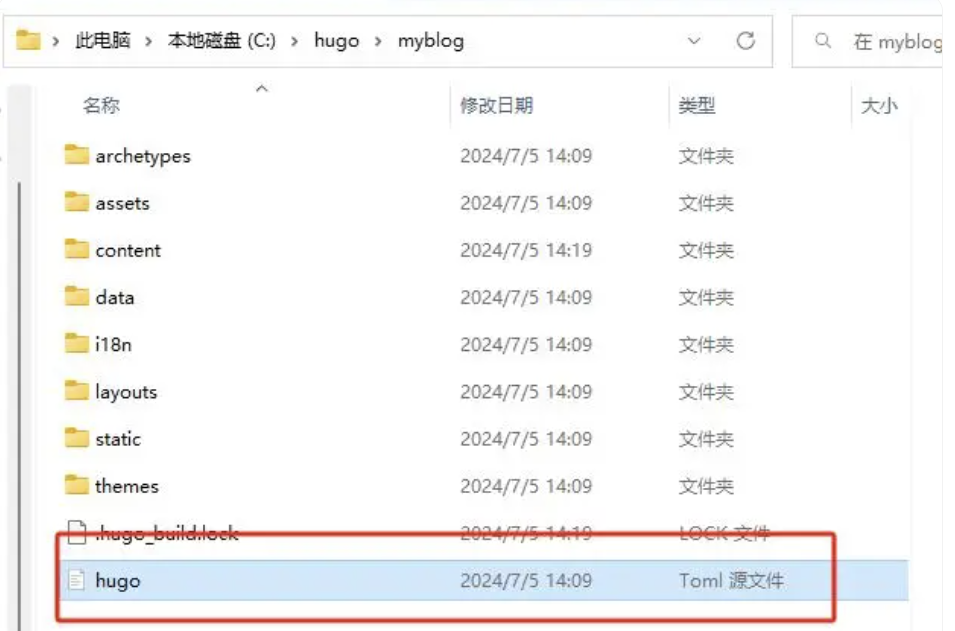
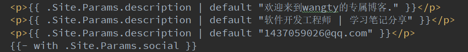
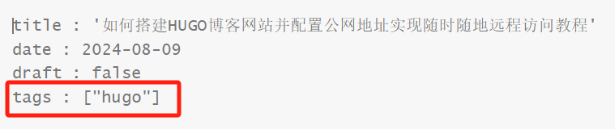

# 如何搭建HUGO博客网站并配置公网地址实现随时随地远程访问教程


# 如何搭建HUGO博客网站并配置公网地址实现随时随地远程访问教程

实现：Windows系统电脑使用HUGO快速搭建一个本地博客网站，并结合cpolar内网穿透工具实现一键发布本地站点至公网，随时随地远程访问，无需公网IP与准备域名、服务器。

------

Hugo 是 Go 编写的静态网站生成器，速度快，易用，可配置。

Hugo 依赖于 Markdown 文件，元数据字体 。用户可以从任意的目录中运行 Hugo，支持共享主机和其他系统。只需要几分之一秒就可以渲染一个经典的中型网站，非常适合博客，文档等等网站的生成。


### 1. 安装环境

接下来教大家如何在Windows系统本地安装HUGO

首先需要安装好Windows版本的 git：

（如果没有安装git的话，进入git官网进行下载windows版本）

git官网：[https://git-scm.com/downloads](https://git-scm.com/downloads，如下图：)

git安装教程请参考：【 [Windows系统Git安装教程（详解Git安装过程） - 学为所用 - 博客园 (cnblogs.com)](https://www.cnblogs.com/xueweisuoyong/p/11914045.html)】


然后需要下载并安装Windows版本的 GO：

（如果没有安装go的话，进入go的中文官网进行下载windows版本）

go的中文官网：https://go.p2hp.com/



### 2. 配置环境变量与hugo安装

然后去上方的hugo项目地址下载好Windows版本的hugo后，放在一边备用。


本教程中下载的项目压缩包名为：hugo_extended_0.128.2_windows-amd64

压缩包下载路径：

https://github.com/gohugoio/hugo/releases/download/v0.128.2/hugo_extended_0.128.2_windows-amd64.zip

【注：hugo·GitHub 地址 https://github.com/gohugoio/hugo/releases】

### 2.1 创建程序目录

在C盘新建一个名为hugo的文件夹，进入文件夹后再创建一个名为bin的文件夹

将下载好的Windows版本hugo应用程序压缩包解压到这个bin文件夹


### 2.2 配置环境变量

然后在Windows搜索栏中搜索环境变量，点击环境变量


选择系统变量中的Path，点击新建


将 C:\hugo\bin 这个路径添加到环境变量


### 2.3 查看程序版本

然后打开powershell终端，输入下方命令查看

```
hugo version
```

显示版本号，即为成功安装了hugo程序。


### 3. 创建博客网站

现在我们就可以使用hugo搭建一个属于自己的博客网站了。

### 3.1 创建站点

首先，我们进入到C盘下的hugo文件夹，点击鼠标右键选择在终端中打开


执行下方命令创建一个静态站点：（本例创建的站点名为myblog，大家可以自定义）

```
hugo new site myblog
```


创建后，我们回到hugo目录，可以看到新增了一个名为myblog的文件夹：


进入该文件夹后，就能看到刚刚创建的博客网站程序：


### 3.2 在站点中创建一篇文章

创建好了站点后，现在网站中还什么内容都没有，我们可以创建一篇文章来进行一下测试：

现在我们在终端中执行下方命令，进入站点目录：


进入网站目录后，执行下方命令创建一篇markdown格式的文章：

```
hugo new posts/Articles01.md
```


执行后可以看到提示已经创建了一篇名为Articles01的文章与其所属路径。

进入这个路径，就能看到文章了。


打开这篇文章后能看到这篇文章的标题，日期等相关信息


在这里我们需要把draft（草稿） = true 修改为 draft = false 来表示这并不是一篇草稿。

然后随便在文档中写一些内容，比如：


然后保存关闭即可。

### 3.3 为网站添加主题

现在我们已经创建好了一个博客网站，并在网站中发布了一篇文章，不过现在我们还不能在浏览器中运行这个本地网站进行查看，因为在这之前，我们需要先给网站添加一个主题。

我们可以登录下方的hugo官网页面来挑选一个你喜欢的网站主题：

https://themes.gohugo.io/themes


这里我们随便选择一个主题，点击进入页面后，可以看到安装方式：


可以看到，想要安装这个网站主题，需要先在终端中进入站点目录：

```
cd myblog
```

也可以想上边一样，在myblog目录中右键在终端中打开。

然后执行下方命令：

```
git clone https://github.com/vaga/hugo-theme-m10c.git themes/m10c
```


然后在打开名为 hugo 的 toml源文件，添加主题配置即可。



网站标题修改为myblog，然后再把theme = “m10c”这行代码加进去保存即可。


现在，我们在myblog目录下的主题文件夹中就能看到刚才添加的主题文件目录了：


### 4. 本地访问测试

现在，我们在终端中执行下方代码启动本地网站进行测试：

```
hugo server
```

本地清除缓存运行

```
hugo server --disableFastRender --gc --noHTTPCache --noBuildLock --logLevel debug
```


可以看到成功启动，在浏览器中输入 localhost:1313/ 即可访问这个本地站点：


可以看到网站标题为myblog，里边有刚才我们发布的第一篇文章Article01：


点击文章标题Article01，即可进入文章页面。

这样我们就成功使用HUGO在Windows本地快速部署了一个静态博客网站。

### 5. 安装内网穿透工具

目前我们在本机成功部署了一个博客网站，但如果没有公网IP的话，只能在本地局域网环境使用，有一定局限性。如果出差在外想要远程使用的话，可以结合Cpolar内网穿透生成公网地址，免去了本地重新部署过程，只需要使用公网地址直接就可以访问本地部署的网站，进行演示。

点击进入cpolar官网注册一个账号，并下载最新版本的Cpolar

https://www.cpolar.com/


登录成功后，点击下载Cpolar到本地并安装（一路默认安装即可）本教程选择下载Windows版本。


Cpolar安装成功后，在浏览器上访问 localhost:9200，使用cpolar账号登录,登录后即可看到Cpolar web 配置界面,结下来在web 管理界面配置即可。

http://localhost:9200/#/login?redirect=%2Fdashboard

【hugo-账户：1437059026@qq.com 密码：Wty201408.】


### 6. 配置公网地址

接下来配置一下本地 博客网站 的公网地址，

登录后，点击左侧仪表盘的隧道管理——创建隧道，

创建一个 博客网站 的公网地址隧道：

- 隧道名称：可自定义命名，注意不要与已有的隧道名称重复
- 协议：选择
- 本地地址：1313
- 域名类型：选择随机域名
- 地区：选择China VIP

点击创建


隧道创建成功后，点击左侧的状态——在线隧道列表,查看所生成的公网访问地址，有两种访问方式。


使用任意一个上面生成的公网地址,在电脑或任意设备在浏览器进行登录访问,即可成功看到 本地博客网站 界面,这样一个可以远程访问的公网地址就创建好了,使用了Cpolar的公网域名,无需自己购买云服务器,即可在公网访问本地部署的服务了！

### 7. 快速搭建本地服务器

配置本地服务器，将编译后的网站文件运行与服务器后，本地可以不启动hugo server

在控制面板打开命令提示符窗格，键入npm install -g anywhere 9999

```
npm install -g anywhere 9999
```

9999这里是设置端口号，端口号自行设置，也可以不输入xxx会默认8000端口号


安装成功anywhere后，可以直接使用anywhere指令启动服务，但是默认是查看全部文件列表

### 8. 编译网站文件并运行于本地服务器

进入myblog根目录下，输入hugo命令进行编译

```
hugo
```

编译后，生成public文件夹，进入该文件夹根目录，并输入anywhere使编译文件运行在上面

```
anywhere
```

【特别注意：运行在服务器上的一定是："**编译后的文件！！！！**"】

### 9.通过内网穿透配置的地址跳转问题解释

使用hugo server本地运行的程序，每次跳转都将走localhost或者127.0.0.1，此处理解和其他程序启动一样，访问及跳转都将走本地。

```
baseURL = 'http://136c5bcc.r16.vip.cpolar.cn/'   //内网穿透地址
```

若要使baseURL配置每次跳转时，自动请求的域名地址为服务器地址，则需要设置.toml文件中的baseURL。

配置方法同小结6相同，配置好后如图


逻辑为：

1、配置本地baseURL为内网穿透地址，使每次访问均可访问内网穿透地址

2、编译文件后，跳转路径指向内网穿透地址

3、内网穿透地址配置localhost:8000指向本地服务器

4、启动本地服务器，使内网穿透访问正常

5、使跳转路径正常

当此处修改为内网穿透地址后，**需先进行编译**，再通过本地服务器启动后的地址后，记得编译之后再运行本地服务器


### 10.网站样式自定义设置

### 10.1 关于themes主题

themes主题为git拉取下来用于整个静态网站的样式代码，均可按照需求进行修改


#### 10.1.1头像设置

1、在layouts包下，有一个baseof.html文件，将其中的首页文件指向调整为你想要的图片


2、并同时更改static文件夹中的图片，使指向和文件名一致。


#### 10.1.2 主题颜色设置

1、拷取themes中配置文件config.toml里默认设置主题颜色的部分代码


默认主题有三种样式


选择其中一种样式，放入我们的配置文件hugo.toml，可以对其中的文字颜色也进行修改，本主题改为粉色


#### 10.1.3 主页文字设置

更改layouts包下，baseof.html文件中书写首页介绍文字的位置



#### 10.1.4 主页分类菜单设置

1、配置文件hugo.html中配置菜单栏


2、并在每条笔记中，使用yaml格式书写抬头




#### 10.1.5 主页关于菜单设置

取主题中content包下的about文件放入myblog的content包根目录下。about内的内容可以自行定义


#### 10.1.6 关于代码块样式设置

配置文件中写入设置样式的命令模块，根据需要更改其中style的值。

hugo中文文档中 ：https://hugo.opendocs.io/getting-started/   选择“内容管理” - “语法高亮”

在style中选择想要更改的样式，放入配置文件中：https://xyproto.github.io/splash/docs/


