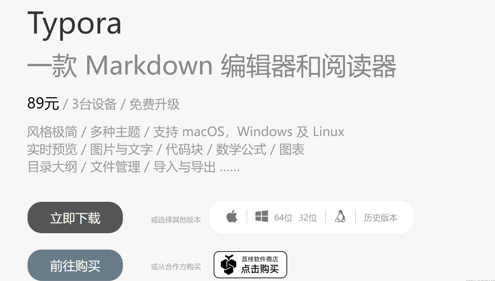
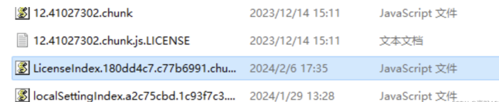
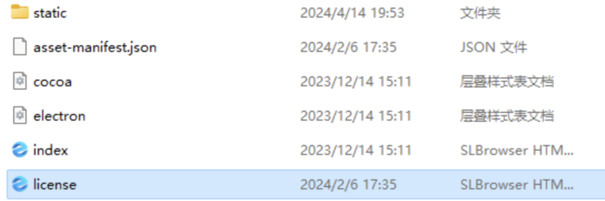
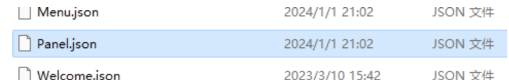
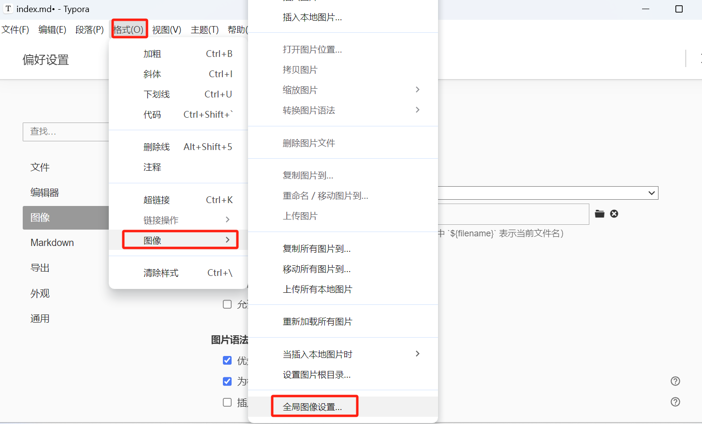
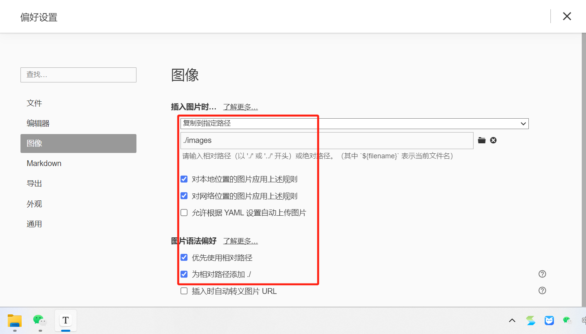

# 破解/安装激活 Typora 2024 教程


#### 官网下载Typora

网址：[Typora 官方中文站 (typoraio.cn)](https://typoraio.cn/)




#### 安装Typora

双击Typora.exe 安装完成

#### 激活方法

安装路径下找到：Typora\resources\page-dist\static\js



右键用记事本打开这个文件，ctrl+F定位到

```
e.hasActivated="true"==e.hasActivated
```

替换为

```
e.hasActivated="true"=="true"
```

这样就已经后台激活完成，但是每次开软件开始会提醒激活。

#### 关闭软件每次启动时的已激活弹窗

继续在安装路径下resources\page-dist\license.html，找到



依旧ctrl+F 定位到：

```html
</body></html>
```

替换为 

```html
</body><script>window.οnlοad=function(){setTimeout(()=>{window.close();},5);}</script></html>
```

#### 去除软件左下角“未激活”提示

按照安装路径，找到 resources\locales\zh-Hans.lproj\Panel.json


**文件中查找**：

```
"UNREGISTERED":"未激活"，
```

**替换为：**

```
"UNREGISTERED":" "
```

**最后，重新打开Typora，手动关掉激活窗口，之后就不会再出现。**

#### 引用图片

注意：Typora 使用带图片的文件，使用相对路径，创建带图片的笔记时，.md文件命名需为index。自动访问路径中的index文件，剪切图片时自动生成image文件夹，使得图片相对路径访问正常





【注意：我的安装路径位置在 C:\Program Files\Typora】

