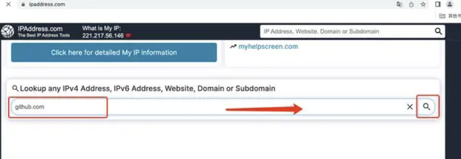
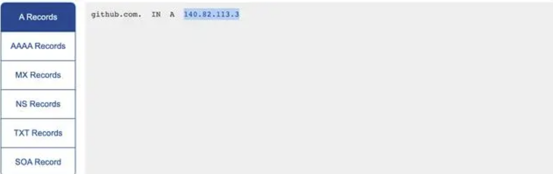
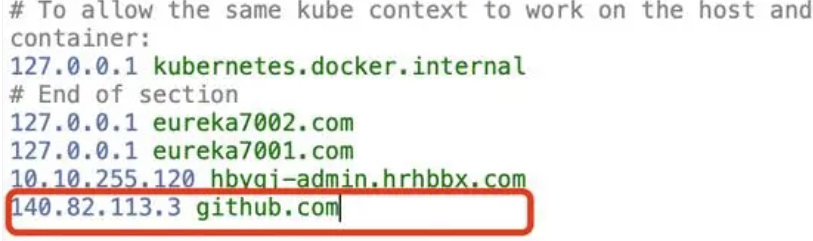
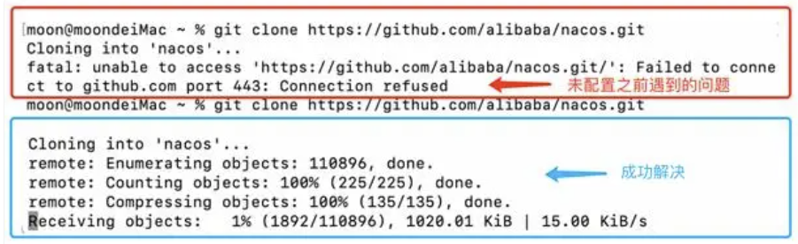

# hugo主题克隆失败解决办法


# hugo主题克隆失败解决办法


**Failed to connect to github.com port 443: Connection refused**

### 一、问题描述：

当下载Nacos时报错如下（可能你是其他与github交互的操作报错，pull或者push等等，但原因都一样）：Failed to connect to github.com port 443: Connection refused

### 二、排查代理问题

尝试重置代理或者取消代理的方式：

```
git config --global --unset http.proxy
git config --global --unset https.proxy
```

如果没效果，接着添加全局代理试试：

```
git config --global http.proxy
git config --global https.proxy
```

如果以上问题还未得到解决，可能不是代理的问题，或许是DNS解析，再采用接下来的方法尝试

### 三、排查DNS解析问题

提示：在DNS解析前先会尝试走hosts然后在找不到的的情况下再DNS解析,修改hosts文件域名解析就会先走hosts中的ip和域名的映射关系。

我们可以修改hosts文件，修改ip地址和域名的映射关系，步骤如下：

### 1、第一步：查找github.com对应的IP

首先通过网址ipaddress.com搜索框输入github.com，查找github.com对应的IP地址：



结果页面拉到最下边会看到如下信息：140.82.113.3 即查到的github.com的IP地址：



### 2、第二步：修改hosts文件

其次找到本机的hosts文件，将查询到的GitHub IP地址内容`140.82.113.3 github.com` 追加进hosts文件：



提示：
Windows大概在C:\Windows\System32\drivers\etc下
Mac在/etc下，打开访达后,在键盘上按Shift+Command+G组合键，在窗口中输入/etc/hosts ，即可到达hosts文件的所在位置

配置好后，再去重新操作，成功解决。



