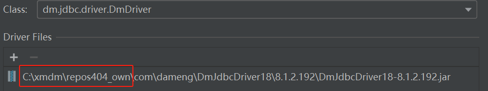
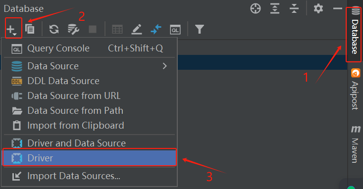
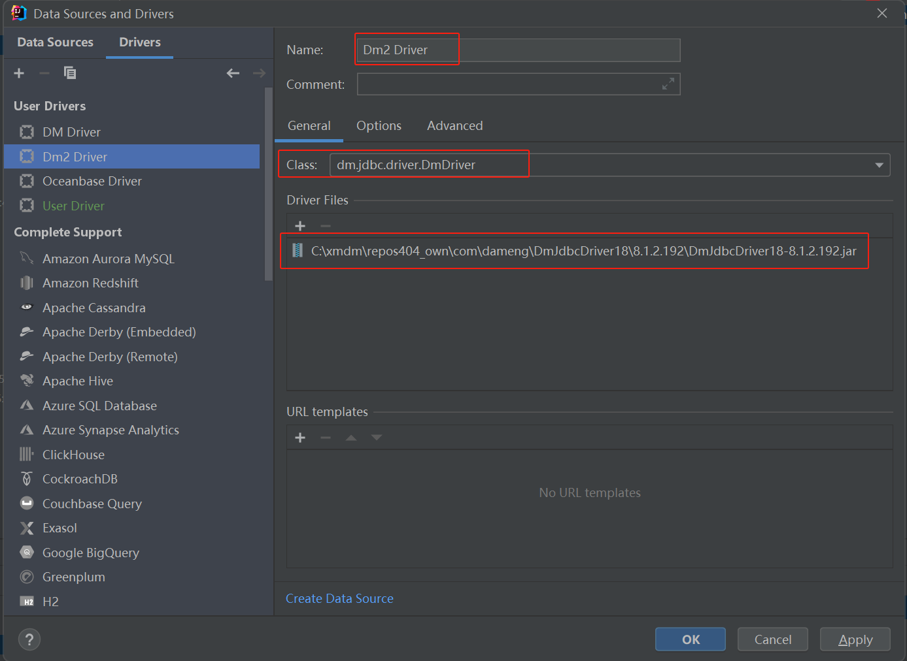
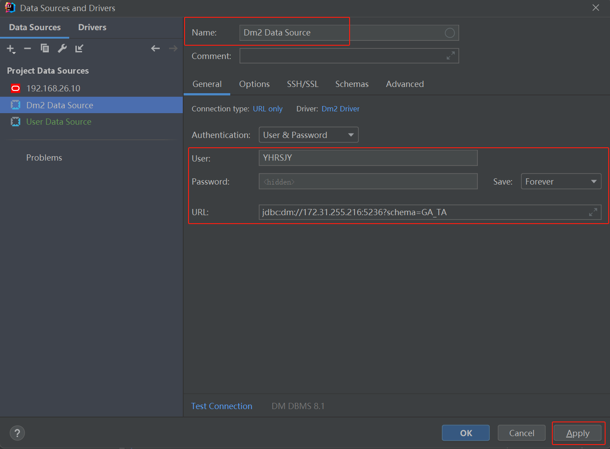
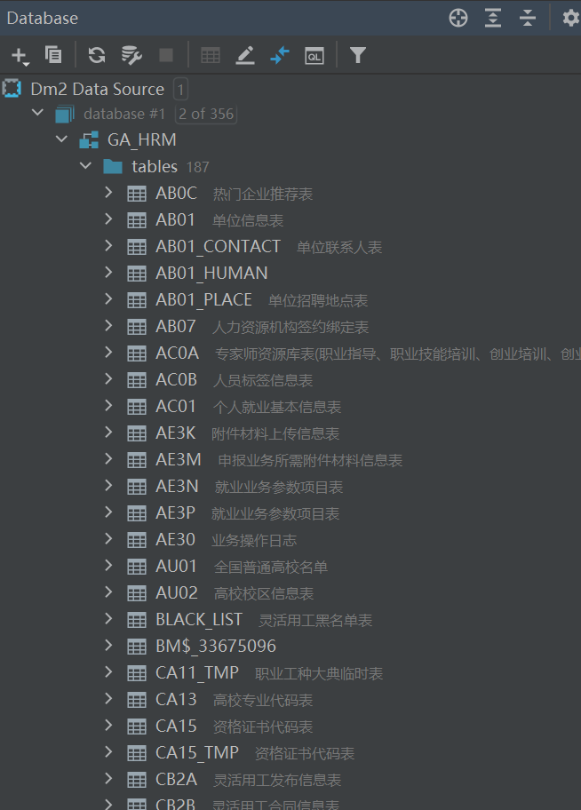

# IDEA在Database中连接达梦数据库

**IDEA在Database中连接达梦数据库**

[repository-达梦8maven.zip · Jared.Yan/dameng-maven - Gitee.com](https://gitee.com/fuile/dameng/blob/master/repository-达梦8maven.zip)

> 如果是连接项目代码中的达梦数据库，此处选择的jar包为项目代码依赖中的dm.jar

1、idea右侧点击database

2、照着我的点就行，驱动包记得得先加上才会出现class选项

3、回到主页面，添加一个数据库连接。

4、测试连接，连接成功

