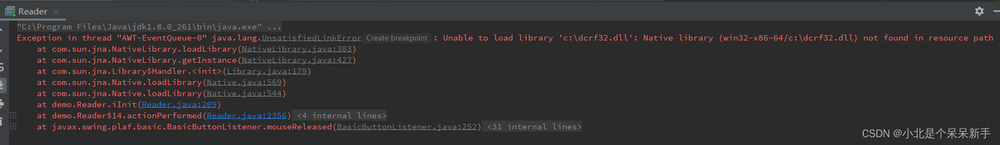
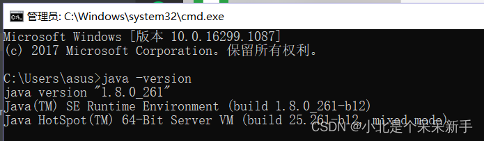
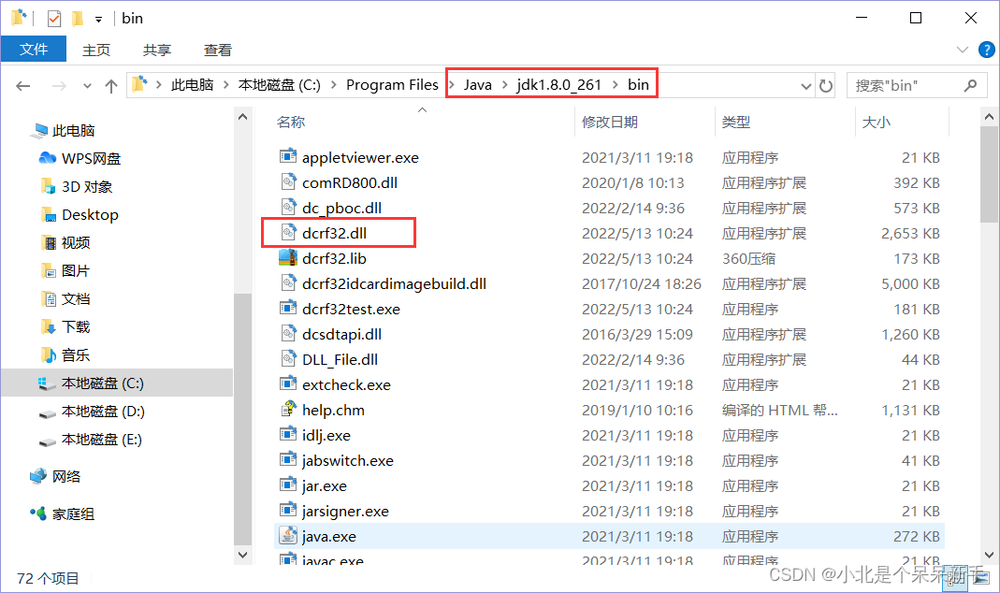
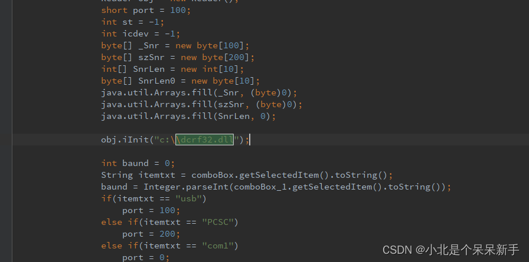

# 【读卡器驱动】dcrf32.dll

报错信息Exception in thread "AWT-EventQueue-0" java.lang.UnsatisfiedLinkError: Unable to load library 'c:\dcrf32.dll':Native library (win32-x86-64/c:\dcrf32.dll) not found in resource path

翻译过来就是：线程“AWT-EventQueue-0”出现异常，无法加载库'c:\dcrf32.dll':本机库(win32-x86-64/c:\dcrf32.dll)在资源路径中找不到

解决办法：

1、我先是检查了jdk 版本，jre是不是选择和[动态库](https://so.csdn.net/so/search?q=动态库&spm=1001.2101.3001.7020)相同位数的32 or 64？

检查jdk版本位数的方法: java -version

2、 动态库是否添加到jdk里面？我检查的时候，是加了的，但是还是报找不到

3、是不是动态库要求放到具体某一个文件夹下了？

 Unable to load library 'c:\dcrf32.dll':Native library (win32-x86-64/c:\dcrf32.dll) not found 

这个括号里面搜索的动态库的位置在c盘根目录下，很像是代码写死了访问位置。于是我找代码去了，确实代码里面是指定要求限制了。

解决办法：把动态库的位置移动到c盘根目录下，或者代码访问位置去掉前面的磁盘限制。

这个错找了很久，特此记录

