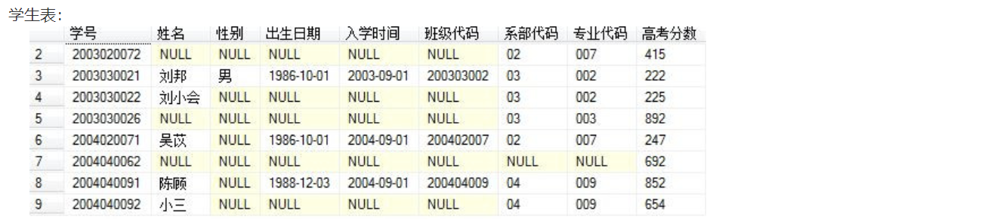
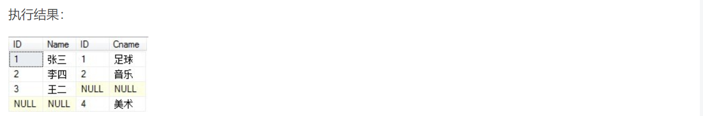
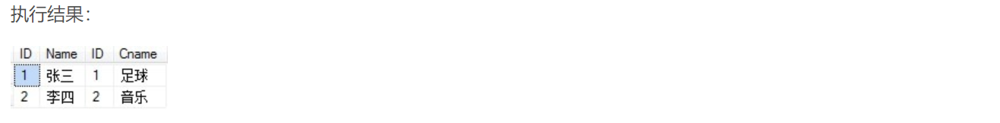

# 【SQL语句】SQL语句部分写法


## 一、聚合函数

有一个学生表如下：



### count

###### 1、统计记录总个数

```sql
SELECT 
	COUNT (*) 
FROM 
	学生表
```


若要命名

```sql
SELECT 
	COUNT (* ) as 学生总人数 
FROM 
	学生表
```


###### 2、统计指定列的值的数目（NULL 值不计入）

```sql
SELECT 
	COUNT (专业代码)   
FROM 
	学生表
```


###### 3、统计指定列，拥有不同值的数目（NULL 值不计入）

```sql
SELECT 
	COUNT (distinct  专业代码)   
FROM 
	学生表
```


### sum

###### 4、计算某一列值的总和

```sql
SELECT 
	sum(高考分数) as 高考总分数 
FROM 学生表
```


### MAX、MIN、AVG

###### 5、求某一列值的最大值 


    MAX 函数返回一列中的最大值。NULL 值不包括在计算中。
    注释：MIN 和 MAX 也可用于文本列，以获得按字母顺序排列的最高或最低值。


```sql
SELECT 
	MAX(高考分数) as 高考最高分数 
FROM 学生表
```

###### 6、求某一列值的最小值 

```sql
SELECT 
	MIN(高考分数) as 高考最低分数 
FROM 学生表
```

###### 7、求某一列值的平均值 

```sql
SELECT  
	AVG(高考分数)  as  高考最高分数 
FROM 学生表
```

### FIRST、ROUND

###### 6、取指定字段的第一个记录的值

```sql
select 
	first(column_name)  
from  table_name   
```

###### 7、ROUND() 函数（四舍五入规则）、用于把数值字段舍入为指定的小数位数。

```sql
SELECT 
	round(列名,小数位数) 
FROM table_name 
```

### MID

###### 8、MID() 函数 ：用于从文本字段中提取字符。

```sql
SELECT MID(列名,开始截取位置,结束截取位置) FROM table_name
```


    SELECT MID(列名,1,3) FROM table_name
    3不写，默认返回剩余的所有字段



### LEN

###### 9、LEN 函数返回文本字段中值的长度。

```sql
SELECT LEN(列名) FROM table_name
```

## 二、数据库查询前10条数据

Oracle中查询

```sql
select * from table where rownum<=10;
```

DB2中查询

```sql
select * from table fetch first 10 rows only;
```

MySql中查询

```sql
select *  from table limit 10;
```

## 三、SQL语言多表关联查询

##### 一、外连接

外连接可分为：左连接、右连接、完全外连接。

```sql
select * from A表 left join B表 on A表条件 = B表条件
```


    左外连接包含left join左表所有行，如果左表中某行在右表没有匹配，则结果中对应行右表的部分全部为空(NULL)



```sql
select * from A表 right join B表 on A表条件 = B表条件
```



    右外连接包含right join右表所有行，如果左表中某行在右表没有匹配，则结果中对应左表的部分全部为空(NULL)。



```sql
select * from A表 full join B表 on A表条件 = B表条件
```


    完全外连接包含full join左右两表中所有的行，如果右表中某行在左表中没有匹配，则结果中对应行右表的部分全部为空(NULL)，如果左表中某行在右表中没有匹配，则结果中对应行左表的部分全部为空(NULL)。




##### 二、内连接

join 或 inner join

```sql
select * from A表 join B表 on A表条件 = B表条件
```


  inner join 是比较运算符，只返回符合条件的行。






