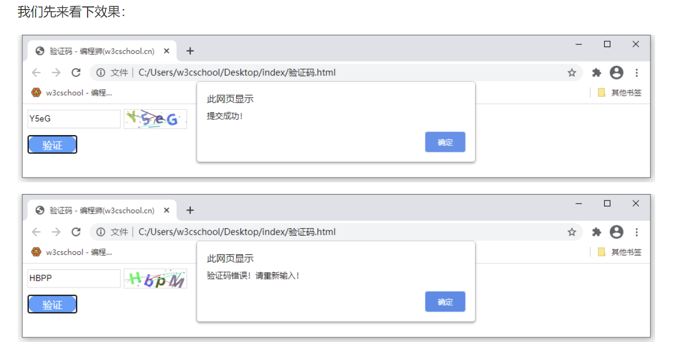
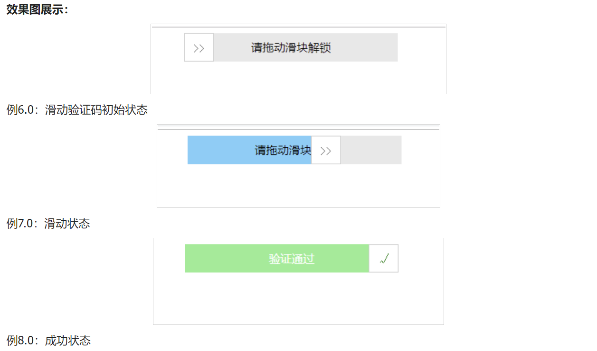

# 【JS】JS 验证码功能的三种实现方式


### 数字短信验证码

**思路：**

a.两个文本框+一个获取验证码按钮，文本框用来输入手机号和获取到的验证码，按钮负责点击和记录倒计时；

b.js书写定时器setTimeout，进行60秒验证码失效时间记录；

c.后台提供短信获取验证的接口，我们把手机号作为参数上传，后台获取到后给该手机号下发验证码

下放代码可以直接

```html
<!DOCTYPE html>
<html lang="en">
<head>
    <meta charset="UTF-8">
    <title>Title</title>
</head>
<script type="text/javascript" src="https://libs.baidu.com/jquery/2.1.4/jquery.min.js" >
//验证码
var counts = 60;

function settime(val) {
 if(counts == 0) {
  val.removeAttribute("disabled");
  val.value = "获取验证码";
  counts = 60;
  return false;
 } else {
  val.setAttribute("disabled", true);
  val.value = "重新发送（" + counts + "）";
  counts--;
 }
 setTimeout(function() {
  settime(val);
 }, 1000);
}

$(function(){
 //获取验证码
 $("#verCodeBtn").click(function() {
  var userinfo = {
   "UserPhoneNum": '86//' + $("input[name='phone']").val()
  }
  $.ajax({
   url: "https://www.xxxxx.cn/user/sendcode/",
   data: userinfo,
   type: "get",
   success: function(data) {
    if(JSON.parse(data).state === 404 || JSON.parse(data).state === 202 || userinfo.UserPhoneNum === '86//') {
     alert("验证码发送失败")
    } else {
     alert("验证码发送成功，请耐心等待")
    }
   },
   error: function() {
    alert("发送失败");
   }
  });
 });
})
</script>

<body>
	
	<input type="text" name="phone" id="phone" value="" placeholder="请输入手机号" maxlength="11" />
	<input type="" name="verCode" id="verCode" value="" placeholder="请输入验证码" maxlength="6"/>
	<input type="button" name="" id="verCodeBtn" value="获取验证码" onclick="settime(this);"/>
</body>
</html>
```

### 图形验证码

概要：一般的图形验证码就像上方的短信验证码一样，就是后台生成的验证码图片返回给前端的，那样的话就比较简单，因为复杂的都让后台解决了，我在这里主要说的是另一种，就是不调用后台接口，通过canvas画布来解决图形验证码。

**思路：**

a.一个文本框用来输入由数字和字母组合的验证码+一个画布标签来显示图形验证码+一个提交按钮；

b.提交按钮进行表单验证，输入正确或者错误进行相应的提示；

c.用画布生成并渲染出验证码图形，并且得到随机的颜色值；




```html
<!DOCTYPE html>
<html lang="en">
<head>
   <meta charset="UTF-8">
    <title>验证码</title>
    <style>
  .input-val {
  width: 150px;
  height: 30px;
  border: 1px solid #ddd;
  box-sizing: border-box;/*box-sizing 属性允许你以某种方式定义某些元素，以适应指定区域。*/
  }

  #canvas {
  vertical-align: middle;/*vertical-align属性设置一个元素的垂直对齐。*/
  box-sizing: border-box;
  border: 1px solid #ddd;
  cursor: pointer;
  }

  .btn {
  display: block;
  margin-top: 10px;
  height: 30px;
  width: 80px;
  font-size: 16px;
  color: #fff;
  background-color: #409EFE;
  border: 1px solid #EBEDEF;
  border-radius: 50px;
  }
 </style>
</head>

<script type="text/javascript" src="https://libs.baidu.com/jquery/2.1.4/jquery.min.js" ></script>
<script>
 $(function(){
  var show_num = [];
  draw(show_num);
  $("#canvas").on('click',function(){
   draw(show_num);
  })
  $(".btn").on('click',function(){
   var val = $(".input-val").val().toLowerCase(); //toLowerCase()函数将字符串中的所有字符转为小写。所以输入框不区分大小写。
   var num = show_num.join("");
   if(val==''){
    alert('请输入验证码！');
   }else if(val == num){
    alert('提交成功！');
    $(".input-val").val('');
   }else{
    alert('验证码错误！请重新输入！');
    $(".input-val").val('');
   }
  })
 })

 function draw(show_num) {//生成并渲染出验证码图形
  var canvas_width=$('#canvas').width();
  var canvas_height=$('#canvas').height();
  var canvas = document.getElementById("canvas");//获取canvas
  var context = canvas.getContext("2d");//获取到canvas画图的环境
  canvas.width = canvas_width;
  canvas.height = canvas_height;
  var sCode = "A,B,C,E,F,G,H,J,K,L,M,N,P,Q,R,S,T,W,X,Y,Z,a,b,c,d,e,f,g,h,i,j,k,m,n,p,q,r,s,t,u,v,w,x,y,z,1,2,3,4,5,6,7,8,9,0";
  var aCode = sCode.split(",");
  var aLength = aCode.length;//获取到数组的长度
  for (var i = 0; i < 4; i++) { //这里的for循环可以控制验证码位数
   var j = Math.floor(Math.random() * aLength);//获取到随机的索引值
   var deg = Math.random() - 0.5; //产生一个随机弧度
   var txt = aCode[j];//得到随机的一个内容
   show_num[i] = txt.toLowerCase();
   var x = 10 + i * 20;//文字在canvas上的x坐标
   var y = 20 + Math.random() * 8;//文字在canvas上的y坐标
   context.font = "bold 24px 微软雅黑";
   context.translate(x, y);
   context.rotate(deg);
   context.fillStyle = randomColor();
   context.fillText(txt, 0, 0);
   context.rotate(-deg);
   context.translate(-x, -y);
  }

  for (var i = 0; i <= 5; i++) { //验证码上显示线条
   context.strokeStyle = randomColor();
   context.beginPath();
   context.moveTo(Math.random() * canvas_width, Math.random() * canvas_height);
   context.lineTo(Math.random() * canvas_width, Math.random() * canvas_height);
   context.stroke();
  }

  for (var i = 0; i <= 20; i++) { //验证码上的小点
   context.strokeStyle = randomColor();//随机生成
   context.beginPath();
   var x = Math.random() * canvas_width;
   var y = Math.random() * canvas_height;
   context.moveTo(x, y);
   context.lineTo(x + 1, y + 1);
   context.stroke();
  }
 }

 function randomColor() {//得到随机的颜色值
  var r = Math.floor(Math.random() * 256);
  var g = Math.floor(Math.random() * 256);
  var b = Math.floor(Math.random() * 256);
  return "rgb(" + r + "," + g + "," + b + ")";
 }
</script>

<body>
    <div class="code">
        <input type="text" value="" placeholder="请输入验证码" class="input-val">
        <canvas id="canvas" width="100" height="30"></canvas>
        <button class="btn">验证</button>
    </div>
</body>

</html>
```

### 滑动验证码

滑块登录，是完成拼图形式的，我下面这个原理是一样的，逻辑是根据鼠标滑动轨迹，坐标位置，计算拖动速度等等来判断是否人为操作，如果小伙伴想做和博客园效果一样的，那么可以用来做参考。

**思路：**

a.由三个div组成，构成了滑块和底部进度条的效果；

b.书写js,注册鼠标按下，悬浮，松开事件；

c.记录滑块移动的距离和状态进行判断是否成功；



html

```html
<div class="drag">
  <div class="bg"></div>
  <div class="text" onselectstart="return false;">请拖动滑块解锁</div>
  <div class="btn">&gt;&gt;</div>
</div>
```

css

```css
<style>
  .drag{
   width: 300px;
   height: 40px;
   line-height: 40px;
   background-color: #e8e8e8;
   position: relative;
   margin:0 auto;
  }
  .bg{
   width:40px;
   height: 100%;
   position: absolute;
   background-color: #75CDF9;
  }
  .text{
   position: absolute;
   width: 100%;
   height: 100%;
   text-align: center;
   user-select: none;
  }
  .btn{
   width:40px;
   height: 38px;
   position: absolute;
   border:1px solid #ccc;
   cursor: move;
   font-family: "宋体";
   text-align: center;
   background-color: #fff;
   user-select: none;
   color:#666;
  }
</style>
```

js

```js
<script>
  //一、定义一个获取DOM元素的方法
  var $ = function(selector){
    return document.querySelector(selector);
   },
   box = $(".drag"),//容器
   bg = $(".bg"),//背景
   text = $(".text"),//文字
   btn = $(".btn"),//滑块
   success = false,//是否通过验证的标志
   distance = box.offsetWidth - btn.offsetWidth;//滑动成功的宽度（距离）
  //二、给滑块注册鼠标按下事件
  btn.onmousedown = function(e){
   //1.鼠标按下之前必须清除掉后面设置的过渡属性
   btn.style.transition = "";
   bg.style.transition ="";
   //说明：clientX 事件属性会返回当事件被触发时，鼠标指针向对于浏览器页面(或客户区)的水平坐标。
   //2.当滑块位于初始位置时，得到鼠标按下时的水平位置
   var e = e || window.event;
   var downX = e.clientX;
   //三、给文档注册鼠标移动事件
   document.onmousemove = function(e){
    var e = e || window.event;
    //1.获取鼠标移动后的水平位置
    var moveX = e.clientX;
    //2.得到鼠标水平位置的偏移量（鼠标移动时的位置 - 鼠标按下时的位置）
    var offsetX = moveX - downX;
    //3.在这里判断一下：鼠标水平移动的距离 与 滑动成功的距离 之间的关系
    if( offsetX > distance){
     offsetX = distance;//如果滑过了终点，就将它停留在终点位置
    }else if( offsetX < 0){
     offsetX = 0;//如果滑到了起点的左侧，就将它重置为起点位置
    }
    //4.根据鼠标移动的距离来动态设置滑块的偏移量和背景颜色的宽度
    btn.style.left = offsetX + "px";
    bg.style.width = offsetX + "px";
    //如果鼠标的水平移动距离 = 滑动成功的宽度
    if( offsetX == distance){
     //1.设置滑动成功后的样式
     text.innerHTML = "验证通过";
     text.style.color = "#fff";
     btn.innerHTML = "&radic;";
     btn.style.color = "green";
     bg.style.backgroundColor = "lightgreen";
     //2.设置滑动成功后的状态
     success = true;
     //成功后，清除掉鼠标按下事件和移动事件（因为移动时并不会涉及到鼠标松开事件）
     btn.onmousedown = null;
     document.onmousemove = null;
     //3.成功解锁后的回调函数
     setTimeout(function(){
      alert('解锁成功！');
     },100);
    }
   }
   //四、给文档注册鼠标松开事件
   document.onmouseup = function(e){
    //如果鼠标松开时，滑到了终点，则验证通过
    if(success){
     return;
    }else{
     //反之，则将滑块复位（设置了1s的属性过渡效果）
     btn.style.left = 0;
     bg.style.width = 0;
     btn.style.transition = "left 1s ease";
     bg.style.transition = "width 1s ease";
    }
    //只要鼠标松开了，说明此时不需要拖动滑块了，那么就清除鼠标移动和松开事件。
    document.onmousemove = null;
    document.onmouseup = null;
   }
  }
</script>
```


