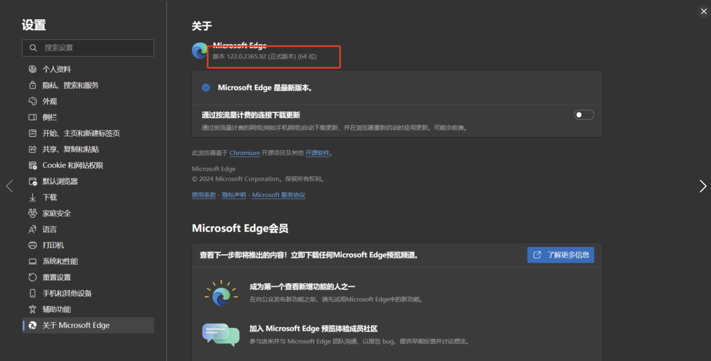
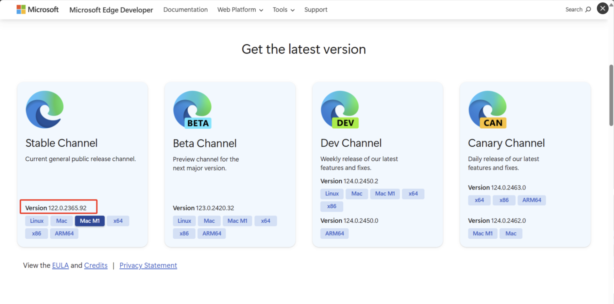
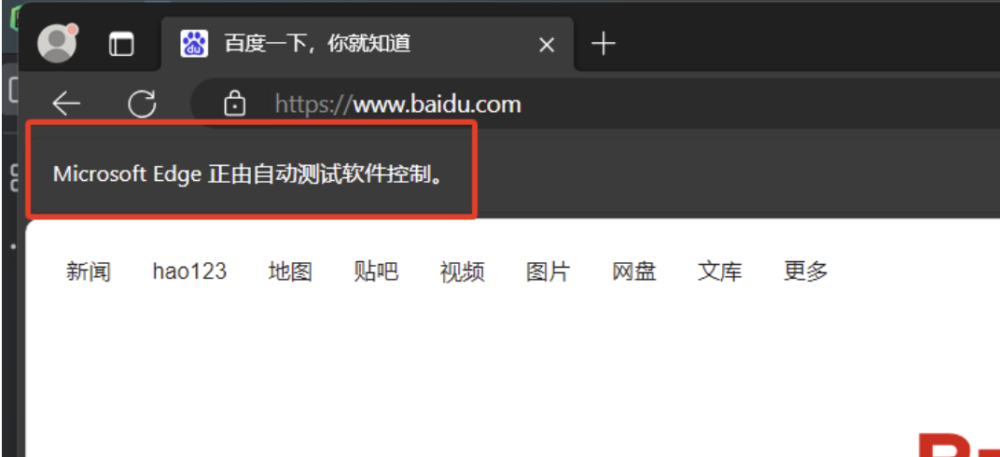

# 【Python】Python的WebDriver问题


本文指导如何处理PyCharm中关于MicrosoftWebDriver.exe路径错误，需下载对应浏览器驱动，如Edge驱动，重命名并将其放置在Python安装目录下，以便PyCharm正常使用Selenium打开浏览器。edge驱动下载地址：**[驱动程序](https://developer.microsoft.com/en-us/microsoft-edge/tools/webdriver/?form=MA13LH)**





1. **将下载好的驱动程序解压。**
2. **找到python的目录文件，将Edge驱动程序放置在python根目录下。**


如果不知道自己的python安装在什么位置了，可以打开cmd键入“where python”


   3.**完成以上步骤你得pycharm就可以正常打开浏览器了。**

```php
driver = webdriver.Edge()
url = "https://www.baidu.com"
driver.get(url)
```




