# 【Vue前端框架】尚硅谷Vue2.0+Vue3.0全套教程

### 模版语法

vue示例和容器root，11对应

el：加#指定容器id，不加#指定容器class

双括号中支持的内容为：{{ js表达式}}

### 数据绑定

v-bind：

**单向数据绑定** ：data数据里的值发生变化，组件的值就发生变化。

v-bind:value="id" 

// data:{ name:"123"} 

但是组件上的值发生变化，data里的值不会发生变化

**双向数据绑定** ：data数据里的值-同-组件的值，同步发生变化。

v-model:value="id" 

// data:{ name:"123"} 

注意：v-model**只能用在输入值表单元素上**

### **$mount.挂载**

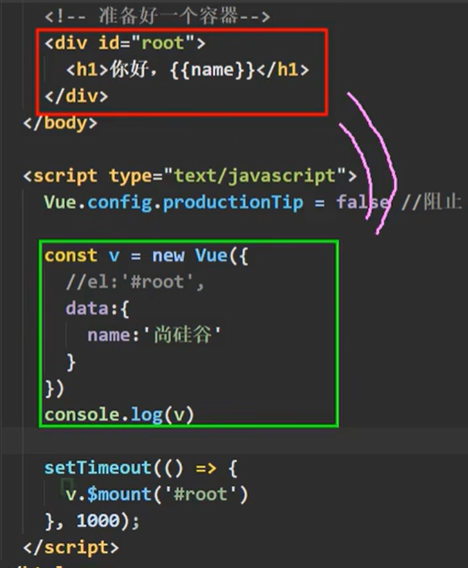

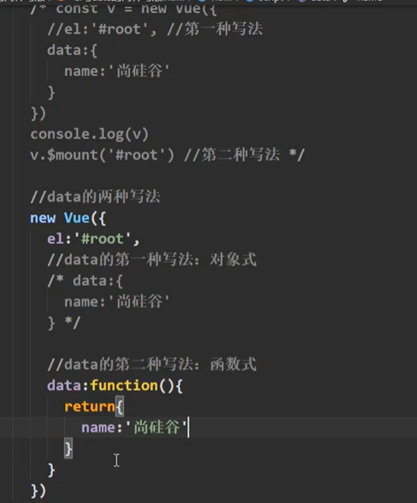

箭头函数，没有this，data()=>{ }中调用的是实例不是vue是windows

### MVVM模型

### 数据代理

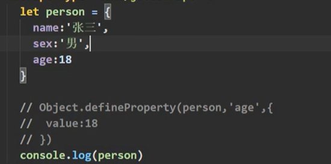

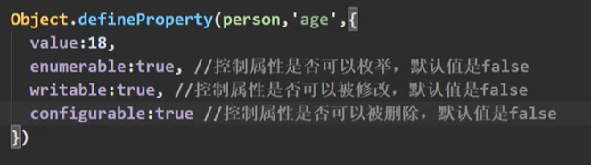

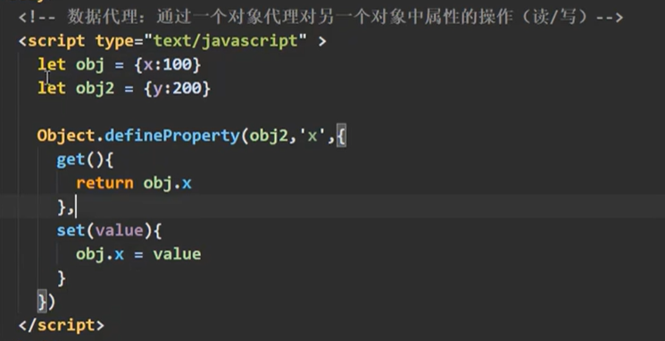

v-on:click = ""  等价于 @click=""

click默认方法里面的传参，为点击事件event

event.target.innerText指获取当前点击元素的文本内容

:直接写是 v-bind 的简写

@直接写是 v-on 的简写

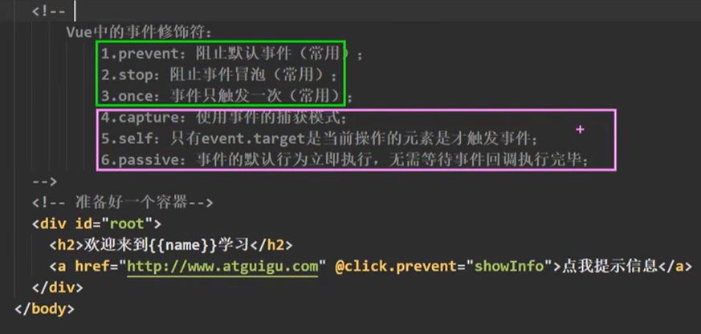

事件修饰符prevent，用于操作点击默认的操作

@keyup 键盘事件

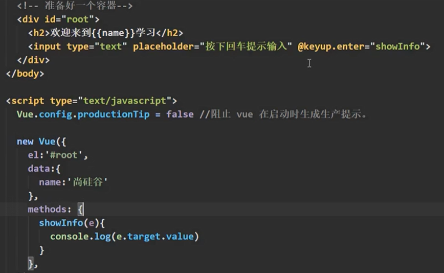

### computed计算属性

只有读取的时候，简写get为计算属性名加（）{ get方法 }

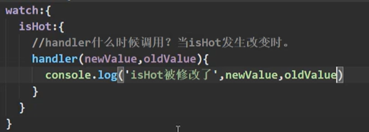

### 深度监视

加deep

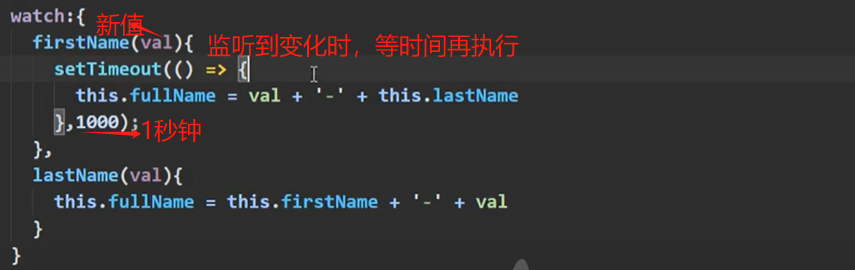

computed计算属性不能实现异步返回，watch监听属性可以

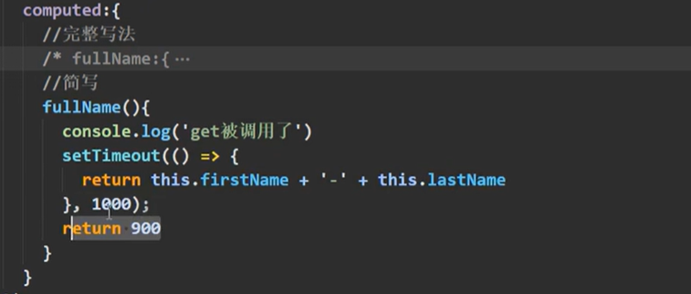

条件渲染 v-show

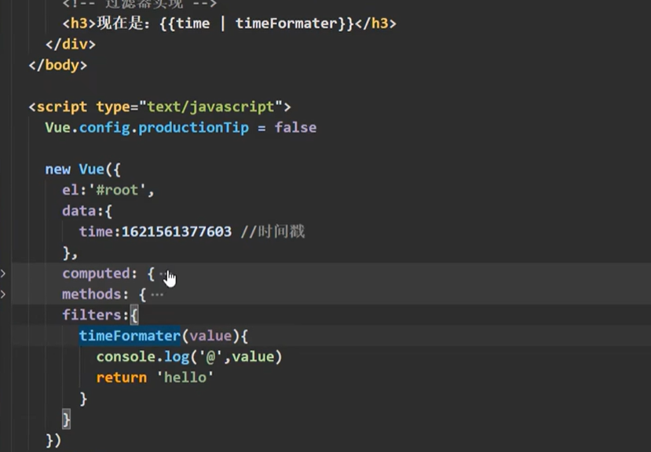

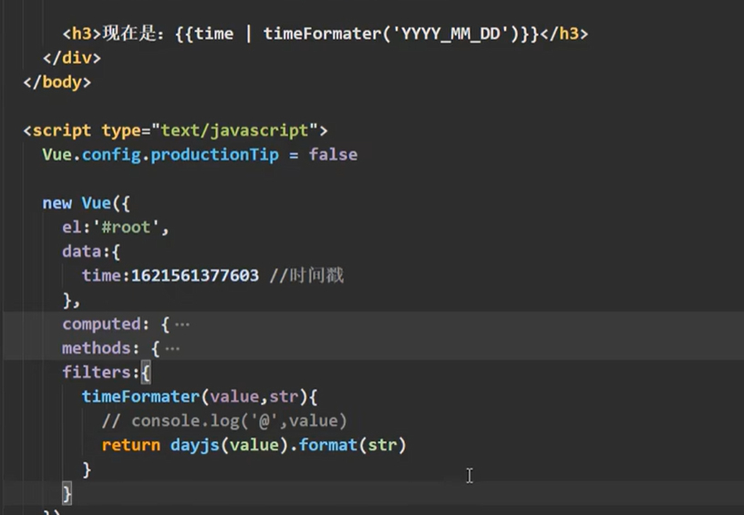

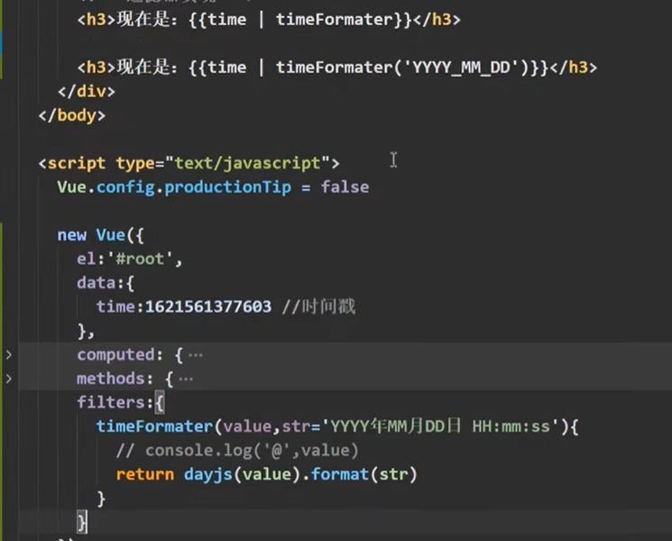

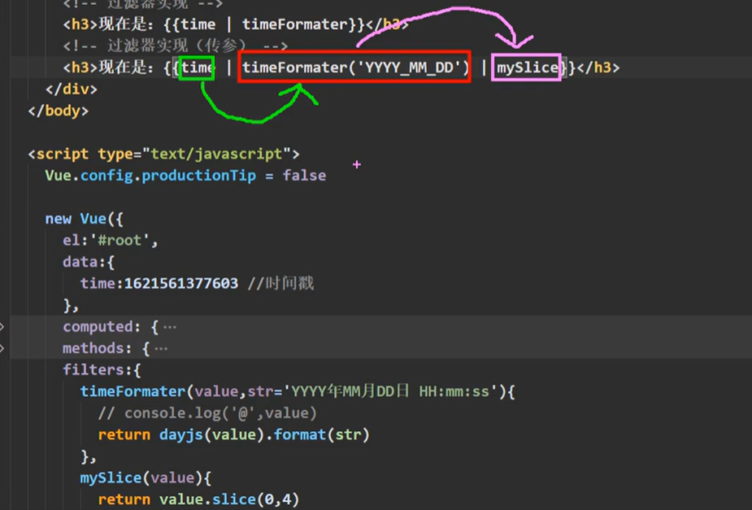

v-text 对所在节点传入文本内容

v-html  对所在节点传入的 带标签的内容 解析成HTML展示

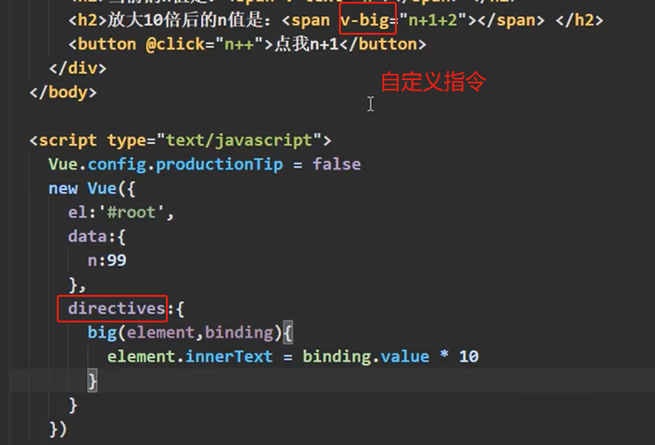

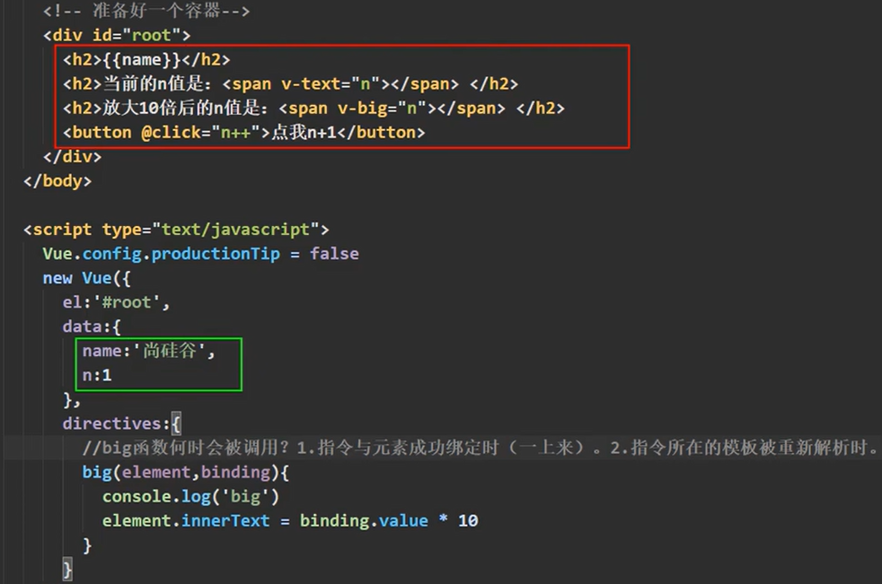

### 生命周期

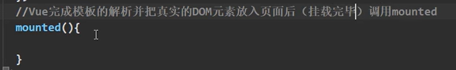

mounted只调一次

mounted在页面挂载完成之后调用

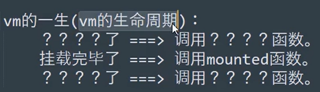

关键的时间点，调一些函数

这些函数，统称为生命周期函数

beforeCreate() 有vm，可用this，无法访问data和method

生命周期流程：初始化生命周期+事件[数据代理未开始] => beforeCreate() =>初始化数据监测+数据代理 => created()

created() =>解析模板，生成虚拟dom内存，页面还不能显示解析的好的内容

beforeMount() = >虚拟dom转真是dom，存在vm.$el里

mounted()=>经过编译的等初始化操作

### 浏览器本地存储

：window.localStorage.getItem('userInfo')
window.localStorage.setItem(Json.stringify(userInfo))
let userInfo = {}

window.localStorage.removeItem('userInfo')

会话存储sessionStorage：

会话会随浏览器窗口关闭而消失

nextTick()等待下一次 DOM 更新刷新的工具方法

setup() 渲染在beforeCreate之前，所有的渲染之前，不能用this，返回return为一个函数

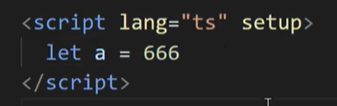

简写形式，语法糖

decode用法

DECODE(value, if1, then1, if2, then2, ..., else)

