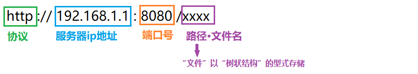
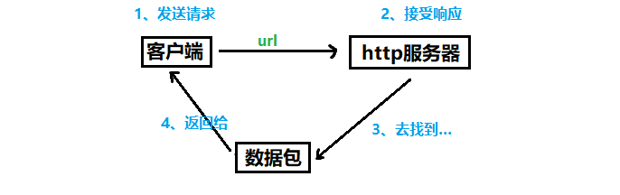
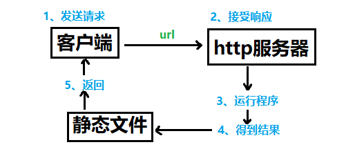

# 【html】网页设计笔记

# 网页设计笔记

## 1、万维网

（world wide web ===> www）作用：实现资源共享

​	是Internet上基于**客户/服务器体系结构**的**分布式多平台**的**超文本超媒体信息服务系统**，它是Internet最主要的信息服务，允许用户在一台计算机上通过Internet读取另一台计算机上的信息。

## 2、网页

（web page）

​	是**存放在web服务器上**供**客户端**用户浏览的**文件**，可以在Internet上传输。网页是按照**网页文档规范**编写的一个或多个文件，这种格式的文件由**超文本标记语言**创建，能将文字、图片、声音等各种**多媒体文件**组合在一起，这些文件被保存在特定计算机的特定目录中。

## 3、网站

（web site）

​	也称站点，定义为已注册的**域名、主页或web服务器**。

​	“网站 = 域名（网站地址）+ 网站空间”

​	网站是一系列**网页的组合**，这些网站拥有**相同或者相似的属性**，并通过各种链接相关联。


相同实现目的、相似设计、共同描述相关主导体


浏览器 ——> 地址栏 ——> 网站地址 ——>网络服务器 ——> 默认网页（首页/主页）


浏览器：简译和显示 网页数据包


## 4、web标准

​	不是某一种标准，而是一系列标准的集合。

​	“网页组成 = 结构 + 行为 + 表现”

对应三类标准：

​	1、结构化标准语言：XHMTL、XML、【HTML: 超文本标记语言HyperText Markup Lauguage】

​	2、表现标准语言：CSS【Cascading Style Sheets 层叠样式表】

​	3、行为标准语言：对象模型W3C DOM 【Document Object Model 文档对象模型】、ECMAScript【API应用接口：连接“网站文件”与“js”的接口】

## 5、Inter网

​	由双绞线通过物理连接构成网。（路由器、交换机）

## 6、http

​	超文本传输协议资源

## 7、URL

统一资源定位符

## 8、UML

统一建模语言

## 9、DNS

域名解析服务器

## 10、网页工作原理

​	1、静态网页（工作原理）

​	2、动态网页（工作原理）

## 11、Java Script

​	运行在客户端的一段程序。

## 12、架构

​	BS架构：浏览器/服务器

​	CS架构：客户端（下载APP）/服务器

## 13、网页图形图像处理工具

​	网页图形图像处理工具可以设计图像：

​	Fireworks  （背景透明 jpg.不支持）

​	PhotoShop  （背景透明 gif.动画 支持）

​	CorelDraw  （背景透明 png.支持）

​	ps处理图像是使用的位图，生成文件尾缀~.psd

​	1024 × 768：横纵向像数点 【位图放大、会失真、会模糊】    

cd处理图像是使用的矢量图，算法记录图形的轮廓，内部颜色填充。尾缀~.cdr

## 14、网页维护

​	1、上传网页：ftp文件传输协议

​	2、网站管理员：修改文件

​	3、服务器管理员：远程桌面

​	4、 网站风格布局：位置、疏密、颜色、装饰、线条、排版

