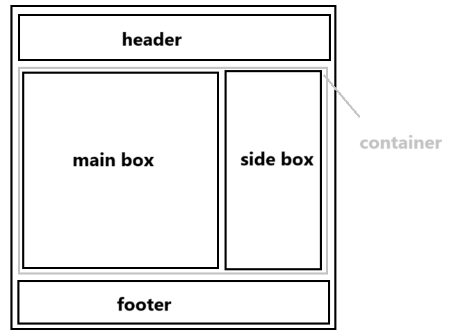

# 【html】网页设计笔记（html+css+javaScript基础）


## 一些基本定义

### 1、万维网

（world wide web ===> www）作用：实现资源共享

​	是Internet上基于**客户/服务器体系结构**的**分布式多平台**的**超文本超媒体信息服务系统**，它是Internet最主要的信息服务，允许用户在一台计算机上通过Internet读取另一台计算机上的信息。

### 2、网页

（web page）

​	是**存放在web服务器上**供**客户端**用户浏览的**文件**，可以在Internet上传输。网页是按照**网页文档规范**编写的一个或多个文件，这种格式的文件由**超文本标记语言**创建，能将文字、图片、声音等各种**多媒体文件**组合在一起，这些文件被保存在特定计算机的特定目录中。

### 3、网站

（web site）

​	也称站点，定义为已注册的**域名、主页或web服务器**。

​	“网站 = 域名（网站地址）+ 网站空间”

​	网站是一系列**网页的组合**，这些网站拥有**相同或者相似的属性**，并通过各种链接相关联。



相同实现目的、相似设计、共同描述相关主导体


浏览器 ——> 地址栏 ——> 网站地址 ——>网络服务器 ——> 默认网页（首页/主页）



浏览器：简译和显示 网页数据包


### 4、web标准

​	不是某一种标准，而是一系列标准的集合。

​	“网页组成 = 结构 + 行为 + 表现”

对应三类标准：

​	1、结构化标准语言：XHMTL、XML、【HTML: 超文本标记语言HyperText Markup Lauguage】

​	2、表现标准语言：CSS【Cascading Style Sheets 层叠样式表】

​	3、行为标准语言：对象模型W3C DOM 【Document Object Model 文档对象模型】、ECMAScript【API应用接口：连接“网站文件”与“js”的接口】

### 5、Inter网

​	由双绞线通过物理连接构成网。（路由器、交换机）

### 6、http

​	超文本传输协议资源


### 7、URL

统一资源定位符

### 8、UML

统一建模语言

### 9、DNS

域名解析服务器

### 10、网页工作原理

​	1、静态网页（工作原理）


​	2、动态网页（工作原理）


### 11、Java Script

​	运行在客户端的一段程序。

### 12、架构

​	BS架构：浏览器/服务器

​	CS架构：客户端（下载APP）/服务器

### 13、网页图形图像处理工具

​	网页图形图像处理工具可以设计图像：

​	Fireworks  （背景透明 jpg.不支持）

​	PhotoShop  （背景透明 gif.动画 支持）

​	CorelDraw  （背景透明 png.支持）

ps处理图像 -使用**位图** 文件尾缀`.psd`  1024×768：表示横纵向像数点（位图放大会失真、会模糊）

cd处理图像 - 使用**矢量图**算法记录图像的轮廓，内部颜色填充。文件尾缀 `.cdr`（随意放大，不会失真）

### 14、网页维护

​	1、上传网页：ftp文件传输协议

​	2、网站管理员：修改文件

​	3、服务器管理员：远程桌面

​	4、 网站风格布局：位置、疏密、颜色、装饰、线条、排版

### 15、网页设计流程

目标 -图片- 加工-优化

**色彩**：暖色（红橙黄）、冷色（青、蓝）、中色（紫、黑、白）

**色彩搭配**：单色搭配、类比色（相近色、近似色120°内）搭配、互补色[搭配/对比]、三元配色

**用户体验**：浏览、相交互、信任

**颜色的属性**：

​	色相：一个物体的颜色（H色相环）

​	明相：亮度B

​	纯色：相对于白色的亮度S

**三元色**：发光体（红、绿、蓝）、反射光（红【品红】、黄、蓝【青绿】）

**RGB色彩值**：（#000000 黑、#666666 灰、 #FFFFFF 白）16进制、0~256、最大值为FF之间元素在此过渡

### 16、网页布局

“国”字型、“厂”字型、“框架”型、“封面”型（表格+框架+DIV+CSS）

## HTML编译规范

### 1、标签

标签：告诉浏览器以下是什么内容。（“英文、半角”下输入，不能有空格）

```html
<起始标签> 受标签影响的内容 </结束标签>

单标记：类似于</p>以下是一个段落、 <br/>换行、 引用图片
双标记：类似于<font></font>文字 、<tr></tr>表格的一行、<td></td>表格的一个单元格 【双标记要标识出作用范围】 
```

### 2、属性

属性：告诉浏览器、以下内容如何显示

 &emsp;&emsp;①不同的标签有不同的属性，标签可以有很多种属性。

 &emsp;&emsp;②“属性”与“属性”之间由“空格”间隔。“属性”与“属性值”之间由“=”连接。

```html
<标签 属性1 = "属性值1" 属性2 = "属性值2" ...> xxx </标签>
```



像`<b>` `<strong>` `<i>` `<em>`等与表现css标准有关的标签，

在软件改进中，或许可以生效，通常不再直接使用。



&emsp;&emsp;标签可以嵌套，但不允许交叉

&emsp;&emsp;显示文件后缀的方法：计算机 - 组织 - 查看 - 显示文件后缀。【直接改.txt 为 .html可以直接编译静态网页】

### 3、文档的基本结构

```html
<!-- 支持规范，符合html5 编写规范 -->
<!DOCTYPE html>
<!-- 告诉浏览器，以下是html代码，语言使用en -->
<html lang="en">
<!-- 告诉浏览器房网页文档的相关信息 -->
<head>
    <!-- 元标签，编码方式为“UTF-8” -->
    <!-- 修改页面编码方式：页面 - 编码 - UTF-8 -->
    <!-- 1B=8bt 指 1字节=8位 ，一般2个字节存放一个字符  -->
    <!-- ASCII编码，为2的8次方=256个字符对应不同的文字和字母 -->
    <!-- GB2312简体中文 -->
    <meta charset="UTF-8">
    <!-- 网页名称，显示在每个打开在浏览器的页面标签头上 -->
    <title>Document</title>
</head>
<!-- 告诉浏览器，放网页要显示的内容 -->
<body>
    网页内容
</body>
<!-- 告诉浏览器，模版结束 -->
</html>
```

### 4、超链接标签（跳转页面）

```html
    <!-- a标签 表示“锚点标记”，即超链接标记 -->
    <!-- href地址属性  #内部的锚点名称标记  记号名：链接的目标+路径URL-->
    <!-- target打开窗口方式属性  _blank在新窗口打开  _self本窗口打开 -->
    <!-- 热点：点击时跳转的对象（可以是图片、文字） -->
    <a href="# 记号名" target="_blank">热点</a>
```

点击的时候是图片（或者跳转链接是图片）：

```html
<a href="C:\Users\Administrator\Desktop\123.jpg" ></a>
```

**阐述【URL相对/绝对 路径】**

&emsp;&emsp;网络路径：http://www.baidu.com  - 在线网络文档路径（优点：不占空间。缺点：保证网络通畅、别人正常维护可访问）

- 本地路径：**绝对路径** - 有盘符、斜杠方向向右（C:\Users\……\xxxx.jpg）


- **相对路径** - 以编辑网页文件所在的文件夹位置为原点（../父级文件/父上一级）优点：加载快。缺点：位置不能随意更改）

### 5、书签标记

```html
<a name="# 记号名" >目标文本附近的内容</a>
例：
<a name="#z1" >第一章</a>
```

### 6、文字标签（排版）

①`<br>`强制换行符      ②`&nbsp`空格符      ③`&`转义字符    ④`lt`小于     ⑤`qt`大于    ⑥`;`结束

⑦`<nobr>...</nobr>`不换行，当窗口大小化时    ⑧`<!-- 注释 -->`单行注释标记

⑨`<p align="left/center/right">……</p>`段落 - 段前，段后均会有一排空行，独占一行显示

⑩`<div>……</div>`独占一行显示，没有空行

⑪`<pre>……</pre>`预先排版标记，按照你输入进行排版，没有便会自动识别为所有格式为一个空格

⑫`<hr>`单标记，插入一条水平线，独占一行显示 （属性：位置、颜色、粗细。width没有宽度）

⑬`<h#>`标题，h#1~6字体的大小，`<h1>……</h1>`一级标题

⑭`<font>……</font>`字体标题，属性：size字体大小，1~7逐渐变大，color=颜色，face = 字体

⑮` <sub>……</sub>`下标标记

⑯`<sup>……</sup>`上标标记

### 7、图片标签

图片标签``跟属性

```html
 
```

```html
   <!-- name定义地图的名称 -->
   <map name=""></map>
```

```html
   <!-- shape 形状（circle圆形/ rect矩形 / poly多边形）-->
   <!-- coords 位置：圆（圆心坐标x轴,圆心坐标y轴,半径）、矩形（左顶点左边,右顶点坐标）-->
   <!-- href 链接-->
   <area shape="" coords="" href="" alt="">
```

```html
    <!-- 左顶格、上顶格 -->
    <body  leftmargin="0" topmargin="0">
    </body>
```

### 8、表格标签

表格标签`<table>`

```html
<table
    border=""        - 表格的边框
    width="x|x%"     - 是body的百分比，占父级容器的百分比
    cellspacing=""   - 单元格的间距
    cellpadding=""   - 内容和边框的间距
    colspan=""       - 占2个横向单元格
    rowspan=""       - 占2个纵向单元格
>
    <tr>
        <td></td>
    </tr>
</table>
```

`<caption>显示表格的标题</caption>`可以写在所有的`<tr>`之前或者之后，但不可以写在之间

`background`背景图片，`<tr>`表示单元格表头，默认会加粗、居中显示

属性：（●`disc `     ○`circle`）

### 9、表单

表单：收集客户端信息发送给服务器的某个动态网页的目标程序，完成客户端与服务器之间的交互。

```html
<form 
    name=""    - 表单名称
    action=""  - URL路径，当action为空时，传递给自己
    method=""  - 用什么方式进行传输 get/post ，get：以明文字符串进行传输≤256字符，post以表单整体进行传输
    >
</form>
```

注：①一切内容都要在“表单之内”才能被提交  ②一个网页可以有多个表单   ③表单只是一个区域、内容需要加入表单元素  ④表单内的元素 一定要有名称 才能被提交

#### input输入框

```html
<!-- 下面都是表单元素 -->
<input type="text" name="text">  <!--单行文本≤255个字符  -->
<input type="button" value="按钮" name="button"> <!-- 按钮类型 -->
<input type="submit" value="提交" name="submit"> <!-- 提交类型-->

<!-- 表单输入框元素的详解 -->
<input 
    type="表项类型" - password 密码类型 、reset重置类型(使表单回到初始状态)、radio单选框、checkbox多选框、hidden隐藏域、date时间域、file文件选择框、image图片作为按钮
    name="表项名"   - 一组单选框的name必须相同，不同组的单选框name必须不相同
    value="默认值"  - 初始值
    size="x"        - 控制输入框的大小，单位为“x”个字符
    maxlength="y"   - 最大输入长度，单位为“y”个字符
>
<input 
    type="button"  - 点击触发onclick事件
    value=""       - 按钮名字
    onclick=""     - 事件函数
    readonly=""    - 只读 true/false
    disabled=""    - 不可更改，框为灰色
    >
```

#### 文本域

```html
<!-- name名称  rows行数  cols列数  -->
<textarea name="" id="" rows="" cols="">多行文本</textarea>
```

#### 选择栏

```html
<!-- name传输的名称 size可选择的个数：1单选 2多选 -->
<select name="" id="" size="" multiple="">
    <!-- 下拉框 可选择的内容 -->
    <option value="">xxx</option>
</select>
```

#### 列表标签

```html
<!-- 列表格式显示为：项目符号 列表项 -->
<!-- 有序列表 ol-->
 <ol>
    <li start="开始序号">列表项1</li>
    <li start="1">列表项2</li>
    <li>列表项3</li>
 </ol>
<!-- 无序列表 ul -->
 <ul>
    <li type="符号类型">列表项1</li>
    <li type="disc">列表项2</li>
    <li type="disc">列表项3</li>
 </ul>
```



注：html中是无法使用图片作为项目符号的！！

```html
<!-- 去掉无序前面的点 -->
<style>
    ul li {
        list-style: none;
    }
</style>
```



## CSS部分

### 一、基本选择符

1、标签选择符（所有的读标签下都使用这个样式）【4】

```css
//html中标签的名字
标签{属性：属性值}
例：
td { width : 100px }
```

2、class类选择符（自由定义）【2】

```css
//class="自定义的名称"（字母开头，下划线数，数字）
·类名称{属性：属性值}
例：
<p class="abc"></p>
.abc{ font-size : 18px}
```

3、id选择符（能且只能使用一次）【1】

```css
#id名{属性：属性值}
例：
<p id="abc"></p>
#abc{ font-size : 18px}
```

4、复合选择符【3】

&emsp;&emsp;&emsp;①“交集”选择符（两个基本选择符、直接连接、且同时满足 ）

&emsp;&emsp;&emsp;②“并集”选择符（两者择其一）

&emsp;&emsp;&emsp;③“后代/包含”选择符（x y{ }，表示在x中的y标签，应用{ }中的样式内容）

5、标签默认样式【5】



【编号】中的数字表示层叠使用时的优先级。若要提高优先级，则需要使用`<!important>`



### 二、 css层叠样式表

**1、后缀`.css`层叠样式表（格式设定）**

层叠：发生样式冲突时，系统以上面编号的优先级进行展示

继承：`<div><p></p></div>`继承父级的样式设定

将css文件单独拎出来，放置在html文件的同级根目录下，可以使用style引用该路径下的css使得多个html同时可以使用同一个css

**css实现的4种形式**

①行内样式表

```html
<!-- style=""双引号中的内容，即为css代码 -->
<div style="font-size: 10px;color: black;"></div>
```

②内部样式表

```html
<!-- 放在html的head中 -->
<head>
     <!-- 使用style标签，之间为css代码 -->
    <style>
        div{
            font-size: 10px;
            color: black;
        }
    </style>
</head>
<body></body>
```

③链入外部样式表

```html
<!-- 引用同级根目录下的css文件 -->
<link rel="stylesheet" href="根目录.css" type="text/css">
```

④导入外部样式表

```html
<!-- 这种引入外部css的方法必须写在第2种的前面才会生效 -->
<style @import url="根目录.css"></style>
```

**2、通用选择符**`* `：所有的网页元素都会被改变

**3、属性选择符：**【优先级高于标签选择符】

格式为：元素[属性]   或者  元素[属性 *  = 属性值] ， 例：E[alt]{ css代码 }

如果我们用E代表元素、alt代表属性、val代表属性值。则下面：

E [alt] {   }  - 属性名选择符

E [alt = val] {   }   - 属性值选择符

E [alt ~ = val ] {   }   - 属性值选择符（其中一个匹配）

E [alt 1 = val ] {   }   - 属性值选择符（连字符匹配、空白匹配） 

E [alt = val- ] {   }     - 属性值选择符（连字符匹配、空白匹配） 

E [alt^ = val ] {   }    - 属性值子串选择符（前缀匹配） 

E [alt$ = val ] {   }    - 属性值子串选择符（后缀匹配） 

E [alt* = val ] {   }    - 属性值子串选择符（子字符串匹配） 

**4、伪类选择符**

UI元素 - 表单元素 ：

&emsp;&emsp;hover：当鼠标移动到上面的时的状态

&emsp;&emsp;fous：当聚焦在上面时的状态

&emsp;&emsp;active：按下激活时的状态

&emsp;&emsp;link：未访问时的状态

锚点标签：

&emsp;&emsp;a : link {  } 未访问的链接状态

&emsp;&emsp;a : visited {  } 已访问的链接状态

&emsp;&emsp;a : hover {  }鼠标悬停在链接上的状态

&emsp;&emsp;a : active {  }被激活的链接状态

&emsp;&emsp;text-indent  : 2em ;  文章首行缩进：2个字符

色彩RGB rgba函数（R G B A ）A为透明通道，也叫透明度 == filter : opacity(0.5) 透明滤镜



 **①HTML**：

&emsp;&emsp;超文本标记语言【不是编程语言】，【超文本】比普通文本功能更高的文本文件，【标记语言】使用一组标签对内容进行描述的语言

**②语法规范**：

&emsp;&emsp;A、后缀为 -.html 或 -.htm   

&emsp;&emsp;B、头文件 + 体文件（head + body）

&emsp;&emsp;C、开头标签 + 结束标签

&emsp;&emsp;D、不区分大小写，常用小写

**③JavaScript**语法规范

&emsp;&emsp;变量（字母、数字、下划线）区分大小写，toSum：以小驼峰来进行命名，尽量避免使用a，b，c这种单字母命名。



### 三、CSS盒模型

#### 针对块级元素


{padding：__ } 一个值：上下左右

{padding：__  __ } 两个值：上下/左右

{padding：__  __ __  __ } 四个值：上/下/左/右

- 我们一般用类似于3px这样的长度单位来设定css盒模型某元素属性的长宽，由此这里对长度单位进行了梳理

  **长度单位**有：

  em - 首行缩进 - 相对长度单位

  px - 像素 - 绝对长度单位

  pt - 点 - 绝对长度单位

  in - 英寸 - 绝对长度单位

  cm - 厘米 - 绝对长度单位

#### css中的一些属性:

1、brackground-image:url(跟图片的位置)

2、【居中】margin: 0px auto  上下间距为0，左右平均分配

3、【两端对齐】text-align: justify

4、【首字下沉】first-letter

5、【设置行高】line-height：length| normal

6、【设置文本换行】word-warp：normal|break-word

7、【设置图像位置】background-position（百分比/长度）

&emsp;长度：左上角顶点距离背景两边移动的长度

&emsp;百分比：中心与中心重叠，占整体的百分比大小

#### 边框属性：

1、所有边框宽度（border-width）：1+7同时使用、才有效果

- medium - 默认宽度
- thin - 小于默认宽度
- thick - 小于默认宽度
- length - 数字+单位标识符（长度值），不可为负值

（4个）上下左右 、 （2个）上下/左右 、（1个）四周、（3个）上/左右/下

2、上边框宽度（border-top）：border-width || border-style || border - color

3、右边框宽度（border-right）

4、左边框宽度（border-left）

5、下边框宽度（border-bottom）

6、边框颜色（border-color）： 6和7一起使用

7、边框样式（border - style）：是个复合属性

- none 无边框样式
- solid实线
- hidden 隐藏样式
- double 双线
- dotted 点虚线
- groove 三维凹槽
- inset 三维凹边
- outset三维凸边
- dashed 长矩线
- ridge 菱形边框

使用时+height + width 设定position：absolute

#### 内边距

内边距padding，和内容在一层，且不允许为负数

- 上内边距padding-top
- 下内边距padding-bottom
- 左内边距padding-right
- 右内边距padding-right

#### 外边距

外边距margin

length：数字+单位标识符（长度值/百分比）

- 上外边距margin-top
- 下外边距margin-bottom
- 左外边距margin- left
- 右外边距margin-right

#### 定位方式

定位方式position

- width宽
- height高
- min-height最小高度
- static【默认】静态定位/无特殊定位
- relative 相对定位（左、右）表偏移量
- absolute 绝对定位（上、下、左、右）属性
- fixed 绝对定位（相对于浏览器窗口）-固定定位
- z-index浮动序列

#### 可见性

可见性visibility

- inherit 继承上一个对父对象的可见性
- visible 对象可见
- collapse 隐藏表格的行列
- hidden 对象隐藏

#### 水平叠加问题

span1\span2 :两个行级元素紧邻不重叠

#### 垂直叠加问题

div1/div2 ：两个块级元素垂直相遇，会产生叠加，形成一个新的外边距，以大的为准

div1/div2：两个块级元素包含相遇，也会产生叠加，面积以大的为准

#### 浮动清除浮动

浮动float

- none不浮动
- left向左浮动
- right向右浮动

清除浮动clear

- none允许浮动
- left清除左浮动
- right清除右浮动
- both两边均清除

### div+css布局

常见的“三行两列”布局



#### 文本控制

文本控制font

- font-family 字体名称类别
- font-size 字体尺寸||绝对尺寸||相对尺寸  12px正文文字大小
- font-weight 字体的粗细（bold粗体，normal默认400、number、lighter默认细、100~900越小字体越细）
- font-style 字体的倾斜（normal默认、italic斜体、obligue倾斜体）
- color 颜色值
- background-color（color颜色、transparent透明）
- text-decoration文本的修饰（underline下划线、blink闪烁、overline上划线、line-through贯穿线、none无装饰）

#### 段落控制

段落控制text

- text-align 设置文本的水平对齐方式 （left左对齐、right右对齐、center居中、justify两端对齐）
- text-indent 设置段落的首行缩进
- first-letter 设置首字母下沉
- line-height 设置行高
- letter-spacing 设置字符间距（word-spacing：length|normal词间距）
- text - overflow 设置文字的截断（clip 简单的裁切、不能显示省略标记 | ellipsis 文本溢出时 显示省略标记 ）
- background-image 背景图像设置（URL+none）
- background-repeat 图像重复方式（no-~不平铺、~-x水平平铺、~-y垂直平铺）

### JavaScript部分

JavaScript网页行为语言（代码区分大小写）

核心部分：ECMAScript核心、BOM、DOM（包含：基本语法、变量、关键字、保留字、数据类型、语句、函数）

——是基于对象和事件驱动、并具有相对安全性的客户端脚本语言

使用的三种方法

- 直接加入HTML文档

- ```html
  <script type="text/javascript">
  ....js代码
  </script>
  ```

- 链接脚本文件

- ```html
  <head>
      <script type="text/javascript" src="脚本文件名.js"></script>
  </head>
  ```

- 在HTML标签内添加脚本，在HTML表单的输入标签内添加脚本

#### javascript交互基本方法

- document.write() 文档输出函数
- alert() 窗口对象方法（对话框）
- confirm() 选择对话框（提示文字）
- prompt() 提示文字内容对话框

#### javascript相关概念

##### 变量

- 变量：开辟在内存中的一块空间

- 变量声明

- ```js
  var <变量>[=值]
  //（任何）变量声明的关键词、弱变量，不区分数据类型
  ```

##### 数据类型

- 整形
- 浮点型
- 字符串型

##### 表达式/运算符

- 取反

- ```js
  -
  !
  ```

- “或”用于嵌套

- 基本编程命令/语句

- 单行注释

- ```js
  //
  ```

- 多行注释

- ```js
  /*。。。*/
  ```

- 转义字符   

- ```
  \
  ```

- ```
  \" 双引号
  \' 单引号
  \n 换行
  \r 回车
  ```

##### 条件结构if

```js
if(i%10 == 0)
cout <br>
//每10个换行
```

##### 循环结构for

```js
for(变量=初始值;循环条件;循环变量的改变)
{<语句>}

-----------------------------------

while(循环条件)
```

- break 直接中断，跳出
- continue 只中断该次循环

##### 函数function

有返回值的称为函数，没有返回值的称为操作

```
函数名(形参)
{函数体;}
haha(a,b){return a+b;}
```

```
调用方式：
返回值 = 函数名(参数1,参数2)
b = haha(data1，data2)
```

- 全局变量：函数在方法外声明的变量
- 局部变量：函数内部声明的变量（在函数被调用时激活，才开辟一个存储单元，在函数结束时被释放）

##### 递归

递归调用 - 递归体 - 出口

```js
//阶乘
function jc(n){
    if(n=1){
        return 1; //留出口，否则死循环
    }else{
        return n*jc(n-1); //调用自身函数，以形成递归体
    }
}

docment.write(jc(5));
```

#### 面向对象的程序设计

对象：属性+方法+事件

##### number对象

number对象为【数值】，可以使用toString()：将数值转化为字符串

##### String对象

String对象【字符串】属性：

- length()：返回字符串的长度
- chatAt(*) ：返回 * 所在位置的字符，下标从0开始
- chatCodeAt(*)：返回 * 所在位置字符的ASCII码
- indexOf(**)：返回 xx所在位置的下标，找不到返回“-1”
- lastIndexOf(xx，x)：同上，下标也同上，只是倒序查找
- split()：返回一个数组
- join()：将一个数组返回字符串
- Substring(始，终)：截取字符串
- substr（始，长度）：截取子字符串
- toUpperCase()：小写全转化大写

##### Array对象

Array对象【数组】属性

```js
var <数组名> = new Array();
//javaScript中数组没有二维数组
```

##### Math对象

Math对象【数学】属性

- E 返回e=2.71828....

- PI 返回π = 3.1415926...

- random() 返回0到1中的一个随机数

- parseInt 构造整数、取整

- ```js
  parseInt(Math.random()*(100-60)+60)
  //生成60-100间的随机整数
  ```

- round() 四舍五入

##### Date对象

Date对象【日期】

```js
var d = new Date(); //获取当前客户端的时间
```

- g/set[UTC]year - 设置年份
- g/set[UTC]month - 设置月份
- g/set[UTC]Date- 设置日
- g/set[UTC]Day- 设置星期几

##### Global全局对象

- eval() 字符串当作表达式处理
- parseInt() 括号内的转化为数值（整数），若以字母开头，返回“NAN”
- parseFloat() 转化为浮点数
- toString() 转化为字符串

##### Dom文档对象

Dom是Bom中的一小部分

Bom浏览器对象（navigate 浏览器对象、screen屏幕对象、window窗口对象：“history历史、location地址、document文档”）

Dom（open打开一个窗口）（open（<URL字符串>,<窗口名称字符串>,<xx属性>））

- menubar = " no " 无菜单栏
- toolbar 工具栏
- scrollbar滚动条
- resizable 可拉动
- location 地址栏 d.导航栏

##### navigate 浏览器对象

- appCodeName 返回“码名”
- appName 返回“浏览器名称”
- appVersion 返回“浏览器版本”
- javaEnable 返回“一个布尔型，允不允许使用java”

##### window窗口对象

- Name 窗口的名称

- Status “状态栏” 可读可写，在最下方

- opener 返回打开该窗口的上一窗口

- close 关闭一个打开的窗口

- ```js
  window.close()
  //self.close
  //setInterval("funl,time")定时器（函数体，时间，单位毫秒）
  ```

- blur() 失去焦点
- focus() 获得焦点
- scrollTo() 滚动到
- scrollBy() 滚动多少
- reSizeTo() 调整到
- setInterval（funl，time）每隔多少时间执行该函数
- setFimeout（funl，time）延迟多少时间执行该函数

##### history历史对象

- length - 访问的窗口数
- back - 后退
- forward - 前进
- history.go(x) - 前进到第x个窗口
- history.go(0) - history.reload - 刷新

##### location地址栏对象

- protocol - 返回协议
- hostname - 返回地址的主机名
- port - 地址端口
- host - 地址路径

##### document文档对象

- lastModified - 输出到修改网页最后一次的时间
- referrer - 返回打开它的网页窗口
- tittle - 返回tittle的名称
- fgcolor - 文字颜色
- bgcolor - 背景颜色
- write()  - 输出一个文档流（在</html时结束）（<html到</html算一个文档流，文档流结束会新开一个窗口）
- getElementById() 通过ID来获取网页上的元素
- getElementByName() 通过名称ID来获取网页上的元素
- body.clientwidth() / clientwidth() 获取客户端网页窗口大小
- offsettop()、offsetleft()、offset() 获取匹配元素在当前视的相对偏移

#### 内联元素

内联元素（行内元素） -属性display：inline；

这个属性能够修复著名的IE双倍浮动边界问题（html规范中的概念-外文名：inline element）

内联元素又名行内元素和其对应的是块元素

内联元素的显示，为了帮助理解，可以形象的称为“文本模式”。即一个挨着一个，都在用一行按从左至右的顺序显示，不单独占一行。display：vnone表示隐藏

加入css控制 内联元素+display = block属性，可以从新行开始 ；块元素+display = inline属性，可以在一行上排列

常见的块级元素address地址/特点：总是在新行上开始

**内联元素（特点）**

- 和其他元素都在一行上（左右可以改变设置）
- 高度，行高和顶以及底边距都不可改变
- 宽度就是它的文字或图片的宽度不可改变

总的来说，内联元素一般都是基于语义级的基本元素，它只能容纳“文本或其他内联元素，通常被包括在块级元素中使用，常见的内联元素：

- a - 锚点
- b - 粗体
- br - 换行
- font - 字体
- abbr - 编写
- acronym - 首字母
- big - 大字体
- cite - 引用
- em - 强调

#### 块级元素

**块级元素特点：**

- 总是在新行上开始
- 高度、行高以及外边距和内边距都可以控制
- 宽度缺省是它的容器的100%，除非设定一个宽度
- 它可以容纳内联元素和其他块元素

常见的块级元素：

- address - 地址
- blockquote - 块引用
- center -居中对齐块
- div - 常用块容器
- h1 - 一级大标题

**HBuilder：编写软件（放html代码，生成js文件）**

frameset框架集：

```html
<!--横向分割-->
<frameset row="20%,*">
    <frame src="上"></frame>
	<!--纵向分割-->
    <frameset cols="20%,*">
        <frame src="左"></frame>
		<frame src="右"></frame>
    </frameset>
</frameset>
```

图解：


#### 如何控制表单提交？

关于事件onsubmit：一般用于表单提交的位置

那么需要在定义函数的时候，给出一个返回值

onsubmit = return checkForm()；

返回为false，则不会提交

分析步骤：

- 确定事件onsubmit并为其绑定一个函数
- 书写这个函数（获取用户输入的数据，获取数据时，需要在指定位置定义一个id）
- 对用户输入的数据进行判断
- 数据合法让表单提交 
- 数据不合法不让表单提交

#### 响应式布局

自适应页面宽高 

