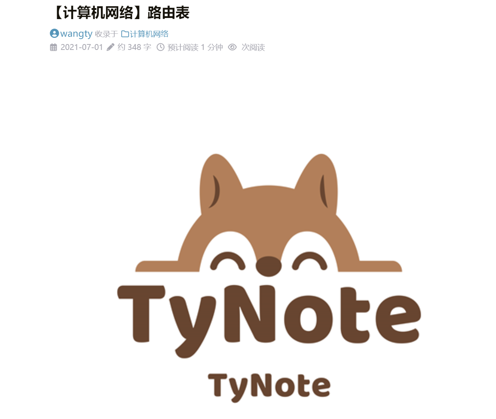

# 【HUGO】Hugo的LoveIt主题美化（一）


## 自定义网站图标

### 1. 主页头像

- 在 blog 根目录下找到文件夹`assets`，打开该文件夹并新建文件夹`images`，把我们的主页头像图片`avatar.png`放到文件夹`images`中。

- 在 blog 根目录下找到配置文件`config.toml` ,在配置文件中找到`# 主页配置 -> # 主页显示头像的 URL`的参数`avatarURL = ""`。在`""`中填入主页头像图片在`assets`下的路径（这里填图片的URL亦可），最后则为`avatarURL = "images/avatar.png"`。

- 然后我们的 blog 主页就有头像了，如下图：

  

### 2. 网站名前的logo

- 同前面一样，先将 logo 图标`logo.png`放到`assets/images`下。

- 在配置文件`config.toml`中找到`# 页面头部导航栏配置 -> # LOGO 的 URL`的参数`logo = ""`。填入路径后将变为`logo = "images/logo_ico.png"`（当然图片URL亦可）。


这里我发现，如果使用`.png`的图片，图片大小控制不好的话,会导致图与文字排列奇怪。图标会将标题顶开一定的位置。

但是如果我们使用`.ico`的图片，那么这种情况就不会出现。然而`logo`这个参数本身并不支持`.ico`图片。因此我们需要把作为 logo 的`.ico`图片的后缀名改为`.png`，这样`logo`才能读取图片文件。

  而如果你的 logo 图一开始是`.png`图片，那么可以通过[这个网站](https://www.xunjietupian.com/image-to-icon/)在线修改为`.ico`图片。



- 然后我们的 blog 就有了显示正常的 logo 了，如下图：

  

### 3. 网站图标

注意与上面不同的是，我们要先将网站图标放到 blog 根目录的`static`文件夹下，而对于要放什么类型的图标我们有两种选择：

1. 使用`.svg`后缀的伸缩矢量图形：

   - 如果你的图标是`.png`文件（其他的类似），则可以通过[这个网站](https://onlineconvertfree.com/zh/convert/svg/)，在线地把`.png`转换为`.svg`文件。然后把这个`.svg`文件放到`static`文件夹即可。

   - 然后在配置文件`config.toml`中找到`# 应用图标配置`的参数`svgFavicon = ""`，不妨认为我们的`.svg`图标名为`safari-pinned-tab.svg`，那么我们只需修改参数为`svgFavicon = "/safari-pinned-tab.svg"`即可。

2. 使用多尺寸的图标：

   - 我们可以找到 LoveIt 主题文件里的配置文件`config.toml`（路径为`your_blog\themes\LoveIt\config.toml`），可以发现`svgFavicon`参数为空，但是它的[官网](https://hugoloveit.com/)却也有网站图标。我们观察一下主题自带的`exampleSite`文件里的`static`（路径为`your_blog\themes\LoveIt\exampleSite\static`），可以发现里面有大小各异的网站图标，如下图：

     

   - 因此我们可以依葫芦画瓢，在我们 blog 根目录的`static`文件夹里，放入我们各种大小的网站图标，如下图：（**采用此方法，`svgFavicon`参数一定要为空，且各种大小的图标命名要和官方一致**）[在这里](https://realfavicongenerator.net/)可以传入你想要的图片，很容易的生成这些文件。

     

   

然后我们的 blog 就有网站图标了，如下图：


## 文章头的参数

我们在根目录`archetypes`文件夹下修改的`default.md`。这个`default.md`实际是我们每篇文章头（如下图）的模板。


### tags

此参数意为文章的标签，可以有多个，若要添加多个标签，只需按照如下形式即可（即用`""`引住标签内容，而`,`作为标签内容间的分隔）：

```markdown
tags: ["博客","LoveIt 美化"]
```


### categories

此参数意为文章的分类，一篇文章可以同时存在于多个分类下（与 tags 参数类似），若要文章处于多个分类下，只需按照如下形式即可（即用`""`引住分类名称，而`,`作为分类名称间的分隔）：

```markdown
categories: ["Hugo 博客","Markdown"]
```


### share

此参数意为是否开启文章底部的分享功能。

### comment

此参数意为是否开启文章底部的评论功能。

### hiddenFromHomePage

此参数意为是否在主页隐藏本文章。

### hiddenFromSearch

此参数意为是否在搜索时隐藏本文章。

### summary

在主页中显示的对文章的描述性语言，如下图：


但如果不加，如下图：


那么hugo会自动将文章内容前半部分取过来，显示在描述这里，文章描述会很杂乱。

### featuredImagePreview

这个参数为在主页显示的文章配图：我们可以对该参数添加图片URL，那么主页对应文章标题上方便会出现被裁剪后的配图，如下图：


但如果我们不加配图，如下图：


那么主页文章间的分割不明显，且不够花里胡哨。

### featuredImage

这个参数与上个参数类似，但它在为主页添加配图的同时，也将图片（未裁剪的）添加至文章内容的开头，如下图：




加到 featuredImagePreview 中的图片的宽高比尽量为 10:3 ，不然会自动裁剪为 10:3 ，这样有可能损失内容。同时为了使网页背景与图片可区分，我们不要让图片以纯白或深灰为底。我一般选# f6f6f6 或# f6f6ff代替纯白。


##  链接和提示框

### link

如果我们在 Markdown 文件中输入`{{` `< link "https://Wangty654.github.io" >` `}}`，则在网页上会显示为[https://Wangty654.github.io](https://Wangty654.github.io)。

### admonition 横幅

我们若在任意一个 Mardown 中输入：


则会出现如下效果：


一个 **技巧** 横幅


- 其中参数 admonition type 为横幅的类型，一共有12种，分别为 note，abstract，info，tip，success，question，warning，failure，danger，bug，example，quote（其中默认值为note）。
- 参数 title 顾名思义是横幅的标题
- 参数 open 为横幅是否自动打开，默认是 true 打开。

### 其他的拓展 Shortcode

具体可见[这里](https://hugoloveit.com/zh-cn/theme-documentation-extended-shortcodes/)，而一些 Hugo 内置的 Shortcode 可见[这里](https://hugoloveit.com/zh-cn/theme-documentation-built-in-shortcodes/)

一个 **技巧** 横幅



一个 **技巧** 横幅



一个 **技巧** 横幅



一个 **技巧** 横幅



一个 **技巧** 横幅



一个 **技巧** 横幅



一个 **技巧** 横幅



一个 **技巧** 横幅



一个 **技巧** 横幅



一个 **技巧** 横幅



一个 **技巧** 横幅



一个 **技巧** 横幅


------

## 关于页面

我们的 blog 往往会有一个"关于"页面来介绍自己，但我们一开始所给的配置参数并不包含这个页面，因此我们可以来添加该页面。

- 首先我们要在终端中来到 blog 的根目录，执行下面命令，在`content`文件夹下创建一个`about`文件夹，并使其有文件`index.md`。一般读取都是读取路径包下的`index.md`文件，若没有多个文件，也可以建成单独的`about.md`

- 这个`index.md`或者`about.md`就是我们的"关于"页面。
- 然后我们还要在菜单栏配置中添加"关于"这一栏。在 blog 根目录下找到 `config.toml`,再在该配置下找到`# 菜单配置`，在这一项下添加：

```toml
[[menu.main]]
name = "关于"
# weight 参数可以看做菜单栏上各项的排序，越大的排在电脑网页的越右边
weight = 4
identifier = "about"
url = "/about/"
title = "About"
```

- 这样，“关于"页面就创建好了。


