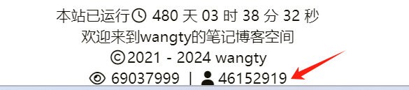

# 【HUGO】Hugo的LoveIt主题美化（二）


## hugo访问统计功能

由于静态网站静态的属性，所以一些动态的内容，如评论、计数等模块就需要借助外来平台。而不蒜子就是这么一个访问统计模块，但与百度统计谷歌分析不同的是，它可直接将访问次数显示在在网页上。因此我们可以通过不蒜子快速便捷地添加访问统计功能。

当然除了不蒜子，valine 评论系统也附带了单页的阅读人数统计。但是由于不蒜子除了单页的阅读人数统计还可以提供全站的访问统计，外加我用的不是 valine 评论系统，所以不蒜子是更加普适且好用的访问统计模块。

在下文中，由于不涉及主题的参数，所以有可能很多的 Hugo 主题都适用，但本文仍以 LoveIt 主题为例。

### 添加 Html 模板

在`your_site\layouts\partials\plugin\`路径下添加文件`busuanzi.html`，并将下面的配置输入至该文件

#### 在配置文件中添加参数

找到`your_site\config.toml`配置文件，在最后面添加不蒜子的参数如下：

```toml
# 添加不蒜子计数
[params.busuanzi]
  enable = true
  # 是否开启全站独立访客数
  site_uv = true
  # 全站独立访客数前的图标或提示语
  site_uv_pre = '<i class="fa fa-user"></i>' 
  # 全站独立访客数后的图标或提示语
  site_uv_post = ''
  # 是否开启全站浏览量
  site_pv = true
  # 全站浏览量前的图标或提示语
  site_pv_pre = '<i class="fa fa-eye"></i>'
  # 全站浏览量后的图标或提示语
  site_pv_post = ''
  # 是否开启单页浏览量
  page_pv = true
  # 单页浏览量前的图标或提示语
  page_pv_pre = '<i class="far fa-eye fa-fw"></i>'
  # 单页浏览量后的图标或提示语
  page_pv_post = ''

```

### 在对应处引入不蒜子

#### 开启页脚的全站统计

把`your_site\themes\LoveIt\layouts\partials\footer.html`复制粘贴到路径`your_site\layouts\partials\`下。 再修改文件`your_site\layouts\partials\footer.html`，在最后三行

```html
        </div>
    </footer>
{{- end -}}
```

的前面添加

```html
{{- /* busuanzi plugin */ -}}
{{- partial "plugin/busuanzi.html" (dict "params" .Site.Params.busuanzi "bsz_type" "footer") -}}
```

添加后代码如下图：


最后的呈现结果如下图：





如果只想简单地开启全站统计，我们可以忽略`## 添加 Html 模板`和`## 在配置文件中添加参数`，直接从[开启页脚的全站统计](https://stilig.me/posts/hugo-adds-busuanzi/#开启页脚的全站统计)开始，但需把要添加的

```html
{{- /* busuanzi plugin */ -}}
{{- partial "plugin/busuanzi.html" (dict "params" .Site.Params.busuanzi "bsz_type" "footer") -}}
```

换为

```html
  <script async src="//busuanzi.ibruce.info/busuanzi/2.3/busuanzi.pure.mini.js"></script>
  <span id="busuanzi_container_site_pv">
      <i class="fa fa-eye"></i> <span id="busuanzi_value_site_pv"></span> 次
  </span> | 
  <span id="busuanzi_container_site_uv">
      <i class="fa fa-user"></i> <span id="busuanzi_value_site_uv"></span> 位
  </span>
```

但这种方法不好添加单页阅读



#### 开启单页的阅读统计

把`your_site\themes\LoveIt\layouts\posts\single.html`复制粘贴到路径`your_site\layouts\posts\`下。再在`your_site\layouts\posts\single.html`中找到第二个`<div class="post-meta-line">`标签，并在该标签下添加下面的代码

```html
{{- /* busuanzi plugin */ -}}
{{- partial "plugin/busuanzi.html" (dict "params" .Site.Params.busuanzi "bsz_type" "page-reading") -}}
```

添加后代码如下：


最后的呈现结果如下图：




参考文章：[不蒜子官方](https://busuanzi.ibruce.info/)



## Permalinks 参数修改

修改这个参数，可以使我们之后修改网站文章的 url 更便捷，不需再采用`hugo new posts/your_post.md`新建文章的方式来修改，我们甚至还可以做到文章文件名与其 url 不一致。



文章文件名就是指你使用`hugo new posts/your_post.md`后生成的文章的文件名，本例子中是`your_post`；而网站文章 url，是指这篇文章在你的 blog 网站中的 url，在本例中如果按照 LovIt 主题默认的方式，那么网站文章 url 为 https://stilig.me/your_post/



### 修改 Permalink 配置

找到博客根目录下的配置文件`your_site/config.toml`，找到参数`Permalinks`，按照下面的代码块修改：

```toml
# Permalinks 配置
[Permalinks]
  # 原来是 posts = ":filename"，其意为以文件名为 url
  posts = "/posts/:slug"
  # 如果你不想改变原来的 url（比如说文章已被搜索网站收录）,可以去掉/posts/，那么其将变为 posts= ":slug"
```

### 将 slug 参数添加至`.md`文件的模版

在你博客的根目录下找到`your_site\archetypes\default.md`并打开，把 slug 参数 添加到 title 参数下，如下代码块：

```markdown
---
title: "{{ replace .TranslationBaseName "-" " " | title }}"
slug: "{{ replace .TranslationBaseName "-" " " | title }}"
<!-- 注意：这里  "{{ replace .TranslationBaseName "-" " " | title }}"  表示参数取文章的文件名，这只是为了防止参数为空而设定的默认值 -->
...
...
---
```

这样我们新建的文章中就都会有 slug 参数了，然后我们只需要修改`slug=""` 的`""`中的值，就可以改变文章 url 了。

而对于之前那些文章，我们也只需要在文章头中添加参数 slug 就可以了，如下图：


## 添加自定义404页面

在博客根目录的`your_site\layouts\`文件夹下，放入你想放的`404.html`文件，这样它就会覆盖掉原主题的`your_blog\themes\LoveIt\layouts\404.html`文件。



生成 public 文件时，Hugo 会优先读取根目录的文件，然后再读取主题里文件（也就是`your_blog\themes\LoveIt\layouts\`里的文件）。

我们当然也可以直接修改主题里的文件，但是如果这样做，那么在更新主题后我们之前的修改也会一并地消失。因此在本文的后面，我们宁愿把主题里的文件复制到根目录对应位置后再修改，也不直接修改。



## 添加文章数量统计

其实就是利用 hugo 提供的变量来获取文章数量，再通过 html 里的`sup`标签，把文章数量在上标中显示出来，如下图：


### 修改 list.html 文件

复制`your_site\themes\LoveIt\layouts\taxonomy\list.html`到`your_site\layouts\taxonomy\`路径下。

- 然后打开`your_site\layouts\taxonomy\list.html`，找到下面的内容：

```html
{{- if eq $taxonomy "category" -}}
    <i class="far fa-folder-open fa-fw"></i>&nbsp;{{ .Title }}
{{- else if eq $taxonomy "tag" -}}
    <i class="fas fa-tag fa-fw"></i>&nbsp;{{ .Title }}
{{- else -}}
```

将其改为：

```html
{{- if eq $taxonomy "category" -}}
    <i class="far fa-folder-open fa-fw"></i>&nbsp;{{ .Title }}<sup>{{ len .Pages }}</sup>
{{- else if eq $taxonomy "tag" -}}
    <i class="fas fa-tag fa-fw"></i>&nbsp;{{ .Title }}<sup>{{ len .Pages }}</sup>
{{- else -}}
```

- 继续找到：

```html
{{- range $pages.PageGroups -}}
  <h3 class="group-title">{{ .Key }}</h3>
```

将其改为：

```html
{{- range $pages.PageGroups -}}
    <h3 class="group-title">{{ .Key }} <sup>{{ len .Pages }}</sup></h3>
```

- 因为 LoveIt 博客是以年份来分组的，但是我的博文没有那么多，以月份来分组更加有记录感，所以可以把下面内容：

```html
{{- /* Paginate */ -}}
{{- if .Pages -}}
    {{- $pages := .Pages.GroupByDate "2006" -}}
```

改为：

```html
{{- /* Paginate */ -}}
{{- if .Pages -}}
    {{- $pages := .Pages.GroupByDate "2006-01" -}}
```

从而达到以月份分组。

### 修改 terms.html 文件

复制`your_site\themes\LoveIt\layouts\taxonomy\terms.html`到`your_site\layouts\taxonomy\`路径下。

- 然后打开`your_site\layouts\taxonomy\terms.html`，找到下面的内容：

```html
<div class="page archive">
  {{- /* Title */ -}}
  <h2 class="single-title animated pulse faster">
      {{- .Params.Title | default (T $taxonomies) | default $taxonomies | dict "Some" | T "allSome" -}}
  </h2>
```

改成：

```html
<div class="page archive">
  {{- /* Title */ -}}
  <h2 class="single-title animated pulse faster">
      {{- .Params.Title | default (T $taxonomies) | default $taxonomies | dict "Some" | T "allSome" -}}<sup>{{ len .Pages }}</sup>
  </h2>
```

- 继续找到：

```html
<h3 class="card-item-title">
  <a href="{{ .RelPermalink }}">
      <i class="far fa-folder fa-fw"></i>&nbsp;{{ .Page.Title }}
  </a>
</h3>
```

然后改成：

```html
<h3 class="card-item-title">
  <a href="{{ .RelPermalink }}">
      <i class="far fa-folder fa-fw"></i>&nbsp;{{ .Page.Title }} <sup>{{ len .Pages }}</sup>
  </a>
</h3>
```

### 修改 section.html 文件

复制`your_site\themes\LoveIt\layouts\_default\section.html`到`your_site\layouts\_default\`路径下。

- 然后打开`your_site\layouts\_default\section.html`，找到下面的内容：

```html
<div class="page archive">
  {{- /* Title */ -}}
  <h2 class="single-title animated pulse faster">
      {{- .Params.Title | default (T .Section) | default .Section | dict "Some" | T "allSome" -}}
  </h2>
```

改成：

```html
<div class="page archive">
  {{- /* Title */ -}}
  <h2 class="single-title animated pulse faster">
      {{- .Params.Title | default (T .Section) | default .Section | dict "Some" | T "allSome" -}}<sup>{{ len .Pages }}</sup>
  </h2>
```

- 继续找到：

```html
{{- range $pages.PageGroups -}}
          <h3 class="group-title">{{ .Key }}</h3>
```

然后改成：

```html
{{- range $pages.PageGroups -}}
  <h3 class="group-title">{{ .Key }} <sup>{{ len .Pages }}</sup></h3>
```

- 同样，这里是以年份分组的，若要改为以月份分组，则要把下面代码：

```html
{{- /* Paginate */ -}}
{{- if .Pages -}}
    {{- $pages := .Pages.GroupByDate "2006" -}}
```

改为：

```html
{{- /* Paginate */ -}}
{{- if .Pages -}}
  {{- $pages := .Pages.GroupByDate "2006-01" -}}
```

这样操作后，以[我的网站](https://Wangty654.github.io)为例，归档、分类和标签页面就都能加上文章数量统计了。

## 添加文章密码

有时候我们并不想把一部分网页展示给所有人，那么我们可以加密我们的网页，使其要通过密码访问，如下图:


### 修改 single.html

将`your_site\themes\LoveIt\layouts\posts\single.html`复制粘贴到`your_site\layouts\posts\`路径下。打开`your_site\layouts\posts\single.html`文件，在`{{- $params := .Scratch.Get "params" -}}`下添加下面内容：

```html
    {{- $password := $params.password | default "" -}}
    {{- if ne $password "" -}}
		<script>
			(function(){
				if({{ $password }}){
					if (prompt('请输入文章密码') != {{ $password }}){
						alert('密码错误！');
						if (history.length === 1) {
							window.opener = null;
							window.open('', '_self');
							window.close();
						} else {
							history.back();
						}
					}
				}
			})();
		</script>
    {{- end -}}

```

### 将 password 参数添加至`.md`文件的模版

之后我们只要将 password 参数添加到文章头即可。

但为了方便起见，我这里直接把它加到了模板文件中，即在博客的根目录下找到`your_site\archetypes\default.md`并打开，把 password 参数添加进去，如下代码块：

```markdown
---
title: "{{ replace .TranslationBaseName "-" " " | title }}"
slug: "{{ replace .TranslationBaseName "-" " " | title }}"
...
...
password: ""
...
...
---
```



`password= ""`的`""`中的字符即为密码，若无字符，则文章不加密无需密码登录。



