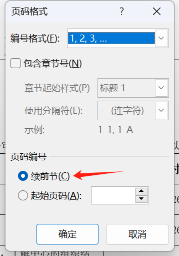

# 【word文档】word页脚页码不连续解决办法



word 页码不连续可通过以下步骤解决：1. 检查并删除分节符；2. 更改页码格式为连续编号；3. 更新整篇文档页码；4. 检查页眉或页脚中的页码设置，确保与正文一致；5. 取消页眉或页脚之间的链接。



**1. 检查分节符：**

- 分节符可以将文档分成不同的部分，每个部分可以有自己的页码。
- 将光标放在页码中断处，然后转到“布局”选项卡 > “分隔符”组。
- 如果有分节符插入，请删除它。  

**2. 更改页码格式：**

- 转到“插入”选项卡 > “页码”组。
- 选择“页码格式”选项，然后选择连续页码选项。
- 确保“页码起始编号”设置为 1。

**3. 更新页码：**

- 更新页码后，需要更新整个文档的页码。
- 转到“插入”选项卡 > “页码”组，然后单击“更新页码”。
- 选择“更新整篇文档”选项。

**4. 检查页眉或页脚：**

- 有时，页眉或页脚中的页码设置可能与文档正文不匹配。
- 双击页眉或页脚区域进行编辑。
- 检查页码设置是否正确，并将其与文档正文中的页码保持一致。

**5. 取消链接页眉或页脚：**

- 如果页眉或页脚之间存在链接，可能会导致页码不连续。
- 双击要更改页眉或页脚的页面。
- 转到“设计”选项卡 > “页眉和页脚”组，然后取消选中“链接到前一节”复选框。

