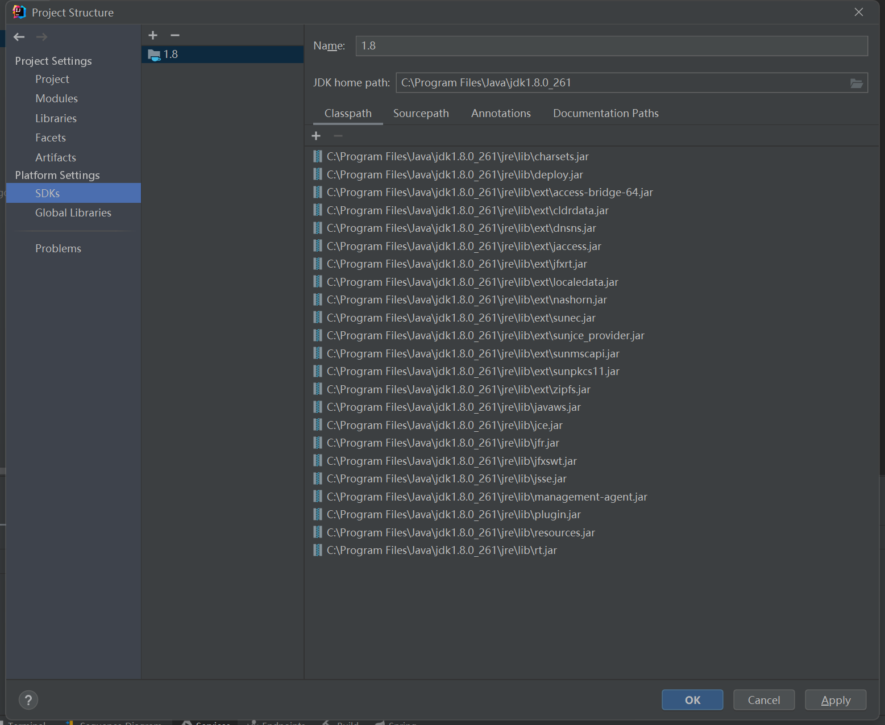
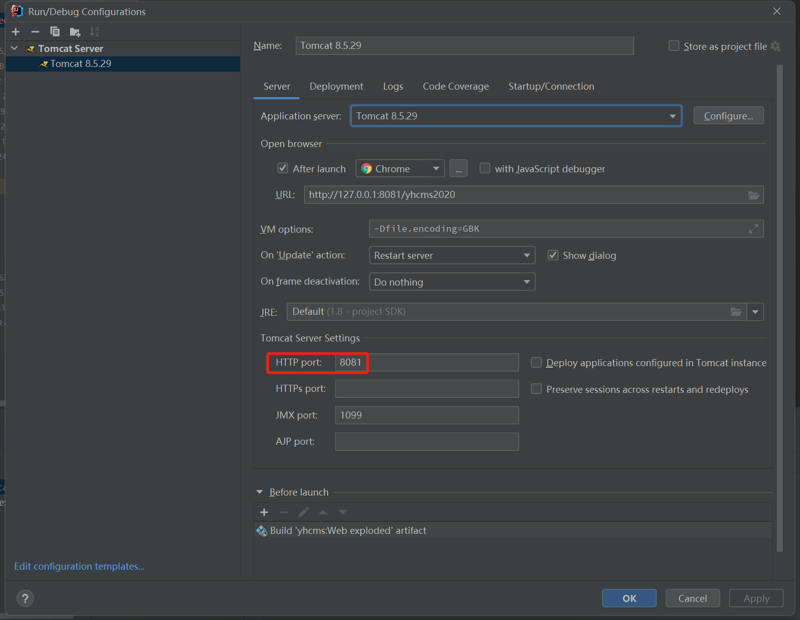

# yhcms部署在tomcat上启动步骤




不按操作步骤配置，起不起来自己想原因。。。



## 项目拉取

1.SVN地址：http://192.168.10.70:8090/svn/JY20CH00200/新网厅系统/程序

后端项目名称：yhcms

下文都是针对 `yhcms` 的配置描述

## 项目配置

### 1、导入.idea包

用idea工具打开(open)后端项目以后，会在 `yhcms` 项目包的根下创建一个`.idea`文件。

将U盘中已经配置好的`.idea`替换刚创建的`.idea`文件。

（替换时候，特别注意：`.idea`文件夹中的`modules.xml`不替换，它需要手动修改）


<br/>

### 2、修改modules.xml配置文件

打开modules.xml，ctrl+A全选，用下面这段代码全部替换。

```xml
<?xml version="1.0" encoding="UTF-8"?>
<project version="4">
  <component name="ProjectModuleManager">
    <modules>
      <module fileurl="file://$PROJECT_DIR$/yhcms2020.iml" filepath="$PROJECT_DIR$/yhcms2020.iml" />
    </modules>
  </component>
</project>
```

这里注意，这段xml中有两个`yhcms2020.iml`，此名称应该与你打开idea工具后自动在根节点帮你创建的`.iml`

文件名一致


### 3、修改yhcms2020.iml配置文件

打开yhcms2020.iml，同样的操作：ctrl+A全选，用下面这段代码全部替换。

```xml
<?xml version="1.0" encoding="UTF-8"?>
<module type="JAVA_MODULE" version="4">
  <component name="FacetManager">
    <facet type="web" name="Web">
      <configuration>
        <descriptors>
          <deploymentDescriptor name="web.xml" url="file://$MODULE_DIR$/webapp/WEB-INF/web.xml" />
        </descriptors>
        <webroots>
          <root url="file://$MODULE_DIR$/webapp" relative="/" />
        </webroots>
      </configuration>
    </facet>
  </component>
  <component name="NewModuleRootManager" LANGUAGE_LEVEL="JDK_1_8" inherit-compiler-output="true">
    <exclude-output />
    <content url="file://$MODULE_DIR$">
      <sourceFolder url="file://$MODULE_DIR$/javacode/cms" isTestSource="false" />
      <sourceFolder url="file://$MODULE_DIR$/javacode/config" isTestSource="false" />
      <sourceFolder url="file://$MODULE_DIR$/javacode/sysdev" isTestSource="false" />
    </content>
    <orderEntry type="inheritedJdk" />
    <orderEntry type="sourceFolder" forTests="false" />
    <orderEntry type="library" exported="" name="admin-auxiliary-default-app-3.0.0-SNAPSHOT" level="project" />
    <orderEntry type="library" exported="" name="caLib" level="project" />
    <orderEntry type="library" exported="" name="ddlogin" level="project" />
  </component>
</module>
```

## Project Structure配置

### 1、Artifacts配置

`Project Structure`中配置`Artifacts`，弹出框选确认


修改名称，注意大小写


### 2、修改yhcms_Web_exploded.xml

修改`.idea`中的`artifacts`包下的`yhcms_Web_exploded.xml`文件

将`<root></root>`节点之间的内容换成下面的代码

```vue
<root id="root">
      <element id="javaee-facet-resources" facet="yhcms2020/web/Web" />
      <element id="directory" name="WEB-INF">
        <element id="directory" name="classes">
          <element id="javaee-facet-classes" facet="yhcms2020/web/Web" />
          <element id="module-output" name="yhcms2020" />
        </element>
        <element id="directory" name="lib">
          <element id="library" level="project" name="caLib" />
          <element id="library" level="project" name="ddlogin" />
          <element id="library" level="project" name="admin-auxiliary-default-app-3.0.0-SNAPSHOT" />
        </element>
      </element>
    </root>
```

这里注意，这段xml中有多个`yhcms2020`，此名称应该与你打开idea工具后自动在根节点现实的`.iml`

文件名一致

### 3、所有配置项检查

虽然我们导入的`.idea`会帮我们自动配置好剩余的Project Structure，但是这个地方最好还是认真检测比对一下。

从上到下检查配置：


注意这儿的三个源节点


module如果有报红或者多引用的，需要手动删除。


web.xml一定是引用的项目中webapp中的，而不是idea自动给你生成的


这里如果是空的需要手动从lib中引入。


如果module那里配置了，这里应该是和那边一致的。




务必检查全部对上。

## tomcat配置

### 1、artifacts依赖

tomcat处注意这两处，依赖一定要选这个Web的，下面需要改成`yhcms2020`：



这儿不叫yhcms2020，则所有`config.properties`都需要将yhcms2020改成你这儿取的名字，否则资源加载不正常




端口改成8081，这儿不用8081端口的，则所有`config.properties`都需要将8081改成你这儿的端口，否则资源加载不正常

## 引用前端

前端静态文件引用路径修改


## 启动项目

到这儿没问题就配置完了，点tomcat启动


