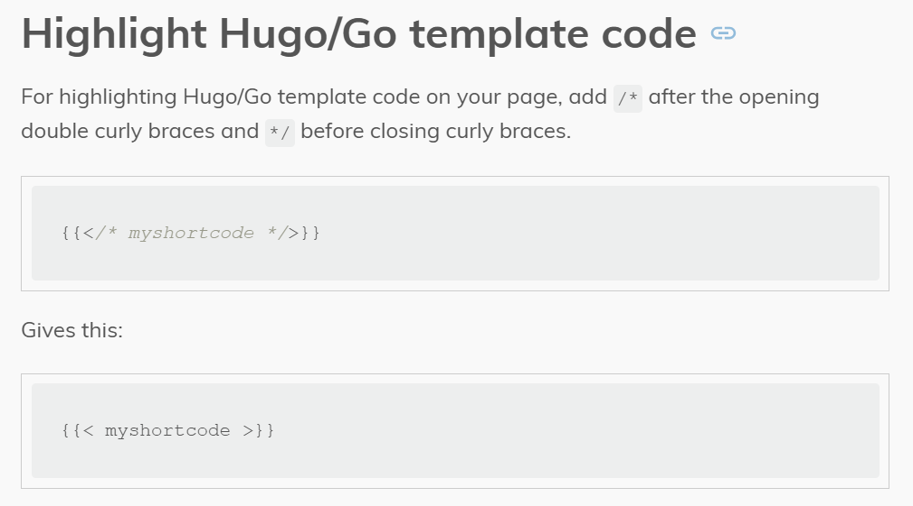

# 【HUGO】Hugo的LoveIt主题美化（五）


## image画廊

一个 `image` 示例:

```markdown

```

呈现的输出效果如下:



`image` shortcode 有以下命名参数:

- **src** *[必需]* (**第一个**位置参数)

  图片的 URL.

- **alt** *[可选]* (**第二个**位置参数)

  图片无法显示时的替代文本, 默认值是 **src** 参数的值.

  *支持 Markdown 或者 HTML 格式.*

- **caption** *[可选]* (**第三个**位置参数)

  图片标题.

  *支持 Markdown 或者 HTML 格式.*

- **title** *[可选]*

  当悬停在图片上会显示的提示.

- **class** *[可选]*

  HTML `figure` 标签的 `class` 属性.

- **src_s** *[可选]*

  图片缩略图的 URL, 用在画廊模式中, 默认值是 **src** 参数的值.

- **src_l** *[可选]*

  高清图片的 URL, 用在画廊模式中, 默认值是 **src** 参数的值.

- **height** *[可选]*

  图片的 `height` 属性.

- **width** *[可选]*

  图片的 `width` 属性.

- **linked** *[可选]*

  图片是否需要被链接, 默认值是 `true`.

- **rel** *[可选]*

  HTML `a` 标签 的 `rel` 补充属性, 仅在 **linked** 属性设置成 `true` 时有效.

## typeit打字动画

`typeit` shortcode 基于 [TypeIt](https://typeitjs.com/) 库提供了打字动画.

只需将你需要打字动画的内容插入 `typeit` shortcode 中即可.

### 1 简单内容

允许使用 `Markdown` 格式的简单内容, 并且 **不包含** 富文本的块内容, 例如图像等等…

一个 `typeit` 示例:

```markdown

这一个带有基于 [TypeIt](https://typeitjs.com/) 的 **打字动画** 的 *段落*...

```

呈现的输出效果如下:


这一个带有基于 [TypeIt](https://typeitjs.com/) 的 **打字动画** 的 *段落*...


另外, 你也可以自定义 **HTML 标签**.

一个带有 `h4` 标签的 `typeit` 示例:

```markdown

这一个带有基于 [TypeIt](https://typeitjs.com/) 的 **打字动画** 的 *段落*...

```

呈现的输出效果如下:


这一个带有基于 [TypeIt](https://typeitjs.com/) 的 **打字动画** 的 *段落*...


### 2 代码内容

代码内容也是允许的, 并且通过使用参数 `code` 指定语言类型可以实习语法高亮.

一个带有 `code` 参数的 `typeit` 示例:

```markdown

public class HelloWorld {
    public static void main(String []args) {
        System.out.println("Hello World");
    }
}

```

呈现的输出效果如下:


public class HelloWorld {
    public static void main(String []args) {
        System.out.println("Hello World");
    }
}


## 禁止解析代码块

使用`/*...*/`包裹禁止解析的代码，[Hugo官方文档- 代码高亮](https://gohugo.io/content-management/syntax-highlighting/).



