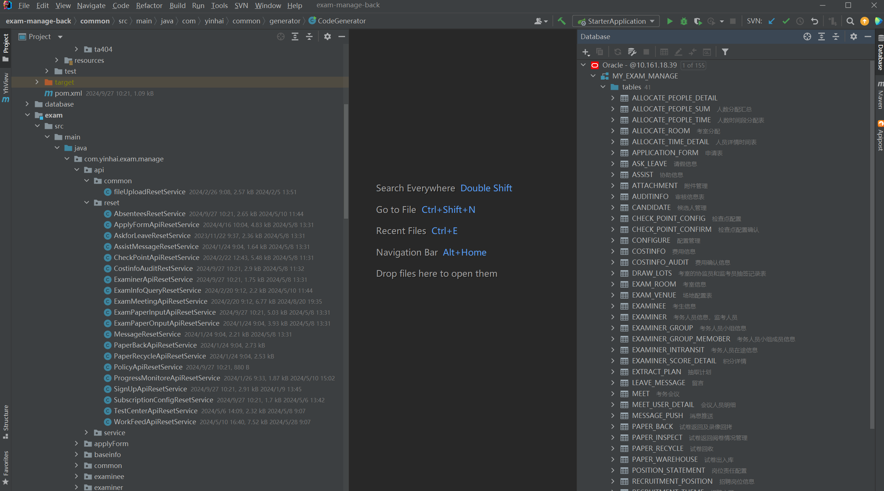
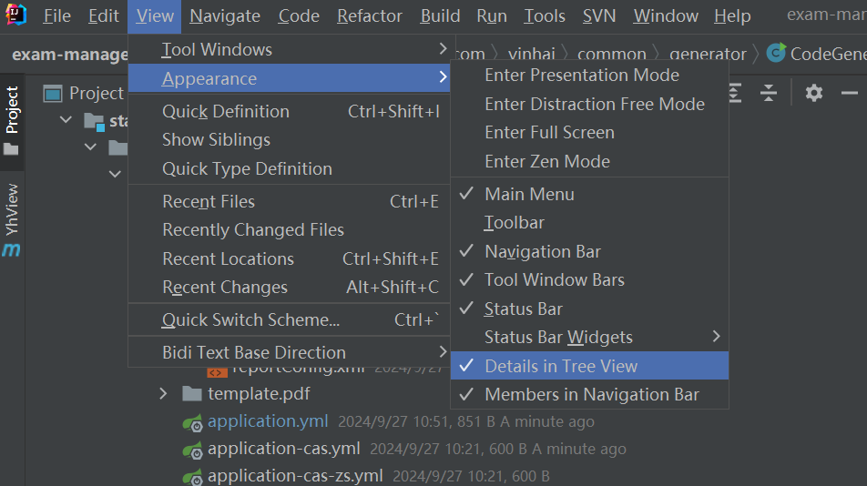

# 【idea】IDEA显示侧边文件的最后修改时间以及文件大小

### 1. idea可以显示侧边文件的最后修改时间以及文件大小

具体如下图

###  2. 关闭或开启

在低版本的idea中 可以使用快捷键 `Shift + alt + \ `来进行开启或者关闭

在idea高版本中取消了快捷键，可以在setting中手动设置快捷键

或者在view - Appearance - Details in Tree View 通过勾选或者取消勾选来进行开启或关闭

