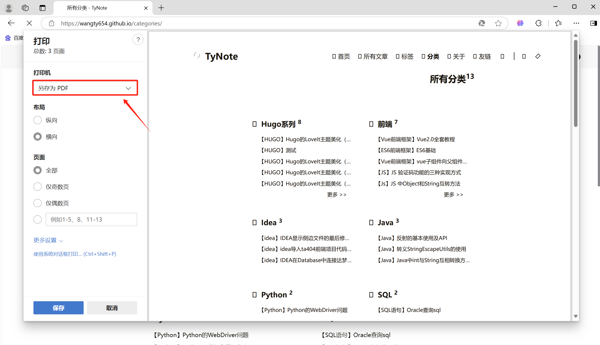
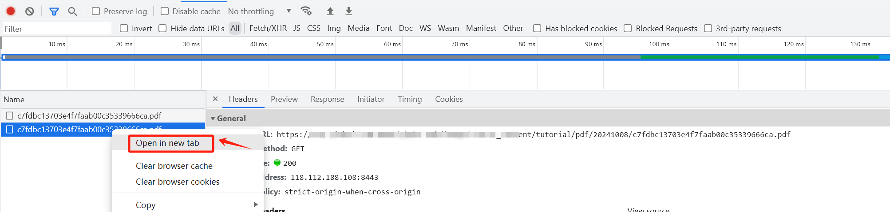
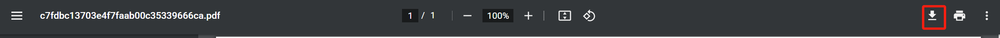
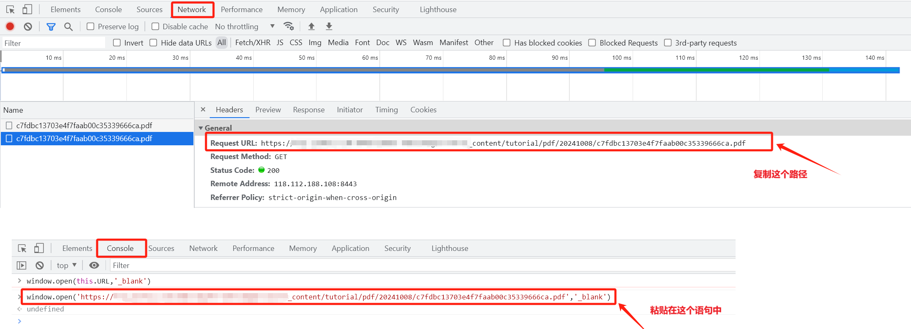

# 【PDF文档】将网页转换为pdf文件并下载


### 办法1：ctrl+p

- 在edge浏览器中，使用`ctrl+p`快捷键可以快速调出打印。
- 打印页面选择，另存为pdf



### 办法2：Open in new tab

1. 打开网页右上方的三个点，找到更多工具，打开开发者工具；
2. 找到Network，找到Fetch/XHR，CTRL+R刷新界面，滑到最下面的fetch文件；
3. 右击最下面的fetch文件，选择Open in new tab；
4. 自动跳转到文件下载页，点击下载按钮。





### 办法3：window.open

- `Open in new tab`打不开的页面
- 打开控制台`Console`，输入下面代码，并按回车键

```js
window.open(URL,'_blank')
```

- 这里的`URL`复制Network处的路径



- 在跳转到的文件下载页，点击下载按钮。


