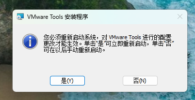

# 【VMware】VMware虚拟机安装Windows11系统教程


### 新建一个虚拟机

**1、打开虚拟机主页面，点击“创建新的虚拟机”**


**2、该页面建议选择”自定义“，并点击”下一步“**


**3、这里选最大`16.2.x`，并点击“下一步”**


**4、选择“稍后安装操作系统”，并点击“下一步”**


**5、没有win11的名称，就选择`win10 x64`版本，并点击“下一步”**


**6、根据自己具体的情况，选择虚拟机存放的位置**


**7、修改虚拟机的名称，用于区别自己创建的其他虚拟机。并点击“下一步”**


**8、该页面，点击“下一步”**


**9、根据情况和需求，配置处理器数量。并点击“下一步”**


**10、根据情况和需求，配置内存大小。并点击“下一步”**


**11、选择“使用桥接网络”，并点击“下一步”**


**12、点击“下一步”**


**13、点击“下一步”**


**14、点击“下一步”**


**15、根据情况和需求，配置磁盘大小。并点击“下一步”**


**16、根据自己具体的情况，选择虚拟机存放的位置，并点击“下一步”**


**17、在浏览器使用搜索引擎**（这里使用的是：百度搜索引擎），搜索`Windows11`。选择[微软官网](https://www.microsoft.com/zh-cn/software-download/windows11?774b232c-a48d-452a-a8fb-3906dc168d5c=True&9d47a9e1-e53b-49a1-92ca-a647d62dc410=True)。


**18、在官网找到“win11磁盘映像”**


**19、选择ISO版本，语言“简体中文”，点击`64-bit Download`**


**20、找到下载完成后保存的位置**


**21、继续回到虚拟机安装导向，点击自定义硬件**


**22、选择`新CD/DVD`，选择使用ISO映像文件，配置刚刚下载的文件的位置，点击“关闭”。**


**23、点击“完成”**


**24、点击“编辑虚拟机设置”，选择“选项”卡，选择“访问控制”，点击“加密”**


**25、根据自己的情况，设置加密密码，两次密码保持一致。并点击“加密”**

```
--随机生成密码
spoHLT2b
```


**26、选择“硬件选项卡”，点击“添加，”选择“可信平台模块”，并点击完成**


**27、点击“开启此虚拟机”。**


**28、进入时，如卡住，按`enter`回车键，继续。`ctrl+alt`可以实现鼠标光标在虚拟机内外来回切换**


**29、出现“安装系统界面”，点击"下一步"**


**30、点击"下一步"**


**31、选择"我没有产品密钥"**


**32、选择"win11专业版"，并点击"下一步"**


**33、勾选"我接受"，并点击"下一步"**


**34、新建磁盘空间，点击"新建"，大小为1024的倍数。例如50G就是50*1024即可。点击"应用"**


**35、其余自动的硬盘分区，也应用，并点击"下一步"**


**39、点击"安装"**


**40、等待安装进度条**


**41、可以等待他自动重启，也可以点击"立即重启"**


**42、等待重启**


**43、安装准备界面，根据提示和导向，一路点"是"**


```
--pin
1437059026@qq.com
```

**48、等待桌面加载**


**49、进入到win11系统桌面界面**


### 设置虚拟机屏幕全屏

**1、选择"虚拟机"，选择"安装VMware Tools"**


**2、右下角弹出窗，表示安装完成**


**3、进入资源管理器，选择"此电脑"，双击打开"DVD驱动器"**


**4、选择"是"，等待安装**


**5、弹出"安装向导"，点击"下一步"**


**6、继续点击"下一步"**


**7、点击"安装"**


**8、等待安装进度**


**9、安装完成后就自动适配了全屏，点击"完成"**


**10、弹出窗，选择"是"**



### 虚拟机内win11系统激活

**打开个性化有下面这个标识，标识win11系统未激活**


**1、激活脚本拷贝进虚拟机**

```
https://www.123pan.com/s/g520Vv-rgRid
```


**2、连接上网络，双击激活脚本，选择"是"**


**3、根据该网址激活教程操作**

```
https://massgrave.dev/
```


```shell
irm https://get.activated.win | iex
```


​	**到此，关闭所有黑窗口**

**6、桌面空白处，右键，选择"个性化"。若激活提示消失，说明激活成功。**


### 操作习惯设置

**1、个性化 - 主题 - 桌面图标设置**


**2、勾选"计算机"、"回收站"、"控制面板"，点击"应用"**


**3、系统 - 显示 - 缩放 ， 大小改为"125%"**


**4、虚拟机这个图标可以全屏，全屏后顶部同样点这个图标可以退出全屏**


```
开机密码--
1437059026
```


