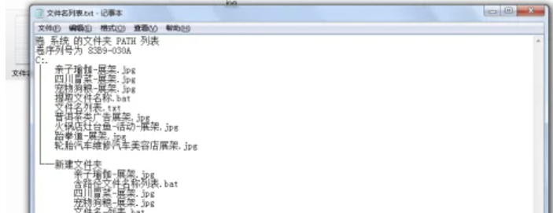

# 【bat批处理】提取多文件夹下的文件名称


## 带路径的文件名称

待提取的文件夹下新建txt文件，拷贝下面这段代码

```shell
@echo off
dir /s/b *.* >文件名.txt
exit
```

保存这个txt文件，然后将txt文件的后缀修改为bat。

双击这个bat文件，此时文件夹中会多出来一个txt文件，此txt文件就是提取的文件夹路径和文件名称了。


## 带结构的文件名称

待提取的文件夹下新建txt文件，拷贝下面这段代码

```shell
@ECHO OFF
tree /F > 文件名列表.txt
```

保存这个txt文件，然后将txt文件的后缀修改为bat。

双击这个bat文件，此时文件夹中会多出来一个txt文件，此txt文件就是提取的文件夹路径和文件名称了。



## excel处理文件名称

选择文件路径内容所在列，选择导航栏：数据 -  分列


默认选择[分隔符]号，点击下一步。


选择其他并输入符号“\”，点击下一步。


点击完成。

