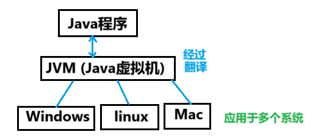

# 【Java】Java语言基础（一）


## 基础概念入门

### 一、计算机

1. **裸机**：没有安装任何软件的计算机

   - 科学计算 —— 数值计算
   - 数据处理
   - 自动控制
   - 计算机辅助设计
   - 人工智能
   - 多媒体应用
   - 计算机网络

2. **计算机硬件**：电工、机械、光电元件（各种物理装置的总称）

   - CPU、主板、内存、电源、主机箱、硬盘、显卡、键盘、鼠标、显示器

3. **计算机软件**：一系列指令（由`程序 + 相关文档` 组成，用于执行`特定任务/功能`）

   - **系统软件**：DOS（Disk Operating System）、Windows、ios、Android、Mac、Linux
   - **应用软件**：Office、QQ、微信

4.  **软件开发**：`特定顺序 + 数据 + 指令` 的集合

5.  **人机交互**：`图形化界面 + 命令行方式 `（例如：控制台）

   - Dos窗口命令：
     - `d:` 切换至d盘 [盘符切换]
     - `dir:` 列出当前目录下的文件 （`ls` Nginx中使用这个）
     - `md` 创建目录
     - `rd` 删除目录（删文件夹）
       - 带内容的文件夹删除
       - 一个一个的删
       - `rd + /s`
       - `rd + /s + /q`
     - `cd` 进入指定目录
     - `cd..` 退出当前目录 （单级退出）
     - `del` 删除 （只能删除`*.txt`类文件）
     - `cls`  清屏
     - `exit` 退出
     - `edit` 编辑
     - `notepad`  打开记事本
     - `mspaint`  打开画图
   - `ctrl + alt + L`  代码对齐
   - 键盘`prtSc` 屏幕截图
   - 确保系统上已正确安装 Java 开发工具包（JDK），Dos窗格中可以：
     - `javac HelloWorld.java` 编译
     - `java HelloWorld.class` 运行

6.  **Java语言平台版本**

   - J2SE  桌面
   - J2ME 手机
   - J2EE  电脑

7.  **Java的垮平台性**：指Java程序能够在不同操作系统和硬件平台上运行，而无需修改源代码。

   - **Java虚拟机（JVM）**：
     - Java源代码在编译后生成的是字节码（.class文件），而不是直接生成特定操作系统的机器代码。字节码可以在任何安装了Java虚拟机（JVM）的设备上运行。各个操作系统都有各自的JVM实现，这使得相同的Java字节码可以在Windows、Linux、Mac OS等平台上无缝运行。
   - **一次编写，到处运行（WORA）**：
     - Java的设计理念是“一次编写，随处运行”。开发者只需将Java程序编写一次，并编译成字节码，之后就可以在任何支持JVM的系统上运行，而无需进行任何修改。
   - **高度的抽象性**：
     - Java提供了大量的标准库和API，这些库和API被设计为与平台无关。开发者在编写应用时主要使用这些标准的功能，而不需要考虑底层操作系统的差异。

   - **图例**：

     

8. （大）**JDK**：Java开发工具包（开发环境）

   - `Javac.exe`   编译工具
   - `jar.exe`   打包工具
   - .....

9. （中）**JRE**：Java运行环境

10. （小）**JVM**：Java虚拟机

11. （小）**Java核心库**：一组重要类和接口，它们提供了Java程序开发所需的基本功能

    - **java.lang**：包含基本的类，如 `String`、`Math`、`Object` 等，所有Java程序默认导入这个包。
    - **java.util**：提供了许多实用的工具类，如集合框架（List、Set、Map）、日期/时间类等。
    - **java.io**：包含输入/输出类，允许程序与数据源（如文件、网络）进行数据交换。
    - **java.net**：提供网络编程的支持，包括URL、Socket等类。
    - **java.awt** 和 **javax.swing**：用于创建图形用户界面（GUI）的类。
    - **java.sql**：提供与数据库连接和操作相关的类。

​     

### 二、path环境配置

`PATH` 是一个环境变量，用于告诉操作系统在命令行中**寻找可执行程序的位置**。正确配置 `PATH` 变量，使你**能够在任何位置**通过命令调用相关的可执行文件，而不需要输入其完整的路径。这在使用 Java、Git 等开发工具时特别重要。

**目的**：需要在任意的目录下均可运行（可执行性文件`.exe`）

####    Windows 中配置

1. **打开系统属性**：

   - 右键点击“此电脑”或“计算机”，选择“属性”。
   - 点击“高级系统设置”。
   - 在“系统属性”窗口中，点击“环境变量”按钮。

2. **编辑 `PATH` 变量**：

   - 在“系统变量”或“用户变量”区域，查找`PATH`变量：
     - 如果不存在，点击“新建”，输入变量名 `Path`。
     - 如果已存在，选择它并点击“编辑”。

3. **添加新的路径**：

   - 在编辑窗口中，点击“新建”，然后添加你想要包含的目录路径（例如，Java 的 `bin` 目录）。

   - 示例路径：

     ```sh
     C:\Program Files\Java\jdk-11\bin  
     ```

   - 你也可以直接在已有的路径中添加（用分号 `;` 分隔每个路径）。

4. **保存并关闭**：

   - 点击“确定”以保存更改，然后关闭所有相关窗口。

#### macOS 和 Linux 中配置

1. **打开终端**。

2. **编辑配置文件**：

   - 根据你使用的 shell，编辑相应的配置文件（例如 `.bashrc`、`.bash_profile` 或 `.zshrc`）。

   - 使用文本编辑器打开文件。例如：

     ```bash
     nano ~/.bashrc  # 对于 bash  
     ```

   - 对于其他 shell，如 zsh，你可能需要编辑 `.zshrc` 文件。

3. **添加路径到 `PATH`**：

   - 在文件的末尾添加以下行：

     ```bash
     export PATH="/path/to/directory:$PATH"  
     ```

   - 例如，如果你希望添加 Java 的`bin`目录：

     ```bash
     export PATH="/usr/local/java/jdk-11/bin:$PATH"  
     ```

4. **保存并退出**（对于 `nano`，使用 `CTRL + X`，然后按 `Y` 保存）。

5. **使改动生效**：

   - 运行以下命令：

     ```bash
     source ~/.bashrc  # 或者 source ~/.zshrc  
     ```

   - 这会使新的 `PATH` 设置在当前终端会话中生效。也可以重新打开终端来应用更改。

​      

#### 验证 `PATH` 配置

你可以通过在命令行中输入以下命令来验证 `PATH` 是否配置正确：

- **在 Windows**：

  ```cmd
  echo %PATH%  
  ```

- **在 macOS/Linux**：

  ```bash
  echo $PATH
  ```

执行该命令后，你应该能看到你添加的路径。如果没有，可能需要检查是否正确保存了文件并重新加载配置。

   

### 三、classpath环境配置

在`Java`中，`CLASSPATH` 是一个环境变量，用于告诉**Java虚拟机（JVM）**和  **Java编译器（`javac`）**在哪些目录下寻找类文件（`.class文件`）和库文件（`.jar文件`）。

- 设置 CLASSPATH 的作用
  - **查找类**：`CLASSPATH` 告诉JVM和编译器从哪里加载所需的类和资源。
  - **项目依赖**：在一个应用程序中，可能会需要多个外部库，`CLASSPATH` 有助于管理这些依赖。

- CLASSPATH 配置方法

在不同操作系统上，配置 `CLASSPATH` 的方法略有不同：

#### Windows

1. **打开系统属性**：

   - 右键点击“此电脑”或“计算机”，选择“属性”。
   - 点击“高级系统设置”。
   - 在“系统属性”窗口中，点击“环境变量”。

2. **创建或编辑 CLASSPATH**：

   - 在“系统变量”或“用户变量”区域，查找`CLASSPATH`变量：
     - 如果不存在，点击“新建”，输入变量名 `CLASSPATH`。
     - 如果已存在，选择它并点击“编辑”。

3. **添加路径**：

   - 在变量值中添加目录路径或jar文件的路径，用分号（;）分隔。例如：

     ```sh
     C:\myproject\classes;C:\myproject\lib\mylibrary.jar  
     ```

4. **保存和关闭**：

   - 点击“确定”保存，并关闭所有窗口。

   

#### macOS 和 Linux

1. **打开终端**。

2. **编辑配置文件**：

   - 根据使用的shell，编辑相应的配置文件（例如，`~/.bashrc`、`~/.bash_profile` 或 `~/.zshrc`）。

   - 使用文本编辑器打开文件，例如：

     ```bash
     nano ~/.bashrc
     ```

3. **添加 CLASSPATH**：

   - 在文件末尾添加以下行：

     ```bash
     export CLASSPATH=/path/to/classes:/path/to/libs/mylibrary.jar:$CLASSPATH
     ```

   - `:` 用于分隔多个路径。

4. **保存并退出**（对于 nano，使用 `CTRL + X`，然后按 `Y` 保存）。

5. **使改动生效**：

   ```bash
   source ~/.bashrc  
   ```

   - 或重新打开终端。


