# 【Java】Java语言基础（二）


## 一、基础部分

### 1. 关键字keyword

全是小写，能被虚拟机识别。`goto` 和 `const`  是保留字（现在保留，可能会成为关键字）。

### 2.标识符

作用：起名字。

组成：`$` `_` `数字` `英文大小写`  （不能以数字开头）

常见的命名规则：

1. 见名知意
2. 包：其实就是文件夹，用于把相同的类名进行区分
   - 单级包（全部小写）：wangty
   - 多级包（用`.`隔开）：cn.wangty   --指cn包下的wangty包
3. 类/接口
   - 一个单词组成，首字母大写：Student、Dog
   - 多个单词组成，大驼峰：HelloWorld
4. 方法/变量
   - 一个单词，首字母小写：main方法、name变量
   - 多个单词，小驼峰：studentAge
5. 常量
   - 一个单词，全部大写：PI 圆周率
   - 多个单词，全部大写，以`_` 隔开：STUDENT_MAX_AGE



类：为java基本底层，一切以其为开始，`{ }`中可以写：结构定义语句、功能执行语句



### 3.注释

用于解释说明程序，调试排错

- 单行注释：`//`
- 多行注释：`/*   */`  （不能嵌套使用）
- 文档注释：`/**   */`  （被javadoc工具解析，生成一个说明书，面向对象部分讲解）

### 4.常量

执行过程中，其值不可发生改变。

使用`final`关键字申明（前端一般使用`const`申明），只能进行一次赋值

- 字面值常量
  1. 字符串常量：双引号括起来的内容，例： `"Hello"`
  2. 整数常量：所有整数，例：`100`
  3. 小数常量：所有小数，例：`0.11111`
  4. 字符常量：单引号括起来的内容，例：`'A'`
  5. 布尔常量：真/假，例：`true` `false`
  6. 空常量：`null`
- 自定义常量

​    

### 5.进制

#### 1) 定义

表示进位的方式。（X进制：逢x进一）

计算机的电子原件状态：`开/关` ，用数字`1/0` 表示

表达数据的时候，国际化标准组织规定，用8个这样的信号来表示一个数据，单位为**字节**

- ob开头：2进制
- o开头：8进制
- ox开头：16进制

​    

#### 2) 进制转换

##### X → 10

**进制的转换**：（任意进制 → 十进制）

1. 系数：每一个位上的数值本身，成为系数
2. 基数：X进制，基数为X
3. 权：从右开始，以0开始编号，即为该位上权值

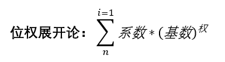

示例：2进制 转 10进制

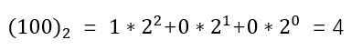

示例：8进制 转 10进制

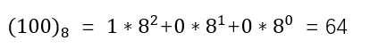

示例：16进制 转 10进制

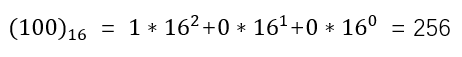

##### 8421码

**8421码**：用于2进制与10进制的快速转换

|  2   |  1   |  1   |  1   |  1   |  1   |  1   |  1   |  1   |
| :--: | :--: | :--: | :--: | :--: | :--: | :--: | :--: | :--: |
|  10  | 128  |  64  |  32  |  16  |  8   |  4   |  2   |  1   |

示例：2进制 转 10进制

将不同权位上为1的，对应位置上的数值相加

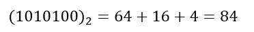

示例：10进制 转 2进制

左添0，从高位寻起，有则为1；相减，无则为0。去掉左0，添ob标识

|  10  | 100  | 100  |  36  |  4   |  4   |  4   |  0   |  0   |
| :--: | :--: | :--: | :--: | :--: | :--: | :--: | :--: | :--: |
|  10  | 128  |  64  |  32  |  16  |  8   |  4   |  2   |  1   |
|  2   |  0   |  1   |  1   |  0   |  0   |  1   |  0   |  0   |

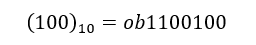

##### 10 → X

**进制的转换**：（十进制 → 任意进制）

商为0时结束，倒写余数。**除基取余，直到商为0，余数反转。**

示例：10进制 转 2进制

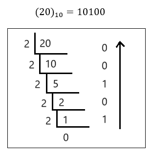

示例：10进制 转 8进制

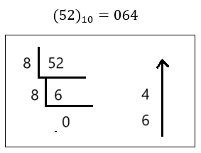

示例：10进制 转 16进制

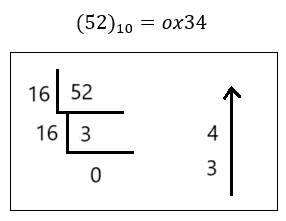

##### X → Y

**任意进制之间转换**：（X → Y）

以10进制做桥梁，X → 10，10 → Y 

​    

### 6.有符号数据表示法

在计算机内，有符号数有3中表示法：**原码、补码、反码**

在计算机操作的时候，都是采用数据对应的二进制补码来计算的。

**原码**：二进制定点表示法，最高位为符号位，`"0"`表示正，`"1"`表示负，其余表数值的大小

示例：`±7`。首先得到7的二进制为`111`

| 原码 | 符号位 |   数值位    |                     |
| :--: | :----: | :---------: | :-----------------: |
|  +7  |   0    | **0000**111 | 总共8为，不为1的补0 |
|  -7  |   1    |   0000111   | 总共8为，不为1的补0 |

**反码**：正数的反码与其原码相同。负数的反码，对其原码逐为取反，但符号位除外。

| 反码 | 符号位 |   数值位    |          |
| :--: | :----: | :---------: | :------: |
|  +7  |   0    |   0000111   |          |
|  -7  |   1    | **1111**000 | 对应取反 |

**补码**：正数的补码与其原码相同。负数的补码，是在反码的基础上加1

| 反码 | 符号位 |   数值位    |                        |
| :--: | :----: | :---------: | :--------------------: |
|  +7  |   0    |   0000111   |                        |
|  -7  |   1    | 111100**1** | 加在尾部，若要进位则进 |

 

**2个练习加深印象**：

1. 已知X的原码10110100B，求补/反码
   - 第一个符号位，为1，该数为负数
   - 原码B表示二进制
   - 反码：0 1001011
   - 补码：0 1001100 （注意进位）
2. 已知X补码11101110B，求原码
   - 补码减1，注意借位，不够往前借
   - 补码：1 1101110
   - 反码：1 1101101
   - 原码：1 0010010

  

### 7.变量

内存中的一小块区域。

```java
//强制转换
byte c = (byte)(a+b)
```

- 变量相加：先提升数据，再计算运行
- 常量相加：先计算结果（调试、编译），再赋值。再检测数据类型范围，超出则报错

```java
//示例：
byte b1 = 3;
byte b2 = 4;
byte b;

//byte的范围 -128 ~ 127
b = b1 + b2   //报错,数据提升。（先提升成int 3，int4，才会进行相加赋值 7是int）
b = 3 + 4     //b = 7 （7是byte）
    
//'a' = 97
//'A' = 65
//'o' = 48   
```

- 字符串相加：其`+`表示为连接符。结果为：字符串
- 数值相加：其`+`表示为运算符。结果为：计算结果

```java
//示例
'a' + 1 + 'hello'  //98hello
'hello' + 'a' + '1' //helloa1    
```

- 定义Long类型变量，`1L`。
- 定义Float类型变量，`1f`。
- 整数默认为int，浮点默认为Double
- byte、short在定义时，他们接受的其实是一个int类型的值。（做了一个数据检测，如果不再它们的范围内，就报错）
- byte值的问题

```java
//byte的范围 -128 ~ 127
byte b1 = 127;
byte b2 = (byte) 128;  //-128
byte b3 = (byte) 129;  //-127
byte b4 = (byte) 130;  //-126

//128:10000000
//-128: 10000000 这里1既是符号位，也是数值位，这里的0为负0
```

### 8.默认类型转换

char(2)、byte(1)、short(2) → int(4) → long(8) → float(4) → double

**为什么 '8字节' 可以转换为 '4字节'？**

- long：8字节，整数存储

- float：4字节，浮点型存储

- 它们底层的存储类型不同，float类型在计算机中只使用4个字节存储，遵循IEEE-754格式标准。一个浮点数有两个部分构成：

  - 底数m：以二进制数表示词浮点数的实际值，占24bit，高位始终为1。

  - 指数e：占用8bit的二进制数，范围0-255。有±，减127才是真正的指数

  - 例如：

    `17.625`存储

    1. 二进制：10001.101
    2. 整数部分：除以2，商为0，余数反转。（10001.101）
    3. 小数部分：乘以2，乘位为0，进位顺序取（1.0001101高位恒为1）
    4. 右移至小数点前只有1位，2→3，需移动4位，指数加127 = 4 + 127=131
    5. 131二进制：10000011

    结果为：0 1000001 10001101  00000000    00000000

    | 符号位 |   指数   |  底数   |       |
    | :----: | :------: | :-----: | :---: |
    |   0    | 10000011 | 0001101 | 0...0 |

- float表示的数据范围比long大

  证明：

  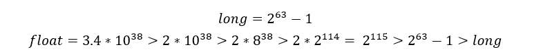

- char能存一个中文字符，一个字符2个字节。java语言采用Unicode编码。

​    

### 9.运算符

#### 1) 算术运算符（Operator）

`+`、`-`、`×`、`÷`、`%`、`++`、`--`

**例一**：a = 10； b = 10 ；c = 10；

```java
a = b++;   //a = 10； b = 11 ；c = 10
c = --a;   //a = 9；  b = 11 ；c = 9
b = ++a;   //a = 10； b = 10 ；c = 9
c = c--;   //a = 9；  b = 10 ；c = 8

//在前，先++/--，再赋值
//在后，先赋值，再++/--
```

**例二**：x = 4

```java
y = (x++) + (++x) + (x*10);    //x = 6;y = 70
//   4       6       60
//  x = 5   x = 6
```

​      

#### 2）赋值运算符

`=`、`+=`、`-=`、`*=`、`/=`、`%=`

**例一**：short s = 1；

```java
s = s + 1;    //short 参加运算，提升为int，可能损失精度
s += 1;       //s为short

//拓展的赋值运算符其实隐含了一个强制类型转换
/*  s += 1; 
<≠> s = s + 1; 
<=> s =(short) s + 1;
*/
```

​     

#### 3）比较运算符（关系运算符）

`<`、`>`、`<=`、`>=`、`!=`、`==`、`instanceof`

结果都是boolean类型，只要有一个满足条件就可以

​     

#### 4）逻辑运算符

- `&` 与 ：同真为真
- `|` 或 ：同假为假
- `^` 异或：同名为假，异名为真
- `!` 非 ：取反
- `&&` 短路与 ：左假右不管
- `||` 短路或 ：左真右不算

左右必须都是布尔型表达式。

​     

#### 5）位运算符（2进制）

- `<<`  扩大，正数补0，负数补1
- `>>`  缩小，正数补0，负数补1
- `&`、`|`、`^`  当两边为数据做的是“位运算”，两边为表达式做的是“逻辑运算”
- `~`、
- `>>>`  无符号右移，全补0

**例一**：某一个数据对另一个数据位异或两次，数据不变

```java
//可以用来加密
a^b^b = a
a^b^a = b
```

**例二**：将两个变量所携带的整数进行交换。a换成b，b换成a

```java
//方法一：
a = a^b;
b = a^b;   //b = a^b^b = a;
a = a^b;   //a = a^b^a = b;
```

```java
//方法二：
a = a+b;   //a =30;
b = a-b;   //b = 10, b = (a+b)-b = a;
a = a-b;   //a = 20, a = (a+b)-a = b;
```

```java
//方法三：
c = a;
a = b;
b = c;
```

```java
//方法四：
b = (a+b)-(a=b)
    
//等价于
a = b;
b = (a+b)-b = a;
```

### 10.键盘录入数据（Scanner）

1. 导包

   ```java
   import java.util.Scanner;
   ```

2. 创建键盘录入对象

   ```java
   Scanner sc = new Scanner(System.in);
   ```

3. 通过对象获取数据

   ```java
      int x = sc.nextInt();  //键盘录入 整数值
   String s = sc.nextLine(); //键盘录入 字符串
   ```

**例一**：

```java
import java.util.Scanner;

public class ScannerDemo {
    public static void main(String[] args) {
        Scanner sc = new Scanner(System.in);
        System.out.println("请输入：");
        int x = sc.nextInt();
        System.out.println("你输入的是："+x);
    }
}
```

​      

### 11.流程控制语句

#### 1）顺序结构

```java
// 顺序结构示例  
System.out.println("程序开始");  

// 变量赋值  
int a = 10;  
int b = 20;  

// 计算和  
int sum = a + b;  

// 输出结果  
System.out.println("a 和 b 的和是: " + sum);  

System.out.println("程序结束");  
```

#### 2）选择结构（if/switch）

```java
if(比较表达式){
    语句体
}else{
    语句体
}
```

```java
switch(表达式){
	case 值1 :语句体1;
			  break;
	 default :语句体n+1;
			  break; 
}

/*
1、case后面，只能是常量，不能是变量，且多个case后的值不能相同
2、default可以省略，不建议
3、break可以省略吗？可以（最后一个）
4、default一定要在最后面吗？可以在任意位置
*/
```

**if/switch的区分**：

- Boolean用if
- 1000上万数据用if
- 小数范围用if
- 针对几个常量值情况用switch

#### 3）循环结构（for/do-while）

##### for循环语句

```java
for(初始化语句;判断条件语句;变量变化){
	循环语句体
}
```

**例一**：输出1~10

```java
for(int x=1;x<=10;x++){
	System.out.println(x);
}
```

**例二**：求1~10的数据和

```java
int sum = 0;
for(int x=1;x<=10;x++){
    sum += x;
}
System.out.println(sum);
```

**例三**：求1~100之间的偶数和

```java
/**
思路：1~100之和为5050
1~100奇/偶对半各50
偶比奇大1，总共多50
（5050-50）÷ 2 +50 = 偶数和
*/

//方法一：
int sum = 0;
for(int x=1;x<=100;x++){
    if(x%2 == 0){
        sum += x;
    }
}
System.out.println(sum);

//方法二：
//从0开始，自增2位
int sum = 0;
for(int x=0;x<=100;x+=2){
    sum += x;
}
System.out.println(sum);
```

**例四**：求5的阶乘

```java
//阶乘：n! = n*(n-1)! = n*(n-1)*(n-2)*...*1
int sum = 1;
for(int x=1;x<=5;x++){
    sum *= x;
}
System.out.println(sum);
```

**例五**：水仙花数（求所有水仙花数）

```java
//水仙花数：一个三位数，即各位数字的立方和等于该数本身。
//例如：153 = 1^3+5^3+3^3 = 153
for(int x=100;x<1000;x++){
    int ge = x%10;        //获取个位数
    int shi = x/10%10;    //获取十位数
    int bai = x/10/10%10; //获取百位数
    if(x == (ge*ge*ge + shi*shi*shi +bai*bai*bai)){
        System.out.println(x);
    }
}
```

##### while循环语句

可以与for循环等价转换

```java
while(判断条件语句){
    循环体语句
}
```

**例一**：按照for语句，交换各项位置

```java
for(int x=0;x<10;x++){
	System.out.println("hello");
}

//等价于
int x = 0;
while(x<10){
    System.out.println("hello");
    x++;
}

/*
while的初始化在外面，x为全局变量
for的x为局部变量
当循环，有范围时，用for；无明确范围时，用while
*/
```

##### do-while循环语句

```java
do{
    循环语句
}while(判断条件句)
```

```java
//对应上方for循环
int x = 0;
do{
   System.out.println("hello");
    x++; 
}while(x<10)
```



**三种循环的区别**：

1. do-while至少执行一次循环体
2. while、for必须判断条件再循环（只有这一个区别）

**死循环**：

`ctrl+c` 强制停止循环。一定注意造成死循环是因为没有写条件控制



​     

### 12.跳转控制语句

#### 1）break中断

break使用场景（离开下面两个场景，无意义）

- switch语句中
- 循环语句中

```java
//嵌套for中，只跳出一层
//使用“标签名：语句” - 跳出目标层
wc:for(...){
	nc:for(...){
        if(){break wc;} //中断外+内层
		if(){break nc;} //中断内层
    }
}
```


#### 2）continue继续

使用场景，for循环中。（离开此场景无意义）

跳出本次循环，进入下一循环体

（0,1,2,跳出，4,5,6...）

​     

#### 3）return返回

使用场景，结束一个方法，跳转到上层调的方法

**方法的注意事项：**

1. 方法不调用不执行
2. 方法与方法是平级关系，不能嵌套定义
3. 方法定义的时候参数之间用逗号隔开
4. 方法调用时不用在传递数据类型
5. 如有明确返回值，一定要return

​     

## 二、核心部分

### 1.方法（函数）

方法定义在一个类中，完成特定功能的代码块。

```java
修饰符 返回类型 方法名(参数类型 参数名){
	函数体;
	return 返回值;
}

/*
写一个方法（两个明确）
1、返回值类型：结果的数据类型
2、参数列表：传递几个、每个的数据类型
*/
```

**参数**：

- 实参：实际参与运算的
- 形参：形式上定义的，用来接受实际参数的

**return**：结束方法

**返回值**：就是功能的结果，由return带回给调用者

**例一**：求2个数的和

```java
//方法不调用不会自动运行
public static int Sum(int a,int b) {
    int c = a+b;
    return c;
}
```

**特例**：main方法，在Java虚拟机处调用，所以不用认为调用，依然可以运行

```java
public static void main(String[] args) {....}
```

**方法的调用方式**：

```java
//单独调用
Sum(a,b);
```

```java
//输出调用
System.out.println(Sum(a,b));
```

```java
//赋值调用
int result = Sum(a,b);
```

**void方法调用**：只适用于第一种"单独调用"

​      

### 2.重载

方法的功能相同，参数列表不同，java允许它们起相同的名字。

参数列表不同：

- 参数个数不同
- 参数数据类型不同

通过参数个数识别，不同的方法。JVM会根据不同的参数，去调用不同的方法。

```java
//原方法
public static int Sum(int a,int b) {}
//重载入参个数
public static int Sum(int a,int b,int c) {}
//重载入参类型
public static float Sum(float a,float b) {}
```

​      

### 3.数组

数组是用于存储多个变量(元素)的容器，这多个元素的数据类型相同。

```java
数据类型[] 数组名     //常用
数据类型  数组名[]    
```

数组定义后，没有值，需要初始化

```java
int[] arr = new int[3];

//int[] arr：看成一个变量，变量需要初始化才能使用
//new：为数组分配内存空间。之后看见的所有的new都是分配内存空间的
//int[3]：数组长度，动态初始化
```

**初始化**：开辟内存空间，并赋值

- 静态初始化：给定元素数值，长度系统定
- 动态初始化：给定系统长度，由系统分配初始值（默认为0）

```java
//动态初始化格式
数据类型[] 数组名 = new 数据类型[数组长度]    
```

```java
//静态初始化格式
数据类型[] 数组名 = new 数据类型[元素1,元素2,...]  
```

**注意：不要同时使用动/静态初始化。**

使用`System.out.println(arr)` 输出数组arr，显示数组的**地址值**

用数组名和索引相结合，可以获取数组中指定编号的元素。格式：**数组名[索引值]**。



Java中的**内存分配**以及**栈**和**堆**的区别：

为了提高运算效率，对**内存空间**进行了**不同区域**的划分

- **栈**：存"基本类型变量"和"引用变量"
- **不同区域**：有特定的“处理数据方式"和"内存管理方式"

**5个内存空间**：

1. 栈（存储局部变量：方法定义上、方法申明上）
2. 堆（存储new出来的东西 + 数组）
3. 方法区
4. 本地方法区（和系统有关）
5. 寄存器（给CPU使用）

**堆内存的特点**：

1. 每一个new出来的东西都有地址值
2. 每个变量都有默认值
   - byte、short、int、long → 0
   - float、double → 0.0
   - char → '\u0000' （空字符）
   - boolean → false
   - 引用类型 → null
3. 使用完毕后，就变成垃圾，但是并没有立即收回，在垃圾回收器空间的时候回收。

**栈内存的特点**：

1. 用完即释放（数据脱离其作用域）

**图解**：

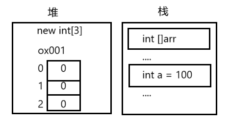



**数组操作（越界/空指针）问题**：

`ArrayIndexOutOfBoundsException` 数组索引越界异常：原因你访问了不存在的索引。

`NullPointerException` 空指针异常：原因数组已经不指向堆内存了，但你使用数组名访问了元素。

图解：

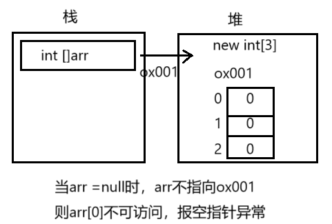

**数组操作（遍历）**：

依次输出数组中每一个元素。

```java
//每个元素只有索引值不同
//遍历：用循环改变索引即可
for(int x=0;x<10;x++){
    System.out.println(arr[x]);
}
```

​       

### 4.


