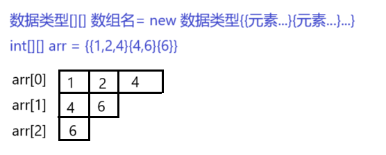
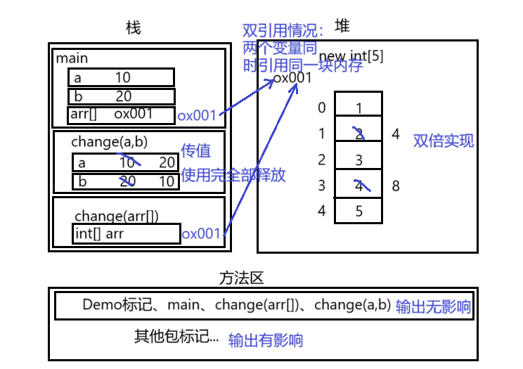
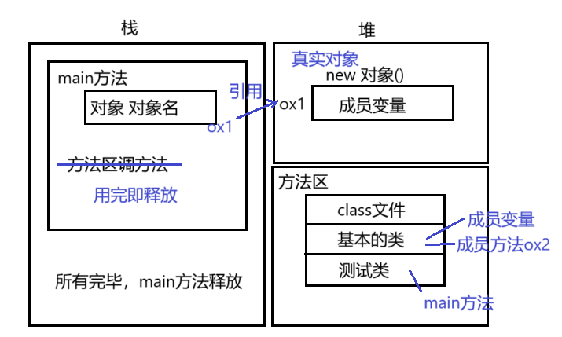
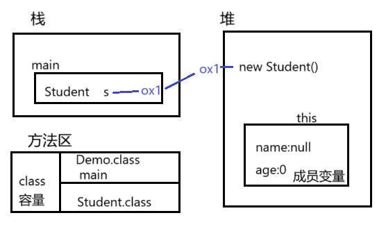
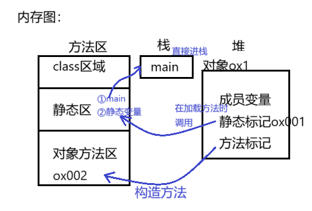
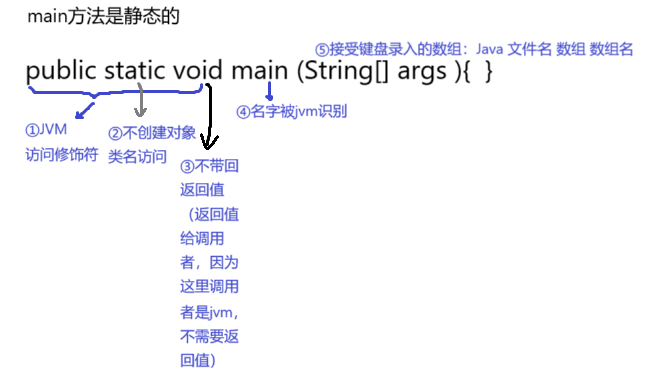

# 【Java】Java语言基础（二）


## 一、基础部分

### 1. 关键字keyword

全是小写，能被虚拟机识别。`goto` 和 `const`  是保留字（现在保留，可能会成为关键字）。

### 2.标识符

作用：起名字。

组成：`$` `_` `数字` `英文大小写`  （不能以数字开头）

常见的命名规则：

1. 见名知意
2. 包：其实就是文件夹，用于把相同的类名进行区分
   - 单级包（全部小写）：wangty
   - 多级包（用`.`隔开）：cn.wangty   --指cn包下的wangty包
3. 类/接口
   - 一个单词组成，首字母大写：Student、Dog
   - 多个单词组成，大驼峰：HelloWorld
4. 方法/变量
   - 一个单词，首字母小写：main方法、name变量
   - 多个单词，小驼峰：studentAge
5. 常量
   - 一个单词，全部大写：PI 圆周率
   - 多个单词，全部大写，以`_` 隔开：STUDENT_MAX_AGE



类：为java基本底层，一切以其为开始，`{ }`中可以写：结构定义语句、功能执行语句



### 3.注释

用于解释说明程序，调试排错

- 单行注释：`//`
- 多行注释：`/*   */`  （不能嵌套使用）
- 文档注释：`/**   */`  （被javadoc工具解析，生成一个说明书，面向对象部分讲解）

### 4.常量

执行过程中，其值不可发生改变。

使用`final`关键字申明（前端一般使用`const`申明），只能进行一次赋值

- 字面值常量
  1. 字符串常量：双引号括起来的内容，例： `"Hello"`
  2. 整数常量：所有整数，例：`100`
  3. 小数常量：所有小数，例：`0.11111`
  4. 字符常量：单引号括起来的内容，例：`'A'`
  5. 布尔常量：真/假，例：`true` `false`
  6. 空常量：`null`
- 自定义常量

​    

### 5.进制

#### 1) 定义

表示进位的方式。（X进制：逢x进一）

计算机的电子原件状态：`开/关` ，用数字`1/0` 表示

表达数据的时候，国际化标准组织规定，用8个这样的信号来表示一个数据，单位为**字节**

- ob开头：2进制
- o开头：8进制
- ox开头：16进制

​    

#### 2) 进制转换

##### X → 10

**进制的转换**：（任意进制 → 十进制）

1. 系数：每一个位上的数值本身，成为系数
2. 基数：X进制，基数为X
3. 权：从右开始，以0开始编号，即为该位上权值


示例：2进制 转 10进制


示例：8进制 转 10进制


示例：16进制 转 10进制


##### 8421码

**8421码**：用于2进制与10进制的快速转换

|  2   |  1   |  1   |  1   |  1   |  1   |  1   |  1   |  1   |
| :--: | :--: | :--: | :--: | :--: | :--: | :--: | :--: | :--: |
|  10  | 128  |  64  |  32  |  16  |  8   |  4   |  2   |  1   |

示例：2进制 转 10进制

将不同权位上为1的，对应位置上的数值相加


示例：10进制 转 2进制

左添0，从高位寻起，有则为1；相减，无则为0。去掉左0，添ob标识

|  10  | 100  | 100  |  36  |  4   |  4   |  4   |  0   |  0   |
| :--: | :--: | :--: | :--: | :--: | :--: | :--: | :--: | :--: |
|  10  | 128  |  64  |  32  |  16  |  8   |  4   |  2   |  1   |
|  2   |  0   |  1   |  1   |  0   |  0   |  1   |  0   |  0   |


##### 10 → X

**进制的转换**：（十进制 → 任意进制）

商为0时结束，倒写余数。**除基取余，直到商为0，余数反转。**

示例：10进制 转 2进制


示例：10进制 转 8进制


示例：10进制 转 16进制


##### X → Y

**任意进制之间转换**：（X → Y）

以10进制做桥梁，X → 10，10 → Y 

​    

### 6.有符号数据表示法

在计算机内，有符号数有3中表示法：**原码、补码、反码**

在计算机操作的时候，都是采用数据对应的二进制补码来计算的。

**原码**：二进制定点表示法，最高位为符号位，`"0"`表示正，`"1"`表示负，其余表数值的大小

示例：`±7`。首先得到7的二进制为`111`

| 原码 | 符号位 |   数值位    |                     |
| :--: | :----: | :---------: | :-----------------: |
|  +7  |   0    | **0000**111 | 总共8为，不为1的补0 |
|  -7  |   1    |   0000111   | 总共8为，不为1的补0 |

**反码**：正数的反码与其原码相同。负数的反码，对其原码逐为取反，但符号位除外。

| 反码 | 符号位 |   数值位    |          |
| :--: | :----: | :---------: | :------: |
|  +7  |   0    |   0000111   |          |
|  -7  |   1    | **1111**000 | 对应取反 |

**补码**：正数的补码与其原码相同。负数的补码，是在反码的基础上加1

| 反码 | 符号位 |   数值位    |                        |
| :--: | :----: | :---------: | :--------------------: |
|  +7  |   0    |   0000111   |                        |
|  -7  |   1    | 111100**1** | 加在尾部，若要进位则进 |

 

**2个练习加深印象**：

1. 已知X的原码10110100B，求补/反码
   - 第一个符号位，为1，该数为负数
   - 原码B表示二进制
   - 反码：0 1001011
   - 补码：0 1001100 （注意进位）
2. 已知X补码11101110B，求原码
   - 补码减1，注意借位，不够往前借
   - 补码：1 1101110
   - 反码：1 1101101
   - 原码：1 0010010

  

### 7.变量

内存中的一小块区域。

```java
//强制转换
byte c = (byte)(a+b)
```

- 变量相加：先提升数据，再计算运行
- 常量相加：先计算结果（调试、编译），再赋值。再检测数据类型范围，超出则报错

```java
//示例：
byte b1 = 3;
byte b2 = 4;
byte b;

//byte的范围 -128 ~ 127
b = b1 + b2   //报错,数据提升。（先提升成int 3，int4，才会进行相加赋值 7是int）
b = 3 + 4     //b = 7 （7是byte）
    
//'a' = 97
//'A' = 65
//'o' = 48   
```

- 字符串相加：其`+`表示为连接符。结果为：字符串
- 数值相加：其`+`表示为运算符。结果为：计算结果

```java
//示例
'a' + 1 + 'hello'  //98hello
'hello' + 'a' + '1' //helloa1    
```

- 定义Long类型变量，`1L`。
- 定义Float类型变量，`1f`。
- 整数默认为int，浮点默认为Double
- byte、short在定义时，他们接受的其实是一个int类型的值。（做了一个数据检测，如果不再它们的范围内，就报错）
- byte值的问题

```java
//byte的范围 -128 ~ 127
byte b1 = 127;
byte b2 = (byte) 128;  //-128
byte b3 = (byte) 129;  //-127
byte b4 = (byte) 130;  //-126

//128:10000000
//-128: 10000000 这里1既是符号位，也是数值位，这里的0为负0
```

### 8.默认类型转换

char(2)、byte(1)、short(2) → int(4) → long(8) → float(4) → double

**为什么 '8字节' 可以转换为 '4字节'？**

- long：8字节，整数存储

- float：4字节，浮点型存储

- 它们底层的存储类型不同，float类型在计算机中只使用4个字节存储，遵循IEEE-754格式标准。一个浮点数有两个部分构成：

  - 底数m：以二进制数表示词浮点数的实际值，占24bit，高位始终为1。

  - 指数e：占用8bit的二进制数，范围0-255。有±，减127才是真正的指数

  - 例如：

    `17.625`存储

    1. 二进制：10001.101
    2. 整数部分：除以2，商为0，余数反转。（10001.101）
    3. 小数部分：乘以2，乘位为0，进位顺序取（1.0001101高位恒为1）
    4. 右移至小数点前只有1位，2→3，需移动4位，指数加127 = 4 + 127=131
    5. 131二进制：10000011

    结果为：0 1000001 10001101  00000000    00000000

    | 符号位 |   指数   |  底数   |       |
    | :----: | :------: | :-----: | :---: |
    |   0    | 10000011 | 0001101 | 0...0 |

- float表示的数据范围比long大

  证明：

  

- char能存一个中文字符，一个字符2个字节。java语言采用Unicode编码。

​    

### 9.运算符

#### 1) 算术运算符（Operator）

`+`、`-`、`×`、`÷`、`%`、`++`、`--`

**例一**：a = 10； b = 10 ；c = 10；

```java
a = b++;   //a = 10； b = 11 ；c = 10
c = --a;   //a = 9；  b = 11 ；c = 9
b = ++a;   //a = 10； b = 10 ；c = 9
c = c--;   //a = 9；  b = 10 ；c = 8

//在前，先++/--，再赋值
//在后，先赋值，再++/--
```

**例二**：x = 4

```java
y = (x++) + (++x) + (x*10);    //x = 6;y = 70
//   4       6       60
//  x = 5   x = 6
```

​      

#### 2）赋值运算符

`=`、`+=`、`-=`、`*=`、`/=`、`%=`

**例一**：short s = 1；

```java
s = s + 1;    //short 参加运算，提升为int，可能损失精度
s += 1;       //s为short

//拓展的赋值运算符其实隐含了一个强制类型转换
/*  s += 1; 
<≠> s = s + 1; 
<=> s =(short) s + 1;
*/
```

​     

#### 3）比较运算符（关系运算符）

`<`、`>`、`<=`、`>=`、`!=`、`==`、`instanceof`

结果都是boolean类型，只要有一个满足条件就可以

​     

#### 4）逻辑运算符

- `&` 与 ：同真为真
- `|` 或 ：同假为假
- `^` 异或：同名为假，异名为真
- `!` 非 ：取反
- `&&` 短路与 ：左假右不管
- `||` 短路或 ：左真右不算

左右必须都是布尔型表达式。

​     

#### 5）位运算符（2进制）

- `<<`  扩大，正数补0，负数补1
- `>>`  缩小，正数补0，负数补1
- `&`、`|`、`^`  当两边为数据做的是“位运算”，两边为表达式做的是“逻辑运算”
- `~`、
- `>>>`  无符号右移，全补0

**例一**：某一个数据对另一个数据位异或两次，数据不变

```java
//可以用来加密
a^b^b = a
a^b^a = b
```

**例二**：将两个变量所携带的整数进行交换。a换成b，b换成a

```java
//方法一：
a = a^b;
b = a^b;   //b = a^b^b = a;
a = a^b;   //a = a^b^a = b;
```

```java
//方法二：
a = a+b;   //a =30;
b = a-b;   //b = 10, b = (a+b)-b = a;
a = a-b;   //a = 20, a = (a+b)-a = b;
```

```java
//方法三：
c = a;
a = b;
b = c;
```

```java
//方法四：
b = (a+b)-(a=b)
    
//等价于
a = b;
b = (a+b)-b = a;
```

### 10.键盘录入数据（Scanner）

1. 导包

   ```java
   import java.util.Scanner;
   ```

2. 创建键盘录入对象

   ```java
   Scanner sc = new Scanner(System.in);
   ```

3. 通过对象获取数据

   ```java
      int x = sc.nextInt();  //键盘录入 整数值
   String s = sc.nextLine(); //键盘录入 字符串
   ```

**例一**：

```java
import java.util.Scanner;

public class ScannerDemo {
    public static void main(String[] args) {
        Scanner sc = new Scanner(System.in);
        System.out.println("请输入：");
        int x = sc.nextInt();
        System.out.println("你输入的是："+x);
    }
}
```

​      

### 11.流程控制语句

#### 1）顺序结构

```java
// 顺序结构示例  
System.out.println("程序开始");  

// 变量赋值  
int a = 10;  
int b = 20;  

// 计算和  
int sum = a + b;  

// 输出结果  
System.out.println("a 和 b 的和是: " + sum);  

System.out.println("程序结束");  
```

#### 2）选择结构（if/switch）

```java
if(比较表达式){
    语句体
}else{
    语句体
}
```

```java
switch(表达式){
	case 值1 :语句体1;
			  break;
	 default :语句体n+1;
			  break; 
}

/*
1、case后面，只能是常量，不能是变量，且多个case后的值不能相同
2、default可以省略，不建议
3、break可以省略吗？可以（最后一个）
4、default一定要在最后面吗？可以在任意位置
*/
```

**if/switch的区分**：

- Boolean用if
- 1000上万数据用if
- 小数范围用if
- 针对几个常量值情况用switch

#### 3）循环结构（for/do-while）

##### for循环语句

```java
for(初始化语句;判断条件语句;变量变化){
	循环语句体
}
```

**例一**：输出1~10

```java
for(int x=1;x<=10;x++){
	System.out.println(x);
}
```

**例二**：求1~10的数据和

```java
int sum = 0;
for(int x=1;x<=10;x++){
    sum += x;
}
System.out.println(sum);
```

**例三**：求1~100之间的偶数和

```java
/**
思路：1~100之和为5050
1~100奇/偶对半各50
偶比奇大1，总共多50
（5050-50）÷ 2 +50 = 偶数和
*/

//方法一：
int sum = 0;
for(int x=1;x<=100;x++){
    if(x%2 == 0){
        sum += x;
    }
}
System.out.println(sum);

//方法二：
//从0开始，自增2位
int sum = 0;
for(int x=0;x<=100;x+=2){
    sum += x;
}
System.out.println(sum);
```

**例四**：求5的阶乘

```java
//阶乘：n! = n*(n-1)! = n*(n-1)*(n-2)*...*1
int sum = 1;
for(int x=1;x<=5;x++){
    sum *= x;
}
System.out.println(sum);
```

**例五**：水仙花数（求所有水仙花数）

```java
//水仙花数：一个三位数，即各位数字的立方和等于该数本身。
//例如：153 = 1^3+5^3+3^3 = 153
for(int x=100;x<1000;x++){
    int ge = x%10;        //获取个位数
    int shi = x/10%10;    //获取十位数
    int bai = x/10/10%10; //获取百位数
    if(x == (ge*ge*ge + shi*shi*shi +bai*bai*bai)){
        System.out.println(x);
    }
}
```

##### while循环语句

可以与for循环等价转换

```java
while(判断条件语句){
    循环体语句
}
```

**例一**：按照for语句，交换各项位置

```java
for(int x=0;x<10;x++){
	System.out.println("hello");
}

//等价于
int x = 0;
while(x<10){
    System.out.println("hello");
    x++;
}

/*
while的初始化在外面，x为全局变量
for的x为局部变量
当循环，有范围时，用for；无明确范围时，用while
*/
```

##### do-while循环语句

```java
do{
    循环语句
}while(判断条件句)
```

```java
//对应上方for循环
int x = 0;
do{
   System.out.println("hello");
    x++; 
}while(x<10)
```



**三种循环的区别**：

1. do-while至少执行一次循环体
2. while、for必须判断条件再循环（只有这一个区别）

**死循环**：

`ctrl+c` 强制停止循环。一定注意造成死循环是因为没有写条件控制



​     

### 12.跳转控制语句

#### 1）break中断

break使用场景（离开下面两个场景，无意义）

- switch语句中
- 循环语句中

```java
//嵌套for中，只跳出一层
//使用“标签名：语句” - 跳出目标层
wc:for(...){
	nc:for(...){
        if(){break wc;} //中断外+内层
		if(){break nc;} //中断内层
    }
}
```


#### 2）continue继续

使用场景，for循环中。（离开此场景无意义）

跳出本次循环，进入下一循环体

（0,1,2,跳出，4,5,6...）

​     

#### 3）return返回

使用场景，结束一个方法，跳转到上层调的方法

**方法的注意事项：**

1. 方法不调用不执行
2. 方法与方法是平级关系，不能嵌套定义
3. 方法定义的时候参数之间用逗号隔开
4. 方法调用时不用在传递数据类型
5. 如有明确返回值，一定要return

​     

## 二、核心部分

### 1.方法（函数）

方法定义在一个类中，完成特定功能的代码块。

```java
修饰符 返回类型 方法名(参数类型 参数名){
	函数体;
	return 返回值;
}

/*
写一个方法（两个明确）
1、返回值类型：结果的数据类型
2、参数列表：传递几个、每个的数据类型
*/
```

**参数**：

- 实参：实际参与运算的
- 形参：形式上定义的，用来接受实际参数的

**return**：结束方法

**返回值**：就是功能的结果，由return带回给调用者

**例一**：求2个数的和

```java
//方法不调用不会自动运行
public static int Sum(int a,int b) {
    int c = a+b;
    return c;
}
```

**特例**：main方法，在Java虚拟机处调用，所以不用认为调用，依然可以运行

```java
public static void main(String[] args) {....}
```

**方法的调用方式**：

```java
//单独调用
Sum(a,b);
```

```java
//输出调用
System.out.println(Sum(a,b));
```

```java
//赋值调用
int result = Sum(a,b);
```

**void方法调用**：只适用于第一种"单独调用"

​      

### 2.重载

方法的功能相同，参数列表不同，java允许它们起相同的名字。

参数列表不同：

- 参数个数不同
- 参数数据类型不同

通过参数个数识别，不同的方法。JVM会根据不同的参数，去调用不同的方法。

```java
//原方法
public static int Sum(int a,int b) {}
//重载入参个数
public static int Sum(int a,int b,int c) {}
//重载入参类型
public static float Sum(float a,float b) {}
```

​      

### 3.数组

#### 1）定义

数组是用于存储多个变量(元素)的容器，这多个元素的数据类型相同。

```java
数据类型[] 数组名     //常用
数据类型  数组名[]    
```

数组定义后，没有值，需要初始化

```java
int[] arr = new int[3];

//int[] arr：看成一个变量，变量需要初始化才能使用
//new：为数组分配内存空间。之后看见的所有的new都是分配内存空间的
//int[3]：数组长度，动态初始化
```

#### 2）初始化

**初始化**：开辟内存空间，并赋值

- 静态初始化：给定元素数值，长度系统定
- 动态初始化：给定系统长度，由系统分配初始值（默认为0）

```java
//动态初始化格式
数据类型[] 数组名 = new 数据类型[数组长度]    
```

```java
//静态初始化格式
数据类型[] 数组名 = new 数据类型[元素1,元素2,...]  
```

**注意：不要同时使用动/静态初始化。**

使用`System.out.println(arr)` 输出数组arr，显示数组的**地址值**

用数组名和索引相结合，可以获取数组中指定编号的元素。格式：**数组名[索引值]**。

#### 3）栈和堆的区别



Java中的**内存分配**以及**栈**和**堆**的区别：

为了提高运算效率，对**内存空间**进行了**不同区域**的划分

- **栈**：存"基本类型变量"和"引用变量"
- **不同区域**：有特定的“处理数据方式"和"内存管理方式"

**5个内存空间**：

1. 栈（存储局部变量：方法定义上、方法申明上）
2. 堆（存储new出来的东西 + 数组）
3. 方法区
4. 本地方法区（和系统有关）
5. 寄存器（给CPU使用）

**堆内存的特点**：

1. 每一个new出来的东西都有地址值
2. 每个变量都有默认值
   - byte、short、int、long → 0
   - float、double → 0.0
   - char → '\u0000' （空字符）
   - boolean → false
   - 引用类型 → null
3. 使用完毕后，就变成垃圾，但是并没有立即收回，在垃圾回收器空间的时候回收。

**栈内存的特点**：

1. 用完即释放（数据脱离其作用域）

**图解**：




#### 4）报错问题

**数组操作（越界/空指针）问题**：

`ArrayIndexOutOfBoundsException` 数组索引越界异常：原因你访问了不存在的索引。

`NullPointerException` 空指针异常：原因数组已经不指向堆内存了，但你使用数组名访问了元素。

图解：


**数组操作（遍历）**：

依次输出数组中每一个元素。

```java
//每个元素只有索引值不同
//遍历：用循环改变索引即可
for(int x=0;x<10;x++){
    System.out.println(arr[x]);
}
```

####  5）数组长度length

数组元素不可数时，用属性`length`，专门获取数组的长度。

```java
数组名.length;
```

#### 6）遍历多个数组

写一个通用方法：返回值void，参数列表int []arr。

依次以数组作为入参

```java
public static void printArray(int []arr){
    for(int x=0;x<arr.length;x++){
        System.out.println(arr[x]);
    }
}

//多个数组依次调用该通用方法
public static void main(String[] args) {
    int []arr1 = .....;
    int []arr2 = .....;
    
	printArray(arr1);
    printArray(arr2);
}
```

#### 7）数组操作（最值）

最值获取 - 最大值获取

```java
int []arr = {1,2,3,4,5}

/*
分析：
1、从数组中，任意找一个元素作为参考（一般取第一个，先默认其最大）
2、遍历其他元素，依次取来与之比较，大于则留下，小的就忽略
3、遍历完成，最后剩下的即是最大值
*/
int max = arr[0];
for(int i=1;i<arr.length;i++){
    if(arr[i]>max){
        max = arr[i];
    }
}
System.out.println(max);
```

写成通用方法：

```java
public static int getArrayMax(int []arr){
	int max = arr[0];
    for(int i=1;i<arr.length;i++){
        if(arr[i]>max){
            max = arr[i];
        }
    }
    return max;
}

//调用该通用方法
public static void main(String[] args) {
    int []arr1 = .....;
    
    int MAX = getArrayMax(arr1);
}
```

#### 8）数组操作（逆序）

```java
/*
分析：
1、把0索引与arr.length-1交换
2、把1索引与arr.length-2交换
...
3、奇一半、偶中间，做到一半arr.length/2时，完成了所有交换
*/

//方法一：
public static void reverse(int []arr){
    for(int x=0;x<arr.length/2;x++){
        int temp = arr[x];
        arr[x] = arr[arr.length-1-x];
        arr[arr.length-1-x] = temp;
    }
}

//方法二：
public static void reverse(int []arr){
    for(int start=0,end=arr.length-1;start<=end;start++,end--){
        int temp = arr[start];
        arr[start] = arr[end];
        arr[end] = temp;
    }
}
```

#### 9）数组操作（查找）

```java
/*
按照索引，查找对应元素

分析：
1、遍历数组
2、和已知数相等
3、返回索引值
*/

//方法一：
public static int getIndex(int []arr,int value){
    for(int i=0;i<arr.length;i++){
        if(value == arr[i]){
           return i;
        }
    }
    return -1; //找不到返回-1
}

/*
分析：
1、定义索引
2、遍历数组
3、查到第一个相同，修改索引值
*/
//方法二：
public static int getIndex(int []arr,int value){
    int index = -1;
    for(int i=0;i<arr.length;i++){
        if(value == arr[i]){
          index = i; //找到即修改
            System.out.println(index);
            break; //找到则不再继续
        }
    }
}
```

### 4.二维数组

#### 1）定义

"一个元素为一维数组"的数组

```java
数据类型 [][]数组名 = new 数据类型[m][n]
数据类型 数组名[][] = new 数据类型[m][n]
数据类型[] 数组名[] = new 数据类型[m][n]
    
//m：表示多少个“一维数组”
//n：表示“一维数组”中有多少个元素
//arr[m][n]：表示获取第m+1个一维数组的第n+1个元素。   
//int x,y：定义两个变量
//int []x,y[]：定义一维数组x，二维数组y    
```

**内存存储方式图例**：


**二维数组元素分布图例**：



####  2）二维数组遍历

```java
/*
分析：
1、arr[0]为第1个数组
2、依次循环改进
3、arr.length在二维数组中，表示一维数组个数
*/
public static void getArrays(int [][]arr){
    for(int x=0;x<arr.length;x++){
        for(int y=0;y<arr[x].length;y++){
        	System.out.println(arr[x][y]);
    	}
    }
}
```

#### 3）二维数组求和

```java
//遍历，累加所有元素，改上的输出为计算sum+=arr[x][y]
public static void arraysAdd(int [][]arr){
    for(int x=0;x<arr.length;x++){
        for(int y=0;y<arr[x].length;y++){
        	sum+=arr[x][y]
    	}
    }
}
```

#### 4）输出杨辉三角形

```java
/*
分析：
杨辉三角形格式：
1
1  1
1  2  1
1  3  3  1
1  4  6  4  1
1  5  10 10 5  1
行数可以手动改输入
任何一行的第一列和最后一列都是1
从第三行开始，每一个数据是它上一行的前一列与本列之和
*/
import java.util.Scanner;  

public class YangHuiTriangle {  
    public static void main(String[] args) {  
        Scanner scanner = new Scanner(System.in);  
        System.out.print("请输入杨辉三角形的行数: ");  
        int numRows = scanner.nextInt();  
        
        int[][] triangle = new int[numRows][];  
        
        for (int i = 0; i < numRows; i++) {  
            triangle[i] = new int[i + 1]; // 每行的元素数量  
        
            // 第一个和最后一个元素为1  
            triangle[i][0] = 1;  
            triangle[i][i] = 1;  

            // 计算中间的元素  
            for (int j = 1; j < i; j++) {  
                triangle[i][j] = triangle[i - 1][j - 1] + triangle[i - 1][j];  
            }  
        }  

        // 打印杨辉三角形  
        for (int i = 0; i < numRows; i++) {  
            for (int j = 0; j <= i; j++) {  
                System.out.print(triangle[i][j] + " ");  
            }  
            System.out.println();  
        }  

        scanner.close();  
    }  
}
```


### 5.面向对象

- 面向过程：强调每一个功能的步骤
- 面向对象：强调对象方法功能
  1. 创建对象
  2. 使用对象
  3. 指挥对象做事情
  4. 管理维护对象之间的关系
  5. 特征（继承、封装、多态）
     - 把构成问题的事物，分成多个独立的对象；
     - 通过调用对象的方法，来解决问题
- UML统一建模语言



错误提示：`Invalid character` 无效字符：【原因】英文符号打成中文符号



**Java中参数传递值（传值）及引用（传地址）在内存中的分布图例**：



### 6.类及对象

- 类：是一组相关的属性和行为的集合，是一个抽象的概念。

- 对象：是该事物的具体表现形式，是具体存在的

- 现实中对事物的描述：
  - 学生：
    - 属性：该事物的描述信息 =>姓名、年龄、性别
    - 行为：该事物能够做什么 =>学习、吃饭、睡觉
  
- 编程模拟现实事物，以Java最基本单位"类"体现出来。

  

#### 1）定义

- 成员变量：定义同前，(位置)类中方法外
- 成员方法：没有static、暂时不写

- 格式

  ```java
  class 类名{
      //定义变量
      数据类型 变量名 初始化
      //定义方法
      修饰符 返回值 方法名(){ 方法体 }
  }
  ```

  

#### 2）使用

1. 在一个java文件中，写两个类：一个基本类、一个测试类
2. 创建对象使用，`类名 对象名 = new 类名();`
3. 使用：
   - 成员变量：`对象名.变量名`
   - 成员方法：`对象名.方法名`

#### 3)一个对象的内存图

java中没有索引，只有引用，且不对引用进行操作

（两）三个对象的内存图，大体一致，注意不同对象的变量的空间方法调用



#### 4）成员变量 & 局部变量（区别）

- 所处位置不同
  - 类中方法外
  - 方法内或者方法声明上
- 内存中位置不同
  - 堆内存
  - 栈内存
- 生命周期不同
  - 随着对象的存在而存在
  - 随着方法的调用而存在，随着方法的调用完毕而消失
- 初始化值不同
  - 有默认初始值
  - 没有初始值，需要定义，被赋值才可使用

同一方法中，局部变量 可以与 成员变量同名，且默认访问的是局部变量。要想访问成员变量，使用`this`关键字。格式：`this.成员变量名`

**C++中，面向过程的程序设计**：

1. 分解出解决问题所需要的步骤
2. 用函数将这些步骤实现
3. 使用时依次调用就可以了

#### 5）匿名对象（没有名字的对象）

```java
new Student(); //匿名对象

//调用方式 - 只能调用一次
匿名对象.方法名
```

```java
//举例
//一个学生对象
public class Student{
    //查看学生信息方法
    public void Show(){...}
}

//实名对象调用
Student s = new Student();
s.Show();
s.Show(); //同一个对象两次调用Show方法

//匿名对象调用
new Student().Show();
new Student().Show();//重新创建了一个新的对象，调用完毕，匿名对象为垃圾

//回收垃圾
java.lang.System.gc();
```

#### 6）形式参数（2种类型）

1. 基本类型：形参的改变，不影响实际参数
2. 引用类型：形参的改变，直接影响实际参数

【注】：方法的形式参数是类名（引用类型）的时候如何调用？

```java
//一个学生对象
public class Student{
    //查看学生信息方法
    public void Show(){...}
}

//一个新的对象
public class StudentDemo{
    //以学生对象为形式参数的方法
    public void method(Student s){
        s.Show();
    }
}

//调用引用类型为参数的类方法，需要传实参对象的地址值
Student s = new Student();
StudentDemo ss = new StudentDemo();
ss.method(s);
```

#### 7）创建对象详解

创建对象做了哪些事情？`Student s  = new Student();`

1. 把`Student.class`文件加载到内存
2. 在栈内存给s变量开辟一个空间
3. 在堆内存为学生对象申请一个空间
4. 给成员变量进行默认初始化（null/0）
5. 给成员变量进行显示初始化
6. 通过构造方法给成员变量进行初始化
7. 把堆内存地址赋值给s内存变量
8. 

### 7.封装

Java中的封装（Encapsulation）是一种**面向对象编**程的核心概念，它指的是将**对象的状态（数据）**和**对状态的操作（方法）**封装在一起，从而保护对象的内部状态不被外部代码直接访问和修改。这种机制提高了数据的安全性，使得对象的行为更加可靠。

封装通过以下几个方面实现：

1. **访问修饰符**：Java提供了四种主要的访问修饰符（public、protected、default、private），用来控制类、方法和变量的可见性。

   - `private`：仅在**本类**中可访问。
   - `default`（没有修饰符）：在**同一包内**可访问
   - `protected`：在**同一包内以及子类**中可访问。
   - `public`：在任何地方可访问。

   范围：从上到下，依次变大

   有public的源文件，文件名必须与public修饰的类名相同（必须）

2. **Getter和Setter**：通过公共的方法来获取和设置私有变量的值。这种方式使得可以在设置或获取值时添加额外的逻辑，例如验证输入值。

   ```java
   public class Person {  
       private String name;  // 私有变量  
   
       // Getter方法  
       public String getName() {  
           return name;  
       }  
   
       // Setter方法  
       public void setName(String name) {  
           this.name = name;  
       }  
   }
   ```

   this随对象存在，哪个对象调用方法，则this指向内存中的该对象堆

3. **改变内部实现而不影响外部**：封装允许我们改变类的内部实现，只要保持接口不变，外部代码就不需要做任何修改。这提高了代码的灵活性和可维护性。

4. **数据保护**：通过限制对对象内部状态的直接访问，封装能防止对象进入不一致的状态。例如，可以在Setter方法中添加条件检查，从而确保只有有效的数据才能赋值。

### 8.构造方法

在Java中，构造方法（Constructor）是一种特殊的方法，**用于**在创建对象时**初始化**该对象的状态。构造方法的特点包括：

1. **与类同名**：构造方法的名称必须与类名完全相同。
2. **没有返回类型**：构造方法不返回任何类型，连`void`也没有。
3. **可以重载**：一个类可以有多个构造方法，称为构造方法重载。通过不同的参数列表来区分。
4. **自动调用**：构造方法在对象创建时自动调用。

#### 1）构造方法的基本示例

以下是一个简单的示例，展示了构造方法的用法：

```java
public class Car {  
    private String model;  
    private int year;  

    // 默认构造方法  
    public Car() {  
        model = "Unknown";  
        year = 2020;  
    }  

    // 带参数的构造方法  
    public Car(String model, int year) {  
        this.model = model;  
        this.year = year;  
    }  

    public void displayInfo() {  
        System.out.println("Model: " + model + ", Year: " + year);  
    }  

    public static void main(String[] args) {  
        // 使用默认构造方法  
        Car car1 = new Car();  
        car1.displayInfo();  // 输出: Model: Unknown, Year: 2020  

        // 使用带参数的构造方法  
        Car car2 = new Car("Toyota", 2021);  
        car2.displayInfo();  // 输出: Model: Toyota, Year: 2021  
    }  
}
```

#### 2）构造方法的类型

1. **默认构造方法**：**如果**类**没有定义**任何构造方法，**Java会自动提供**一个无参的默认构造方法。它会初始化对象的字段为默认值（如数值为0，布尔为false，引用对象为null）。
2. **参数化构造方法**：用户可以定义构造方法，接受参数以初始化对象的状态。

##### 注意事项

- 如果我们给了构造方法，不管是否有参，系统都不再提供
- 构造方法被私有以后，外界就不能创建对象
- 构造方法不能被`static`修饰，也不能被`final`或`abstract`修饰。
- 在一个构造方法中，可以使用`this`关键字来调用同一类中的其他构造方法，实现构造方法重载。例子参考下面。

#### 3）关键字 `this`

在构造方法中，常常使用`this`关键字来区分实例变量和参数变量。例如：

```java
public Car(String model, int year) {  
    this.model = model;  // this.model指的是类的实例变量  
    this.year = year;    // model和year是构造方法的参数  
}
//这个示例展示了如何使用构造方法来正确初始化对象的属性。
```

### 9.static关键字的引入

#### 1）定义及特点

针对多个对象有共同的这样的成员变量值的时候，Java提供`static`关键字来修饰。

- 随着类的加载而加载【可以修饰成员变量和方法】
- 优先于对象存在
- 对象共享【如果某个成员变量被所有对象所共享时，用静态修饰】
- 可以通过类名调用【**特殊的：main方法**。被`类名.main`虚拟机调用。其实它本身也可以通过对象名调用，静态修饰的内容一般我们称其为：与类相关的类成员】
- 被static修饰的，内存位置全部移动；
- 
- 在静态方法中没有`this`关键字：静态是随着类的加载而加载，this是随着对象的创建而存在。静态优先于内存中比对象先存在。
- 静态方法只能访问静态的成员方法/变量。

#### 2）特点示例

在Java中，`static`关键字用于**声明类的静态成员**（字段和方法）。静态成员属于类本身，而不是类的实例（对象）。这意味着你可以在没有类实例（对象）的情况下访问静态成员。以下是`static`关键字的几个主要用法和特性：

1. **静态变量（字段）**：

   - 静态变量是属于类的**共享变量**，而不是某个特定对象的实例变量。所有对象共享同一个静态变量。

   - 例子：

     ```java
     class MyClass {  
         static int staticCount = 0; // 静态变量  
     
         MyClass() {  
             staticCount++;  
         }  
     }  
     ```

2. **静态方法**：

   - 静态方法可以直接**通过类名调用**，而无需创建类的实例。静态方法只能访问静态变量，无法直接访问实例变量（非静态变量）。

   - 例子：

     ```java
     class MyClass {  
         static void staticMethod() {  
             System.out.println("This is a static method.");  
         }  
     }  
     
     // 调用静态方法  
     MyClass.staticMethod();  
     ```

3. **静态块**：

   - 静态初始化块用于初始化静态变量或执行某些一次性操作。它在**类被加载时执行**。

   - 例子：

     ```java
     class MyClass {  
         static int staticVar;  
     
         static {  
             staticVar = 42; // 静态块  
         }  
     }  
     ```

4. **静态内部类**：

   - 静态内部类属于外部类，可以直接访问外部类的静态成员，但不能访问非静态成员。

   - 例子：

     ```java
     class Outer {  
         static int outerStaticVar = 5;  
     
         static class Inner {  
             void display() {  
                 System.out.println("Outer static var: " + outerStaticVar);  
             }  
         }  
     }  
     ```

5. **静态导入**：

   - Java允许通过静态导入语句直接使用类中的静态成员，简化代码。

   - 例子：

     ```java
     import static java.lang.Math.*;  
     
     double result = sqrt(25); // 直接使用sqrt()方法  
     ```

`static`关键字在Java中提供了一种方便的方式来管理类级别的属性和行为，使得代码更加简洁和高效。

#### 3）main方法详解




#### 4）静态变量/成员变量区别

|          |            静态变量            |            成员变量            |
| :------: | :----------------------------: | :----------------------------: |
|   所属   |          类（类变量）          |        对象（对象变量）        |
| 内存位置 |        方法区中的静态区        |               堆               |
| 出现时间 | 类加载时出现<br />类消失时释放 | 对象产生出现<br />对象消失释放 |
|   调用   |       类.xx<br />对象.xx       |            对象.xx             |

### 10.递归

递归是指在一个方法内部，直接或间接**调用自身**的过程。它通常用于解决可以被分解成相似子问题的问题，适合处理那些具有重叠子问题和最优子结构特性的场景。递归的关键概念包括**基准情况**和**递归情况**。

#### 1）递归基本结构

1. **基准情况**：这是递归的终止条件，防止无限调用自身。
2. **递归调用**：在基准情况未满足时，方法会调用自身来解决更小的子问题。

#### 2）递归的例子

最常见的递归示例是计算阶乘（Factorial）和斐波那契数列（Fibonacci sequence）。

##### 1. 计算阶乘

阶乘是一个非负整数的乘积，表示为 `n!`，可以定义为：

- `0! = 1`
- `n! = n * (n - 1)!`

Java实现：

```java
public class Factorial {  
    public static int factorial(int n) {  
        // 基准情况  
        if (n == 0) {  
            return 1;  
        }  
        // 递归情况  
        return n * factorial(n - 1);  
    }  

    public static void main(String[] args) {  
        int number = 5;  
        System.out.println("Factorial of " + number + " is: " + factorial(number));  
    }  
}
```

##### 2. 斐波那契数列

斐波那契数列定义为：

- `F(0) = 0`
- `F(1) = 1`
- `F(n) = F(n - 1) + F(n - 2)`（n ≥ 2）

Java实现：

```java
public class Fibonacci {  
    public static int fibonacci(int n) {  
        // 基准情况  
        if (n == 0) {  
            return 0;  
        } else if (n == 1) {  
            return 1;  
        }  
        // 递归情况  
        return fibonacci(n - 1) + fibonacci(n - 2);  
    }  

    public static void main(String[] args) {  
        int number = 6;  
        System.out.println("Fibonacci of " + number + " is: " + fibonacci(number));  
    }  
}
```

#### 3）递归的优缺点

##### 优点：

- **简洁**：递归可以显著简化一些复杂问题的代码。
- **自然表达**：能更自然地表达一些问题的解决方案，如树结构的遍历。

##### 缺点：

- **效率**：递归方法可能效率较低，尤其是在调用深度较大或存在重叠子问题时，可能导致大量重复计算（例如斐波那契数列的简单递归）。
- **栈溢出**：递归深度过大可能导致栈溢出错误（StackOverflowError）。

### 11.继承

在Java中，继承是面向对象编程的一个重要概念，它允许一个类（子类）继承另一个类（父类）的属性（字段）和方法（行为）。通过继承，子类能够重用父类的代码，同时还可以扩展或修改父类的功能。继承有助于代码重用和组织，便于维护和扩展。

#### 1）继承的基本概念

1. **父类（超级类）和子类**：

   - **父类**（或基类）是被继承的类。
   - **子类**（或派生类）是继承父类的类。

2. **`extends` 关键字**：用于表明一个类是从另一个类继承的，例如：

   ```java
   class Parent {  
       // 父类属性和方法  
   }  
   
   class Child extends Parent {  
       // 子类中的属性和方法  
   }  
   ```

3. **单继承**：Java不支持多重继承，即一个类只能有一个直接父类。子类可以实现多个接口，但只能继承一个类。

#### 2）继承的特点

1. **属性和方法的继承**：子类可以直接访问父类的公共属性和方法，也可以通过`protected`修饰符访问。在子类中，无法直接访问父类的私有属性和方法。

2. **方法重写**：子类可以重写父类的方法，以提供特定的实现。重写的方法必须具有相同的名称、返回类型和参数列表。

   ```java
   class Parent {  
       void display() {  
           System.out.println("This is the Parent class.");  
       }  
   }  
   
   class Child extends Parent {  
       @Override  
       void display() { // 方法重写  
           System.out.println("This is the Child class.");  
       }  
   }  
   ```

3. **构造器**：子类构造器默认调用父类的无参构造器。如果父类没有无参构造器，则必须在子类构造器中显式调用父类的其他构造器。

4. **`super`关键字**：用于引用父类的属性和方法。可以在子类构造器中使用`super()`调用父类构造器。

   ```java
   class Parent {  
       Parent() {  
           System.out.println("Parent constructor");  
       }  
   }  
   
   class Child extends Parent {  
       Child() {  
           super(); // 调用父类构造器  
           System.out.println("Child constructor");  
       }  
   }  
   ```

#### 3）示例代码

下面是一个简单的继承示例，包含父类和子类的定义以及方法的重写：

```java
class Animal {  
    void sound() {  
        System.out.println("Animal makes a sound");  
    }  
}  

class Dog extends Animal {  
    @Override  
    void sound() { // 方法重写  
        System.out.println("Dog barks");  
    }  

    void fetch() {  
        System.out.println("Dog fetches a ball");  
    }  
}  

public class Main {  
    public static void main(String[] args) {  
        Dog dog = new Dog();  
        dog.sound(); // 调用重写的方法  
        dog.fetch(); // 调用子类特有的方法  
    }  
}  
```

#### 4）继承的优点和缺点

##### 优点：

- **代码重用**：通过继承，子类可以重用父类的代码，减少重复代码。
- **结构化设计**：可以通过继承建立类之间的层次结构，便于理解和维护代码。

##### 缺点：

- **紧耦合性**：子类与父类之间的关系可能导致代码的紧耦合，父类的改动会影响所有子类。
- **继承的复杂性**：过多的继承层次会导致系统的复杂性增加，影响可读性和可维护性。

### 12.重写/重载

在Java中，**重写**（Overriding）和**重载**（Overloading）都是重要的多态性概念，但它们之间有着明显的区别。以下是对这两个概念的详细解释：

#### 1. 重载（Overloading）

重载是指在同一个类中，可以定义多个**同名**的方法，这些方法在**参数列表**上必须**不同**（可以是参数类型、参数个数或参数顺序不同）。重载主要用于增强代码的可读性和灵活性。

##### 特点：

- **方法名相同**：重载的方法必须有相同的方法名。
- **参数不同**：重载的方法必须至少有一个参数的类型或数量不同。
- **返回类型**：返回类型可以不同，但返回类型的不同不能作为重载的唯一条件。

##### 示例：

```java
class MathUtils {  
    // 重载的方法  
    public int add(int a, int b) {  
        return a + b;  
    }  

    public double add(double a, double b) {  
        return a + b;  
    }  

    public int add(int a, int b, int c) {  
        return a + b + c;  
    }  
}  

public class Main {  
    public static void main(String[] args) {  
        MathUtils mathUtils = new MathUtils();  
        System.out.println(mathUtils.add(2, 3));            // int  
        System.out.println(mathUtils.add(2.5, 3.5));        // double  
        System.out.println(mathUtils.add(1, 2, 3));         // int  
    }  
}  
```

#### 2. 重写（Overriding）

重写是指在**子类中重新定义父类中已经存在的方法**。重写允许子类提供特定的实现，以替代父类中的实现，增加了灵活性和可扩展性。重写的主要目的是实现运行时多态性。

##### 特点：

- **方法名相同**：重写的方法名与被重写的方法名相同。
- **参数相同**：重写方法的参数列表必须与父类中的方法完全相同。
- **返回类型**：允许返回类型是被重写方法返回类型的子类（协变返回类型）。
- **访问修饰符**：重写方法的访问修饰符不能比父类中的方法更加严格。（私有父类方法不可重写，子类权限不小于父类，父类静态方法，子类必须以静态方法重写）

##### 示例：

```java
class Animal {  
    void sound() {  
        System.out.println("Animal makes a sound");  
    }  
}  

class Dog extends Animal {  
    @Override // 注解，表明该方法是重写父类的方法  
    void sound() {  
        System.out.println("Dog barks");  
    }  
}  

public class Main {  
    public static void main(String[] args) {  
        Animal myDog = new Dog();  
        myDog.sound(); // 输出: Dog barks  
    }  
}  
```

#### 对比总结

| 特征       | 重载（Overloading）              | 重写（Overriding）             |
| :--------- | :------------------------------- | :----------------------------- |
| 定义       | 同一类中，方法名相同，参数不同   | 子类中，方法名和参数相同       |
| 方法数量   | 可以有多个重载方法               | 一种方法只能有一个重写         |
| 返回类型   | 可以不同                         | 必须相同或协变返回类型         |
| 使用场景   | 提高代码可读性，支持多种输入类型 | 实现运行时多态性，提供特定实现 |
| 访问修饰符 | 无特殊限制                       | 访问修饰符不能更严格           |

### 13.多态

在Java中，多态（Polymorphism）是面向对象编程的重要特性之一。多态性允许对象以多种形式出现，它主要分为**编译时多态**（也称为**方法重载**）和**运行时多态**（也称为**方法重写**）。

#### 1. 编译时多态（方法重载）

编译时多态是通过方法重载实现的。在同一个类中，可以定义多个同名的方法，这些方法具有不同的参数列表。编译器根据传入参数的数量和类型来决定调用哪个方法。示例参考上面。

#### 2. 运行时多态（方法重写）

运行时多态是通过方法重写实现的。子类可以重写（Override）父类的方法，以提供特定的实现。示例参考上面。


### 14.final关键字

在Java中，`final` 关键字用于定义一些**不应被修改**的内容。它可以用来修饰类、方法和变量，具有不同的含义。以下是对 `final` 关键字的详细解释：

#### 1. `final` 修饰变量

当一个变量被声明为 `final` 时，它的值在初始化后不能再被修改。这意味着你只能给它赋一次值。`final` 变量可以是基本数据类型（如 `int`、`double`）或引用类型（如对象）。

##### 示例：

```java
final int MAX_VALUE = 100;  
// MAX_VALUE = 200; // 这将导致编译错误，无法改变 final 变量的值  

final List<String> myList = new ArrayList<>();  
myList.add("Hello"); // 可以修改对象的内容  
// myList = new ArrayList<>(); // 这将导致编译错误，无法重新赋值  
```

#### 2. `final` 修饰方法

当一个方法被声明为 `final` 时，该方法不能在子类中被重写。这可以保护父类的实现，确保子类不会改变方法的行为。

##### 示例：

```java
class Parent {  
    final void display() {  
        System.out.println("This is a final method.");  
    }  
}  

class Child extends Parent {  
    // void display() { // 这将导致编译错误，不能重写 final 方法  
    //     System.out.println("Trying to override.");  
    // }  
}  
```

#### 3. `final` 修饰类

当一个类被声明为 `final` 时，该类不能被继承。这意味着不能创建一个子类来扩展该类。这通常用于创建安全的、不应被修改的类。

##### 示例：

```java
final class FinalClass {  
    // 类的内容  
}  

// class SubClass extends FinalClass { // 这将导致编译错误，FinalClass 不能被继承  
// }  
```

#### 4. 使用 `final` 的目的

- **常量定义**：使用 `final` 来定义常量，确保值不被修改。
- **安全性**：防止实现被修改，维护代码的安全性和稳定性。
- **性能优化**：某些情况下，JVM 可以对 `final` 方法或类进行优化，从而提高性能。

### 15.抽象类

在Java中，**抽象类**是面向对象编程的一部分，用于**提供一个不完全的类定义**，可以由子类进行扩展。抽象类允许您定义不需要完全实现的类，为子类提供基本的结构。以下是对抽象类的详细解释以及它们的用途、特性和示例。

#### 1. 抽象类的定义

抽象类是使用 `abstract` 关键字声明的类。它可以包含抽象方法（没有具体实现的方法）和具体方法（有实现的方法）。抽象类无法实例化，您不能直接创建一个抽象类的对象。

##### 示例定义：

```java
abstract class Animal {  
    // 抽象方法，没有实现  
    abstract void sound();
    //不能写成sound(){}，因为{}是空方法体。抽象方法不能有主体。

    // 具体方法  
    void eat() {  
        System.out.println("Animal is eating");  
    }  
}  
```

#### 2. 抽象类的特性

- **不能实例化**：您无法创建抽象类的实例，只能通过子类来使用。
- **可以包含抽象方法和具体方法**：抽象类可以包含零个或多个抽象方法，也可以包含具有实现的具体方法。
- **子类必须实现抽象方法**：所有继承抽象类的子类必须实现所有抽象方法，除非子类也是抽象类。

#### 3. 抽象类的用途

- **提供模板**：抽象类可以作为其他类的模板，强制子类实现特定的方法。
- **代码复用**：可以在抽象类中实现共享的方法，子类可以直接使用或重写这些方法。
- **实现多态**：可以通过抽象类来实现多态性，使用父类引用指向子类对象进行方法调用。

#### 4. 示例

下面的示例展示了如何定义一个抽象类，并使其子类实现抽象方法：

```java
// 定义抽象类  
abstract class Animal {  
    // 抽象方法  
    abstract void sound();  

    // 具体方法  
    void eat() {  
        System.out.println("Animal is eating");  
    }  
}  

// 继承抽象类并实现抽象方法  
class Dog extends Animal {  
    @Override  
    void sound() {  
        System.out.println("Dog barks");  
    }  
}  

class Cat extends Animal {  
    @Override  
    void sound() {  
        System.out.println("Cat meows");  
    }  
}  

// 主类  
public class Main {  
    public static void main(String[] args) {  
        Animal myDog = new Dog(); // 父类引用指向子类对象  
        Animal myCat = new Cat();  

        myDog.sound(); // 输出: Dog barks  
        myDog.eat();   // 输出: Animal is eating  

        myCat.sound(); // 输出: Cat meows  
        myCat.eat();   // 输出: Animal is eating  
    }  
}  
```

#### 5. 不能与抽象类共存的关键字

- `private`：无法重写
- `final`：无法重写
- `static`：无方法体，调用无意义

#### 6.抽象类与接口的比较

| 特性     | 抽象类                                   | 接口                                         |
| :------- | :--------------------------------------- | :------------------------------------------- |
| 修饰符   | 可以有 public、protected、private 修饰符 | 默认是 public，方法默认是抽象的              |
| 变量     | 可以包含实例变量和静态变量               | 只能包含常量（static final）                 |
| 方法     | 可以有抽象方法和具体方法                 | 只能有抽象方法（从 Java 8 开始支持默认方法） |
| 继承     | 支持单继承                               | 支持多重继承（可以实现多个接口）             |
| 适用场景 | 用于提供类的一部分实现                   | 用于定义一组功能                             |

### 16.接口

体现事物的扩展性，不是实际意义上的类，只做功能的扩展，无法实现
在Java中，**接口**（Interface）是一种**特殊的参考类型**，它定义了一组方法的签名，但不提供具体的实现。接口用于实现抽象，允许不同类之间实现一致的行为。以下是关于接口的一些重要点：

#### 1. 定义接口

接口使用`interface`关键字定义，示例如下：

```java
public interface Animal {  
    void eat();  
    void sleep();  
}  
```

#### 2. 实现接口

一个类可以通过`implements`关键字实现一个或多个接口。类需要提供接口中声明的所有方法的具体实现：

```java
//接口的子类，重写所有抽象方法（具体类）
public class Dog implements Animal {  
    @Override  
    public void eat() {  
        System.out.println("Dog is eating.");  
    }  

    @Override  
    public void sleep() {  
        System.out.println("Dog is sleeping.");  
    }  
}  
```

#### 3. 多重继承

Java不支持类的多重继承，但一个类可以实现多个接口，从而允许多重行为的实现：

```java
public interface Pet {  
    void play();  
}  

public class Cat implements Animal, Pet {  
    @Override  
    public void eat() {  
        System.out.println("Cat is eating.");  
    }  

    @Override  
    public void sleep() {  
        System.out.println("Cat is sleeping.");  
    }  
    
    @Override  
    public void play() {  
        System.out.println("Cat is playing.");  
    }  
}  
```

#### 4. 默认方法和静态方法

从Java 8开始，接口可以包含默认方法和静态方法：

```java
public interface Vehicle {  
    void drive();  
    
    default void honk() {  
        System.out.println("Honking!");  
    }  
    
    static void fuel() {  
        System.out.println("Filling fuel.");  
    }  
}  
```

#### 5. 常量

接口可以包含常量，定义时需要使用`public static final`（默认为这样）：

```java
public interface Constants {  
    int MAX_SPEED = 120;  
}  
```

#### 6. 接口与抽象类的比较

- **实现方式**：接口只定义方法的签名，抽象类可以有实现的方法。
- **构造函数**：接口不能有构造函数，抽象类可以有。
- **多继承**：一个类可以实现多个接口，但只能继承一个抽象类。

#### 7.接口的成员访问特点

- **成员变量**：接口中的变量，默认为常量、且为静态的。有默认修饰符`public static final`
- **构造方法**：没有，所有类都默认继承自`Object`类
- **成员方法**：没有方法体，默认`public abstract`

#### 8.多态的几种类型

1. 具体类多态（几乎没有）
2. 抽象类多态（常用）
3. 接口多态（最常用）

### 17.包

在Java中，包（Package）是一种组织类和接口的机制，可以帮助开发者更好地管理和结构化代码。包提供了命名空间，避免类名冲突，并且可以控制访问权限。以下是关于Java包的一些重要概念：

#### 1. 定义包

使用`package`关键字定义包。例如，将类放入名为`com.example`的包中：

```java
package com.example;  

public class MyClass {  
    // 类内容  
}  
```

#### 2. 包的命名规则

- 包名通常采用小写字母，避免与类名冲突。
- 通常使用反向域名来命名包，例如`com.companyname.project`。
- 包名中可以包含字母、数字和下划线，但应避免使用特殊字符和空格。

#### 3. 导入包

在Java中，可以使用`import`关键字导入其他包中的类。可以导入单个类或整个包：

```java
import com.example.MyClass; // 导入单个类  

import com.example.*; // 导入包中的所有类  
```

#### 4. 访问控制

包还与访问控制相关联。Java提供了四种访问修饰符，用于控制类、方法和变量的可见性：

- **public**：公共的，可以被任何类访问。
- **protected**：受保护的，在同一包内或子类中可访问。
- **默认（无修饰符）**：在同一包内可访问。
- **private**：私有的，仅在同一类中可访问。

#### 5. 使用自定义包

可以创建自己的包并在项目中使用。通常，组织方式为：

```css
src  
 └── com  
     └── example  
         ├── MyClass.java  
         └── AnotherClass.java  
```

这些类可以通过相同的包名来组织，方便管理。

#### 6. Java标准库中包

Java标准库中有许多使用广泛的包，例如：

- `java.lang`：包含核心类，自动导入。
- `java.util`：包含集合框架、日期时间等。
- `java.io`：提供输入输出功能。
- `java.net`：包含网络相关的类。

#### 7. 包的好处

- **避免命名冲突**：不同包中的类可以使用相同的名称。
- **组织代码**：将相关的类和接口组织成一个层次结构，使代码更清晰。
- **访问控制**：通过包的可见性控制，增强安全性和模块性。

#### 示例

定义一个简单的包并在主类中使用：

```java
// 在 com/example 目录下创建 MyClass.java  
package com.example;  

public class MyClass {  
    public void display() {  
        System.out.println("Hello from MyClass!");  
    }  
}  

// 在其他文件中使用  
import com.example.MyClass;  

public class Main {  
    public static void main(String[] args) {  
        MyClass myClass = new MyClass();  
        myClass.display();  
    }  
}  
```

通过上述示例，可以看到package语句必须是程序的第一条可执行的代码；package语句在一个java文件中只能有一个；如果没有package，默认表示无包名。

### 18.内部类

在Java中，内部类（Inner Class）是一种**在另一个类内部定义的**类。使用内部类可以让你更好地组织代码、提高封装性并简化某些任务。下面是关于内部类的几个重要方面：

#### 1. 内部类的类型

Java主要有四种类型的内部类：

##### 1.1 成员内部类

直接定义在外部类的类中。可以访问外部类的所有成员（包括私有成员）。

```java
public class OuterClass {  
    private int outerField = 10;  

    class InnerClass {  
        void display() {  
            System.out.println("Outer field value: " + outerField);  
        }  
    }  
}  
```

##### 1.2 静态内部类

使用`static`关键字定义，不能访问外部类的非静态成员。静态内部类的实例可以直接通过外部类名来创建。

```java
public class OuterClass {  
    static int outerField = 10;  

    static class StaticInnerClass {  
        void display() {  
            System.out.println("Outer static field value: " + outerField);  
        }  
    }  
}  
```

##### 1.3 局部内部类

定义在外部类的方法内部，其**作用域仅限于方法内部**。可以访问外部类的所有成员，包括私有的。

```java
public class OuterClass {  
    void outerMethod() {  
        class LocalInnerClass {  
            void display() {  
                System.out.println("Inside local inner class.");  
            }  
        }  

        LocalInnerClass localInner = new LocalInnerClass();  
        localInner.display();  
    }  
}  
```

##### 1.4 匿名内部类

**没有名字**的类，用来实现接口或扩展类，通常在声明上直接创建实例。常用于事件处理和回调。

```java
public class OuterClass {  
    void createAnonymous() {  
        Runnable runnable = new Runnable() {  
            @Override  
            public void run() {  
                System.out.println("Running in anonymous inner class.");  
            }  
        };  

        new Thread(runnable).start();  
    }  
}  
```

#### 2. 内部类的用途

- **封装性**：内部类可以封装不需要对外公开的类，因为它们只在外部类的上下文中使用。
- **易读性**：使得代码逻辑更清晰，内聚性更强。
- **直接访问外部类成员**：内部类可以直接访问外部类的成员，减少了参数传递的麻烦。

#### 3. 使用示例

以下是一个使用内部类的完整示例，演示了成员内部类和静态内部类的用法：

```java
public class Outer {  
    private String outerField = "Outer field";  

    // 成员内部类  
    class Inner {  
        void display() {  
            System.out.println("Accessing: " + outerField);  
        }  
    }  

    // 静态内部类  
    static class StaticInner {  
        static void print() {  
            System.out.println("Static inner class method.");  
        }  
    }  

    public static void main(String[] args) {  
        // 创建内部类的实例  
        Outer outer = new Outer();  
        Inner inner = outer.new Inner();  
        inner.display();  

        // 创建静态内部类的实例  
        StaticInner.print();  
    }  
}  
```

#### 4. 注意事项

- 内部类的实例不能存在于其外部类的实例之前。
- 使用`static`修饰的内部类不能直接访问外部类的非静态成员。
- 内部类与外部类的关系表明了封装性和依赖性，有助于减少耦合性。

