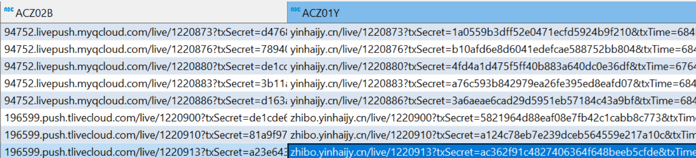

# 【腾讯云】腾讯云直播后端


### 腾讯云服务相关配置

添加依赖

```xml
<dependency>
    <groupId>com.tencentcloudapi</groupId>
    <artifactId>tencentcloud-sdk-java-trtc</artifactId>
    <version>3.1.637</version>
</dependency>
<dependency>
    <groupId>com.tencentcloudapi</groupId>
    <artifactId>tencentcloud-sdk-java-live</artifactId>
    <version>3.1.637</version>
</dependency>
<dependency>
    <groupId>com.tencentcloudapi</groupId>
    <artifactId>tencentcloud-sdk-java-vod</artifactId>
    <version>3.1.637</version>
</dependency>        
```

在后端项目`resource`包目录下，选择或者新建文件`application-integration.yml`

配置内容：

```yml
# 腾讯云服务相关配置
tencent:
  #腾讯云账号
  secretId: AKIDRo**********hDyV0
  secretKey: wxuy2**********Yiv8
  #即时视频
  SDKAppId: 160****473
  rtcSecretKey: f5391*****************75054
  #直播
  live:
    secretId: AKIDRo8XoE**********2GZ2KhDyV0
    secretKey: wxuy2AeTI8***********IKKRYiv8
    #播放
    play:
      domainName: play.gajy.org.cn
      authenticationKey: pnWY4******a2sMpR
    #推流
    push:
      domainName: 203204.push.tlivecloud.com
      authenticationKey: 627a88a**********9a0eab11
```

对应的直播服务账户和密码，播放的域名，到 [腾讯云官网](https://cloud.tencent.com/product/css) 付费获取。

这里是：账号申请 [相关文档](https://cloud.tencent.com/document/product/267/13551)

   

### 腾讯直播工具类

公共包`common`下，选择或新建`util`，新建文件`TencentLiveBroadcastUtil.java`

```java
package com.hrss.remotework.infrastructure.common.util;
/*
 * @Description //TODO
 * @Date 2023/1/5 14:40
 * @Author xx
 **/

import com.hrss.remotework.infrastructure.config.TencentConfig;
import com.hrss.remotework.infrastructure.gatewayimpl.database.dataobject.TaskInfo;
import com.tencentcloudapi.common.exception.TencentCloudSDKException;
import com.tencentcloudapi.live.v20180801.LiveClient;
import com.tencentcloudapi.live.v20180801.models.*;
import com.tencentcloudapi.trtc.v20190722.models.WaterMark;
import com.tencentcloudapi.vod.v20180717.VodClient;
import com.tencentcloudapi.vod.v20180717.models.*;
import com.yinhai.ta404.core.restservice.resultbean.Page;
import com.yinhai.ta404.core.utils.DateUtils;
import lombok.extern.slf4j.Slf4j;
import org.apache.commons.codec.digest.DigestUtils;
import org.springframework.beans.factory.annotation.Autowired;
import org.springframework.boot.autoconfigure.condition.ConditionalOnClass;
import org.springframework.cglib.beans.BeanMap;
import org.springframework.stereotype.Component;
import org.springframework.util.Assert;

import javax.annotation.Resource;
import java.io.UnsupportedEncodingException;
import java.security.MessageDigest;
import java.security.NoSuchAlgorithmException;
import java.util.Arrays;
import java.util.HashMap;
import java.util.List;
import java.util.concurrent.atomic.AtomicLong;
import java.util.stream.Collectors;

/**
 * 腾讯直播工具类
 *
 * @author xx
 * @date 2023/01/05
 */
@Component
@ConditionalOnClass(TencentConfig.class)
@Slf4j
public class TencentLiveBroadcastUtil {
    @Resource
    private TencentLiveBroadcastProperties tencentLiveBroadcastProperties;
    private final static String MD5String = "MD5";


    private VodClient vodClient;

    @Resource
    private LiveClient liveClient;

    @Autowired
    public void setVodClient(VodClient vodClient) {
        this.vodClient = vodClient;
    }

    private static final char[] DIGITS_LOWER =
            {'0', '1', '2', '3', '4', '5', '6', '7', '8', '9', 'a', 'b', 'c', 'd', 'e', 'f'};

    public String getPushUrl(String streamName) {
        long txTime = DateUtils.getCurrentDate().getTime() / 1000 + tencentLiveBroadcastProperties.expireTime.getSeconds();
        return new StringBuilder()
                .append(tencentLiveBroadcastProperties.getPush().domainName).append("/")
                .append(tencentLiveBroadcastProperties.getAppName()).append("/")
                .append(streamName).append("?").
                append(getTxSecretAndTxTime(tencentLiveBroadcastProperties.getPush().authenticationKey, streamName, txTime)).toString();
    }

    public String getPlayUrl(String streamName) {
        long txTime = DateUtils.getCurrentDate().getTime() / 1000 + tencentLiveBroadcastProperties.expireTime.getSeconds();

        return new StringBuilder()
                .append(tencentLiveBroadcastProperties.getPlay().domainName).append("/")
                .append(tencentLiveBroadcastProperties.getAppName()).append("/")
                .append(streamName).append("?").
                append(getTxSecretAndTxTime(tencentLiveBroadcastProperties.getPlay().authenticationKey, streamName, txTime)).toString();
    }

    /*
     * KEY+ streamName + txTime
     */
    private String getTxSecretAndTxTime(String key, String streamName, long txTime) {
        String input = new StringBuilder().
                append(key).
                append(streamName).
                append(Long.toHexString(txTime).toUpperCase()).toString();

        String txSecret = null;
        try {
            MessageDigest messageDigest = MessageDigest.getInstance(MD5String);
            txSecret = byteArrayToHexString(
                    messageDigest.digest(input.getBytes("UTF-8")));
        } catch (NoSuchAlgorithmException e) {
            log.error(e.getLocalizedMessage());
        } catch (UnsupportedEncodingException e) {
            log.error(e.getLocalizedMessage());
        }

        return txSecret == null ? "" :
                new StringBuilder().
                        append("txSecret=").
                        append(txSecret).
                        append("&").
                        append("txTime=").
                        append(Long.toHexString(txTime).toUpperCase()).
                        toString();
    }

    private String byteArrayToHexString(byte[] data) {
        char[] out = new char[data.length << 1];

        for (int i = 0, j = 0; i < data.length; i++) {
            out[j++] = DIGITS_LOWER[(0xF0 & data[i]) >>> 4];
            out[j++] = DIGITS_LOWER[0x0F & data[i]];
        }
        return new String(out);
    }

    /**
     * 搜索媒体信息
     */
    public MediaInfo[] searchMedia(String streamName) {
        Assert.notNull(streamName, "流名为空");
        SearchMediaRequest req = new SearchMediaRequest();
        req.setStreamId(streamName);
        try {
            SearchMediaResponse searchMediaResponse = vodClient.SearchMedia(req);
            return searchMediaResponse.getMediaInfoSet();
        } catch (TencentCloudSDKException e) {
            throw new RuntimeException(e);
        }
    }

    //合并视频，返回任务id
    public EditMediaResponse mergeTencentVideo(String... streamName) {
        EditMediaStreamInfo[] editMediaStreamInfos = new EditMediaStreamInfo[streamName.length];
        try {
            // 实例化一个请求对象,每个接口都会对应一个request对象
            EditMediaRequest req = new EditMediaRequest();
            req.setInputType("Stream");
            Arrays.stream(streamName).map(s -> {
                EditMediaStreamInfo editMediaStreamInfo = new EditMediaStreamInfo();
                editMediaStreamInfo.setStreamId(s);
                return editMediaStreamInfo;
            }).collect(Collectors.toSet()).toArray(editMediaStreamInfos);
            req.setStreamInfos(editMediaStreamInfos);
            // 返回的resp是一个EditMediaResponse的实例，与请求对象对应
            EditMediaResponse resp = vodClient.EditMedia(req);
            return resp;
        } catch (TencentCloudSDKException e) {
            throw new RuntimeException(e);
        }
    }


    //查询任务
    public TaskInfo describeTaskDetailRequest(String taskId) {
        DescribeTaskDetailRequest req = new DescribeTaskDetailRequest();
        req.setTaskId(taskId);
        // 返回的resp是一个DescribeTaskDetailResponse的实例，与请求对象对应
        try {
            return TaskHandler(vodClient.DescribeTaskDetail(req));
        } catch (TencentCloudSDKException e) {
            throw new RuntimeException(e);
        }
    }

    //查询所有水印
    public Page<WaterMark> queryAllWatermarks() {
        DescribeLiveWatermarksRequest req = new DescribeLiveWatermarksRequest();
        // 返回的resp是一个DescribeLiveWatermarksResponse的实例，与请求对象对应
        try {
            DescribeLiveWatermarksResponse resp = liveClient.DescribeLiveWatermarks(req);
            Page page = new Page();
            page.setPages(1);
            page.setCurrentSize(Math.toIntExact(resp.getTotalNum()));
            page.setList(Arrays.asList(resp.getWatermarkList()));
            page.setPageNum(1);
            page.setPageSize(page.getCurrentSize());
            page.setTotal(Long.valueOf(page.getCurrentSize()));
            return page;
        } catch (TencentCloudSDKException e) {
            throw new RuntimeException(e);
        }
    }

    public Long addWatermark(String watermarkName, String pictureUrl) {
        // 实例化一个请求对象,每个接口都会对应一个request对象
        AddLiveWatermarkRequest req = new AddLiveWatermarkRequest();
        req.setWatermarkName(watermarkName);
        req.setPictureUrl(pictureUrl);
        // 返回的resp是一个AddLiveWatermarkResponse的实例，与请求对象对应
        try {
            AddLiveWatermarkResponse resp = liveClient.AddLiveWatermark(req);
            return resp.getWatermarkId();
        } catch (TencentCloudSDKException e) {
            throw new RuntimeException(e);
        }
    }

    public void bindWatermark(String streamName, Long templateId) {
        CreateLiveWatermarkRuleRequest req = new CreateLiveWatermarkRuleRequest();
        req.setDomainName(tencentLiveBroadcastProperties.getPush().domainName);
        req.setAppName(tencentLiveBroadcastProperties.AppName);
        req.setStreamName(streamName);
        req.setTemplateId(templateId);
        // 返回的resp是一个CreateLiveWatermarkRuleResponse的实例，与请求对象对应
        try {
            CreateLiveWatermarkRuleResponse resp = liveClient.CreateLiveWatermarkRule(req);
        } catch (TencentCloudSDKException e) {
            throw new RuntimeException(e);
        }
    }

    /**
     * 创建混合流
     *
     * @param mixStreamSessionId  混合流会话id
     * @param mixStreamTemplateId 混合流程模板id
     * @param outputStream        输出流 一般为需要混流的模版，如在模版1上进行混流，则此处参数为1，inputstream为1，2
     * @param inputStreams        输入流
     */
    public void createMixStream(String mixStreamSessionId, Long mixStreamTemplateId, String outputStream, List<String> inputStreams) {
        CreateCommonMixStreamRequest req = new CreateCommonMixStreamRequest();
        req.setMixStreamSessionId(mixStreamSessionId);
        req.setMixStreamTemplateId(mixStreamTemplateId);
        AtomicLong count = new AtomicLong(1);
        req.setInputStreamList((CommonMixInputParam[]) inputStreams.stream().map(s -> {
            CommonMixInputParam commonMixInputParam = new CommonMixInputParam();
            commonMixInputParam.setInputStreamName(s);
            CommonMixLayoutParams commonMixLayoutParams = new CommonMixLayoutParams();
            commonMixLayoutParams.setImageLayer(count.getAndIncrement());
            commonMixInputParam.setLayoutParams(commonMixLayoutParams);
            return commonMixInputParam;
        }).toArray());
        CommonMixOutputParams commonMixOutputParams = new CommonMixOutputParams();
        commonMixOutputParams.setOutputStreamName(outputStream);
        req.setOutputParams(commonMixOutputParams);
        try {
            // 返回的resp是一个CreateCommonMixStreamResponse的实例，与请求对象对应
            CreateCommonMixStreamResponse resp = liveClient.CreateCommonMixStream(req);
        } catch (TencentCloudSDKException e) {
            throw new RuntimeException(e);
        }
    }

    /**
     * 取消混合流
     *
     * @param mixStreamSessionId 混合流会话id
     */
    public void cancelMixStream(String mixStreamSessionId) {
        // 实例化一个请求对象,每个接口都会对应一个request对象
        CancelCommonMixStreamRequest req = new CancelCommonMixStreamRequest();

        // 返回的resp是一个CancelCommonMixStreamResponse的实例，与请求对象对应
        try {
            CancelCommonMixStreamResponse resp = liveClient.CancelCommonMixStream(req);
            Assert.notNull(resp.getRequestId(), "调用腾讯腾讯取消混流接口失败！");
        } catch (TencentCloudSDKException e) {
            throw new RuntimeException(e);
        }
    }

    public TaskInfo TaskHandler(DescribeTaskDetailResponse describeTaskDetailResponse) {
        String taskId = null;
        try {
            if (!"FINISH".equals(describeTaskDetailResponse.getStatus())) {
                throw new RuntimeException("任务正在处理中");
            }
            if ("EditMedia".equals(describeTaskDetailResponse.getTaskType())) {
                EditMediaTask editMediaTask = describeTaskDetailResponse.getEditMediaTask();
                taskId = editMediaTask.getTaskId();
                if (!"FINISH".equals(editMediaTask.getStatus())) {
                    throw new RuntimeException("任务正在处理中");
                }
                if (!Long.valueOf(0).equals(editMediaTask.getErrCode())) {
                    throw new RuntimeException(editMediaTask.getMessage());
                }
                HashMap temp = new HashMap(BeanMap.create(editMediaTask.getOutput()));
                return TaskInfo.builder().taskId(editMediaTask.getTaskId())
                        .status(editMediaTask.getStatus())
                        .progressing(editMediaTask.getProgress())
                        .taskType(describeTaskDetailResponse.getTaskType()).
                        data(temp).
                        build();
            }
        } catch (Exception e) {
            return TaskInfo.builder().taskId(taskId)
                    .status(describeTaskDetailResponse.getStatus())
                    .message(e.getLocalizedMessage())
                    .taskType(describeTaskDetailResponse.getTaskType()).build();

        }
        return null;
    }

    /*@Data
    @Builder
    static class TaskInfo {
        private String taskId;
        private String taskType;
        private String status;
        private Long progressing;
        private String message;
        private HashMap data;
    }*/

}
```

工具类中涉及的属性`TencentLiveBroadcastProperties.java`，依据购买的账号密码和域名

```java
package com.hrss.remotework.infrastructure.common.util;
/*
 * @Description //TODO
 * @Date 2023/1/4 17:29
 * @Author xx
 **/
import lombok.Data;
import lombok.Getter;
import org.springframework.boot.context.properties.ConfigurationProperties;
import org.springframework.stereotype.Component;
import java.time.Duration;

/**
 * 腾讯直播属性
 *
 * @author xx
 * @date 2023/01/04
 */
@Data
@ConfigurationProperties("tencent.live")
@Component
public class TencentLiveBroadcastProperties {

    public String AppName = "live";
    public Duration expireTime = Duration.ofDays(365);
    public PlayProperties play = new PlayProperties();
    public PushProperties push = new PushProperties();
    public String secretId = "AKIDRo*********Z2KhDyV0";
    public String secretKey = "";

    @Data
    class PlayProperties {
        //拉流
        public String domainName = "play.gajy.org.cn";
        public String authenticationKey = "pnWY4X******a2sMpR";
    }

    @Data
    class PushProperties {
        //推流
        public String domainName = "203204.push.tlivecloud.com";
        public String authenticationKey = "627a88********b11";
        public Duration txDelayTime = Duration.ZERO;
    }
}
```

公共包`common`下，选择或新建`util`，新建文件`TencentConfig.java`

```java
package com.hrss.remotework.infrastructure.config;
/*
 * @Description //TODO
 * @Date 2022/11/28 10:40
 * @Author xx
 **/

import com.hrss.remotework.infrastructure.common.util.TencentLiveBroadcastProperties;
import com.hrss.remotework.infrastructure.common.util.TencentRtcProperties;
import com.tencentcloudapi.common.Credential;
import com.tencentcloudapi.common.profile.ClientProfile;
import com.tencentcloudapi.live.v20180801.LiveClient;
import com.tencentcloudapi.trtc.v20190722.TrtcClient;
import com.tencentcloudapi.vod.v20180717.VodClient;
import org.springframework.beans.factory.annotation.Autowired;
import org.springframework.boot.autoconfigure.condition.ConditionalOnClass;
import org.springframework.boot.context.properties.EnableConfigurationProperties;
import org.springframework.context.annotation.Bean;
import org.springframework.context.annotation.Configuration;

/**
 * 腾讯配置
 *
 * @author xx
 * @date 2022/11/28
 */
@Configuration(proxyBeanMethods = false)
@EnableConfigurationProperties(TencentRtcProperties.class)
@ConditionalOnClass(Credential.class)
public class TencentConfig {

    @Autowired
    private TencentRtcProperties tencentRtcProperties;
    @Autowired
    private TencentLiveBroadcastProperties tencentLiveBroadcastProperties;

    /**
     * 实例化腾讯云产品（实时音视频）的client对象
     *
     * @return
     */
    @Bean
    public TrtcClient trtcClient() {
        //实例化一个认证对象，需要传入腾讯云账户的SecretId 、SecretKey
        Credential cred = new Credential(tencentRtcProperties.getSecretId(), tencentRtcProperties.getSecretKey());
        //实例化腾讯云产品（实时音视频）的client对象
        ClientProfile clientProfile = new ClientProfile();
        //设置签名方法(默认使用 TC3-HMAC-SHA256 签名方式)
        //clientProfile.setSignMethod(ClientProfile.SIGN_TC3_256);
        TrtcClient trtcClient = new TrtcClient(cred, tencentRtcProperties.getRegion(), clientProfile);
        return trtcClient;
    }


    /**
     * 实例化腾讯云产品（vod）的client对象
     *
     * @return
     */
    @Bean
    public VodClient vodClient() {
        //实例化一个认证对象，需要传入腾讯云账户的SecretId 、SecretKey
        Credential cred = new Credential(tencentLiveBroadcastProperties.getSecretId(), tencentLiveBroadcastProperties.getSecretKey());
        //实例化腾讯云产品（实时音视频）的client对象
        ClientProfile clientProfile = new ClientProfile();
        //设置签名方法(默认使用 TC3-HMAC-SHA256 签名方式)
        //clientProfile.setSignMethod(ClientProfile.SIGN_TC3_256);
        VodClient vodClient = new VodClient(cred, tencentRtcProperties.getRegion(), clientProfile);
        return vodClient;
    }

    //直播 client
    @Bean
    public LiveClient liveClient() {
        //实例化一个认证对象，需要传入腾讯云账户的SecretId 、SecretKey
        Credential cred = new Credential(tencentLiveBroadcastProperties.getSecretId(), tencentLiveBroadcastProperties.getSecretKey());
        //实例化腾讯云产品（实时音视频）的client对象
        ClientProfile clientProfile = new ClientProfile();
        //设置签名方法(默认使用 TC3-HMAC-SHA256 签名方式)
        //clientProfile.setSignMethod(ClientProfile.SIGN_TC3_256);
        LiveClient liveClient = new LiveClient(cred, tencentRtcProperties.getRegion(), clientProfile);
        return liveClient;
    }
}

```


### 推流地址生成

调用工具类，并存储推流地址。

```java
//推流地址
cz30Do.setAcz02b(tencentLiveBroadcastUtil.getPushUrl(acz300.toString()));
//直播存储实体cz30Do
//推流记录地址字段acz02b
//直播主键id字段acz300 自动生成满足位数的uuid就可以
```

获取该推流地址，放入前端直播推流代码相应位置。前端推流写法参照：本网站[【腾讯云】腾讯云直播前端](https://wangty654.github.io/text16/)


### 拉流地址生成

调用工具类，并存储拉流地址。

```java
//直播视频流地址(播放)
cz30Do.setAcz01y(tencentLiveBroadcastUtil.getPlayUrl(acz300.toString()));
//直播存储实体cz30Do
//推流记录地址字段acz01y
//直播主键id字段acz300 与推流同一个id，则可以拉取到此id推流的直播间的直播信息
```

获取该拉流地址，放入前端直播拉流代码相应位置。前端拉流写法参照：本网站[【腾讯云】腾讯云直播前端](https://wangty654.github.io/text16/)




注：推拉流生成方法一致，但根据推拉流域名不同，所以生成的地址也不同。如图所示：



则每一个直播间一个推流地址对应一个拉流地址，且不同直播间之间互不影响



