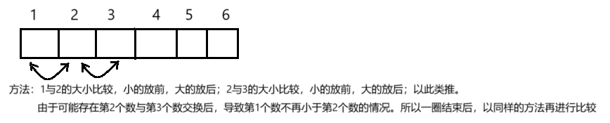

# 【Java】Java语言进阶（二）


## 基础排序算法

在Java中，基础的排序算法 包括插入排序、冒泡排序和选择排序。这些算法相对简单易懂，适合学习排序算法的基本概念。下面是对每种算法的详细介绍，包括它们的原理、时间复杂度以及实现示例。

### 1. 插入排序（Insertion Sort）

**原理**：插入排序通过构建一个有序的子数组，将新元素插入到适当的位置，以保持数组的有序性。它的工作方式类似于在纸上排序扑克牌，逐一将每张牌放入合适的位置。


**时间复杂度**：

- 最坏情况：O(n²)
- 平均情况：O(n²)
- 最好情况：O(n)（当数组已经基本有序时）

**实现**：

```java
public class InsertionSort {  
    public static void insertionSort(int[] array) {  
        for (int i = 1; i < array.length; i++) {  
            int key = array[i];  
            int j = i - 1;  

            // 将大于key的元素移动到它的后面  
            while (j >= 0 && array[j] > key) {  
                array[j + 1] = array[j];  
                j--;  
            }  
            array[j + 1] = key; // 将key放到正确位置  
        }  
    }  

    public static void main(String[] args) {  
        int[] array = {12, 11, 13, 5, 6};  
        insertionSort(array);  
        System.out.println(java.util.Arrays.toString(array));  
    }  
}  
```

### 2. 冒泡排序（Bubble Sort）

**原理**：冒泡排序通过比较相邻的元素并交换它们的顺序，将较大的元素逐渐“冒泡”到数组的末尾。这个过程会重复进行，直到没有需要交换的元素为止。[每一轮比较完毕后，下一次比较的时候就会减少一个元素（一轮结束，最后一个元素一定为最大元素）。总共需要比较数组长度-1次]



**时间复杂度**：

- 最坏情况：O(n²)
- 平均情况：O(n²)
- 最好情况：O(n)（当数组已经基本有序时）

**实现**：

```java
public class BubbleSort {  
    public static void bubbleSort(int[] array) {  
        int n = array.length;  
        boolean swapped;  
        for (int i = 0; i < n - 1; i++) {  
            swapped = false;  
            // 每次遍历都将最大元素移动到末尾  
            for (int j = 0; j < n - 1 - i; j++) {  
                if (array[j] > array[j + 1]) {  
                    // 交换元素  
                    int temp = array[j];  
                    array[j] = array[j + 1];  
                    array[j + 1] = temp;  
                    swapped = true; // 表示发生了交换  
                }  
            }  
            // 如果没有交换，说明数组已经有序，直接退出  
            if (!swapped) break;  
        }  
    }  

    public static void main(String[] args) {  
        int[] array = {64, 34, 25, 12, 22, 11, 90};  
        bubbleSort(array);  
        System.out.println(java.util.Arrays.toString(array));  
    }  
}  
```

### 3. 选择排序（Selection Sort）

**原理**：选择排序分为多个步骤，每一步从未排序部分选择最小（或最大）的元素，将其放到已排序部分的末尾。这个过程重复进行，直到所有元素均在相应位置。


**时间复杂度**：

- 最坏情况：O(n²)
- 平均情况：O(n²)
- 最好情况：O(n²)

**实现**：

```java
public class SelectionSort {  
    public static void selectionSort(int[] array) {  
        int n = array.length;  
        // 遍历数组  
        for (int i = 0; i < n - 1; i++) {  
            // 找到未排序部分的最小元素  
            int minIndex = i;  
            for (int j = i + 1; j < n; j++) {  
                if (array[j] < array[minIndex]) {  
                    minIndex = j;  
                }  
            }  
            // 交换未排序部分的第一个元素和最小元素  
            int temp = array[minIndex];  
            array[minIndex] = array[i];  
            array[i] = temp;  
        }  
    }  

    public static void main(String[] args) {  
        int[] array = {29, 10, 14, 37, 13};  
        selectionSort(array);  
        System.out.println(java.util.Arrays.toString(array));  
    }  
}  
```

在Java中，有多种高级排序算法可以用于对数组或集合进行排序，这些算法比基础的排序算法（如插入排序或冒泡排序）更为高效。以下是一些流行的高级排序算法的介绍，包括它们的原理、时间复杂度和在Java中的实现方式。

<br/>

## 高级排序算法

### 1. 归并排序（Merge Sort）

**原理**：归并排序是一种分治算法。它将数组分成两个子数组，分别对这两个子数组进行排序，然后将它们合并成一个排好序的数组。

**时间复杂度**：O(n log n)

**实现**：

```java
public class MergeSort {  
    public static void mergeSort(int[] array) {  
        if (array.length < 2) {  
            return;  
        }  
        int mid = array.length / 2;  
        int[] left = new int[mid];  
        int[] right = new int[array.length - mid];  

        for (int i = 0; i < mid; i++) {  
            left[i] = array[i];  
        }  
        for (int i = mid; i < array.length; i++) {  
            right[i - mid] = array[i];  
        }  

        mergeSort(left);  
        mergeSort(right);  
        merge(array, left, right);  
    }  

    private static void merge(int[] array, int[] left, int[] right) {  
        int i = 0, j = 0, k = 0;  
        while (i < left.length && j < right.length) {  
            if (left[i] <= right[j]) {  
                array[k++] = left[i++];  
            } else {  
                array[k++] = right[j++];  
            }  
        }  
        while (i < left.length) {  
            array[k++] = left[i++];  
        }  
        while (j < right.length) {  
            array[k++] = right[j++];  
        }  
    }  

    public static void main(String[] args) {  
        int[] array = {38, 27, 43, 3, 9, 82, 10};  
        mergeSort(array);  
        System.out.println(java.util.Arrays.toString(array));  
    }  
}  
```

### 2. 快速排序（Quick Sort）

**原理**：快速排序也是一种分治算法。它选择一个“基准”元素，将数组分成两个部分，小于基准的元素在左边，大于基准的元素在右边。然后对这两部分继续进行排序。


**时间复杂度**：平均情况 O(n log n)，最坏情况 O(n²)

**实现**：

```java
public class QuickSort {  
    public static void quickSort(int[] array, int low, int high) {  
        if (low < high) {  
            int pi = partition(array, low, high);  
            quickSort(array, low, pi - 1);  
            quickSort(array, pi + 1, high);  
        }  
    }  

    private static int partition(int[] array, int low, int high) {  
        int pivot = array[high];  
        int i = (low - 1);  
        for (int j = low; j < high; j++) {  
            if (array[j] < pivot) {  
                i++;  
                int temp = array[i];  
                array[i] = array[j];  
                array[j] = temp;  
            }  
        }  
        int temp = array[i + 1];  
        array[i + 1] = array[high];  
        array[high] = temp;  
        return i + 1;  
    }  

    public static void main(String[] args) {  
        int[] array = {10, 80, 30, 90, 40, 50, 70};  
        quickSort(array, 0, array.length - 1);  
        System.out.println(java.util.Arrays.toString(array));  
    }  
}  
```

### 3. 堆排序（Heap Sort）

**原理**：堆排序利用堆的数据结构。首先构建最大堆或最小堆，然后反复取出堆顶元素，将其放到已排序的数组末端。

**时间复杂度**：O(n log n)

**实现**：

```java
public class HeapSort {  
    public static void heapSort(int[] array) {  
        int n = array.length;  
        for (int i = n / 2 - 1; i >= 0; i--) {  
            heapify(array, n, i);  
        }  
        for (int i = n - 1; i > 0; i--) {  
            int temp = array[0];  
            array[0] = array[i];  
            array[i] = temp;  
            heapify(array, i, 0);  
        }  
    }  

    private static void heapify(int[] array, int n, int i) {  
        int largest = i;  
        int left = 2 * i + 1;  
        int right = 2 * i + 2;  

        if (left < n && array[left] > array[largest]) {  
            largest = left;  
        }  
        if (right < n && array[right] > array[largest]) {  
            largest = right;  
        }  
        if (largest != i) {  
            int swap = array[i];  
            array[i] = array[largest];  
            array[largest] = swap;  
            heapify(array, n, largest);  
        }  
    }  

    public static void main(String[] args) {  
        int[] array = {12, 11, 13, 5, 6, 7};  
        heapSort(array);  
        System.out.println(java.util.Arrays.toString(array));  
    }  
}  
```

### 4. 桶排序（Bucket Sort）

**原理**：桶排序将数据元素分到有限数量的桶中，每个桶再单独排序（可以使用其他排序算法），最终顺序输出。

**时间复杂度**：O(n + k)，其中`k`是桶的数量（在理想情况下）。

**实现**：

```java
import java.util.ArrayList;  
import java.util.Collections;  

public class BucketSort {  
    public static void bucketSort(float[] array) {  
        int n = array.length;  
        if (n <= 0) return;  

        // 创建桶  
        ArrayList<Float>[] buckets = new ArrayList[n];  
        for (int i = 0; i < n; i++) {  
            buckets[i] = new ArrayList<>();  
        }  

        // 将元素分入桶中  
        for (float value : array) {  
            int index = (int) (n * value); // 假设浮点数范围为[0, 1)  
            buckets[index].add(value);  
        }  

        // 对每个桶进行排序  
        for (ArrayList<Float> bucket : buckets) {  
            Collections.sort(bucket);  
        }  

        // 合并结果  
        int index = 0;  
        for (ArrayList<Float> bucket : buckets) {  
            for (Float value : bucket) {  
                array[index++] = value;  
            }  
        }  
    }  

    public static void main(String[] args) {  
        float[] array = {0.42f, 0.32f, 0.23f, 0.45f, 0.12f, 0.67f};  
        bucketSort(array);  
        System.out.println(java.util.Arrays.toString(array));  
    }  
}  
```


### 5.**希尔排序（Shell Sort）**

**原理**：

- 初始时，将整个数组分成若干个子数组（根据指定的间隔），对每个子数组进行插入排序。
- 然后逐渐减少间隔，最终变成一个完整的数组，进行最后的插入排序。

- 这种方法能够显著减少需要移动的元素数，因此在大多数情况下比简单的插入排序更高效。

**时间复杂度**：希尔排序的时间复杂度依赖于间隔序列的选择，最坏情况下为 O(n²)，而在使用合适的间隔序列（如希尔原始间隔序列、Hibbard间隔序列、Sedgewick间隔序列等）时，希尔排序的平均时间复杂度可以达到 O(n^(3/2)) 或 O(n log² n)。

**实现**：

1. 选择一个初始的“间隔” h，通常是数组长度的一半。
2. 将数组划分成多个子数组，每个子数组之间的间隔为 h。
3. 对每个子数组进行插入排序。
4. 减少间隔（如 h = h / 2），重复步骤 2 和 3，直到间隔减小到 1。
5. 最后一次插入排序，将数组完全排序。

**代码示例**：

```java
public class ShellSort {  
    public static void shellSort(int[] array) {  
        int n = array.length;  
        
        // 选择初始间隔  
        for (int gap = n / 2; gap > 0; gap /= 2) {  
            // 对间隔为 gap 的子数组进行插入排序  
            for (int i = gap; i < n; i++) {  
                int key = array[i];  
                int j = i;  
                
                // 向前移动 gap 个元素  
                while (j >= gap && array[j - gap] > key) {  
                    array[j] = array[j - gap];  
                    j -= gap;  
                }  
                array[j] = key; // 将 key 放到合适的位置  
            }  
        }  
    }  

    public static void main(String[] args) {  
        int[] array = {12, 34, 54, 2, 3};  
        shellSort(array);  
        System.out.println(java.util.Arrays.toString(array));  
    }  
}  
```

**输入**：`{12, 34, 54, 2, 3}`
**输出**：`{2, 3, 12, 34, 54}`

当数据量较大或需要频繁的插入和删除时，选择`快速排序`和`堆排序`通常是更优的选择。

`归并排序`则在处理链表等数据结构时表现出色。

 <br/>

## 高级查找

基本查找为无序（从头找到尾），高级查找为有序。

在Java中，高级查找算法用于在**数据集合中**高效地**查找元素**。这些算法通常比简单的线性查找更为高效，特别是在处理较大数据集时。以下是几种常见的高级查找算法，以及它们的原理、时间复杂度和实现示例。

- **二分查找**：适用于已排序数组。
- **哈希表查找**：适用于需要频繁查找的场景，常用在键值对存储中。
- **跳跃查找**：适用于较大的已排序数组，提供了更高效的查找。
- **插值查找**：适用于均匀分布的已排序数组。

### 1. 二分查找（Binary Search）

**原理**：二分查找用于在已排序的数组中查找一个特定的元素。它通过反复将查找范围缩小为一半来快速定位目标值（折半查找）。每次比较中间元素和目标值，如果中间元素等于目标值，查找成功；如果目标值小于中间元素，则在左半部分继续查找，否则在右半部分继续查找。


**时间复杂度**：

- O(log n)

**实现：**

```java
public class BinarySearch {  
    public static int binarySearch(int[] array, int target) {  
        int left = 0;  
        int right = array.length - 1;  

        while (left <= right) {  
            int mid = left + (right - left) / 2; // 防止溢出  
            if (array[mid] == target) {  
                return mid; // 找到目标值，返回索引  
            }  
            if (array[mid] < target) {  
                left = mid + 1; // 在右半部分查找  
            } else {  
                right = mid - 1; // 在左半部分查找  
            }  
        }  
        return -1; // 未找到目标值  
    }  

    public static void main(String[] args) {  
        int[] array = {2, 3, 4, 10, 40};  
        int target = 10;  
        int result = binarySearch(array, target);  

        if (result != -1) {  
            System.out.println("元素在索引 " + result + " 处被找到");  
        } else {  
            System.out.println("元素未找到");  
        }  
    }  
}  
```

### 2. 哈希表查找（Hash Table Search）

**原理**：哈希表使用哈希函数将键映射到表中的位置，从而实现常量时间复杂度的查找。由于哈希表基于键值对存储数据，可以迅速找到目标元素。

**时间复杂度**：

- 平均情况：O(1)
- 最坏情况：O(n)（发生冲突时）

**实现：**

使用 Java 的 `HashMap` 进行查找：

```java
import java.util.HashMap;  

public class HashTableSearch {  
    public static void main(String[] args) {  
        HashMap<String, Integer> map = new HashMap<>();  
        map.put("apple", 1);  
        map.put("banana", 2);  
        map.put("orange", 3);  

        String keyToFind = "banana";  
        Integer value = map.get(keyToFind);  

        if (value != null) {  
            System.out.println("键 " + keyToFind + " 的值是 " + value);  
        } else {  
            System.out.println("未找到键 " + keyToFind);  
        }  
    }  
}  
```

### 3. 瀑布流查找（Jump Search）

**原理**：跳跃查找是一种结合了线性查找与二分查找的查找算法。它先以固定的步长跳跃到达数组中某个位置，然后在这个位置进行线性查找。

**时间复杂度**：

- O(√n)

**实现：**

```java
public class JumpSearch {  
    public static int jumpSearch(int[] array, int target) {  
        int n = array.length;  
        int step = (int) Math.sqrt(n);  
        int prev = 0;  

        // 找到块中的目标索引  
        while (array[Math.min(step, n) - 1] < target) {  
            prev = step;  
            step += (int) Math.sqrt(n);  
            if (prev >= n) return -1; // 越界  
        }  

        // 在线性区间内查找目标值  
        for (int i = prev; i < Math.min(step, n); i++) {  
            if (array[i] == target) return i; // 找到目标值  
        }  

        return -1; // 未找到  
    }  

    public static void main(String[] args) {  
        int[] array = {0, 1, 2, 3, 4, 5, 6, 7, 8, 9};  
        int target = 5;  
        int result = jumpSearch(array, target);  

        if (result != -1) {  
            System.out.println("元素在索引 " + result + " 处被找到");  
        } else {  
            System.out.println("元素未找到");  
        }  
    }  
}  
```

### 4. 插值查找（Interpolation Search）

**原理**：插值查找是一种改进的二分查找，适用于均匀分布的数组。它根据目标值与最小和最大值的关系，动态计算应该查找的位置来跳过不必要的中间值查找。

**时间复杂度**：

- 最坏情况：O(n)
- 平均情况：O(log log n)

**实现：**

```java
public class InterpolationSearch {  
    public static int interpolationSearch(int[] array, int target) {  
        int low = 0;  
        int high = array.length - 1;  

        while (low <= high && target >= array[low] && target <= array[high]) {  
            // 计算插值位置  
            int pos = low + (target - array[low]) * (high - low) / (array[high] - array[low]);  
            
            if (array[pos] == target) return pos; // 找到目标值  
            
            if (array[pos] < target) {  
                low = pos + 1; // 在右部分查找  
            } else {  
                high = pos - 1; // 在左部分查找  
            }  
        }  
        
        return -1; // 未找到  
    }  

    public static void main(String[] args) {  
        int[] array = {10, 20, 30, 40, 50};  
        int target = 30;  
        int result = interpolationSearch(array, target);  

        if (result != -1) {  
            System.out.println("元素在索引 " + result + " 处被找到");  
        } else {  
            System.out.println("元素未找到");  
        }  
    }  
}  
```

<br/>

## 包装类

在Java中，**包装类**（Wrapper Classes）是为了将基本数据类型（primitive data types）包装成对象类型（object types）而提供的类。**每个基本数据类型都有一个对应的包装类**，这些类使得基本类型**可以像对象一样使用**，提供了更多的功能。

### 1. 基本数据类型与其包装类

| 基本数据类型 | 对应的包装类 |
| :----------- | :----------- |
| `boolean`    | `Boolean`    |
| `byte`       | `Byte`       |
| `char`       | `Character`  |
| `double`     | `Double`     |
| `float`      | `Float`      |
| `int`        | `Integer`    |
| `long`       | `Long`       |
| `short`      | `Short`      |

### 2. 包装类的主要功能

- **对象化**：基本数据类型不能用于某些需要对象的地方，比如集合（例如：`ArrayList`、`HashMap`等），而包装类则可以。

- 方法的使用

  ：每个包装类都提供了一些方法，例如：

  - `parseXXX`：将字符串转换为基本类型，如 `Integer.parseInt()`
  - `valueOf`：将基本类型转换为包装类对象
  - `toString`：将包装类对象转换为字符串表示

- **常量**：各个包装类中都有一些常量，例如 `Integer.MAX_VALUE` 表示 `int` 类型的最大值。

### 3. 示例代码

以下展示了如何使用各个包装类：

```java
public class WrapperExample {  
    public static void main(String[] args) {  
        // 使用 Integer 包装类  
        Integer intValue = Integer.valueOf(10); // 装箱  
        int intPrimitive = intValue.intValue(); // 拆箱  
        System.out.println("Integer value: " + intValue);  
        
        // 使用 Double 包装类  
        Double doubleValue = Double.valueOf(25.5); // 装箱  
        System.out.println("Double value: " + doubleValue);  
        
        // 使用 Boolean 包装类  
        Boolean boolValue = Boolean.valueOf(true); // 装箱  
        System.out.println("Boolean value: " + boolValue);  

        // 使用 Character 包装类  
        Character charValue = Character.valueOf('A'); // 装箱  
        System.out.println("Character value: " + charValue);  
        
        // 包装类与集合结合使用  
        java.util.List<Integer> numberList = new java.util.ArrayList<>();  
        numberList.add(intValue); // 可以添加 Integer 对象  
        System.out.println("List contains: " + numberList);  
        
        // 自动装箱和拆箱示例  
        Integer autoBoxedValue = 20; // 自动装箱  
        int autoUnboxedValue = autoBoxedValue; // 自动拆箱  
        System.out.println("Auto-boxed value: " + autoBoxedValue);  
        System.out.println("Auto-unboxed value: " + autoUnboxedValue);  
    }  
}  
```

### 4. 自动装箱与拆箱

Java 1.5 引入了**自动装箱（Autoboxing）**和**自动拆箱（Unboxing）**的特性，允许编译器自动将基本数据类型与其对应的包装类之间的转换。例如：

- 将基本类型直接赋值给对应的包装类（自动装箱）：

  ```java
  Integer num = 100; // 自动装箱  
  ```

- 将包装类直接赋值给基本类型变量（自动拆箱）：

  ```java
  int number = num; // 自动拆箱  
  ```

### 5. 包装类的优缺点

**优点**：

- 提供了基本类型不具备的功能和灵活性。
- 允许基本类型在需要对象的地方使用（如集合）。

**缺点**：

- 包装类在内存使用上更为消耗，因为对象的开销大于基本数据类型。
- 自动装箱和拆箱可能导致性能问题，尤其是在高频调用中。

<br/>

## Biglnteger类

`BigInteger`类是Java中处理任意精度整数的强大工具，适用于需要高精度数值计算的场景。通过使用`BigInteger`，开发者可以轻松处理超出标准数据类型限制的数值计算任务。

在Java中，`BigInteger`类是一个用于处理任意精度的整数的类，主要用于解决整型数器范围受限的问题。它位于`java.math`包中，允许开发者处理比`int`或`long`更大的整数值。`BigInteger`类常用在需要高精度数值计算的场景，比如数学运算、密码学和大数处理等。

### 1. 主要特点

- **任意精度**：`BigInteger`可以处理超出标准数据类型（如`int`、`long`）所能表示的范围的大整数。
- **不可变性**：`BigInteger`对象是不可变的，任何对其值的修改都会返回一个新的`BigInteger`对象，而不会更改原对象。
- **数学运算**：提供了丰富的方法支持各种数学运算，包括加、减、乘、除以及取模等。

### 2. 常用字段和方法

#### 2.1 创建`BigInteger`对象

- 构造函数：
  - `BigInteger(String val)`：根据字符串创建一个`BigInteger`。
  - `BigInteger(int signum, byte[] magnitude)`：根据符号和大小构造一个`BigInteger`。

#### 2.2 常用方法

- **基本操作**：
  - `BigInteger add(BigInteger val)`：返回两个`BigInteger`的和。
  - `BigInteger subtract(BigInteger val)`：返回两个`BigInteger`的差。
  - `BigInteger multiply(BigInteger val)`：返回两个`BigInteger`的积。
  - `BigInteger divide(BigInteger val)`：返回两个`BigInteger`的商。
  - `BigInteger mod(BigInteger val)`：返回两个`BigInteger`的模。
- **比较方法**：
  - `int compareTo(BigInteger val)`：比较两个`BigInteger`的大小，返回负数、零或正数。
  - `boolean equals(Object x)`：判断两个`BigInteger`是否相等。
- **次幂与开方**：
  - `BigInteger pow(int exponent)`：返回当前`BigInteger`的指定次幂。
  - `BigInteger gcd(BigInteger val)`：计算当前`BigInteger`与另一个`BigInteger`的最大公约数。
- **转换方法**：
  - `long longValue()`：将`BigInteger`转换为`long`类型。
  - `String toString()`：将`BigInteger`转换为字符串表示。

### 3. 示例代码

以下是一个示例程序，演示了`BigInteger`的基本用法：

```java
import java.math.BigInteger;  

public class BigIntegerExample {  
    public static void main(String[] args) {  
        // 创建BigInteger对象  
        BigInteger bigInt1 = new BigInteger("123456789012345678901234567890");  
        BigInteger bigInt2 = new BigInteger("987654321098765432109876543210");  

        // 加法  
        BigInteger sum = bigInt1.add(bigInt2);  
        System.out.println("和: " + sum);  

        // 减法  
        BigInteger difference = bigInt1.subtract(bigInt2);  
        System.out.println("差: " + difference);  

        // 乘法  
        BigInteger product = bigInt1.multiply(bigInt2);  
        System.out.println("积: " + product);  

        // 除法  
        BigInteger quotient = bigInt2.divide(bigInt1);  
        System.out.println("商: " + quotient);  

        // 求模  
        BigInteger remainder = bigInt2.mod(bigInt1);  
        System.out.println("余数: " + remainder);  

        // 次幂  
        BigInteger power = bigInt1.pow(2);  
        System.out.println("平方: " + power);  

        // 比较  
        int comparison = bigInt1.compareTo(bigInt2);  
        System.out.println("比较结果: " + (comparison < 0 ? "大于" : comparison > 0 ? "小于" : "等于"));  

        // 最大公约数  
        BigInteger gcd = bigInt1.gcd(bigInt2);  
        System.out.println("最大公约数: " + gcd);  
    }  
}  
```

### 4. 使用场景

- **金融计算**：在需要处理很大金额的金融应用中，`BigInteger`提供了安全的数值处理方式。
- **密码学应用**：在进行加密和解密时，常常需要使用较大的随机数和素数，`BigInteger`非常适合这种用途。
- **大数据处理**：在数据分析中，处理数值的需要超出基本数据类型的范围时，可以使用`BigInteger`。

<br/>

## 正则表达式

在Java中，**正则表达式**（Regular Expressions）是一种用于描述字符串模式的工具，可以用来对字符串进行搜索、校验、替换等操作。Java的正则表达式支持由`java.util.regex`包提供，主要包含以下几个类：

1. `Pattern`: 表示编译后的正则表达式。
2. `Matcher`: 用于在字符串中执行匹配操作。
3. `PatternSyntaxException`: 表示正则表达式的语法错误。

### 1. 基本用法

#### 创建一个Pattern

使用`Pattern.compile(String regex)`方法编译一个正则表达式，返回一个`Pattern`对象。

```java
import java.util.regex.Pattern;  

Pattern pattern = Pattern.compile("abc");  
```

#### 创建一个Matcher

使用`Pattern.matcher(String input)`方法创建一个`Matcher`对象，该对象对输入字符串执行匹配操作。

```java
import java.util.regex.Matcher;  

String input = "abcdef";  
Matcher matcher = pattern.matcher(input);  
```

### 2. 常用方法

- **`find()`**: 查找下一个匹配项。
- **`matches()`**: 检查整个输入字符串是否匹配正则表达式。
- **`replaceAll(String replacement)`**: 用替换字符串替换所有匹配的子字符串。
- **`replaceFirst(String replacement)`**: 用替换字符串替换第一个匹配的子字符串。

### 3. 示例代码

以下是一个简单的示例，演示了如何使用正则表达式来查找、替换和分割字符串。

```java
import java.util.regex.Matcher;  
import java.util.regex.Pattern;  

public class RegexExample {  
    public static void main(String[] args) {  
        String input = "Hello World! Welcome to the world of Java.";  
        
        // 创建正则表达式  
        Pattern pattern = Pattern.compile("world", Pattern.CASE_INSENSITIVE); // 不区分大小写  
        
        // 创建 Matcher 对象  
        Matcher matcher = pattern.matcher(input);  
        
        // 查找匹配项  
        while (matcher.find()) {  
            System.out.println("Found at index: " + matcher.start()); // 输出匹配项的起始索引  
        }  

        // 替换所有匹配项  
        String replacedString = matcher.replaceAll("universe");  
        System.out.println("Replaced String: " + replacedString);  
        
        // 使用正则表达式分割字符串  
        String[] words = input.split("\\W+"); // 根据非单词字符分割  
        for (String word : words) {  
            System.out.println(word);  
        }  
    }  
}  
```

### 4. 常见正则表达式

- `.`: 匹配任意单个字符（除换行符外）。
- `*`: 匹配前一个字符零次或多次。
- `+`: 匹配前一个字符一次或多次。
- `?`: 匹配前一个字符零次或一次。
- `^`: 匹配输入字符串的开始。
- `$`: 匹配输入字符串的结束。
- `{n}`: 精确匹配n次。
- `{n,}`: 匹配至少n次。
- `{n,m}`: 匹配n到m次。
- `[]`: 指定字符集，例如 `[abc]` 匹配a、b、或c。
- `|`: 或操作符，例如 `abc|def` 匹配abc或def。
- `\\d`: 匹配任何数字，等同于 `[0-9]`。
- `\\D`: 匹配任何非数字字符。
- `\\w`: 匹配任何字母数字字符，等同于 `[a-zA-Z_0-9]`。
- `\\W`: 匹配任何非字母数字字符。
- `\\s`: 匹配任何空白字符。
- `\\S`: 匹配任何非空白字符。

### 5. 小提示

- Java中的正则表达式使用双反斜杠，例如要匹配一个点`.`，需要使用`\\.`。

<br/>

## Math类

在Java中，`Math`类是一个提供各种**数学操作的工具类**，包含了一系列静态方法，方便**进行常见的数学计算**。`Math`类位于`java.lang`包中，因此不需要额外导入。这个类的方法可以用于浮点数和整数运算，涵盖了基本的算术运算、三角函数、对数、幂运算等。

### 1. 主要特点

- **所有方法都是静态的**：可以直接通过`Math`类调用，而无需创建实例。
- **不允许实例化**：`Math`类的构造器是私有的，不能被实例化。
- **提供了常量**：如`Math.PI`和`Math.E`，分别表示π和自然常数e的值。

### 2. 常用方法

以下是`Math`类中一些常用方法的概述：

#### 2.1 基本数学运算

- **`Math.abs(x)`**: 计算绝对值。
- **`Math.ceil(x)`**: 向上取整，返回大于或等于x的最小整数。
- **`Math.floor(x)`**: 向下取整，返回小于或等于x的最大整数。
- **`Math.round(x)`**: 四舍五入，返回最接近的整数。
- **`Math.max(a, b)`**: 返回两个值中的最大值。
- **`Math.min(a, b)`**: 返回两个值中的最小值。

#### 2.2 乘方和开方

- **`Math.pow(x, y)`**: 计算x的y次方。
- **`Math.sqrt(x)`**: 计算x的平方根。

#### 2.3 三角函数

- **`Math.sin(x)`**: 计算x的正弦值（x以弧度为单位）。
- **`Math.cos(x)`**: 计算x的余弦值。
- **`Math.tan(x)`**: 计算x的正切值。
- **`Math.asin(x)`**, **`Math.acos(x)`**, **`Math.atan(x)`**：分别计算反正弦、反余弦和反正切。

#### 2.4 指数和对数

- **`Math.exp(x)`**: 计算e的x次方。
- **`Math.log(x)`**: 计算以e为底的x的对数。
- **`Math.log10(x)`**: 计算以10为底的x的对数。

#### 2.5 随机数生成

- **`Math.random()`**: 返回0.0到1.0之间的随机数。

### 3. 示例代码

以下是一个简单示例，演示了`Math`类的常用方法：

```java
public class MathExample {  
    public static void main(String[] args) {  
        double x = -5.5;  
        double y = 2.0;  

        // 绝对值  
        System.out.println("绝对值: " + Math.abs(x));  

        // 向上取整  
        System.out.println("向上取整: " + Math.ceil(x));  

        // 向下取整  
        System.out.println("向下取整: " + Math.floor(x));  

        // 四舍五入  
        System.out.println("四舍五入: " + Math.round(x));  

        // 最大值和最小值  
        System.out.println("最大值: " + Math.max(x, y));  
        System.out.println("最小值: " + Math.min(x, y));  

        // 幂运算  
        System.out.println("2的3次方: " + Math.pow(2, 3));  

        // 平方根  
        System.out.println("25的平方根: " + Math.sqrt(25));  

        // 三角函数  
        double rad = Math.toRadians(30); // 角度转弧度  
        System.out.println("30度的正弦值: " + Math.sin(rad));  

        // 随机数  
        System.out.println("随机数: " + Math.random());  
    }  
}  
```

### 4. 常量

`Math`类提供了以下常量：

- **`Math.PI`**: 圆周率(π的值)。
- **`Math.E`**: 自然对数的底数（约等于2.71828）。

### 5. 性能注意事项

- 所有`Math`类的方法都是静态的，无需实例化，利用这种特性可以减少不必要的开销。
- 对于频繁的数学计算，可以考虑使用一些其他的数学库，如Apache Commons Math等，这些库可能在特定场景下提供更好的性能或功能。

<br/>

## Random类

在Java中，`Random`类是用于生成伪随机数的工具类，位于`java.util`包中。它提供了多种方法来生成不同类型的随机数，包括布尔值、整数、长整数、浮点数和双精度数。`Random`类是通过算法生成随机数，因此生成的数列是可预测的（伪随机），但对于大多数用途来说，它们足够随机。

`Random`类是Java中一个非常便捷和广泛使用的工具，用于生成伪随机数。对于大部分应用场景，`Random`类的使用足够满足需求。如果需要更高质量的随机数（如用于安全加密），可以考虑使用`java.security.SecureRandom`类。

### 1. 主要特点

- **伪随机数生成**：`Random`类使用一个种子（seed）来初始化随机数生成器。相同的种子会产生相同的随机数序列。
- **线程安全性**：`Random`类的方法不是线程安全的。如果多个线程同时执行随机数生成，建议使用`java.util.concurrent.ThreadLocalRandom`类或`java.security.SecureRandom`来避免竞争条件。

### 2. 创建`Random`对象

可以通过无参构造方法创建随机数生成器，自动使用当前时间戳作为种子，或者通过提供一个特定的种子值进行初始化：

```java
import java.util.Random;  

// 无参构造函数，使用系统时间作为种子  
Random randomDefault = new Random();  

// 指定种子  
Random randomWithSeed = new Random(42);  
```

### 3. 常用方法

以下是`Random`类的一些常用方法：

- **生成布尔值**：
  - **`boolean nextBoolean()`**: 随机生成一个布尔值（`true`或`false`）。
- **生成整数**：
  - **`int nextInt()`**: 生成一个随机整数（范围是 `-2^31` 到 `2^31-1`）。
  - **`int nextInt(int bound)`**: 返回一个从 `0`（含）到 `bound`（不含）的随机整数。
- **生成长整数**：
  - **`long nextLong()`**: 生成一个随机长整数（范围是 `-2^63` 到 `2^63-1`）。
- **生成浮点数**：
  - **`float nextFloat()`**: 生成一个从 `0.0`（含）到 `1.0`（不含）的随机浮点数。
  - **`double nextDouble()`**: 生成一个从 `0.0`（含）到 `1.0`（不含）的随机双精度数。
- **生成字节**：
  - **`void nextBytes(byte[] bytes)`**: 用随机数填充字节数组。

### 4. 示例代码

以下是一个示例，演示了如何使用`Random`类生成不同类型的随机数：

```java
import java.util.Random;  

public class RandomExample {  
    public static void main(String[] args) {  
        Random random = new Random(); // 使用当前时间戳生成随机数  

        // 生成布尔值  
        boolean randomBoolean = random.nextBoolean();  
        System.out.println("随机布尔值: " + randomBoolean);  

        // 生成随机整数  
        int randomInt = random.nextInt();  
        System.out.println("随机整数: " + randomInt);  

        // 生成从0到100之间的随机整数  
        int randomIntBounded = random.nextInt(100);  
        System.out.println("0到100之间的随机整数: " + randomIntBounded);  

        // 生成随机长整数  
        long randomLong = random.nextLong();  
        System.out.println("随机长整数: " + randomLong);  

        // 生成随机浮点数  
        float randomFloat = random.nextFloat();  
        System.out.println("随机浮点数: " + randomFloat);  

        // 生成随机双精度数  
        double randomDouble = random.nextDouble();  
        System.out.println("随机双精度数: " + randomDouble);  
        
        // 生成随机字节  
        byte[] randomBytes = new byte[5];  
        random.nextBytes(randomBytes);  
        System.out.print("随机字节: ");  
        for (byte b : randomBytes) {  
            System.out.print(b + " ");  
        }  
    }  
}  
```

### 5. 使用场景

- **游戏开发**：生成随机事件、道具或敌人位置。
- **模拟和建模**：用于测试和模拟场景，例如生成随机样本。
- **抽奖或随机选择**：在某个范围内随机选择一个或多个项。

<br/>

## System类

在Java中，`System`类是一个提供系统相关功能的工具类，位于`java.lang`包中。它提供了一系列静态方法和字段，这些方法和字段用于访问系统环境属性、I/O操作、与时间、内存等相关的功能。`System`类的常用静态成员包括标准输入和输出流、获取系统属性等。

### 1. 主要特点

- **静态成员**: 大多数成员是静态的，可以直接通过`System`类调用，而无需创建实例。
- **不允许实例化**: `System`类的构造器是私有的，因此无法被实例化。
- **与系统相关**: 提供与操作系统和Java运行环境交互的接口。

### 2. 常用功能

#### 2.1 输入和输出

- **`System.out`**: 标准输出流，通常对应于控制台，可以使用打印方法（如 `System.out.println()`）输出信息。
- **`System.err`**: 标准错误输出流，用于输出错误信息。
- **`System.setIn(InputStream in)`**: 设置标准输入流。
- **`System.setOut(PrintStream out)`**: 设置标准输出流。
- **`System.setErr(PrintStream err)`**: 设置标准错误流。

#### 2.2 系统属性

- **`System.getProperty(String key)`**: 获取指定的系统属性，例如 Java 版本、操作系统名称等。
- **`System.getProperties()`**: 返回系统的所有属性集合。

#### 2.3 内存管理

- **`System.gc()`**: 推荐JVM运行垃圾回收器。
- **`System.currentTimeMillis()`**: 返回当前时间，以毫秒为单位。
- **`System.nanoTime()`**: 返回当前时间，以纳秒为单位，侧重高精度计时。

#### 2.4 数组操作

- **`System.arraycopy(Object src, int srcPos, Object dest, int destPos, int length)`**: 复制数组的内容，可以用于对象数组、基本数据类型数组等的复制。
- **`System.fill()`**: 用于填充数组的内容。

### 3. 示例代码

以下示例展示了`System`类的常见用法：

```java
public class SystemExample {  
    public static void main(String[] args) {  
        // 打印系统属性  
        System.out.println("Java版本: " + System.getProperty("java.version"));  
        System.out.println("操作系统: " + System.getProperty("os.name"));  

        // 使用 System.currentTimeMillis()  
        long startTime = System.currentTimeMillis();  
        // 模拟一些操作  
        for (int i = 0; i < 1000000; i++) {  
            Math.sqrt(i); // 进行一些数学计算  
        }  
        long endTime = System.currentTimeMillis();  
        System.out.println("执行时间: " + (endTime - startTime) + " 毫秒");  

        // 数组拷贝示例  
        int[] sourceArray = {1, 2, 3, 4, 5};  
        int[] destArray = new int[5];  
        System.arraycopy(sourceArray, 0, destArray, 0, sourceArray.length);  
        System.out.print("目标数组内容: ");  
        for (int num : destArray) {  
            System.out.print(num + " ");  
        }  
        System.out.println();  

        // 标准错误输出  
        System.err.println("这是一个错误信息示例。");  
    }  
}  
```

### 4. 常用静态方法和字段

| 方法/字段                    | 描述                                     |
| :--------------------------- | :--------------------------------------- |
| `System.out`                 | 标准输出流，用于输出信息。               |
| `System.err`                 | 标准错误流，用于输出错误信息。           |
| `System.in`                  | 标准输入流，用于读取输入。               |
| `System.getProperty()`       | 获取系统属性。                           |
| `System.setProperty()`       | 设置系统属性。                           |
| `System.currentTimeMillis()` | 获取当前时间（毫秒级）。                 |
| `System.nanoTime()`          | 获取当前时间（纳秒级），用于高精度计时。 |
| `System.arraycopy()`         | 复制数组的一个部分到另一个数组。         |
| `System.gc()`                | 建议运行垃圾回收器。                     |

<br/>

## Date概述

在Java中，`Date`类用于**表示特定的时间点**，包括日期和时间。它位于`java.util`包中。虽然`Date`类在Java的早期版本中广泛使用，但随着Java 8引入新的时间日期API（`java.time`包），`Date`类的使用逐渐减少，尤其是在需要进行更复杂的日期和时间操作时。然而，了解`Date`类对于处理旧代码和了解Java的时间处理仍然很重要。

### 1. 主要特点

- **表示时间的瞬间**：`Date`对象表示一个特定的时刻，从1970年1月1日00:00:00 UTC到某个时间点的毫秒数。
- **包含日期和时间**：`Date`类同时关注日期和时间，没有单独的方法表示日期、时间或时区。
- **不可变性**：`Date`对象本身是可变的，但在某些情况下（如在多线程环境中），创建不可变对象会更安全。

### 2. 构造函数

`Date`类提供了几个构造函数来创建日期对象：

```java
Date date1 = new Date(); // 创建当前时间的Date对象  
Date date2 = new Date(long date) // 根据给定的毫秒数创建Date对象  
Date date3 = new Date(int year, int month, int day) // 根据指定的年份、月份和日期创建Date对象（不推荐使用）  
```

> **注意**：使用`Date(int year, int month, int day)`构造函数已经被弃用，建议使用`Calendar`类或`java.time`包中的类来处理日期。

### 3. 常用方法

- **获取时间戳**：
  - `long getTime()`: 返回自1970年1月1日00:00:00 UTC以来的毫秒数。
- **设置时间**：
  - `void setTime(long time)`: 根据指定的毫秒数设置日期对象的时间。
- **比较日期**：
  - `boolean before(Date when)`: 判断当前日期是否在指定日期之前。
  - `boolean after(Date when)`: 判断当前日期是否在指定日期之后。
  - `boolean equals(Object obj)`: 判断两个`Date`对象是否相等。
- **格式化显示**：
  - `String toString()`: 返回日期和时间的字符串表示形式。

### 4. 示例代码

以下是一个示例程序，演示了`Date`类的基本用法：

```java
import java.util.Date;  

public class DateExample {  
    public static void main(String[] args) {  
        // 创建当前时间的Date对象  
        Date now = new Date();  
        System.out.println("当前时间: " + now);  

        // 获取时间戳  
        long timestamp = now.getTime();  
        System.out.println("时间戳: " + timestamp);  

        // 创建指定时间的Date对象  
        Date specificDate = new Date(1672531199000L); // 代表2023-01-01 00:00:00  
        System.out.println("指定时间: " + specificDate);  

        // 比较日期  
        if (now.before(specificDate)) {  
            System.out.println("当前时间在指定时间之前");  
        } else {  
            System.out.println("当前时间在指定时间之后");  
        }  

        // 设置时间  
        specificDate.setTime(timestamp);  
        System.out.println("设置后的指定时间: " + specificDate);  

        // 其他日期方法  
        System.out.println("日期的字符串表示: " + specificDate.toString());  
    }  
}  
```

### 5. 使用场景

尽管`Date`类在Java中仍然被使用，但在处理日期和时间时，新的日期时间API（特别是`LocalDate`、`LocalDateTime`和`ZonedDateTime`等）提供了更好的灵活性和更简洁的操作方法。

- **旧代码兼容性**： 在阅读和维护遗留代码时，可能会遇到`Date`类。
- **简单的时间戳处理**： 在需要存储和比较时间戳时，`Date`类仍然可以使用。

<br/>

## BigDecimal概述

在Java中，`BigDecimal`类用于**处理任意精度的十进制数**，主要用于金融和科学计算等需要高精度的场景。它位于`java.math`包中，提供了对浮点数存在精度问题的有效解决方案。`BigDecimal`允许开发者准确表示和操作非常大的或非常小的数字，而不会丢失精度。

### 1. 主要特点

- **任意精度**：可以表示非常大的数字和非常小的数字，而不受`float`或`double`精度限制。
- **不可变性**：`BigDecimal`对象是不可变的，类似于`String`，对其值的任何操作都会返回一个新的`BigDecimal`对象。
- **精确的数学运算**：提供了多种方法精确执行加、减、乘、除等运算，同时支持舍入模式。

### 2. 创建`BigDecimal`对象

`BigDecimal`对象可以通过多种方式创建：

```java
BigDecimal bigDec1 = new BigDecimal("123.45"); // 使用字符串构造  
BigDecimal bigDec2 = new BigDecimal(12345); // 使用整数构造  
BigDecimal bigDec3 = new BigDecimal(123.45); // 使用浮点数构造（不推荐，可能存在精度问题）  
```

使用字符串构造方式通常是推荐的做法，以避免浮点数表示问题。

### 3. 常用方法

#### 3.1 基本操作

- **加法**：`BigDecimal add(BigDecimal augend)`：返回两个`BigDecimal`的和。
- **减法**：`BigDecimal subtract(BigDecimal subtrahend)`：返回两个`BigDecimal`的差。
- **乘法**：`BigDecimal multiply(BigDecimal multiplicand)`：返回两个`BigDecimal`的积。
- **除法**：
  - `BigDecimal divide(BigDecimal divisor)`：返回两个`BigDecimal`的商。
  - `BigDecimal divide(BigDecimal divisor, int scale, RoundingMode roundingMode)`：以指定的精确度和舍入模式返回商。
- **比较方法**：
  - `int compareTo(BigDecimal val)`：比较当前对象与指定`BigDecimal`的大小。
  - `boolean equals(Object x)`：判断两个`BigDecimal`是否相等。

#### 3.2 舍入

- **常用舍入模式**：`RoundingMode`枚举提供多种舍入策略，如`CEILING`、`FLOOR`、`HALF_UP`等。

### 4. 示例代码

以下是一个示例程序，展示了如何使用`BigDecimal`进行基本的数学运算：

```java
import java.math.BigDecimal;  
import java.math.RoundingMode;  

public class BigDecimalExample {  
    public static void main(String[] args) {  
        // 创建BigDecimal对象  
        BigDecimal num1 = new BigDecimal("123.45");  
        BigDecimal num2 = new BigDecimal("678.90");  

        // 加法  
        BigDecimal sum = num1.add(num2);  
        System.out.println("和: " + sum);  

        // 减法  
        BigDecimal difference = num1.subtract(num2);  
        System.out.println("差: " + difference);  

        // 乘法  
        BigDecimal product = num1.multiply(num2);  
        System.out.println("积: " + product);  

        // 除法  
        BigDecimal quotient = num2.divide(num1, 2, RoundingMode.HALF_UP); // 保留两位小数  
        System.out.println("商: " + quotient);  

        // 比较  
        int comparison = num1.compareTo(num2);  
        System.out.println("比较结果: " + (comparison < 0 ? "num1 < num2" : comparison > 0 ? "num1 > num2" : "num1 = num2"));  
    }  
}  
```

### 5. 使用场景

`BigDecimal`类常用于以下场景：

- **金融应用**：财务计算需要高精度以避免舍入误差和精度丢失。
- **科学计算**：任何需要精确表示十进制数的领域（如工程、物理等）。
- **计算器应用**：需要处理高精度数值的计算器。

<br/>

## Calendar概述

在Java中，`Calendar`类用于**处理日期和时间**，属于`java.util`包。它**提供了一个抽象的类**，可以帮助开发者以更灵活和易于操作的方式**获取和操作日期和时间信息**。虽然`Calendar`类在Java中是一个常用的工具，但在Java 8之后，更新的日期和时间API（如`java.time`包中的`LocalDate`、`LocalDateTime`等）提供了更强大和灵活的功能。

`Calendar`类提供了一种灵活的日期和时间处理方式，尽管在Java 8之后，新的日期时间API提供了更为简便和强大的功能，但`Calendar`仍然在处理遗留代码和某些特定场合中广泛使用。

### 1. 主要特点

- **可变性**：`Calendar`对象是可变的，可以在不创建新对象的情况下修改其值。
- **时区支持**：能够处理不同的时区，并与其他时间和日期格式进行转换。
- **灵活的日期和时间操作**：提供了增、减、设置和获取日期或时间各组成部分（如年、月、日、时、分、秒等）的方法。

### 2. 创建`Calendar`实例

`Calendar`是一个抽象类，通常通过`Calendar.getInstance()`方法获得一个具体的`Calendar`子类的实例：

```java
Calendar calendar = Calendar.getInstance(); // 获取当前日期和时间的Calendar实例 
```

### 3. 常用方法

#### 3.1 获取和设置日期时间成分

- **获取当前日期和时间**：
  - `int year = calendar.get(Calendar.YEAR);`
  - `int month = calendar.get(Calendar.MONTH);` // 注意：月份从0开始（0=一月）
  - `int day = calendar.get(Calendar.DAY_OF_MONTH);`
  - `int hour = calendar.get(Calendar.HOUR_OF_DAY);`
  - `int minute = calendar.get(Calendar.MINUTE);`
  - `int second = calendar.get(Calendar.SECOND);`
- **设置日期和时间**：
  - `calendar.set(Calendar.YEAR, 2025);`
  - `calendar.set(Calendar.MONTH, Calendar.JANUARY);`
  - `calendar.set(Calendar.DAY_OF_MONTH, 1);`

#### 3.2 日期计算

- **增加或减少时间**：
  - `calendar.add(Calendar.DAY_OF_MONTH, 1);` // 增加一天
  - `calendar.add(Calendar.MONTH, -1);` // 减少一个月
- **获取特定时间的时间戳**：
  - `long timeInMillis = calendar.getTimeInMillis();`
  - `Date date = calendar.getTime();` // 转换为Date对象

### 4. 示例代码

以下是一个简单的示例，展示了如何使用`Calendar`类来操作日期和时间：

```java
import java.util.Calendar;  

public class CalendarExample {  
    public static void main(String[] args) {  
        // 创建一个Calendar实例  
        Calendar calendar = Calendar.getInstance();  

        // 获取并显示当前日期和时间  
        System.out.println("当前日期和时间: " + calendar.getTime());  

        // 获取年、月、日、时、分、秒  
        int year = calendar.get(Calendar.YEAR);  
        int month = calendar.get(Calendar.MONTH) + 1; // 加1，因为月份从0开始  
        int day = calendar.get(Calendar.DAY_OF_MONTH);  
        int hour = calendar.get(Calendar.HOUR_OF_DAY);  
        int minute = calendar.get(Calendar.MINUTE);  
        int second = calendar.get(Calendar.SECOND);  

        System.out.printf("当前时间：%04d-%02d-%02d %02d:%02d:%02d%n", year, month, day, hour, minute, second);  

        // 增加一天  
        calendar.add(Calendar.DAY_OF_MONTH, 1);  
        System.out.println("增加一天后的日期: " + calendar.getTime());  

        // 设置为特定日期  
        calendar.set(2025, Calendar.JANUARY, 1);  
        System.out.println("设置为2025年1月1日: " + calendar.getTime());  
    }  
}  
```

### 5. 使用场景

- **日期和时间处理**：在需要对日期和时间进行操作、比较、转换等场景下，`Calendar`非常有用。
- **跨时区的应用**：处理涉及多时区的应用程序，可以利用`Calendar`类的时区功能。

<br/>


