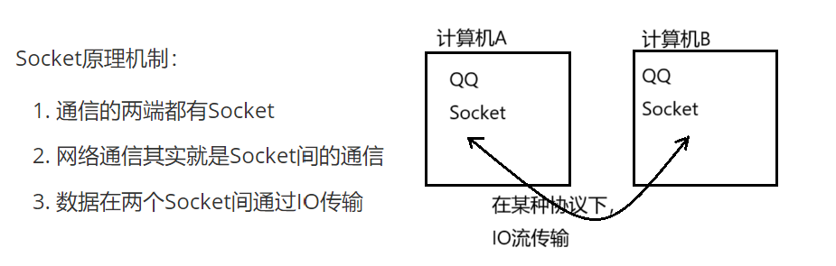

# 【Java】Java进阶（四）计算机网络


## 计算机网络

**计算机网络**：多台计算机+连接+信息传递/资源共享

**网络编程**：多台计算机+程序之间+数据交换

**网络模型**：

1. TCP/IP参考模型 —— 4层
   - 应用层
   - 传输层
   - 网际层
2. OSI参考模型 —— 7层模型
   - 应用层：应用程序
   - 表示层：数据解释，加/解密，人机交换
   - 会话层：会话请求，实现通信
   - 传输层：数据传输协议，端口号（TCP/UDP）
   - 网络成：对数据进行IP地址（加/解封装）【设备：路由器；数据：数据包】
   - 数据链接层：MAC地址（加/解封装）【设备：交换机；数据：帧】
   - 物理层 ：传输比特流，定义设备标准，接口类型，传输速率（不同介质/IO流）
3. 网络编程的3要素：
   - IP地址：用于找到电脑
   - 端口：用于区分该电脑上的程序
   - 协议：按照某种规则
4. 两个Dos命令：
   - `ipconfig`查看本地IP地址
   - `ping` 测试本机与指定的IP地址之间通信是否有问题

<br/>

### 二、IP地址（标识号）

#### 1、定义

指定和识别计算机，网络中，计算机的唯一标识。

#### 2、十进制表示

**问**：计算机只能识别二进制的数据，IP地址应该是一个二进制的数据，但我们配置的IP地址却不是二进制的为什么？

**IP地址组成**：网络号段+主机号段

`192.168.1.100`

换算

`00000000   10101000  00000001  01100100`

如此配置IP地址，记忆会比较麻烦，所以每一个字节换成十进制，用点分开。这种方法叫**点分十进制**

#### 3、IP地址分类：

A类：1.0.0.1 ~ 127.255.255.254  

​	第一号段为网络号段（机号段 256×256×256，可配16777216台）

B类：128.0.0.1 ~ 191.255.255.254 

​	前两段为网络号段，后两位为主机号段（机号段 256×256，可配65536台）

C类：192.0.0.1 ~ 233.255.255.254    (前三段为网络号段，主机号段可配256台)

D类：224.0.0.1 ~ 239.255.255.254 （D类为保留地址）

E类：240.0.0.1 ~ 247.255.255.254  （E类为保留地址）



- `10.x.x.x` 和 `192.168.x.x` 为私有地址，在互联网上不使用，在局域网中使用
- 特殊的IP地址：

- - 127.0.0.1 回环地址（表示本机）
  - x.x.x.255 广播地址

  - x.x.x.0 网络地址



<br/>

#### 4、InetAddress

`InetAddress` 是 Java 中的一个类，用于表示 Internet 互联网协议（IP）地址。它在网络编程中非常重要，主要用于处理与 IP 地址和主机名相关的操作。

##### 主要功能

1. **主机名解析**：可以将主机名（例如 `www.example.com`）转换为对应的 IP 地址。
2. **获取本地主机**：可以通过 `InetAddress.getLocalHost()` 方法获取本机的 IP 地址。
3. **处理 IP 地址**：可以从 IP 地址创建 `InetAddress` 对象，也可以从 IP 地址获取主机名等。

##### 常用方法

- `public static InetAddress getByName(String host)`：返回指定主机的 IP 地址。
- `public static InetAddress getLocalHost()`：返回本地主机的 IP 地址。
- `public String getHostName()`：获取该 IP 地址对应的主机名。
- `public String getHostAddress()`：返回 IP 地址的字符串表示。
- `public boolean isReachable(int timeout)`：测试该 IP 地址在指定的超时时间内是否可达。

##### 示例代码

以下是一个简单的 Java 示例，展示如何使用 `InetAddress`：

```java
import java.net.InetAddress;  

public class Main {  
    public static void main(String[] args) {  
        try {  
            // 获取主机的 IP 地址  
            InetAddress inetAddress = InetAddress.getByName("www.example.com");  
            System.out.println("IP 地址: " + inetAddress.getHostAddress());  
            System.out.println("主机名: " + inetAddress.getHostName());  

            // 获取本地主机  
            InetAddress localHost = InetAddress.getLocalHost();  
            System.out.println("本地主机 IP 地址: " + localHost.getHostAddress());  
        } catch (Exception e) {  
            e.printStackTrace();  
        }  
    }  
}  
```

<br/>

### 三、 端口号：

物理端口/逻辑端口（我们指端口，一般说的是逻辑端口）

1. 每一个网络程序都至少一个逻辑端口
2. 用于标识进程（运行中的程序）的逻辑地址，不同进程的标识
3. 有效端口：`0~65535`、`0~1074`系统使用或保留端口

<br/>

### 四、协议（通信的规则）

#### Socket

`Socket` 是网络编程中的一个重要类，尤其在 Java 中，用于处理 `TCP/IP` 协议下的网络通信。它提供了一种**将计算机之间建立连接**并**进行双向通信**的方式。



##### 主要功能

1. **建立连接**：`Socket` 类允许客户端通过 IP 地址和端口号与服务器建立连接。
2. **数据传输**：一旦连接建立，客户端和服务器可以通过输入流和输出流进行数据传输。
3. **关闭连接**：完成通信后，可以关闭 `Socket` 以释放资源。

##### 常用方法

- `public InputStream getInputStream()`：返回与此套接字关联的输入流，用于接收数据。
- `public OutputStream getOutputStream()`：返回与此套接字关联的输出流，用于发送数据。
- `public void close()`：关闭套接字并释放与之关联的资源。
- `public InetAddress getInetAddress()`：返回与此套接字关联的远程 IP 地址。

##### 用法示例

以下是一个简单的 Java 示例，展示如何创建一个 `Socket` 并进行基本的通信：

###### 服务器端

```java
import java.net.ServerSocket;  
import java.net.Socket;  
import java.io.InputStreamReader;  
import java.io.BufferedReader;  
import java.io.PrintWriter;  

public class Server {  
    public static void main(String[] args) {  
        try (ServerSocket serverSocket = new ServerSocket(12345)) {  
            System.out.println("服务器启动，等待客户端连接...");  
            Socket socket = serverSocket.accept(); // 等待客户端连接  
            System.out.println("客户端已连接: " + socket.getInetAddress());  

            // 获取输入流  
            BufferedReader in = new BufferedReader(new InputStreamReader(socket.getInputStream()));  
            PrintWriter out = new PrintWriter(socket.getOutputStream(), true);  

            String clientMessage;  
            while ((clientMessage = in.readLine()) != null) {  
                System.out.println("客户端消息: " + clientMessage);  
                out.println("服务器回应: " + clientMessage); // echo back  
            }  
        } catch (Exception e) {  
            e.printStackTrace();  
        }  
    }  
}  
```

###### 客户端

```java
import java.net.Socket;  
import java.io.PrintWriter;  
import java.io.BufferedReader;  
import java.io.InputStreamReader;  

public class Client {  
    public static void main(String[] args) {  
        try (Socket socket = new Socket("localhost", 12345)) {  
            PrintWriter out = new PrintWriter(socket.getOutputStream(), true);  
            BufferedReader in = new BufferedReader(new InputStreamReader(socket.getInputStream()));  

            out.println("你好，服务器！");  
            String response = in.readLine();  
            System.out.println("收到的回应: " + response);  
        } catch (Exception e) {  
            e.printStackTrace();  
        }  
    }  
}  
```

在这个例子中，服务器在特定端口（12345）上监听客户端连接，而客户端连接到服务器并发送一条消息。服务器接受消息并返回相同的消息。

<br/>

#### UDP协议

UDP（用户数据报协议）是一种**无连接**的协议，适用于**发送短小的**数据报，提供简单而快速的数据传输。UDP 不保证数据的完整性、顺序或重传，因此在实时应用（例如视频通话、在线游戏）中常用。

##### 使用 Java 通过 UDP 发送数据

在 Java 中，你可以使用 `DatagramSocket` 和 `DatagramPacket` 类来发送和接收 UDP 数据报。

##### UDP 发送数据的基本步骤

1. **创建 `DatagramSocket`**：用于发送数据的套接字。
2. **构造数据包 `DatagramPacket`**：包含要发送的数据、目标地址和端口号。
3. **发送数据包**：使用 `send()` 方法发送数据包。
4. **关闭套接字**：数据发送完成后，关闭套接字。

##### UDP 接收数据的基本步骤

1. **创建 `DatagramSocket`**：在指定端口上创建一个套接字以监听接入的数据包。
2. **创建接收数据包 `DatagramPacket`**：定义一个缓冲区，用于存储接收到的数据。
3. **接收数据包**：使用 `receive()` 方法接收数据包。
4. **处理数据**：从数据包中提取数据并进行处理。
5. **关闭套接字**：完成接收后，关闭套接字。

##### 示例代码

下面是一个简单的示例，展示如何使用 UDP 发送数据：

###### UDP 客户端

```java
import java.net.DatagramPacket;  
import java.net.DatagramSocket;  
import java.net.InetAddress;  

public class UDPClient {  
    public static void main(String[] args) {  
        DatagramSocket socket = null;  
        try {  
            socket = new DatagramSocket();  
            String message = "Hello, UDP Server!";  
            byte[] buffer = message.getBytes();  
            
            // 要发送的数据包  
            InetAddress address = InetAddress.getByName("localhost");  
            DatagramPacket packet = new DatagramPacket(buffer, buffer.length, address, 12345);  

            // 发送数据包  
            socket.send(packet);  
            System.out.println("数据已发送: " + message);  
        } catch (Exception e) {  
            e.printStackTrace();  
        } finally {  
            if (socket != null && !socket.isClosed()) {  
                socket.close();  
            }  
        }  
    }  
}  
```

###### UDP 服务器

```java
import java.net.DatagramPacket;  
import java.net.DatagramSocket;  

public class UDPServer {  
    public static void main(String[] args) {  
        DatagramSocket socket = null;  
        try {  
            // 在端口 12345 上创建 DatagramSocket  
            socket = new DatagramSocket(12345);  
            byte[] buffer = new byte[1024]; // 接收缓冲区  

            System.out.println("服务器已启动，等待接收数据...");  
            while (true) {  
                // 创建接收数据包  
                DatagramPacket packet = new DatagramPacket(buffer, buffer.length);  
                
                // 接收数据包  
                socket.receive(packet);   

                // 从数据包中获取消息  
                String receivedMessage = new String(packet.getData(), 0, packet.getLength());  
                System.out.println("接收到的消息: " + receivedMessage);  
                
                // 如果需要，可以回复给客户端（可选）  
                // 这里可以选择是否回复数据  
            }  
        } catch (Exception e) {  
            e.printStackTrace();  
        } finally {  
            if (socket != null && !socket.isClosed()) {  
                socket.close();  
            }  
        }  
    }  
}  
```

###### 代码说明

1. **UDP 服务器**：在端口 `12345` 上监听来自客户端的数据报，一旦接收到数据，即打印出内容。
2. **UDP 客户端**：创建数据报并发送包含 "Hello, UDP Server!" 的消息到服务器。

通过这种方式，可以实现利用 UDP 协议在客户端和服务器之间进行数据传输。

##### UDP协议特点

1. 把数据打包（数据源+目的）
2. 数据有限制 64k
3. 不建立连接
4. 速度快
5. 不可靠（不保证对方能收到）

<br/>

#### TCP协议

TCP（传输控制协议）是一种**面向连接**的协议，提供**可靠的、按顺序发送的**数据流。TCP 保证所有数据包的完整性并进行错误检查，适合需要确保数据传输可靠性的应用（例如网页浏览、文件传输等）。

##### 使用 Java 通过 TCP 发送数据

在 Java 中，可以使用 `Socket` 类用于客户端和 `ServerSocket` 类用于服务器端进行 TCP 连接和数据传输。

##### TCP 发送数据的基本步骤

1. **创建 `ServerSocket`**：在服务器上绑定一个端口以监听客户端连接。
2. **接受连接**：使用 `accept()` 方法等待并接受客户端的连接。
3. **创建 `Socket`**：一旦客户端连接后，服务器和客户端通过 `Socket` 进行通信。
4. **发送和接收数据**：使用输入流和输出流进行数据的读取和写入。
5. **关闭连接**：完成数据传输后，关闭输入流和输出流，以及套接字。

##### 示例代码

下面是一个简单示例，展示如何使用 TCP 在客户端和服务器之间发送数据。

###### TCP 服务器

```java
import java.io.BufferedReader;  
import java.io.InputStreamReader;  
import java.io.PrintWriter;  
import java.net.ServerSocket;  
import java.net.Socket;  

public class TCPServer {  
    public static void main(String[] args) {  
        try (ServerSocket serverSocket = new ServerSocket(12345)) {  
            System.out.println("服务器已启动，等待客户端连接...");  

            // 接受客户端连接  
            try (Socket clientSocket = serverSocket.accept()) {  
                System.out.println("客户端已连接: " + clientSocket.getInetAddress());  

                // 输入输出流  
                BufferedReader in = new BufferedReader(new InputStreamReader(clientSocket.getInputStream()));  
                PrintWriter out = new PrintWriter(clientSocket.getOutputStream(), true);  

                String clientMessage;  
                while ((clientMessage = in.readLine()) != null) {  
                    System.out.println("接收到的消息: " + clientMessage);  
                    out.println("服务器回应: " + clientMessage); // echo back  
                }  
            }  
        } catch (Exception e) {  
            e.printStackTrace();  
        }  
    }  
}  
```

###### TCP 客户端

```java
import java.io.BufferedReader;  
import java.io.InputStreamReader;  
import java.io.PrintWriter;  
import java.net.Socket;  

public class TCPClient {  
    public static void main(String[] args) {  
        try (Socket socket = new Socket("localhost", 12345)) {  
            // 输入输出流  
            PrintWriter out = new PrintWriter(socket.getOutputStream(), true);  
            BufferedReader in = new BufferedReader(new InputStreamReader(socket.getInputStream()));  

            // 发送消息  
            out.println("你好，服务器！");  
            String response = in.readLine(); // 接收服务器响应  
            System.out.println("收到的回应: " + response);  
        } catch (Exception e) {  
            e.printStackTrace();  
        }  
    }  
}  
```

###### 代码说明

1. **TCP 服务器**：监听端口 `12345`，接受来自客户端的连接。一旦连接建立，就读取客户端发送的数据，并发送回应。
2. **TCP 客户端**：连接到服务器，发送一个消息 "你好，服务器！"，并等待接收服务器的回应。

###### 如何运行

1. 首先在你的 IDE 或命令行中运行 TCP 服务器代码。
2. 然后在同一个或不同的窗口运行 TCP 客户端代码。

这样，客户端会发送消息到服务器，并且服务器会返回相同的消息作为回应。

##### TCP协议特点

1. 建立连接通道
2. 数据无限制
3. 速度慢
4. 可靠（三次握手）

<br/>

## 类加载

**类的加载**：加载 → 连接【验证、准备、解析】→ 初始化

**类加载器**：复制将class文件加载到内存中，并生成对应的class对象

- `Bootstrap ClassLoader` 根类·加载器：负责Java核心类的加载【jdk\jre\lib】
- `Extension ClassLoader `扩展类·加载器：负责jre的扩展目录中jar包的加载
- `System ClassLoader` 系统类·加载器：负责jvm启动时，class文件的加载

**java类中运算符优先级**：

1. `()`
2. `! + - ++ --`  正负
3. `* / %`
4. `+ -` 加减
5. `<  <=  >=  >`
6. `==  !=`
7. `^`
8. `&&`
9. `||`
10. `?=`
11. `=  +=  -=  *=  /=  %=`

