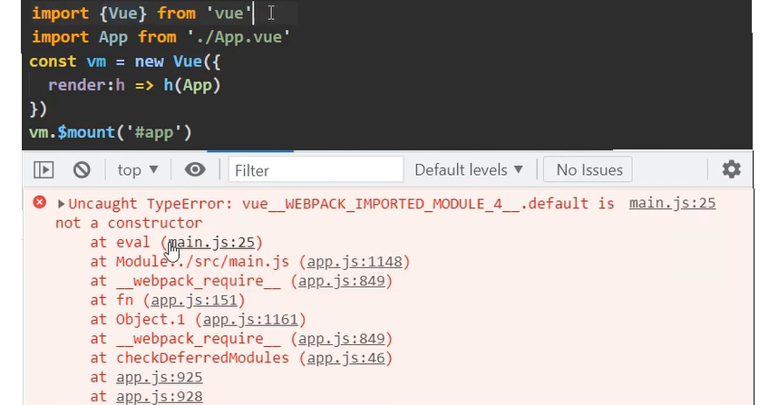
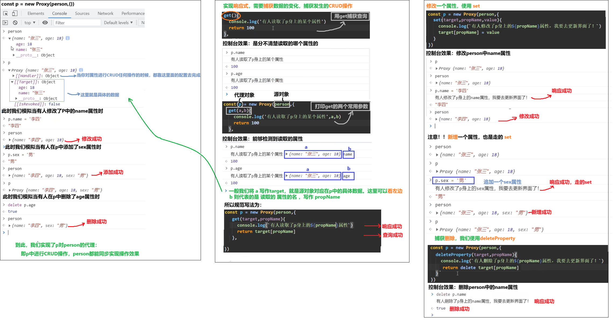
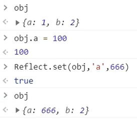
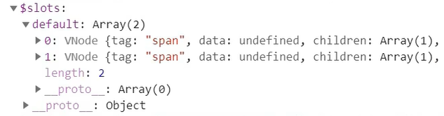
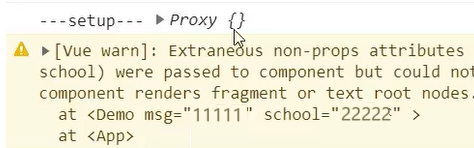
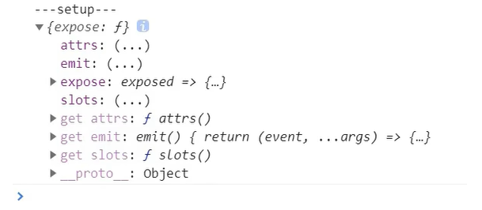
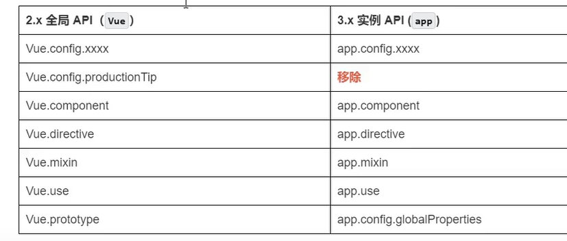

# 【Vue前端框架】Vue3.0全套教程


## Vue3快速上手

### 1.Vue3简介

- 2020年9月18日，Vue.js发布3.0版本，代号:One Piece(海贼王)
- 耗时2年多、2600+次提交、30+个RFC（请求修改意见稿）、600+次PR、99位贡献者
- github上的tags（各个开源版本）地址:https://github.com/vuejs/vue-next/releases/tag/v3.0.0

### 2.Vue3带来了什么


## 一、创建Vue3.0工程

### 1.使用 vue-cli 创建

官方文档：https://cli.vuejs.org/zh/guide/creating-a-project.html#vue-create

```sh
## 查看@vue/c1i版本，确保@vue/cli版本在4.5.0以上 ,vue -V查看本机@vue/c1i版本
vue --version
## 安装或者升级你的@vue/cli --不满足版本要求就自行这一步重新安装
npm install -g @vue/cli
## 创建
vue create vue_test
## 启动
cd vue_test
npm run serve
```

​       

### 2.使用 vite 创建

官方文档：https://v3.cn.vuejs.org/guide/installation.html#vite
vite官网：https://vitejs.cn

- 什么是vite? —— 新一代前端构建工具（作用对比webpack）。

- 优势如下：

  - 开发环境中，无需打包操作，可快速的冷启动。
  - 轻量快速的热重载(HMR)
  - 真正的按需编译，不再等待整个应用编译完成。

- 传统构建 与 vite构建对比图（这两张图来自于vite官网[位置](https://vitejs.cn/vite5-cn/guide/why.html)）

  

  `npm run serve`这种的`webpack`**传统工作模式**：先是从一个`entry`，先看路由，再看模块，再进行打包，最后告知8080服务器启动好了。【主要等待时间在`Bundle`打包的位置】

  

   **vite构建工作模式**：先告知8080服务器启动准备完成，根据你发起的请求，找到对应的`entry`并且解析该模块对应的路由和组件信息展示。

  ```sh
  ## 创建工程
  npm init vite-app <project-name>
  ##进入工程目录
  cd <project-name>
  ##安装依赖
  npm insta1l
  ## 运行
  npm run dev
  ```

  我们将两种构建模式放一起同时运行，很明显vite方式的要比传统方式快很多。

  期间，传统方式等待的这段时间，就是在打包。

  

  传统运行命令是`npm run serve`，vite运行命令式`npm run dev`。现在vite模式还没有大规模应用，所以我们此文档后面的演示还是使用基于传统模式的运行方式。

  

  


### 3.分析工程结构



分析工程结构，需要：使用Vue3搭建好后最原始的初始化工程

关闭框架自动的校验提示，同样使用Vue2中根目录下的`vue.config.js`文件。拷贝放入根目录即可。



#### 入口文件main.js

首先分析入口文件，文件路径为`工程项目包/src/main.js`

```js
//引入的不再是Vue构造函数了，引入的是一个名为createApp的工厂函数
//Vue构造函数：需要使用new关键字进行引用
//工厂函数：不需要使用new关键字，可以直接调用，如：createApp()
import {createApp } from 'vue'
import App from './App.vue‘

createApp(App).mount('#app')
```

我们对这一句代码`createApp(App).mount('#app')`，进行拆解分析：

```js
//创建应用实例对象，类似于vm，但app比vm更"轻"，没有那么多的属性和方法
const app = createApp(App) 
app.mount('#app') //挂载mount。

//对应挂载mount，有unmount卸载.
//使用定时器，1秒钟后卸载app组件，整体页面消失
setTimeout(()=>{
    app.unmount('#app')
},1000)
```

对比vue2中写法，可以发现结构其实是相似的：

```js
import {Vue } from 'vue'
const vm = new Vue({
    render:h=>h(App)
})
vm.$mount('#app')
```



在Vue3的项目入口文件中使用Vue2中的写法是不可以的。我们可以清晰的看见报错信息：

翻译过来为：不存在的对象，不能进行实例化。



我们打印Vue实例对象，我们发现并没有成功引入进来。


所以使用new实例化对象的Vue2写法在Vue3项目中并不可行。



#### 领头组件App.vue

```vue
<template>
<!--Vue3组件中的模板结构，可以不使用div根标签包裹，如果写，也不会报错-->
    
    <HelloWorld msg="Welcome to Your Vue.js App"/>
</template>

<script>
<!--正常引入组件-->
import HelloWorld from './components/HelloWorld.vue'
export default {
    name: 'App',
    components:{HelloWorld}
}
</script>

<!--组件样式-->
<style>
    .....
</style>
```

### 4.安装开发者工具

Vue2篇幅中，安装在浏览器里的Vue开发者工具是不支持Vue3的。

由此，我们需要安装Vue3专用的开发者工具。

同样，也有两种安装方式：

1. **在线安装：**直接在chrome网上应用商店，搜索`vue`，选择图标带脚标的，进行添加安装

   

   

   

2. **离线安装：**Vue开发者工具安装包，拖入拓展程序页面，点击添加，添加后启用。

   

   

3. 如果扩展程序同时添加了Vue2以及Vue3的开发者工具，则需要禁用一个，启用一个。

   


## 二、常用 Composition API

Composition API 我们也称`组合式API`

官方文档: https://v3.cn.vuejs.org/guide/composition-api-introduction.html

### 1.setup配置项

1. 理解：Vue3.0中一个新的配置项，值为一个函数。

   ```js
   setup(){
   	//数据
       //方法
       //计算属性，监视属性
       //生命周期等钩子函数
   }
   ```

2. 组件中所用到的：数据、方法等等，均要配置在setup中。

3. setup函数的两种返回值:

   1.若返回一个对象，则对象中的属性、方法,在模板中均可以直接使用。

   2.若返回一个渲染函数：则可以自定义渲染内容。

4. 简单示例：

   ```vue
   <template>
   <h1>Hello Vue3</h1>
   <!--直接使用setup的返回中暴露的数据和方法-->
   <h2>姓名：{{name}}</h2>
   <h2>年龄：{{age}}</h2>
   <button @click="sayHello">说你好</button>
   </template>
   
   <!--返回一个对象-->
   <script>
       export default {
           name:'App',
           //此处简单示例只用于测试setup工作，暂不考虑处理响应式
           setup(){
               //数据
               let name = '张三'  //不用const说明，以后这些数据有可能发生变化
               let age = 18
               
               //方法
               function sayHello(){
                   alert(`我叫${name},我${age}岁了，你好！`) //使用``模版字符串
               }
               
               //setup返回一个对象，将所有数据和方法暴露出去
               return {
                  name, //当key-value形式，写为 name:name时，可以触发简写形式name
                  age,
                  sayHello 
               }
           }
       }
   </script>
   ```

   ```vue
   <template>
   <!--不论此模版处写什么，都不进行编译，只读取返回的渲染函数中的内容-->
   <h1>Hello Vue3</h1>
   </template>
   
   <!--返回一个渲染函数-->
   <script>
       //手动引用h函数
       import {h} from 'vue'
       export default {
           name:'App',
           setup(){
               //数据
               let name = '张三'
               let age = 18
               
               //方法
               function sayHello(){
                   alert(`我叫${name},我${age}岁了，你好！`)
               }
               
               //setup返回一个渲染函数【这种写法不常用，但可做了解】
               //在Vue2中，有个render配置项
               //只要写render，Vue就帮你传入一个h，并调用，这个h就是渲染函数
               //Vue3中，需要手动引入这个h函数，才能调用
               //调用方式和Vue2中一样，传入两个参数:h('想要放入页面的元素','该元素对应的文字')
               //例如：h('h1','你好')
               //将h函数的调用返回值暴露返回给setup的return。return h('h1','你好')
               //即整体写做   return ()=>{return h('h1','你好')}
               //简写为  return ()=> h('h1','你好')
               return ()=> h('h1','你好')
           }
       }
   </script>
   ```

5. Vue3是可以向下兼容Vue2写法的，他们可以同时存在和使用，例如：

   ```vue
   <template>
   <!--Vue3所配置的数据及方法-->
   <h2>姓名：{{name}}</h2>
   <button @click="sayHello">说你好</button>
   
   <!--Vue2所配置的数据及方法-->
   <h2>姓名：{{age}}</h2>
   <button @click="sayAge">说你好</button>
   </template>
   
   <!--返回一个对象-->
   <script>
       export default {
           name:'App',
           //-----------Vue2语法------------
           data(){
               return {sex:'男'}
           },
           methods：{
           	sayAge(){ alert(`22222222`) }
       	},
           //-----------Vue3语法------------
           setup(){
               let name = '张三'
               function sayHello(){ alert(`11111111`) }
               return { name,sayHello }
           }
       }
   </script>
   ```

6. 注意点:

   1. 尽量不要与Vue2.x配置混用

      - Vue2.x配置(data、methos、computed..)中可以访问到setup中的属性、方法。

        ```vue
        <!--Vue2中访问Vue3的setup配置中的数据、方法：均能访问成功-->
        <script>
            export default {
                name:'App',
                data(){
                    return {sex:'男'}
                },
                methods：{
                    test(){
                        console.log(this.sex)  //男
                        console.log(this.name) //张三
                        console.log(this.sayHello) //function(..)
                    }
            	},
                //-----------Vue3语法------------
                setup(){
                    let name = '张三'
                    function sayHello(){ alert(`11111111`) }
                    return { name,sayHello }
                }
            }
        </script>
        ```

      - 但在setup中不能访问到Vue2.x配置(data、methos、computed...)。

        ```vue
        <!--Vue3的setup配置中访问Vue2的数据、方法：均不能访问成功-->
        <script>
            export default {
                name:'App',
                data(){
                    return {sex:'男'}
                },
                methods：{
                	sayAge(){ alert(`22222222`) }
            	},
                setup(){
                    let name = '张三'
                    function sayHello(){ alert(`11111111`) }
                    function test(){ 
                        console.log(this.sex)  	  //undefined
                        console.log(this.sayAge)  //undefined
                        console.log(name) //张三
                        console.log(sayHello) //function(..)                
                    }
                    return { name,sayHello,test }
                }
            }
        </script>
        ```

      - 如果有重名，setup优先。

        ```vue
        <template>
        <h2>{{a}}</h2><!--编译a的值，显示为：200-->
        </template>
        
        <script>
            export default {
                name:'App',
                //-----------Vue2语法------------
                data(){
                    return {a:100}
                },
                //-----------Vue3语法------------
                setup(){
                    let a = 200
                    return { a }
                }
            }
        </script>
        ```

        

   2. setup不能是一个async函数（不可写做`async setup(){}`）。

      凡是`async`修饰的函数，返回值不再是return的对象，而是promise包裹了一层的对象，会导致Vue模板看不到return对象中的属性。

      在写function为同异步调用的时候特别注意！！这里不能使用！！会导致模版编译不可用！！

   

### 2.ref函数

- 作用：定义一个响应式的数据
- 接收的数据可以是：基本类型、也可以是对象类型。
- 基本类型的数据：响应式依然是靠 0bject.defineProperty()的 get 与 set 完成的。
- 对象类型的数据：响应式内部“求助”了Vue3.0中的一个新函数-reactive函数【后面阐述】

Vue2中ref是一个标签属性，写做`<input ref="qwq' ...>`，用于标识组件或者标签。

Vue3中ref也可以作为标签属性，但他还有一个用法，就是作为ref函数：

**看一个现象：**

正常声明数据变量，并在方法中修改，变量被修改成功，但页面并不渲染。


```vue
<template>
    <h1>一个人的信息</h1>
    <h2>姓名:{{name}}</h2>
    <h2>年龄:{{age}}</h2>
    <button @click="changeInfo">修改人的信息</button>
</template>

<script>
    export default {
        name: 'App',
        setup(){
        let name = '张三'
        let age = 18
        //方法
        function changeInfo(){
            name ='李四'
       		age = 48
        	console.log(name,age)
        }
        return {
            name,
            age,
            changeInfo
        }
    }
</script>
```

#### ref函数-基本类型数据申明

我们用ref函数包裹申明，并且打印申明的数据：

```js
import {ref} from 'vue'
....
setup(){
        let name = ref('张三')
    	let age = ref(18)
        //方法
        function changeInfo(){
        	console.log(name)
            console.log(18)
        }
....
```


根据打印结果，很明显的，所有的数据都申明成了一个`RefImpl`对象。

数据内容都是对`RefImpl`的实例化。

我们拆分`RefImpl`单词，分别为`reference`引用，` implement`实现。所以对其申明的对象（`{}`中的内容），我们称之为：**引用实现对象。**

全称：引用实现的实例对象。

也简称：引用对象。

对于基本数据类型，如果在Vue3中想要实现响应式，则需要将数据丢给ref函数进行处理，形成引用对象。

在Vue3中，基本数据类型通过ref实现响应式，和Vue2中一样，也是通过`0bject.defineProperty()`实现getter、setter的方式。

且getter、setter其不在实例对象本体`RefImpl`上，而在原型对象`__proto__`上。找不到默认往原型上找，可以成功找到。使用数据的时候，可以通过`.value`的方式进行访问，修改时，也可以通过setter进行页面的重新渲染，且保证了实例对象的属性精简。


上述例子，修改数据的完整写法：

```vue
<template>
    <h1>一个人的信息</h1>
    <h2>姓名:{{name}}</h2>
    <h2>年龄:{{age}}</h2>
    <button @click="changeInfo">修改人的信息</button>
</template>

<script>
    import {ref} from 'vue'
    export default {
        name: 'App',
        setup(){
            let name = ref('张三')
            let age = ref(18)
            //方法
            function changeInfo(){
                name.value ='李四'
                age.value  = 48
                console.log(name,age)
            }
            return {
                name,
                age,
                changeInfo
            }
    }
</script>
```



只有在setup访问中，遵循ES6语法时，访问数据才使用`.value`的形式。

在模版解析的时候：不能写成`name.value`。

```vue
<!--模版中，正常使用插值语法-->
<template>
    <h2>姓名:{{name}}</h2>
    <h2>年龄:{{age}}</h2>
</template>
```

在Vue3中，解析模版时，当其发现引用数据为`RefImpl`的实例对象，则会自动帮我们访问数据对象的`.value`属性。

如果再手动加`.value`，就会识别成`name.value.value`导致也能渲染失败



#### ref函数-对象类型数据申明

注意申明结构：

```js
let person = ref({
   name : '张三',
   age : 18
})
```

打印`person.value`结果


这里能看到，对象类型的数据实现响应式，不再同Vue2一样。而是使用的`Proxy`对象。【后面会详细阐述】

访问每个属性则使用：`person.value.type`

修改对象类型数据的完整写法：

```vue
<template>
    <h1>一个人的信息</h1>
    <h2>姓名:{{person.type}}</h2>
    <h2>年龄:{{person.salary}}</h2>
    <button @click="changeInfo">修改人的信息</button>
</template>

<script>
    import {ref} from 'vue'
    export default {
        name: 'App',
        setup(){
            let person = ref({
                type : '前端工程师',
                salary : 30k
            })
            //方法
            function changeInfo(){
               person.value.type = 'UI设计师'
               person.value.salary = '40k' 
            }
            return {
                person,
                changeInfo
            }
    }
</script>
```


### 3.reactive函数

- 作用：定义一个**对象类型**的响应式数据

与ref基本和对象类型的都可以申明不同，reactive只能申明对象类型的。用reactive申明基本数据类型`let number = reactive(666)`，控制台报错：


申明对象类型的，则控制台打印：


- 语法：`const 代理对象 = reactive(源对象) `

  接收一个对象(或数组)，返回一个**代理对象(proxy的实例对象，简称proxy对象)**

  ```js
  //申明对象
  let job = reactive({
      d:111,
  	a:{
          b:{
              c: 666
          }
      }
  })
  ```

  - reactive定义的响应式数据是“深层次的”。

  ```js
  //修改对象
  job.a.b.c = 999
  ```

  ```js
  //申明数组
  let hobby = reactive(['111','222','333'])
  ```

  ```js
  //修改数组
  hobby[0] = '000'
  ```

- 内部基于 ES6 的 Proxy 实现，通过 <u>代理对象</u> 操作 <u>源对象</u>  内部数据进行操作。

​    

### 4.Vue3.0中的响应式原理

#### vue2.x的响应式

- 实现原理:

  - 对象类型:通过 Object.defineProperty()对对象的的读取、修改进行拦截(数据劫持)。

  - 数组类型:通过重写更新数组的一系列方法来实现拦截。(对数组的变更方法进行了包裹)

    ```js
    Object.defineProperty(data,'count',{
        get(){}，
        set(){}
    })
    ```

- 存在问题：

  - 新增属性、删除属性，界面不会更新。（原因是：defineProperty只检测查改，检测不到增删。检测查改利用的get和set，没有检测增删的手段和方法）

    ```vue
    <template>
    	<div>
            <!--person身上追加一个性别属性，删除原有的name属性-->
        	<h1 v-show="person.name">姓名：{{person.name}}</h1>
            <h1>年龄：{{person.age}}</h1>
            <h1 v-show="person.sex">性别：{{person.sex}}</h1>
        </div>
    </template>
    
    <script>
        export default {
            name: 'App',
            data(){
                return {
                    person:{
                        name:'张三'，
                        age: 18
                    }
                }
            },
            methods:{
                addSex(){
                    this.person.sex = '女'  //person中数据改了，但是页面不更新
                    //解决办法
                    this.$set(this.person,'sex','女')
                    //或者 import Vue from 'vue'
                    Vue.set(this.person,'sex','女')
                },
                deleteName(){
                    delete this.person.name //person中数据改了，但是页面不更新
                    //解决办法
                    this.$delete(this.person,'name')
                    //或者 import Vue from 'vue'
                    Vue.delete(this.person,'name')
                }
            }
        }
    </script>
    ```

  - 直接通过下标修改数组,界面不会自动更新。

    ```vue
    <template>
    	<div>
            <!-- -->
        	<h1>爱好：{{person.hobby}}</h1>
        </div>
    </template>
    
    <script>
        export default {
            name: 'App',
            data(){
                return {
                    person:{
                        hobby:['学习','吃饭','睡觉']
                    }
                }
            },
            methods:{
                updateHobby(){
                    this.person.hobby[0] = '逛街' //person中数据改了，但是页面不更新
                    //解决办法
                    this.$set(this.person.hobby,0,'逛街')
                    //或者
                    this.person.hobby.splice(0,1,'逛街')
                }
            }
        }
    </script>
    ```

    ​      

#### vue3.0的响应式

##### vue2.x的响应式模拟

1. 新建一个`.html`文件，我们在其中模拟vue2.x实现响应式原理的关键代码

```html
<!DOCTYPE html>
<html lang="en">
<head>
    <meta charset="UTF-8">
    <title>Document</title>
</head>
<body>
    <script type="text/javascript">
        //源数据
        let person = {
            name:'张三'，
            age:18
        }
        
        //模拟Vue2中实现响应式
        let p = {}   //新建一个代理对象
        Object.defineProperty(p,'name',{    //(操作对象,'对象中要操作的属性',{get\set方法})
            configurable:true,//允许删除
            get(){ //有人读取person中的name时调用
                return person.name
            },
            set(value){  //有人修改person中name时调用
                console.log('有人修改了name属性，我发现了，我要去更新界面！')
                person.name = value
            }
        })
        
        //age同理----------------
        Object.defineProperty(p,'age',{   
            get(){ //有人读取person中的age时调用
                return person.age
            },
            set(value){  //有人修改person中age时调用
                console.log('有人修改了age属性，我发现了，我要去更新界面！')
                person.age = value
            }
        })
        
        //....
        //有多少个属性就要写多少个Object.defineProperty()----------------
    </script>
</body>
</html>
```

测试一下响应式的效果


​      

##### vue3.0的响应式模拟

- 想研究Vue3中的响应式，需要认识window上的`window.Proxy`这个函数。

  他是window身上的一个**内置的**构造函数（不用下载安装，不用引入，直接就可以通过window使用）

- 这个`Proxy`我们在之前配置脚手架的代理的时候也用过，当时用作解决ajax跨域的问题。其实，不管在哪里，他都是**代理**的意思。

- 他的作用，就是使用p去映射对person的操作。和defineProperty弄出来一个p去匹配get、set；一操作p，就使person发生变化，并且能检测到，是一个道理。

**下面是他的使用语法**：

1. 同样是新建一个`.html`文件，我们在其中模拟vue3.0实现响应式原理的关键代码

```html
<!--只是模拟关键代码，阐述原理，vue3底层并不是真正的这样去直接操作源数据-->
<!DOCTYPE html>
<html lang="en">
<head>
    <meta charset="UTF-8">
    <title>Document</title>
</head>
<body>
    <script type="text/javascript">
        //源数据
        let person = {
            name:'张三'，
            age:18
        }
        
        //模拟Vue3中实现响应式
        //(要代理的对象，{代理使用的CRUD方法})
   		//const p = new Proxy(person,{})   //{}里可以空着，但是{}必须写
        const p = new Proxy(person,{
            get(target, propName){
                console.log('有人读取了p身上的${propName}属性，我发现了，我要去更新界面！')
                return target[propName]
            },
            set(target, propName, value){
                console.log('有人修改了p身上的${propName}属性，我发现了，我要去更新界面！')
                target[propName] = value
            }，
            // 拦截删除属性
            deleteProperty(target,propName){
            console.log('有人删除了p身上的${propName}属性，我发现了，我要去更新界面！')
                return delete target[propName]
            }
        })
        
        //不管多少个属性，写一个Proxy就可以了----------------
    </script>
</body>
</html>
```

测试一下响应式的效果



##### vue3.0的响应式真实原理



```JS
new Proxy(data,{
    // 拦截读取属性值
    get(target, propName){
        return Reflect.get(target,propName)
    },
    // 拦截设置属性值或添加新属性
    set(target, propName, value){
        return Reflect.set(target,propName,value)
	}，
    // 拦截删除属性
	deleteProperty(target,propName){
    	return Reflect.deleteProperty(target,propName)
	}
})
```

- 实现原理:

  - 通过Proxy(代理)：拦截对象中任意属性的变化，包括:属性值的读写、属性的添加、属性的删除等。

  - 通过Reflect(反射)：对被代理对象的属性进行操作。

  - MDN文档中描述的Proxy与Reflect：
    - Proxy: https://developer.mozilla.org/zh-CN/docs/Web/JavaScript/Reference/Global_Objects/Proxy
    - Reflect: https://developer.mozilla.org/zh-CN/docs/Web/JavaScript/Reference/Global_Objects/Reflect



```js
let obj = {a:1,b:2}
```

- **读取一个对象`obj`身上的属性：**

```js
//方式一
obj.a     //1

//方式二 
//window.Reflect 反射
Reflect.get(obj,'a')  //1
```

控制台效果：

****

- **修改一个对象`obj`身上的属性：**

```js
//方式一
obj.a = 100   //a=100

//方式二
Reflect.set(obj,'a',666)  //a=666
```

控制台效果：



- **删除一个对象`obj`身上的属性：**

```js
Reflect.deleteProperty(obj,'a') //true
```

控制台效果：

****

对象Object身上常用的API在Reflect上基本也有，所以`Object.defineProperty()`对应的`Reflect.defineProperty()`也是有的。

与`Object.defineProperty()`不同的是，`Reflect.defineProperty()`代码编译运行更加健壮，即使存在重复代码，也就能够继续往下执行。而Object却要使用`try..catch`抛出错误，才能使后方代码继续执行。

所以在Vue3中采用的是`Reflect.defineProperty()`。

​        

### 5.reactive对比ref

- 从定义数据角度对比：
  - ref用来定义：**基本类型数据**。
  - reactive用来定义：**对象(或数组)类型数据**
  - 备注：ref也可以用来定义**对象(或数组)类型数据**，它内部会自动通过 `reactive` 转为代理对象。
- 从原理角度对比：
  - ref通过 `Object.defineProperty()`的`get` 与 `set `来实现响应式**(数据劫持)**。
  - reactive通过使用**Proxy**来实现响应式(数据劫持),并通过`Reflect`操作**源对象**内部的数据。
- 从使用角度对比：
  - ref定义的数据：操作数据**需要**`.value`，读取数据时模板中直接读取**不需要**`.value`。
  - reactive定义的数据：操作数据与读取数据：**均不需要**`.value`。

​     

### 6.setup的两个注意点  

- setup执行的时机
  - 在beforeCreate之前执行一次，this是undefined。
- setup的参数
  - props：值为对象，包含：组件外部传递过来，且组件内部声明接收了的属性。
  - context：上下文对象
    - attrs：值为对象，包含：组件外部传递过来，但没有在props配置中声明的属性，相当于`this.$attrs`
    - slots: 收到的插槽内容，相当于`this.$slots`
    - emit: 分发自定义事件的函数，相当于`this.$emit `。




- props接受传参

```vue
<Demo msg='111' school='222'> <!--父组件中传值-->

<script>...,props:['msg','school'] //子组件中接受 </script>
<h3>{{msg}}</h3> <!--子组件中使用-->  
<h3>{{school}}</h3> <!--子组件中使用-->   
```

- $attrs存储传参

```vue
<Demo msg='111' school='222'> <!--父组件中传值-->

<script>...,props:[] //子组件中不接受 </script>
<h3>{{$attrs.msg}}</h3> <!--子组件中使用-->  
<h3>{{$attrs.school}}</h3> <!--子组件中使用--> 
```

- 这里注意一个现象：


- 同样的，$slots中也能够存储插槽的虚拟节点信息。如：

```vue
<Demo>
    <span>1111</span>
    <span>2222</span>
</Demo> <!--父组件中传值-->

<div class="demo">
    <h3>我是Demo组件</h3> 
    <slot></slot><!--子组件中不管使不使用，$slots中均有内容--> 
    <slot></slot>
</div>

```







- **setup在beforeCreate之前执行，且setup内的this是undefined。**

```vue
<script>
    export default {
        name: 'Demo',
        beforeCreate(){
            console.log('---beforeCreate---')
        }，
        setup(){
            console.log('---setup---',this)
        }
    }
</script>
```

控制台效果：


- **setup中的props参数接受传参**

```vue
<Demo msg='111' school='222'> <!--父组件中传值-->

<script><!--子组件中接收-->
    export default {
        name: 'Demo',
        setup(props){
            console.log('---setup---',props)
        }
    }
</script>
```

控制台效果：

​	

**说明Vue3中不能只申明不接收就在setup中使用！**

```vue
<script><!--子组件中接收-->
    export default {
        name: 'Demo',
        props:['msg','school'],//*******所有传入参数，必须全部申明*********
        setup(props){
            console.log('---setup---',props)
        }
    }
</script>
```

- **setup中的context参数**

```vue
<script><!--子组件中接收-->
    export default {
        name: 'Demo',
        setup(context){
            console.log('---setup---',context)
        }
    }
</script>
```

控制台效果：



这个里面配置项的效果，与Vue2中对应的配置项，的效果一致。

注意！emits要用的时候，必须都先申明：

```vue
<script><!--子组件中接收-->
    export default {
        name: 'Demo',
        props:['msg','school'],//*******申明props*********
        emits:['hello'],//*******申明emits*********
        setup(props,context){
            console.log('---setup---',context.attrs)//相当于Vue2中的$attrs
            console.log('---setup---',context.emit)//触发自定义事件
            console.log('---setup---',context.slots)//插槽
        }
    }
</script>
```

注意：Vue3中有API兼容的问题，推荐使用插槽的时候使用`v-slot:名字`的方式

```vue
<!--父组件中传值-->
<template v-slot:qwe>
	<span>11111</span>
</template>
```



### 7.计算属性与监视

#### 1.computed函数

- 与Vue2.x中computed配置功能一致
- 写法

```js
import {computed} from 'vue'

setup(){
    ...
    //计算属性一简写
    let fullName = computed(()=>{
        return person.firstName + '-' + person.lastName
    })
    //计算属性-完整
    let fullName = computed({
    get(){
    	return person.firstName +'-'+ person.lastName
    },
    set(value){
        const nameArr =value.split('_')
        person.firstName =nameArr[0]
        person.lastName =nameArr[1]
    }
    })
}
```

#### 2.watch函数

- 与Vue2.x中watch配置功能一致

- 两个小"坑"：

  - 监视reactive定义的响应式数据时：oldValue无法正确获取、强制开启了深度监视(deep配置失效)。
  - 监视reactive定义的响应式数据中某个属性时：deep配置有效。

  ```js
  //情况一:监视ref定义的响应式数据
  watch(sum,(newValue,oldValue)=>{
  	console.log('sum变化了',newValue,oldValue)
  },{immediate:true})
  
  //情况二:监视多个ref定义的响应式数据
  watch([sum,msg],(newValue,oldValue)=>{
      console.log('sum或msg变化了',newValue,oldValue)
  })
  
  /*情况三:监视reactive定义的响应式数据
  	若watch监视的是reactive定义的响应式数据，则无法正确获得oldvalue!!
  	若watch监视的是reactive定义的响应式数据，则强制开启了深度监视
  */
  
  watch(person,(newValue,oldValue)=>{
      console.log('person变化了',newValue,oldValue)
  },{immediate:true,deep:false})//此处的deep配置不再奏效
  
  //情况四:监视reactive定义的响应式数据中的某个属性
  watch(()=>person.job,(newValue,oldValue)=>{
      console.log('person的job变化了',newValue,oldValue)
  },{immediate:true,deep:true})
  
  //情况五:监视reactive所定义的一个响应式数据中的某些属性
   watch([()=>person.name,()=>person.age],(newValue,oldValue)=>{
       console.log('person的name或age变化了',newValue,oldValue)
   })
  
  //特殊情况
  watch(()=>person.job,(newValue,oldValue)=>{
      console.log('person的job变化了',newValue,oldValue)
  },{deep:true})//此处由于监视的是reactive素定义的对象中的某个属性，所以deep配置有效
  ```

  

#### 3.watchEffect函数

- watch的套路是：既要指明监视的属性，也要指明监视的回调。

- watchEfect的套路是：不用指明监视哪个属性，监视的回调中用到哪个属性，那就监视哪个属性。

- watchEffect有点像computed：

  - 但computed注重的计算出来的值(回调函数的返回值)，所以必须要写返回值

  - 而watchEffect更注重的是过程(回调函数的函数体)，所以不用写返回值。

  ```js
  //watchEffect所指定的回调中用到的数据只要发生变化，则直接重新执行回调。
  watchEffect(()=>{
      const x1= sum.value
      const x2=person.age
      console.log('watchEffect配置的回调执行了')
  })
  ```

  


### 8.生命周期

待完善

### 9.自定义hook函数

- 什么是hook?——本质是一个函数，把setup函数中使用的Composition API进行了封装。

- 类似于vue2.x中的mixin。

- 自定义hook的优势：复用代码，让setup中的逻辑更清楚易懂。

  

### 10.toRefs

- 作用：创建一个 ref对象，其value值指向另一个对象中的某个属性值。
- 语法：`const name =toRef(person,'name')`
- 应用：要将响应式对象中的某个属性单独提供给外部使用时。
- 扩展：`toRefs`与`toRef`功能一致，但可以批量创建多个ref 对象，语法：`toRefs(person)`


## 三、其它 Composition API

### 1.shallowReactive 与 shallowRef

- shallowReactive：只处理对象最外层属性的响应式(浅响应式)。

- shallowRef：只处理基本数据类型的响应式，不进行对象的响应式处理。

- 什么时候使用?

  - 如果有一个对象数据，结构比较深，但变化时只是外层属性变化 ===>  shallowReactive。

  - 如果有一个对象数据，后续功能不会修改该对象中的属性，而是生新的对象来替换 ===> shallowRef。

### 2.readonly 与 shallowReadonly

- readonly：让一个响应式数据变为只读的(深只读)。
- shallowReadonly：让一个响应式数据变为只读的(浅只读)。
- 应用场景：不希望数据被修改时。

### 3.toRaw 与 markRaw

- toRaw：

  - 作用：将一个由`reactive` 生成的**响应式对象**转为**普通对象**。

  - 使用场景：用于读取响应式对象对应的普通对象，对这个普通对象的所有操作，不会引起页面更新。

- markRaw：

  - 作用：标记一个对象，使其永远不会再成为响应式对象。

  - 应用场景：
    1. 有些值不应被设置为响应式的，例如复杂的第三方类库等。
    2. 当渲染具有不可变数据源的大列表时，跳过响应式转换可以提高性能。

### 4.customRef

- 作用：创建一个自定义的 ref，并对其依赖项跟踪和更新触发进行显式控制。

- 实现防抖效果：

  ```vue
  <template>
      <input type="text" v-model="keyword">
      <h3>{{keyword}}</h3>
  </template>
  
  <script>
      import {ref,customRef} from 'vue'
      export default{
          name:'Demo',
          setup(){\
              //let keyword = ref('hello')  //使用Vue准备好的内置ref
              //自定义一个myRef
              function myRef(value,delay){
                  let timer
                  //通过customRef去实现自定义
      			return customRef((track,trigger)=>{
                      return{
                          get(){
                              track()//告诉Vue这个value值是需要被“追踪”的
                              return value
                          },
      					set(newValue){
                              clearTimeout(timer)
                              timer = setTimeout(()=>{
                                  value = newValue
                                  trigger()//告诉Vue去更新界面
                              },delay)
                          }
                      }
                  })
              }
              
              // let keyWord =ref('hello')   //使用Vue提供的ref
              let keyWord = myRef('hello',500)//使用程序员自定义的ref
              
  			return {keyWord}
          }
  </script>
  ```

  

### 5.provide 与 inject

- 作用：实现**祖孙组件间**通信

- 套路：父组件有一个 `provide` 选项来提供数据，子组件有一个 `inject` 选项来开始使用这些数据

- 具体写法：

  1. 祖组件中:

     ```js
     setup(){
         ...
     	let car =reactive({name:'奔驰',price:'40万'})
         provide('car',car)
         ...
     }
     ```

     

  2.  孙组件中:

     ```js
     setup(props,context){
         ...
     	const car=inject('car')
         return {car}
         ...
     }
     ```

     

### 6.响应式数据的判断

- isRef：检查一个值是否为一个 ref 对象

- isReactive：检查一个对象是否是由 `reactive` 创建的响应式代理

- isReadonly：检査一个对象是否是由 `readonly` 创建的只读代理

- isProxy：检査一个对象是否是由 `reactive` 或者 `readonly` 方法创建的代理

  

## 四、Composition API 的优势

### 1.Options API 存在的问题

使用传统OptionsAPI中，新增或者修改一个需求，就需要分别在data，methods，computed里修改。


### 2.Composition APl 的优势

我们可以更加优雅的组织我们的代码，函数。让相关功能的代码更加有序的组织在一起。


## 五、新的组件

### 1.Fragment

- 在Vue2中：组件必须有一个根标签

- 在Vue3中：组件可以没有根标签，内部会将多个标签包含在一个Fragment虚拟元素中

- 好处：减少标签层级，减小内存占用

  

### 2.Teleport

- 什么是Teleport?

  —— `Teleport` 是一种能够将我们的**组件html结构**移动到指定位置的技术。

```html
<teleport to="移动位置">
    <div v-if="isShow" class="mask">
        <div class="dialog">
            <h3>我是一个弹窗</h3>
            <button @click="isShow = false">关闭弹窗</button>
        </div>
	</div>
</teleport>
```


### 3.Suspense

- 等待异步组件时渲染一些额外内容，让应用有更好的用户体验

- 使用步骤：

  - 异步引入组件

  ```js
  import {defineAsyncComponent} from 'vue'
  const Child = defineAsyncComponent(()=>import('./components/Child.vue'))
  ```

  - 使用 `Suspense`包裹组件，并配置好 `default` 与 `fallback`

  ```html
  <template>
      <div class="app">
          <h3>我是App组件</h3>
          <Suspense>
              <template v-slot:default>
              	<Child/>
              </template>
              <template v-slot:fallback>
                  <h3>加载中.....</h3>
              </template>
          </Suspense>
      </div>
  </template>
  ```

  

## 六、其他

### 1.全局API的转移

- Vue 2.x有许多全局 API和配置。
  - 例如：注册全局组件、注册全局指令等

```js
//注册全局组件
Vue.component('MyButton',{
    data:()=>({
		count:0
}),
    template:'<button @click="count++">Clicked {{ count }} times.</button>'

//注册全局指令
Vue.directive('focus',{
inserted:el =>el.focus()
}
```

- Vue3.0中对这些API做出了调整：
  - 将全局的API，即:`Vue.xxx`调整到应用实例(`app`)上



### 2.其他改变

- data选项应始终被声明为一个函数。

- 过度类名的更改:

  - Vue2.x写法

    ```css
    .enter,
    .v-leave-to{
        opacity:0;
    }
    .v-leave,
    .v-enter-to{
        opacity: 1;
    }
    ```

  - Vue3.x写法

    ```css
    .v-enter-from,
    .v-leave-to{
        opacity: 0;
    }
    .v-leave-from,
    .v-enter-to{
        opacity: 1;
    }
    ```

    

- **移除** keyCode作为 v-on 的修饰符，同时也不再支持 `config.keyCodes`

- **移除** `v-on.native` 修饰符

  - 父组件中绑定事件

    ```vue
    <my-component
       v-on:close="handleComponentEvent"
       v-on:click="handleNativeclickEvent"
    />
    ```

  - 子组件中声明自定义事件

    ```vue
    <script>
        export default {
        	emits:['close']
        }
    </script>
    ```

- **移除**过滤器(filter)

  过滤器虽然这看起来很方便，但它需要一个自定义语法，打破大括号内表达式是“只是 JavaScript" 的假设，这不仅有学习成本，而且有实现成本！建议用方法调用或计算属性去替换过滤器。

